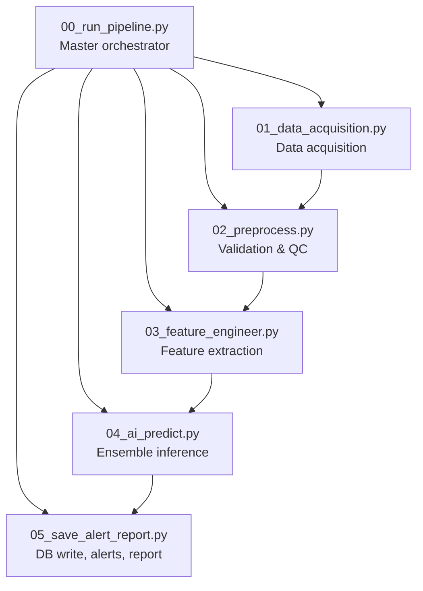
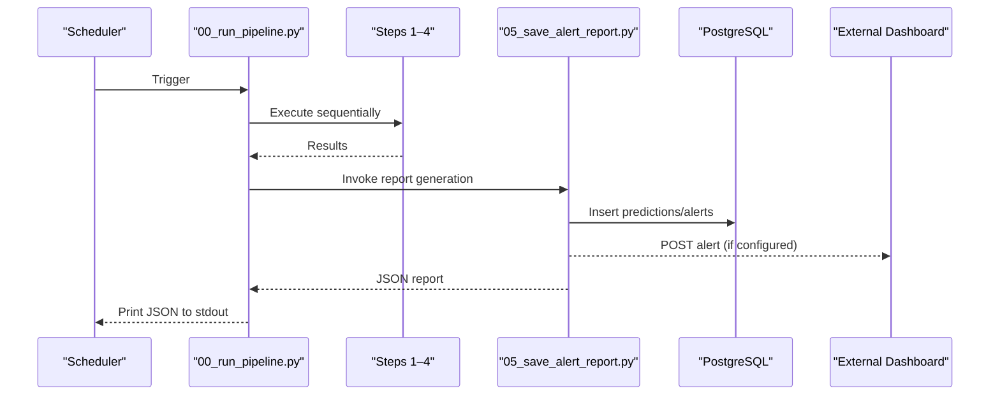
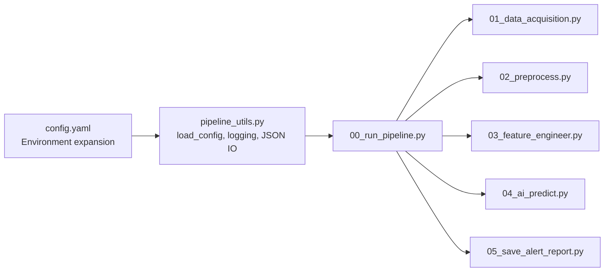

# API Reference

<cite>
**Referenced Files in This Document**
- [README.md](file://README.md)
- [config.yaml](file://config.yaml)
- [pipeline_utils.py](file://pipeline_utils.py)
- [00_run_pipeline.py](file://00_run_pipeline.py)
- [01_data_acquisition.py](file://01_data_acquisition.py)
- [02_preprocess.py](file://02_preprocess.py)
- [03_feature_engineer.py](file://03_feature_engineer.py)
- [04_ai_predict.py](file://04_ai_predict.py)
- [05_save_alert_report.py](file://05_save_alert_report.py)
</cite>

## Table of Contents
1. [Introduction](#introduction)
2. [Project Structure](#project-structure)
3. [Core Components](#core-components)
4. [Architecture Overview](#architecture-overview)
5. [Detailed Component Analysis](#detailed-component-analysis)
6. [Dependency Analysis](#dependency-analysis)
7. [Performance Considerations](#performance-considerations)
8. [Troubleshooting Guide](#troubleshooting-guide)
9. [Conclusion](#conclusion)
10. [Appendices](#appendices)

## Introduction
This document describes the JSON output interface and related APIs exposed by the Aditya-L1 Solar Flare Forecasting Pipeline. It covers:
- The canonical structured JSON report schema produced by the pipeline at runtime
- Configuration mechanisms for runtime parameters, model selection, and alert thresholds
- Webhook integration for alert dispatch
- Database schema and query interfaces for historical data access and export
- Practical usage examples, response interpretation, error handling, and operational guidance

Note: The pipeline is orchestrated as a scheduled job and writes outputs to disk and a database. There is no built-in HTTP API server in this repository. The “API” described here refers to the JSON contract for outputs and configuration, and the alert webhook integration.

## Project Structure
The pipeline is composed of discrete steps executed in sequence by a master orchestrator. The orchestrator prints a structured JSON report to stdout upon completion, which downstream systems consume.

**Diagram sources**
- [00_run_pipeline.py:63-121](file://00_run_pipeline.py#L63-L121)
- [01_data_acquisition.py:350-452](file://01_data_acquisition.py#L350-L452)
- [02_preprocess.py:230-409](file://02_preprocess.py#L230-L409)
- [03_feature_engineer.py:199-249](file://03_feature_engineer.py#L199-L249)
- [04_ai_predict.py:402-448](file://04_ai_predict.py#L402-L448)
- [05_save_alert_report.py:452-502](file://05_save_alert_report.py#L452-L502)

**Section sources**
- [00_run_pipeline.py:13-24](file://00_run_pipeline.py#L13-L24)
- [README.md:7-32](file://README.md#L7-L32)

## Core Components
- JSON Output Interface: The orchestrator emits a single JSON object to stdout containing the run summary and prediction results.
- Configuration API: Runtime parameters and thresholds are loaded from a YAML configuration file and environment variables.
- Alert Webhook API: When configured, the pipeline dispatches alert events to a webhook endpoint.
- Database API: The pipeline creates and writes to a PostgreSQL schema for historical data retrieval and export.

**Section sources**
- [00_run_pipeline.py:115-141](file://00_run_pipeline.py#L115-L141)
- [config.yaml:66-104](file://config.yaml#L66-L104)
- [05_save_alert_report.py:267-297](file://05_save_alert_report.py#L267-L297)
- [05_save_alert_report.py:47-116](file://05_save_alert_report.py#L47-L116)

## Architecture Overview
The pipeline’s runtime JSON output is generated by the final step and printed by the orchestrator. The alert engine evaluates predictions against thresholds and dispatches alerts via webhook/email. Historical data is persisted to PostgreSQL for later queries and exports.

**Diagram sources**
- [00_run_pipeline.py:63-121](file://00_run_pipeline.py#L63-L121)
- [05_save_alert_report.py:452-502](file://05_save_alert_report.py#L452-L502)
- [05_save_alert_report.py:267-297](file://05_save_alert_report.py#L267-L297)
- [05_save_alert_report.py:143-188](file://05_save_alert_report.py#L143-L188)

## Detailed Component Analysis

### JSON Output Schema (Runtime Report)
The orchestrator prints a single JSON object summarizing the pipeline run and prediction results. The fields are derived from the final report generation step.

- Top-level fields
  - run_id: string (UUID-like identifier for the run)
  - timestamp: string (UTC ISO 8601 timestamp of report generation)
  - pipeline_version: string (from configuration)
  - elapsed_seconds: number (float)
  - pipeline_status: string (status of the run)
  - data_acquisition: object
    - source_used: string
    - data_points_processed: integer
    - status: string
  - data_quality: object
    - records_validated: integer
    - records_passed: integer
    - warnings: array of strings
  - timestamp: string (UTC ISO 8601 timestamp of the prediction input)
  - data_points_processed: integer
  - flare_probability: string (percentage)
  - predicted_flare_class: string
  - predicted_flux_class: string
  - class_probabilities: object (percentages)
  - cme_probability: string (percentage)
  - geomagnetic_risk: string
  - geomagnetic_risk_score: string (percentage)
  - confidence_score: string (percentage)
  - estimated_onset_utc: string (UTC ISO 8601)
  - onset_window_minutes: array of two integers
  - ai_ensemble: object
    - models: array of strings
    - weights: object
  - alert_status: string
  - active_alerts: array of objects
    - severity: string
    - message: string
  - recommended_action: string
  - threshold_evaluation: object (boolean flags)
  - system_health: object
    - pipeline_ok: boolean
    - prediction_id: string
    - db_write: string ("SIMULATED" or "POSTGRES")
    - dashboard: string

Validation rules
- All percentage fields are formatted as "NN.N%" strings.
- Numerical scores are rounded to one decimal place in the report.
- Arrays and objects are empty when no data is available.
- Fields derived from predictions are present when predictions exist.

Example usage
- Consume the stdout of the orchestrator as a JSON object.
- Persist to a log aggregator or SIEM for alerting.
- Forward to a dashboard or monitoring system.

**Section sources**
- [00_run_pipeline.py:115-141](file://00_run_pipeline.py#L115-L141)
- [05_save_alert_report.py:340-425](file://05_save_alert_report.py#L340-L425)

### Configuration API (Runtime Parameter Adjustment)
The pipeline reads configuration from a YAML file and environment variables. The configuration controls:
- Pipeline scheduling, retries, logging
- Data sources (PRADAN and NOAA fallback)
- Storage locations and retention
- Instrument definitions and feature windows
- Model hyperparameters and ensemble weights
- Alert thresholds and channels
- Database connection and table names

Key configuration areas
- Pipeline settings: name, version, schedule, log level, retries
- Data sources: PRADAN credentials, fallback endpoints, storage directories
- Instruments: band definitions and units
- Preprocessing: outlier handling, normalization, synchronization
- Features: temporal window and rolling statistics
- Models: sequence length, feature dimension, ensemble weights, model paths
- Alerts: thresholds and channels (log, email, webhook)
- Database: host, port, name, user, password, pool size, table names

Runtime parameter adjustment
- Modify config.yaml to change thresholds, model weights, or data endpoints.
- Set environment variables for secrets (PRADAN credentials, DB credentials, SMTP host, webhook URL).
- Adjust schedules for cron jobs externally.

Notes
- The pipeline expands ${ENV_VAR} placeholders in the YAML at runtime.
- The webhook URL is read from the environment variable and injected into the configuration.

**Section sources**
- [config.yaml:6-104](file://config.yaml#L6-L104)
- [pipeline_utils.py:25-40](file://pipeline_utils.py#L25-L40)
- [README.md:64-83](file://README.md#L64-L83)

### Webhook API (External System Integration)
The pipeline can dispatch alerts to an external system via a webhook endpoint.

Request format
- Method: POST
- Headers: Content-Type: application/json
- Body: Alert payload (see Alert Payload below)

Alert payload
- alert_id: string
- pred_id: string
- severity: string (CRITICAL, WARNING, HIGH RISK, STORM WATCH, WATCH)
- threshold_name: string (threshold key)
- threshold_value: number (probability threshold)
- actual_value: number (actual probability)
- message: string (human-readable message)

Authentication
- No authentication is implemented in the pipeline for webhook dispatch.
- Ensure the receiving endpoint validates requests (e.g., shared secret, IP allowlist, signed headers).

Error handling
- The pipeline logs failures to send alerts but continues execution.
- Network timeouts are handled with a fixed timeout for webhook requests.

Integration pattern
- Deploy a webhook receiver that accepts POST requests and persists or forwards alerts.
- Optionally add request signing or HMAC verification upstream.

**Section sources**
- [05_save_alert_report.py:267-297](file://05_save_alert_report.py#L267-L297)

### Database API (Historical Data Access and Export)
The pipeline writes predictions and alerts to PostgreSQL. The schema is created on first run.

Tables
- pipeline_runs: run-level tracking
- solexs_hel1os_raw: raw observations
- flare_predictions: model outputs and metadata
- flare_alerts: fired alerts

Schema highlights
- Primary keys and foreign keys are defined for referential integrity.
- Indexes are created for frequent queries (e.g., prediction time).
- JSONB fields store structured data for flexibility.

Queries and export patterns
- Retrieve recent predictions ordered by time.
- Join alerts to predictions using pred_id.
- Export historical datasets for analytics or model retraining.

Bulk export
- Use standard SQL clients or ETL tools to export tables.
- Consider partitioning or retention policies for large datasets.

Operational notes
- The pipeline simulates writes if the database driver is unavailable.
- Connection errors are logged and do not fail the run.

**Section sources**
- [05_save_alert_report.py:47-116](file://05_save_alert_report.py#L47-L116)
- [05_save_alert_report.py:143-188](file://05_save_alert_report.py#L143-L188)
- [config.yaml:91-104](file://config.yaml#L91-L104)

## Dependency Analysis
The pipeline components depend on shared utilities for configuration loading, logging, and JSON I/O. The orchestrator coordinates step execution and prints the final report.

**Diagram sources**
- [pipeline_utils.py:25-40](file://pipeline_utils.py#L25-L40)
- [00_run_pipeline.py:35-38](file://00_run_pipeline.py#L35-L38)
- [01_data_acquisition.py:34-37](file://01_data_acquisition.py#L34-L37)
- [02_preprocess.py:26-29](file://02_preprocess.py#L26-L29)
- [03_feature_engineer.py:35-38](file://03_feature_engineer.py#L35-L38)
- [04_ai_predict.py:32-35](file://04_ai_predict.py#L32-L35)
- [05_save_alert_report.py:32-35](file://05_save_alert_report.py#L32-L35)

**Section sources**
- [00_run_pipeline.py:35-38](file://00_run_pipeline.py#L35-L38)
- [pipeline_utils.py:25-40](file://pipeline_utils.py#L25-L40)

## Performance Considerations
- The pipeline is designed for periodic execution (every 5 minutes) and writes minimal intermediate artifacts to disk.
- JSON serialization and database writes occur only in the final step.
- Recommendations
  - Monitor database connection latency and tune pool size.
  - Use fast storage for data directories to reduce I/O overhead.
  - Scale horizontally by running multiple instances behind a scheduler.

[No sources needed since this section provides general guidance]

## Troubleshooting Guide
Common issues and resolutions
- No new data since last run
  - Cause: Acquisition deduplication detected identical records.
  - Action: Wait for new data or adjust deduplication logic.
- Data acquisition failed
  - Cause: PRADAN login or NOAA fallback endpoints unreachable.
  - Action: Verify credentials and network connectivity; check logs.
- No valid records after preprocessing
  - Cause: Validation errors or insufficient data.
  - Action: Inspect warnings and fix data quality issues.
- Database connection failed
  - Cause: Incorrect credentials or service downtime.
  - Action: Confirm environment variables and database availability.
- Alert webhook failures
  - Cause: Network errors or invalid endpoint.
  - Action: Check webhook URL and network; inspect logs for error messages.

Error codes and statuses
- Pipeline status values include SUCCESS, FAILED, PENDING, NO_NEW_DATA.
- Alert severities include NOMINAL, WATCH, STORM WATCH, HIGH RISK, WARNING, CRITICAL.

**Section sources**
- [01_data_acquisition.py:420-424](file://01_data_acquisition.py#L420-L424)
- [02_preprocess.py:246-249](file://02_preprocess.py#L246-L249)
- [05_save_alert_report.py:139-141](file://05_save_alert_report.py#L139-L141)
- [05_save_alert_report.py:277-278](file://05_save_alert_report.py#L277-L278)

## Conclusion
The pipeline exposes a robust JSON output contract, flexible configuration via YAML and environment variables, optional alert webhook dispatch, and a PostgreSQL-backed historical data store. While there is no HTTP API server in this repository, the JSON report and configuration enable straightforward integration with external systems, dashboards, and alerting stacks.

[No sources needed since this section summarizes without analyzing specific files]

## Appendices

### API Usage Examples
- Consuming the JSON report
  - Capture stdout from the orchestrator and parse as JSON.
  - Store in a log aggregation platform or SIEM.
- Adjusting thresholds
  - Edit thresholds under alerts.thresholds in config.yaml.
  - Restart the pipeline after changes.
- Enabling webhook alerts
  - Set the webhook URL via the environment variable and enable the webhook channel in config.yaml.
  - Deploy a webhook receiver to handle incoming alert payloads.
- Querying historical data
  - Connect to PostgreSQL using the configured credentials.
  - Query predictions and alerts tables for reporting and analytics.

**Section sources**
- [00_run_pipeline.py:115-141](file://00_run_pipeline.py#L115-L141)
- [config.yaml:79-89](file://config.yaml#L79-L89)
- [05_save_alert_report.py:47-116](file://05_save_alert_report.py#L47-L116)

### Rate Limiting, Versioning, and Compatibility
- Rate limiting
  - The pipeline runs on a fixed schedule; no internal rate limiting is implemented.
  - External systems should enforce their own limits on webhook receivers.
- Versioning
  - The pipeline version is embedded in the JSON report and configuration.
  - Backward compatibility
    - New fields are additive; consumers should tolerate unknown fields.
    - Percentage fields remain string-formatted for readability.

**Section sources**
- [00_run_pipeline.py:115-141](file://00_run_pipeline.py#L115-L141)
- [config.yaml:8](file://config.yaml#L8)

### Client Implementation Guidelines and SDK Usage
- Client responsibilities
  - Poll or subscribe to the orchestrator’s stdout for JSON reports.
  - Persist reports and integrate with alerting systems.
  - Query PostgreSQL for historical insights.
- SDK usage
  - Use standard JSON libraries to parse the report.
  - Use a PostgreSQL driver to connect and query tables.
  - For webhook receivers, implement a small HTTP server to accept POST requests.

**Section sources**
- [00_run_pipeline.py:115-141](file://00_run_pipeline.py#L115-L141)
- [05_save_alert_report.py:47-116](file://05_save_alert_report.py#L47-L116)