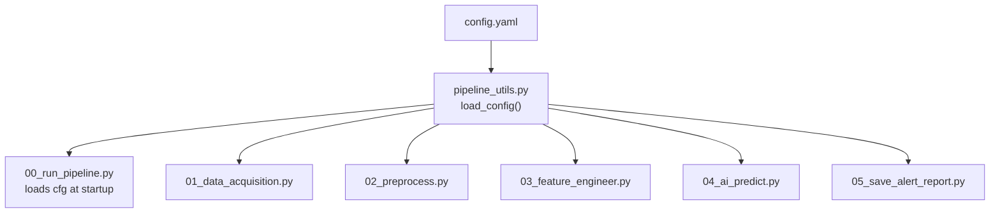
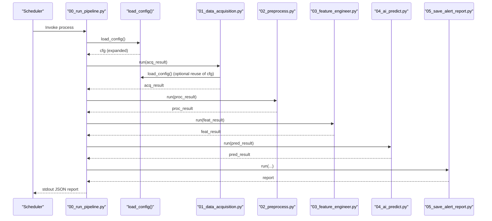
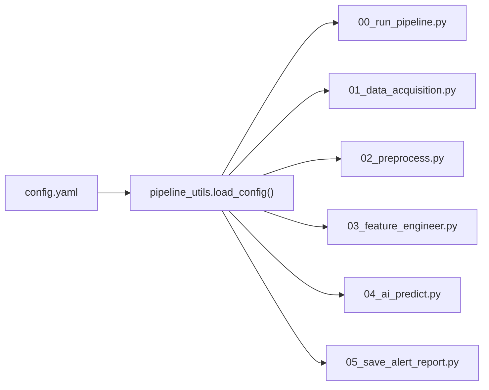

# Configuration API

<cite>
**Referenced Files in This Document**
- [config.yaml](file://config.yaml)
- [pipeline_utils.py](file://pipeline_utils.py)
- [00_run_pipeline.py](file://00_run_pipeline.py)
- [01_data_acquisition.py](file://01_data_acquisition.py)
- [02_preprocess.py](file://02_preprocess.py)
- [03_feature_engineer.py](file://03_feature_engineer.py)
- [04_ai_predict.py](file://04_ai_predict.py)
- [05_save_alert_report.py](file://05_save_alert_report.py)
- [README.md](file://README.md)
</cite>

## Table of Contents
1. [Introduction](#introduction)
2. [Project Structure](#project-structure)
3. [Core Components](#core-components)
4. [Architecture Overview](#architecture-overview)
5. [Detailed Component Analysis](#detailed-component-analysis)
6. [Dependency Analysis](#dependency-analysis)
7. [Performance Considerations](#performance-considerations)
8. [Troubleshooting Guide](#troubleshooting-guide)
9. [Conclusion](#conclusion)
10. [Appendices](#appendices)

## Introduction
This document describes the configuration management interface for the Aditya-L1 Solar Flare Forecasting Pipeline. It documents the YAML configuration structure, parameter semantics, defaults, acceptable ranges, and validation rules. It also explains how configuration is loaded at runtime, how to safely update configuration for operational scenarios, and how to manage backups, versioning, and rollbacks. Environment variable overrides and precedence are covered, along with the hot-reload behavior of the pipeline.

## Project Structure
The configuration is centralized in a single YAML file and consumed by all pipeline modules through a shared loader. The master orchestrator loads configuration once and passes it to downstream steps. Logging and state persistence are managed by shared utilities.

**Diagram sources**
- [config.yaml](file://config.yaml)
- [pipeline_utils.py](file://pipeline_utils.py)
- [00_run_pipeline.py](file://00_run_pipeline.py)
- [01_data_acquisition.py](file://01_data_acquisition.py)
- [02_preprocess.py](file://02_preprocess.py)
- [03_feature_engineer.py](file://03_feature_engineer.py)
- [04_ai_predict.py](file://04_ai_predict.py)
- [05_save_alert_report.py](file://05_save_alert_report.py)

**Section sources**
- [config.yaml](file://config.yaml)
- [pipeline_utils.py](file://pipeline_utils.py)
- [00_run_pipeline.py](file://00_run_pipeline.py)

## Core Components
- Centralized configuration: Single YAML file containing all pipeline settings.
- Configuration loader: Reads YAML, expands environment variable placeholders, and returns a Python dictionary.
- Per-module consumption: Each pipeline step imports the loader and reads the relevant subsections.
- Runtime reload behavior: Configuration is loaded once at process start; changes require restarting the process.

Key runtime behaviors:
- Logging level is applied globally across modules.
- Database configuration is passed to the PostgreSQL writer.
- Alert thresholds and channels are read by the alert evaluation step.
- Model and feature engineering parameters are read by the preprocessing and AI prediction steps.

**Section sources**
- [config.yaml](file://config.yaml)
- [pipeline_utils.py](file://pipeline_utils.py)
- [00_run_pipeline.py](file://00_run_pipeline.py)
- [01_data_acquisition.py](file://01_data_acquisition.py)
- [02_preprocess.py](file://02_preprocess.py)
- [03_feature_engineer.py](file://03_feature_engineer.py)
- [04_ai_predict.py](file://04_ai_predict.py)
- [05_save_alert_report.py](file://05_save_alert_report.py)

## Architecture Overview
The configuration architecture follows a simple, predictable pattern: a single source of truth (YAML) expanded by the loader, then accessed by all pipeline modules. There is no dynamic hot-reload mechanism; configuration changes take effect after process restart.

**Diagram sources**
- [00_run_pipeline.py](file://00_run_pipeline.py)
- [pipeline_utils.py](file://pipeline_utils.py)
- [01_data_acquisition.py](file://01_data_acquisition.py)
- [02_preprocess.py](file://02_preprocess.py)
- [03_feature_engineer.py](file://03_feature_engineer.py)
- [04_ai_predict.py](file://04_ai_predict.py)
- [05_save_alert_report.py](file://05_save_alert_report.py)

## Detailed Component Analysis

### Configuration Schema and Parameters
The configuration is organized into top-level sections. Below is a structured overview with field descriptions, defaults, acceptable ranges, and validation notes. Values marked as environment variable placeholders are expanded at load time.

- pipeline
  - name: Pipeline identifier string. Default: as configured.
  - version: Semantic version string. Default: as configured.
  - cron_schedule: Cron expression for periodic runs. Default: as configured.
  - retrain_schedule: Cron expression for nightly model retraining. Default: as configured.
  - log_level: Logging verbosity. Acceptable values: TRACE, DEBUG, INFO, WARNING, ERROR, CRITICAL. Default: INFO.
  - max_retries: Number of retries for each step. Default: 3. Range: positive integer.
  - retry_delay_seconds: Delay between retries. Default: 30. Range: non-negative integer.

- data.pradan
  - base_url: PRADAN portal URL. Default: as configured.
  - username: Username placeholder. Default: ${PRADAN_USERNAME}.
  - password: Password placeholder. Default: ${PRADAN_PASSWORD}.
  - instruments: List of instrument codes. Default: ["SoLEXS", "HEL1OS"].
  - data_level: Data level string. Default: L1.
  - format: Data format string. Default: FITS.
  - look_back_hours: Hours to query for new files. Default: 6. Range: positive integer.

- data.noaa_fallback.enabled: Enable fallback to NOAA SWPC feeds. Default: true.
- data.storage.raw_dir: Local directory for raw data. Default: data/raw.
- data.storage.processed_dir: Local directory for processed data. Default: data/processed.
- data.storage.features_dir: Local directory for feature vectors. Default: data/features.
- data.storage.archive_days: Retention period for raw data. Default: 90. Range: positive integer.

- instruments.{SoLEXS,HEL1OS}.bands: Instrument-specific band definitions.
  - name: Band label string.
  - range_angstrom: Wavelength range for SoLEXS bands.
  - range_keV: Energy range for HEL1OS bands.
  - goes_equivalent: Boolean indicating GOES equivalence for SoLEXS.
  - unit: Physical unit string.

- preprocessing
  - missing_value_strategy: Interpolation method. Default: linear_interpolation.
  - max_gap_minutes: Maximum allowed gap in minutes. Default: 10. Range: positive float.
  - outlier_sigma_threshold: Sigma-clipping threshold. Default: 4.0. Range: positive float.
  - normalization: Normalization scheme. Default: log10_minmax.
  - sync_tolerance_seconds: Time tolerance for synchronization. Default: 30. Range: non-negative integer.
  - duplicate_window_seconds: Duplicate detection window. Default: 10. Range: non-negative integer.

- features
  - temporal_window_minutes: Window size for temporal features. Default: 60. Range: positive integer.
  - rolling_windows: List of rolling window sizes. Default: [5, 15, 30, 60].

- models
  - sequence_length: LSTM/Transformer sequence length. Default: 60. Range: positive integer.
  - feature_dim: Feature vector dimensionality. Default: 17.
  - ensemble_weights: Dict of model weight fractions summing to 1.0.
    - LSTM: Default: 0.30
    - GRU: Default: 0.25
    - Transformer: Default: 0.30
    - XGBoost: Default: 0.15
  - LSTM: hidden_size, num_layers, dropout, model_path.
  - GRU: hidden_size, num_layers, dropout, model_path.
  - Transformer: d_model, nhead, num_encoder_layers, dim_feedforward, dropout, model_path.
  - XGBoost: n_estimators, max_depth, learning_rate, subsample, colsample_bytree, model_path.

- alerts.thresholds
  - m_class_warning_pct: Threshold percentage for M-class warning. Default: 70.
  - x_class_critical_pct: Threshold percentage for X-class critical. Default: 50.
  - cme_high_risk_pct: Threshold percentage for CME high risk. Default: 60.
  - geomag_storm_pct: Threshold percentage for geomagnetic storm watch. Default: 55.
  - flare_watch_pct: General flare watch threshold. Default: 40.
  - Acceptable ranges: Percentages from 0 to 100; higher values increase sensitivity.

- alerts.channels
  - type: Channel kind. Supported: log, email, webhook.
  - enabled: Boolean enable flag.
  - recipients: Email list (when type=email).
  - smtp_host: SMTP host (when type=email).
  - url: Webhook endpoint (when type=webhook).

- database
  - host: Hostname placeholder. Default: ${DB_HOST}.
  - port: Port number. Default: 5432.
  - name: Database name placeholder. Default: ${DB_NAME}.
  - user: Username placeholder. Default: ${DB_USER}.
  - password: Password placeholder. Default: ${DB_PASSWORD}.
  - pool_size: Connection pool size. Default: 5.
  - tables: Table names for raw, processed, predictions, alerts, pipeline_runs.

Validation and defaults summary:
- Numeric ranges are enforced implicitly by usage; invalid values will cause runtime errors or unexpected behavior.
- Strings representing percentages should be integers in [0, 100].
- Lists such as rolling_windows should contain positive integers.
- Model weights must sum to approximately 1.0 for proper ensemble behavior.

**Section sources**
- [config.yaml](file://config.yaml)

### Configuration Loading and Expansion
The loader performs two primary tasks:
- Parses YAML into a nested dictionary.
- Expands environment variable placeholders of the form ${VAR} using os.getenv, preserving literal ${VAR} if the environment variable is unset.

Logging level is applied immediately upon logger creation using the pipeline.log_level setting.

**Section sources**
- [pipeline_utils.py](file://pipeline_utils.py)
- [00_run_pipeline.py](file://00_run_pipeline.py)

### Hot-Reload and Runtime Behavior
- The pipeline loads configuration once at process start.
- Changes to config.yaml require restarting the process (e.g., via cron) to take effect.
- There is no built-in hot-reload mechanism; modules do not re-read the file mid-execution.

**Section sources**
- [00_run_pipeline.py](file://00_run_pipeline.py)
- [pipeline_utils.py](file://pipeline_utils.py)

### Operational Scenarios and Examples
Below are practical scenarios for updating configuration. Replace values in config.yaml and restart the pipeline process.

- Change alert thresholds
  - Modify thresholds under alerts.thresholds to adjust sensitivity for warnings and watches.
  - Example: Increase m_class_warning_pct to reduce false positives; decrease x_class_critical_pct to increase sensitivity.

- Enable/disable database writes
  - The PostgreSQL writer connects using database.* settings. To disable writes, remove or comment out the database section, or rely on simulation mode if psycopg2 is not installed.
  - Example: Set database.host to a non-routable address to simulate failures and test alert paths.

- Modify model weights
  - Adjust ensemble_weights to shift prediction emphasis among LSTM, GRU, Transformer, and XGBoost.
  - Example: Increase LSTM weight and decrease XGBoost weight to favor recurrent modeling.

- Adjust monitoring cadence
  - Update pipeline.cron_schedule to change how often the pipeline runs.
  - Example: Change to "*/15 * * * *" for every 15 minutes.

- Environment variable overrides
  - Set environment variables to override placeholders in config.yaml (e.g., PRADAN_USERNAME, PRADAN_PASSWORD, DB_HOST, DB_NAME, DB_USER, DB_PASSWORD, SMTP_HOST, ALERT_WEBHOOK_URL).
  - The loader substitutes ${VAR} with the environment variable value; if unset, the literal ${VAR} remains.

- Command-line parameter precedence
  - The pipeline does not accept command-line arguments for configuration. Environment variables take precedence over YAML defaults for placeholders.

Backup, versioning, and rollback:
- Back up config.yaml before changes.
- Version control the configuration alongside code.
- For rollback, restore the previous version and restart the pipeline.

**Section sources**
- [config.yaml](file://config.yaml)
- [README.md](file://README.md)

## Dependency Analysis
Configuration dependencies across modules are straightforward: each step imports the loader and accesses its required subsections. There are no circular dependencies.

**Diagram sources**
- [config.yaml](file://config.yaml)
- [pipeline_utils.py](file://pipeline_utils.py)
- [00_run_pipeline.py](file://00_run_pipeline.py)
- [01_data_acquisition.py](file://01_data_acquisition.py)
- [02_preprocess.py](file://02_preprocess.py)
- [03_feature_engineer.py](file://03_feature_engineer.py)
- [04_ai_predict.py](file://04_ai_predict.py)
- [05_save_alert_report.py](file://05_save_alert_report.py)

**Section sources**
- [config.yaml](file://config.yaml)
- [pipeline_utils.py](file://pipeline_utils.py)
- [00_run_pipeline.py](file://00_run_pipeline.py)
- [01_data_acquisition.py](file://01_data_acquisition.py)
- [02_preprocess.py](file://02_preprocess.py)
- [03_feature_engineer.py](file://03_feature_engineer.py)
- [04_ai_predict.py](file://04_ai_predict.py)
- [05_save_alert_report.py](file://05_save_alert_report.py)

## Performance Considerations
- Logging level affects I/O overhead; set pipeline.log_level to INFO or WARNING for production to reduce noise.
- Reducing database pool_size may limit concurrent connections; tune database.pool_size according to workload.
- Adjusting models.sequence_length impacts memory and computation; ensure alignment with available resources.
- Rolling windows in features influence computational cost; keep rolling_windows reasonable for throughput.

[No sources needed since this section provides general guidance]

## Troubleshooting Guide
Common issues and resolutions:
- Configuration parse errors
  - Cause: Invalid YAML syntax or malformed structure.
  - Resolution: Validate YAML syntax and ensure all required keys are present.

- Environment variable expansion
  - Cause: ${VAR} unresolved placeholders remain literal.
  - Resolution: Export required environment variables before running the pipeline.

- Database connection failures
  - Cause: Incorrect host, port, name, user, or password.
  - Resolution: Verify database credentials and network accessibility; confirm psycopg2 installation for real writes.

- Alert delivery failures
  - Cause: Invalid recipients, SMTP misconfiguration, or webhook endpoint downtime.
  - Resolution: Test email SMTP host and webhook URL independently; ensure recipients list is populated when enabled.

- Pipeline retries and delays
  - Cause: Excessive transient errors leading to max_retries exhaustion.
  - Resolution: Inspect logs around retry cycles; adjust pipeline.retry_delay_seconds and pipeline.max_retries as needed.

**Section sources**
- [config.yaml](file://config.yaml)
- [pipeline_utils.py](file://pipeline_utils.py)
- [05_save_alert_report.py](file://05_save_alert_report.py)

## Conclusion
The pipeline’s configuration is centralized, explicit, and easy to modify. While there is no hot-reload capability, the design ensures deterministic behavior—changes take effect after a controlled restart. By understanding the configuration schema, environment variable overrides, and operational scenarios, operators can safely adjust pipeline behavior for varied operational needs.

[No sources needed since this section summarizes without analyzing specific files]

## Appendices

### Appendix A: Configuration Reload Mechanism
- Reload behavior: One-time load at process start.
- Triggering reload: Restart the process (e.g., via cron) after editing config.yaml.
- Validation tip: After edits, run a dry-run of the pipeline to validate configuration and environment variables.

**Section sources**
- [00_run_pipeline.py](file://00_run_pipeline.py)
- [pipeline_utils.py](file://pipeline_utils.py)

### Appendix B: Environment Variable Overrides
- Supported placeholders:
  - PRADAN_USERNAME, PRADAN_PASSWORD
  - DB_HOST, DB_NAME, DB_USER, DB_PASSWORD
  - SMTP_HOST
  - ALERT_WEBHOOK_URL

- Precedence order:
  1) Environment variables (highest)
  2) config.yaml values (lowest)

**Section sources**
- [config.yaml](file://config.yaml)
- [README.md](file://README.md)