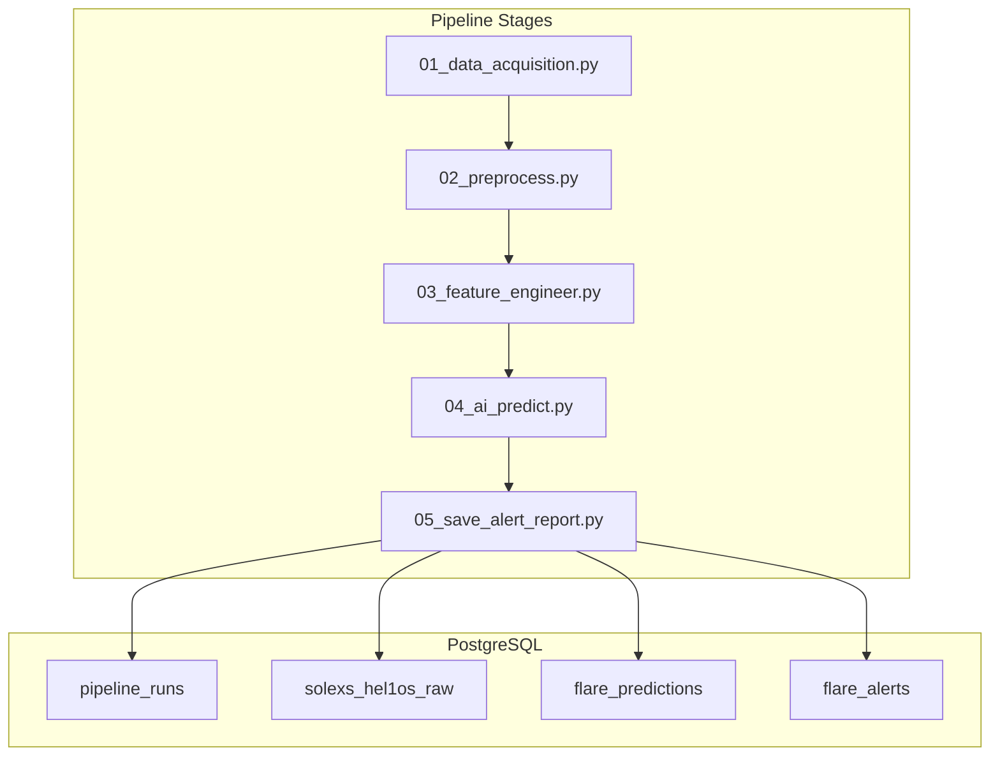
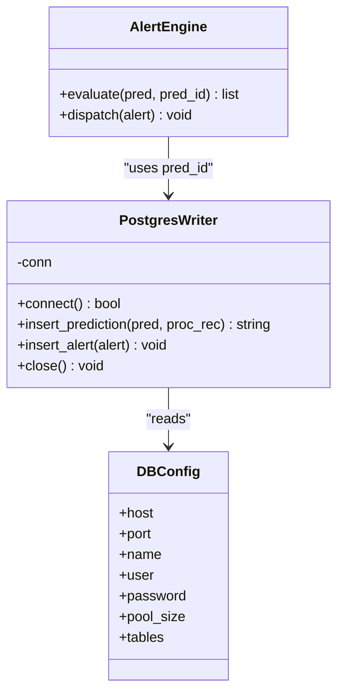
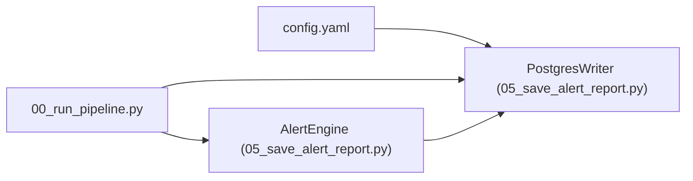

# Database API

<cite>
**Referenced Files in This Document**
- [README.md](file://README.md)
- [config.yaml](file://config.yaml)
- [05_save_alert_report.py](file://05_save_alert_report.py)
- [00_run_pipeline.py](file://00_run_pipeline.py)
- [01_data_acquisition.py](file://01_data_acquisition.py)
- [02_preprocess.py](file://02_preprocess.py)
- [03_feature_engineer.py](file://03_feature_engineer.py)
- [04_ai_predict.py](file://04_ai_predict.py)
</cite>

## Table of Contents
1. [Introduction](#introduction)
2. [Project Structure](#project-structure)
3. [Core Components](#core-components)
4. [Architecture Overview](#architecture-overview)
5. [Detailed Component Analysis](#detailed-component-analysis)
6. [Dependency Analysis](#dependency-analysis)
7. [Performance Considerations](#performance-considerations)
8. [Troubleshooting Guide](#troubleshooting-guide)
9. [Conclusion](#conclusion)
10. [Appendices](#appendices)

## Introduction
This document describes the PostgreSQL database interface used by the Aditya-L1 Solar Flare Forecasting Pipeline for historical data access and bulk data export. It documents the database schema, connection configuration, transaction handling, and common SQL query patterns for retrieving recent predictions, performing historical trend analysis, alert history lookup, and monitoring performance. It also provides guidance on database maintenance, backup procedures, schema evolution, data retention, archiving strategies, and performance optimization. Finally, it includes examples of programmatic database access using Python and other languages.

## Project Structure
The pipeline is composed of multiple stages that culminate in writing predictions and alerts to PostgreSQL. The database schema is created on first run and includes four primary tables:
- pipeline_runs
- solexs_hel1os_raw
- flare_predictions
- flare_alerts

**Diagram sources**
- [01_data_acquisition.py:1-458](file://01_data_acquisition.py#L1-L458)
- [02_preprocess.py:1-422](file://02_preprocess.py#L1-L422)
- [03_feature_engineer.py:1-265](file://03_feature_engineer.py#L1-L265)
- [04_ai_predict.py:1-466](file://04_ai_predict.py#L1-L466)
- [05_save_alert_report.py:47-116](file://05_save_alert_report.py#L47-L116)

**Section sources**
- [README.md:1-228](file://README.md#L1-L228)
- [config.yaml:91-104](file://config.yaml#L91-L104)

## Core Components
- Database configuration and connection pooling are defined in the configuration file and consumed by the database writer component.
- The database writer creates tables on first run and inserts records for raw observations, predictions, and alerts.
- Transactions are managed around insert operations with commit or rollback semantics.

Key configuration locations:
- Database connection parameters and pool size
- Table names for raw observations, processed features, predictions, alerts, and pipeline runs

**Section sources**
- [config.yaml:91-104](file://config.yaml#L91-L104)
- [05_save_alert_report.py:118-142](file://05_save_alert_report.py#L118-L142)

## Architecture Overview
The database layer is part of the final stage of the pipeline. The PostgresWriter connects to the database, ensures schema readiness, and persists:
- Raw observations into solexs_hel1os_raw
- Predictions into flare_predictions
- Alerts into flare_alerts
- Run metadata into pipeline_runs

**Diagram sources**
- [05_save_alert_report.py:47-216](file://05_save_alert_report.py#L47-L216)
- [config.yaml:91-104](file://config.yaml#L91-L104)

## Detailed Component Analysis

### Database Schema and Field Definitions
The schema is created on first run and includes:
- pipeline_runs
- solexs_hel1os_raw
- flare_predictions
- flare_alerts

Indexes:
- Index on flare_predictions.obs_time descending for time-range queries
- Index on flare_alerts.severity for severity filtering

Constraints:
- Primary keys on run_id, obs_id, pred_id, alert_id
- Foreign key from flare_alerts.pred_id to flare_predictions.pred_id

Field definitions and data types:
- pipeline_runs
  - run_id: TEXT (PK)
  - run_time: TIMESTAMPTZ
  - source_used: TEXT
  - records_fetched: INTEGER
  - pipeline_status: TEXT
  - elapsed_s: REAL
  - warnings: JSONB

- solexs_hel1os_raw
  - obs_id: TEXT (PK)
  - obs_time: TIMESTAMPTZ
  - source: TEXT
  - solexs_1_8A_Wm2: DOUBLE PRECISION
  - solexs_0_4A_Wm2: DOUBLE PRECISION
  - solexs_peak_60min: DOUBLE PRECISION
  - solexs_dFdt: DOUBLE PRECISION
  - flux_ratio: DOUBLE PRECISION
  - hel1os_20_60_cts: DOUBLE PRECISION
  - hel1os_60_100_cts: DOUBLE PRECISION
  - spectral_gamma: DOUBLE PRECISION
  - kp_index: REAL
  - solar_wind_speed: REAL
  - imf_bz: REAL
  - raw_json: JSONB

- flare_predictions
  - pred_id: TEXT (PK)
  - obs_time: TIMESTAMPTZ
  - prediction_time: TIMESTAMPTZ
  - source: TEXT
  - predicted_class: TEXT
  - predicted_flux_class: TEXT
  - flare_probability: REAL
  - m_class_probability: REAL
  - x_class_probability: REAL
  - cme_probability: REAL
  - geomagnetic_risk: REAL
  - geomagnetic_label: TEXT
  - confidence_score: REAL
  - estimated_onset_utc: TIMESTAMPTZ
  - class_probs_json: JSONB
  - model_outputs_json: JSONB

- flare_alerts
  - alert_id: TEXT (PK)
  - pred_id: TEXT (FK to flare_predictions.pred_id)
  - alert_time: TIMESTAMPTZ
  - severity: TEXT
  - threshold_name: TEXT
  - threshold_value: REAL
  - actual_value: REAL
  - message: TEXT
  - dispatched: BOOLEAN DEFAULT FALSE

Indexes:
- idx_pred_obs_time: on obs_time DESC
- idx_alert_severity: on severity

**Section sources**
- [05_save_alert_report.py:49-116](file://05_save_alert_report.py#L49-L116)

### Connection Configuration and Pooling
- Connection parameters are loaded from the configuration file and passed to the database driver.
- The writer attempts to connect and create tables if they do not exist.
- If the database driver is not available, the writer operates in simulation mode and logs informational messages.

Connection parameters:
- host, port, dbname, user, password
- Connection timeout is set during connect.

Pool size is configured in the configuration file under database.pool_size.

**Section sources**
- [config.yaml:91-97](file://config.yaml#L91-L97)
- [05_save_alert_report.py:121-141](file://05_save_alert_report.py#L121-L141)

### Transaction Handling
- Insert operations are wrapped in a cursor context manager.
- Successful inserts commit the transaction; failures trigger rollback.
- The writer closes the connection when finished.

**Section sources**
- [05_save_alert_report.py:133-135](file://05_save_alert_report.py#L133-L135)
- [05_save_alert_report.py:181-185](file://05_save_alert_report.py#L181-L185)
- [05_save_alert_report.py:207-211](file://05_save_alert_report.py#L207-L211)
- [05_save_alert_report.py:213-215](file://05_save_alert_report.py#L213-L215)

### Programmatic Database Access Examples

Python (psycopg2):
- Connect to the database using the configuration parameters.
- Create tables if not present.
- Insert predictions and alerts.
- Commit or rollback based on success.

Example references:
- [Connect and create tables:121-136](file://05_save_alert_report.py#L121-L136)
- [Insert prediction:143-188](file://05_save_alert_report.py#L143-L188)
- [Insert alert:190-211](file://05_save_alert_report.py#L190-L211)
- [Close connection:213-215](file://05_save_alert_report.py#L213-L215)

Other languages:
- Use any SQL client or ORM that supports PostgreSQL and JSONB fields.
- Ensure proper handling of TIMESTAMPTZ and JSONB data types.
- Apply the same transaction semantics: wrap inserts in transactions and handle errors with rollback.

[No sources needed since this section provides general guidance]

### SQL Query Patterns and Examples

Common use cases and example queries:

- Retrieve recent predictions ordered by observation time
  - Example: SELECT pred_id, obs_time, predicted_class, flare_probability FROM flare_predictions ORDER BY obs_time DESC LIMIT 100;

- Historical trend analysis by class probability over time
  - Example: SELECT DATE_TRUNC('hour', obs_time) AS hour_bin, AVG(flare_probability) AS avg_prob, AVG(m_class_probability) AS avg_m_prob FROM flare_predictions WHERE obs_time >= NOW() - INTERVAL '7 days' GROUP BY hour_bin ORDER BY hour_bin;

- Alert history lookup filtered by severity
  - Example: SELECT alert_id, alert_time, severity, threshold_name, actual_value FROM flare_alerts WHERE severity IN ('CRITICAL','WARNING','HIGH RISK','STORM WATCH') AND alert_time >= NOW() - INTERVAL '30 days' ORDER BY alert_time DESC;

- Performance monitoring: count of predictions per run and average confidence
  - Example: SELECT pr.run_id, pr.run_time, COUNT(fp.pred_id) AS predictions_count, AVG(fp.confidence_score) AS avg_conf FROM pipeline_runs pr JOIN flare_predictions fp ON pr.run_time = fp.prediction_time WHERE pr.run_time >= NOW() - INTERVAL '7 days' GROUP BY pr.run_id, pr.run_time ORDER BY pr.run_time DESC;

- Export recent raw observations for analysis
  - Example: COPY (SELECT obs_id, obs_time, source, solexs_1_8A_Wm2, hel1os_20_60_cts, kp_index, imf_bz FROM solexs_hel1os_raw WHERE obs_time >= NOW() - INTERVAL '1 day') TO '/tmp/solexs_hel1os_export.csv' WITH CSV HEADER;

- Aggregation and reporting: daily summary of alerts by severity
  - Example: SELECT DATE(alert_time) AS alert_date, severity, COUNT(*) AS alert_count FROM flare_alerts WHERE alert_time >= NOW() - INTERVAL '7 days' GROUP BY alert_date, severity ORDER BY alert_date, severity;

- Bulk data export with JSON fields
  - Example: SELECT pred_id, class_probs_json, model_outputs_json FROM flare_predictions WHERE obs_time >= NOW() - INTERVAL '1 day';

Notes:
- Replace intervals and limits according to your retention and reporting needs.
- Use EXPLAIN/EXPLAIN ANALYZE to review query plans and ensure index usage.

[No sources needed since this section provides general guidance]

## Dependency Analysis
- The database writer depends on the configuration file for connection parameters.
- The writer is invoked by the final pipeline stage, which orchestrates earlier steps and passes prediction results to the writer.
- The alert engine evaluates predictions and triggers alert insertions.

**Diagram sources**
- [config.yaml:91-104](file://config.yaml#L91-L104)
- [05_save_alert_report.py:47-216](file://05_save_alert_report.py#L47-L216)
- [00_run_pipeline.py:451-502](file://00_run_pipeline.py#L451-L502)

**Section sources**
- [00_run_pipeline.py:451-502](file://00_run_pipeline.py#L451-L502)
- [05_save_alert_report.py:47-216](file://05_save_alert_report.py#L47-L216)

## Performance Considerations
- Indexes
  - Ensure idx_pred_obs_time remains maintained for time-range queries.
  - Consider adding indexes on frequently filtered columns like severity in flare_alerts if not already indexed.

- Connection pooling
  - Use the configured pool size to limit concurrent connections.
  - Reuse connections across runs to reduce overhead.

- Data types
  - TIMESTAMPTZ ensures timezone-aware sorting and comparisons.
  - JSONB enables flexible storage of probabilistic outputs and model details.

- Query optimization
  - Prefer selective filters and appropriate LIMIT clauses.
  - Use EXPLAIN/EXPLAIN ANALYZE to verify index usage.

- Retention and archival
  - Archive older records to separate tables or partitions to keep main tables smaller.
  - Use partitioning by time for large-scale analytics.

[No sources needed since this section provides general guidance]

## Troubleshooting Guide
- Connection failures
  - Verify environment variables and configuration values.
  - Confirm the database is reachable and credentials are correct.
  - Check for network or firewall restrictions.

- Missing database driver
  - If psycopg2 is not installed, the writer operates in simulation mode and logs informational messages.
  - Install the driver to enable real database writes.

- Transaction errors
  - Inspect error logs for insert failures.
  - Rollbacks are performed automatically on exceptions.

- Schema creation issues
  - Ensure the database user has privileges to create tables and indexes.
  - The writer attempts to create tables idempotently on first run.

**Section sources**
- [05_save_alert_report.py:121-141](file://05_save_alert_report.py#L121-L141)
- [05_save_alert_report.py:181-185](file://05_save_alert_report.py#L181-L185)
- [05_save_alert_report.py:207-211](file://05_save_alert_report.py#L207-L211)

## Conclusion
The PostgreSQL database interface integrates seamlessly with the pipeline to persist raw observations, predictions, alerts, and run metadata. With proper indexing, connection pooling, and transaction handling, it supports efficient historical analysis and real-time monitoring. The schema and indexes are designed to support common query patterns, and the configuration-driven approach simplifies deployment and maintenance.

## Appendices

### Database Maintenance and Backup Procedures
- Regular backups
  - Use logical backups (e.g., pg_dump) for point-in-time recovery.
  - Schedule periodic full backups and incremental backups as needed.

- Index maintenance
  - Periodically rebuild or reindex to maintain performance.
  - Monitor index bloat and adjust as necessary.

- Vacuum and analyze
  - Run VACUUM/ANALYZE regularly to keep statistics fresh and reclaim space.

- Archival strategy
  - Move older records to historical tables or partitions.
  - Consider compression and partitioning by time.

[No sources needed since this section provides general guidance]

### Schema Evolution Guidance
- Add new columns carefully with defaults where appropriate.
- Create indexes for new frequently queried columns.
- Test migrations on staging before applying to production.
- Preserve backward compatibility for JSON fields to avoid breaking downstream consumers.

[No sources needed since this section provides general guidance]

### Data Retention and Archiving
- Retention policy
  - Define retention windows for each table based on operational and regulatory requirements.
  - Automatically archive or delete expired records.

- Archiving strategy
  - Partition by time or use dedicated historical tables.
  - Compress archived data to reduce storage costs.

[No sources needed since this section provides general guidance]