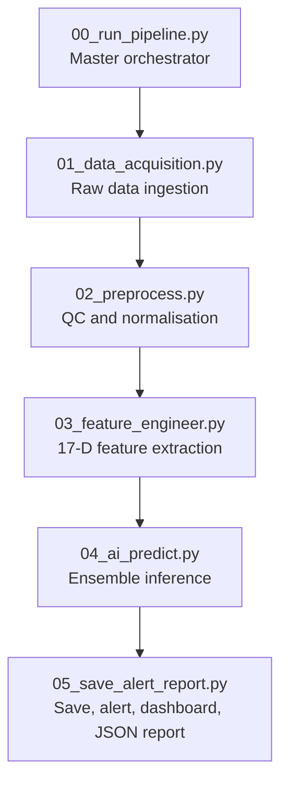
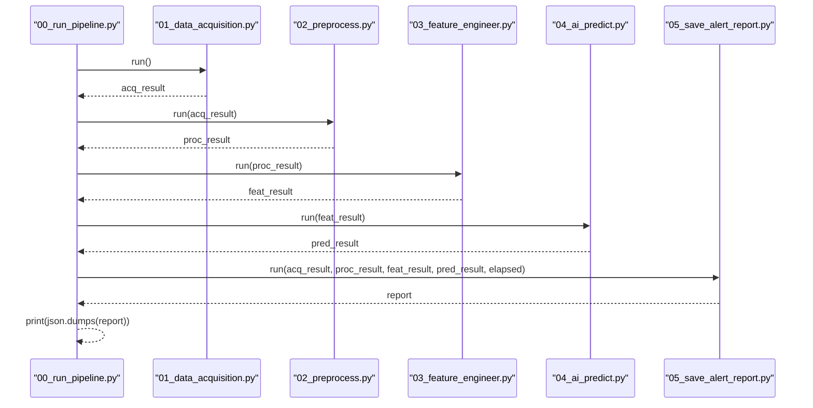
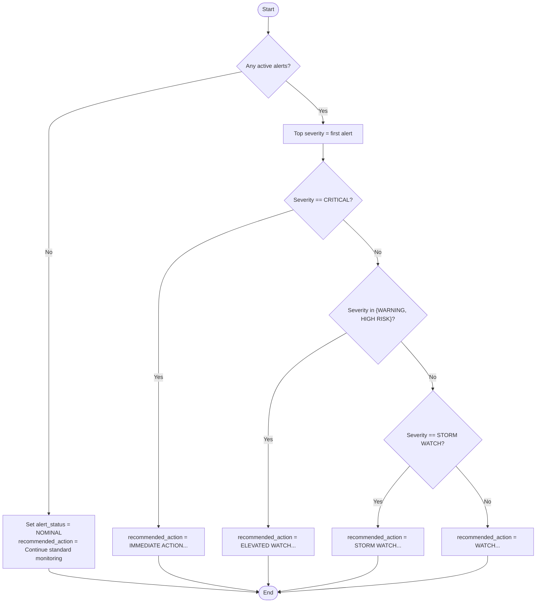
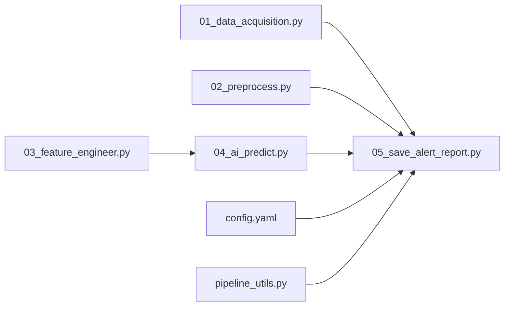

# JSON Output Schema

<cite>
**Referenced Files in This Document**
- [00_run_pipeline.py](file://00_run_pipeline.py)
- [05_save_alert_report.py](file://05_save_alert_report.py)
- [README.md](file://README.md)
- [config.yaml](file://config.yaml)
- [01_data_acquisition.py](file://01_data_acquisition.py)
- [02_preprocess.py](file://02_preprocess.py)
- [03_feature_engineer.py](file://03_feature_engineer.py)
- [04_ai_predict.py](file://04_ai_predict.py)
- [pipeline_utils.py](file://pipeline_utils.py)
</cite>

## Table of Contents
1. [Introduction](#introduction)
2. [Project Structure](#project-structure)
3. [Core Components](#core-components)
4. [Architecture Overview](#architecture-overview)
5. [Detailed Component Analysis](#detailed-component-analysis)
6. [Dependency Analysis](#dependency-analysis)
7. [Performance Considerations](#performance-considerations)
8. [Troubleshooting Guide](#troubleshooting-guide)
9. [Conclusion](#conclusion)
10. [Appendices](#appendices)

## Introduction
This document defines the canonical structured JSON output schema produced by the Aditya-L1 Solar Flare Forecasting Pipeline. It describes all fields in the report, including run metadata, data acquisition details, quality control metrics, prediction outputs with probabilities and classifications, AI ensemble information, alert status and recommendations, threshold evaluations, and system health indicators. It also explains the recommended_action decision logic, the relationship between probability thresholds and alert severity levels, and field dependencies based on pipeline execution results.

## Project Structure
The pipeline is composed of eight sequential steps orchestrated by the master entry point. The final step generates the canonical JSON report consumed by downstream systems.

**Diagram sources**
- [00_run_pipeline.py:63-121](file://00_run_pipeline.py#L63-L121)
- [01_data_acquisition.py:350-452](file://01_data_acquisition.py#L350-L452)
- [02_preprocess.py:230-409](file://02_preprocess.py#L230-L409)
- [03_feature_engineer.py:199-249](file://03_feature_engineer.py#L199-L249)
- [04_ai_predict.py:402-448](file://04_ai_predict.py#L402-L448)
- [05_save_alert_report.py:452-502](file://05_save_alert_report.py#L452-L502)

**Section sources**
- [00_run_pipeline.py:13-24](file://00_run_pipeline.py#L13-L24)
- [05_save_alert_report.py:452-502](file://05_save_alert_report.py#L452-L502)

## Core Components
The canonical JSON report is generated in the final step and includes:
- Run metadata: run_id, timestamp, pipeline_version, elapsed_seconds, pipeline_status
- Data acquisition: source_used, data_points_processed, status
- Data quality: records_validated, records_passed, warnings
- Prediction outputs: timestamp, data_points_processed, flare_probability, predicted_flare_class, predicted_flux_class, class_probabilities, cme_probability, geomagnetic_risk, geomagnetic_risk_score, confidence_score, estimated_onset_utc, onset_window_minutes
- AI ensemble: models, weights
- Alerts: alert_status, active_alerts, recommended_action
- Threshold evaluation: boolean flags for configured thresholds
- System health: pipeline_ok, prediction_id, db_write, dashboard

**Section sources**
- [05_save_alert_report.py:340-425](file://05_save_alert_report.py#L340-L425)

## Architecture Overview
The pipeline’s final step composes the report from upstream results and applies alert thresholds to produce alert_status and recommended_action.

**Diagram sources**
- [00_run_pipeline.py:72-116](file://00_run_pipeline.py#L72-L116)
- [05_save_alert_report.py:452-502](file://05_save_alert_report.py#L452-L502)

## Detailed Component Analysis

### Canonical JSON Report Fields
The report is a single JSON object containing the following top-level fields. Each field’s type, units, acceptable ranges, and validation rules are documented below.

- run_id
  - Type: string
  - Description: Unique identifier for the pipeline run
  - Example: RUN-A1B2C3D4
  - Validation: Non-empty string; UUID-derived uppercase hex segments
  - Conditional presence: Always present

- timestamp
  - Type: string (ISO 8601 UTC)
  - Description: Report creation time
  - Example: 2026-06-25T12:00:00Z
  - Validation: Valid ISO 8601 UTC timestamp
  - Conditional presence: Always present

- pipeline_version
  - Type: string
  - Description: Version of the pipeline
  - Example: 1.0.0
  - Validation: Matches configuration version
  - Conditional presence: Always present

- elapsed_seconds
  - Type: number (float)
  - Description: Total pipeline runtime in seconds
  - Units: seconds
  - Range: ≥ 0
  - Validation: Non-negative finite number
  - Conditional presence: Always present

- pipeline_status
  - Type: string
  - Description: Status of the AI prediction step
  - Values: SUCCESS, FAILED, UNKNOWN
  - Validation: Enumerated values only
  - Conditional presence: Always present

- data_acquisition
  - Type: object
  - Subfields:
    - source_used: string
      - Values: PRADAN_L1_FITS, NOAA_SWPC_FALLBACK
      - Validation: Enumerated values only
    - data_points_processed: integer
      - Range: ≥ 0
      - Validation: Non-negative integer
    - status: string
      - Values: SUCCESS, NO_NEW_DATA, FAILED
      - Validation: Enumerated values only
  - Conditional presence: Always present

- data_quality
  - Type: object
  - Subfields:
    - records_validated: integer
      - Range: ≥ 0
    - records_passed: integer
      - Range: ≥ 0
    - warnings: array of strings
      - Validation: Array of non-empty strings
  - Conditional presence: Always present

- timestamp (prediction)
  - Type: string (ISO 8601 UTC)
  - Description: Observation time associated with the prediction
  - Example: 2026-06-25T11:59:00Z
  - Validation: Valid ISO 8601 UTC timestamp
  - Conditional presence: Always present

- data_points_processed
  - Type: integer
  - Range: ≥ 0
  - Description: Number of records processed in acquisition
  - Conditional presence: Always present

- flare_probability
  - Type: string (percentage)
  - Description: Probability of a C-class or stronger flare occurring within the forecast window
  - Format: "NN.N%"
  - Range: [0%, 100%]
  - Validation: Percentage string; numeric part ∈ [0, 100]
  - Conditional presence: Always present

- predicted_flare_class
  - Type: string
  - Description: Predicted GOES-class letter (A–X)
  - Values: A, B, C, M, X
  - Validation: Single uppercase letter from enumerated set
  - Conditional presence: Always present

- predicted_flux_class
  - Type: string
  - Description: Predicted flux-class label (e.g., M3.2)
  - Format: "<letter><value>"
  - Validation: Letter ∈ {A,B,C,M,X}; value numeric and positive
  - Conditional presence: Always present

- class_probabilities
  - Type: object
  - Description: Per-class probabilities
  - Keys: A, B, C, M, X
  - Values: string percentages
  - Range: [0%, 100%]; sum ≈ 100%
  - Validation: Keys match enumerated classes; values are percentage strings
  - Conditional presence: Always present

- cme_probability
  - Type: string (percentage)
  - Description: Probability of a coronal mass ejection (CME) associated with the event
  - Format: "NN.N%"
  - Range: [0%, 100%]
  - Validation: Percentage string; numeric part ∈ [0, 100]
  - Conditional presence: Always present

- geomagnetic_risk
  - Type: string
  - Description: Geomagnetic storm label (e.g., HIGH (G3))
  - Values: QUIET, LOW (G1), MODERATE (G2), HIGH (G3), SEVERE (G4-G5)
  - Validation: Enumerated values only
  - Conditional presence: Always present

- geomagnetic_risk_score
  - Type: string (percentage)
  - Description: Geomagnetic risk score
  - Format: "NN.N%"
  - Range: [0%, 100%]
  - Validation: Percentage string; numeric part ∈ [0, 100]
  - Conditional presence: Always present

- confidence_score
  - Type: string (percentage)
  - Description: Model confidence (entropy-based calibration)
  - Format: "NN.N%"
  - Range: [0%, 100%]
  - Validation: Percentage string; numeric part ∈ [0, 100]
  - Conditional presence: Always present

- estimated_onset_utc
  - Type: string (ISO 8601 UTC)
  - Description: Estimated onset time of the event
  - Example: 2026-06-25T14:23:00Z
  - Validation: Valid ISO 8601 UTC timestamp
  - Conditional presence: Always present

- onset_window_minutes
  - Type: array of integers
  - Description: Estimated onset window bounds (minutes from now)
  - Example: [10, 30]
  - Validation: Two integers; lower ≤ upper
  - Conditional presence: Always present

- ai_ensemble
  - Type: object
  - Subfields:
    - models: array of strings
      - Values: LSTM, GRU, Transformer, XGBoost
      - Validation: Subset of enumerated models
    - weights: object
      - Keys: LSTM, GRU, Transformer, XGBoost
      - Values: numeric weights ∈ [0, 1]; sum ≈ 1.0
  - Conditional presence: Always present

- alert_status
  - Type: string
  - Description: Highest severity among active alerts; NOMINAL if none
  - Values: NOMINAL, WATCH, STORM WATCH, HIGH RISK, WARNING, CRITICAL
  - Validation: Enumerated values only
  - Conditional presence: Always present

- active_alerts
  - Type: array of objects
  - Description: List of active alerts
  - Subfields:
    - severity: string
      - Values: WATCH, STORM WATCH, HIGH RISK, WARNING, CRITICAL
    - message: string
  - Conditional presence: Always present

- recommended_action
  - Type: string
  - Description: Actionable recommendation based on alert_status
  - Validation: Free-form string; depends on alert_status
  - Conditional presence: Always present

- threshold_evaluation
  - Type: object
  - Description: Boolean flags indicating whether configured thresholds were exceeded
  - Subfields:
    - x_class_critical_50pct: boolean
      - True if x_class_probability > 50%
    - m_class_warning_70pct: boolean
      - True if m_class_probability > 70%
    - cme_high_risk_60pct: boolean
      - True if cme_probability > 60%
    - geomag_storm_55pct: boolean
      - True if geomagnetic_risk > 55%
  - Conditional presence: Always present

- system_health
  - Type: object
  - Subfields:
    - pipeline_ok: boolean
      - Always true for successful runs
    - prediction_id: string
      - Identifier for the prediction record
    - db_write: string
      - Values: SIMULATED, POSTGRES
    - dashboard: string
      - Value: PAYLOAD_READY
  - Conditional presence: Always present

**Section sources**
- [05_save_alert_report.py:356-425](file://05_save_alert_report.py#L356-L425)
- [config.yaml:79-89](file://config.yaml#L79-L89)

### Alert Evaluation and Recommended Action Logic
Alerts are evaluated against configurable thresholds. The highest severity among active alerts determines alert_status. The recommended_action is derived from the top severity.

**Diagram sources**
- [05_save_alert_report.py:226-265](file://05_save_alert_report.py#L226-L265)
- [05_save_alert_report.py:428-446](file://05_save_alert_report.py#L428-L446)

**Section sources**
- [05_save_alert_report.py:226-265](file://05_save_alert_report.py#L226-L265)
- [05_save_alert_report.py:428-446](file://05_save_alert_report.py#L428-L446)
- [config.yaml:80-85](file://config.yaml#L80-L85)

### Thresholds and Severity Mapping
Thresholds are configurable and define when alerts are triggered. The mapping from probabilities to severities is as follows:
- X-Class probability > 50% → CRITICAL
- M-Class probability > 70% → WARNING
- CME probability > 60% → HIGH RISK
- Geomagnetic storm risk > 55% → STORM WATCH
- General flare probability > 40% → WATCH

These thresholds are applied to the reported probabilities and scores.

**Section sources**
- [05_save_alert_report.py:229-244](file://05_save_alert_report.py#L229-L244)
- [config.yaml:80-85](file://config.yaml#L80-L85)
- [README.md:175-185](file://README.md#L175-L185)

### Field Dependencies and Conditional Presence
- alert_status depends on active_alerts; if empty, alert_status is NOMINAL.
- recommended_action depends on alert_status.
- threshold_evaluation flags depend on the reported probabilities and scores.
- Some fields are derived from upstream steps (e.g., data_acquisition.source_used, data_quality.warnings).
- system_health.db_write reflects availability of PostgreSQL driver.

**Section sources**
- [05_save_alert_report.py:400-425](file://05_save_alert_report.py#L400-L425)
- [05_save_alert_report.py:416-422](file://05_save_alert_report.py#L416-L422)

## Dependency Analysis
The report composition depends on outputs from earlier pipeline stages. The following diagram shows the dependencies between components and the report.

**Diagram sources**
- [00_run_pipeline.py:72-116](file://00_run_pipeline.py#L72-L116)
- [05_save_alert_report.py:452-502](file://05_save_alert_report.py#L452-L502)

**Section sources**
- [00_run_pipeline.py:72-116](file://00_run_pipeline.py#L72-L116)
- [05_save_alert_report.py:452-502](file://05_save_alert_report.py#L452-L502)

## Performance Considerations
- The report is generated after all prior steps complete successfully. Failures in earlier steps lead to a minimal failure report with pipeline_status FAILED.
- The report includes elapsed_seconds to aid monitoring and tuning.
- Threshold evaluation is constant-time per prediction.

[No sources needed since this section provides general guidance]

## Troubleshooting Guide
Common issues and their indicators in the report:
- Acquisition failures: data_acquisition.status = FAILED; pipeline_status = FAILED; recommended_action suggests checking connectivity.
- No new data: data_acquisition.status = NO_NEW_DATA; pipeline_status remains SUCCESS; alert_status = NOMINAL.
- PostgreSQL unavailable: system_health.db_write = SIMULATED; predictions still stored locally.
- Missing or invalid fields: Validate percentage strings, ISO timestamps, and enumerated values.

**Section sources**
- [00_run_pipeline.py:122-141](file://00_run_pipeline.py#L122-L141)
- [05_save_alert_report.py:118-141](file://05_save_alert_report.py#L118-L141)
- [05_save_alert_report.py:416-422](file://05_save_alert_report.py#L416-L422)

## Conclusion
The canonical JSON report provides a complete, machine-readable snapshot of the pipeline’s run, predictions, and alert status. Its schema ensures interoperability across ISRO operations, satellite operators, and downstream systems. The thresholds and recommended actions are configurable and designed to support timely decision-making under varying space weather conditions.

[No sources needed since this section summarizes without analyzing specific files]

## Appendices

### Complete JSON Examples
Below are representative examples of the canonical report for different scenarios. Replace values with actual pipeline outputs.

- Nominal conditions
  - alert_status: NOMINAL
  - recommended_action: Continue standard 5-minute cron monitoring cadence. No immediate action required.
  - Example fields:
    - run_id, timestamp, pipeline_version, elapsed_seconds, pipeline_status
    - data_acquisition: source_used, data_points_processed, status
    - data_quality: records_validated, records_passed, warnings
    - timestamp, data_points_processed, flare_probability, predicted_flare_class, predicted_flux_class, class_probabilities
    - cme_probability, geomagnetic_risk, geomagnetic_risk_score, confidence_score, estimated_onset_utc, onset_window_minutes
    - ai_ensemble: models, weights
    - alert_status, active_alerts: empty array
    - threshold_evaluation: all flags false
    - system_health: pipeline_ok=true, prediction_id, db_write, dashboard

- Watch alert
  - alert_status: WATCH
  - recommended_action: WATCH: Monitor more frequently. No satellite action needed yet. Brief on-call space weather duty officer.
  - Example fields:
    - threshold_evaluation.x_class_critical_50pct: false
    - threshold_evaluation.m_class_warning_70pct: false
    - threshold_evaluation.cme_high_risk_60pct: false
    - threshold_evaluation.geomag_storm_55pct: false
    - threshold_evaluation.flare_watch_40pct: true

- Warning alert
  - alert_status: WARNING
  - recommended_action: ELEVATED WATCH: Increase sampling to 1-min cadence. Brief satellite operations team. Standby for SEP event protocol. Notify power grid operators for potential geomagnetic disturbance.
  - Example fields:
    - threshold_evaluation.m_class_warning_70pct: true

- Critical alert
  - alert_status: CRITICAL
  - recommended_action: IMMEDIATE ACTION: Initiate satellite safe-mode protocols. Notify all LEO/GEO satellite operators. Issue ISRO public advisory. Mobilise Udaipur Solar Observatory backup observations.
  - Example fields:
    - threshold_evaluation.x_class_critical_50pct: true

- High-risk CME alert
  - alert_status: HIGH RISK
  - recommended_action: ELEVATED WATCH: Increase sampling to 1-min cadence. Brief satellite operations team. Standby for SEP event protocol. Notify power grid operators for potential geomagnetic disturbance.
  - Example fields:
    - threshold_evaluation.cme_high_risk_60pct: true

- Storm watch alert
  - alert_status: STORM WATCH
  - recommended_action: STORM WATCH: Alert power grid operators and GNSS service providers. Monitor Kp index continuously. Prepare geomagnetic storm contingency.
  - Example fields:
    - threshold_evaluation.geomag_storm_55pct: true

**Section sources**
- [05_save_alert_report.py:428-446](file://05_save_alert_report.py#L428-L446)
- [05_save_alert_report.py:409-414](file://05_save_alert_report.py#L409-L414)
- [config.yaml:80-85](file://config.yaml#L80-L85)