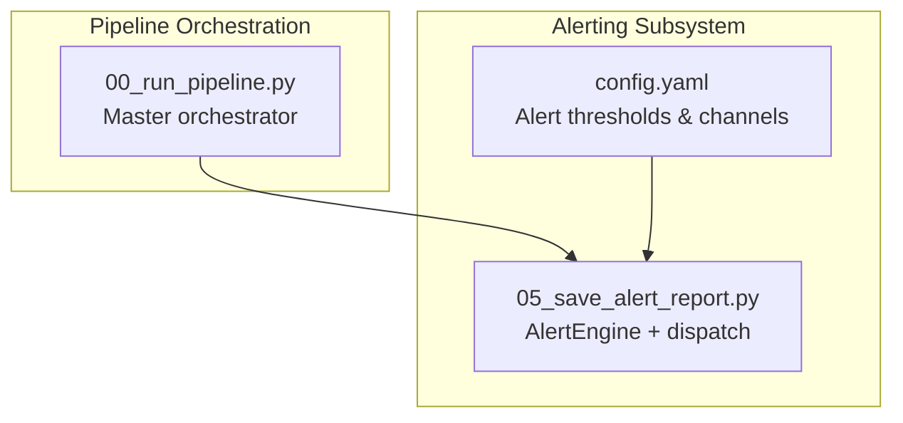
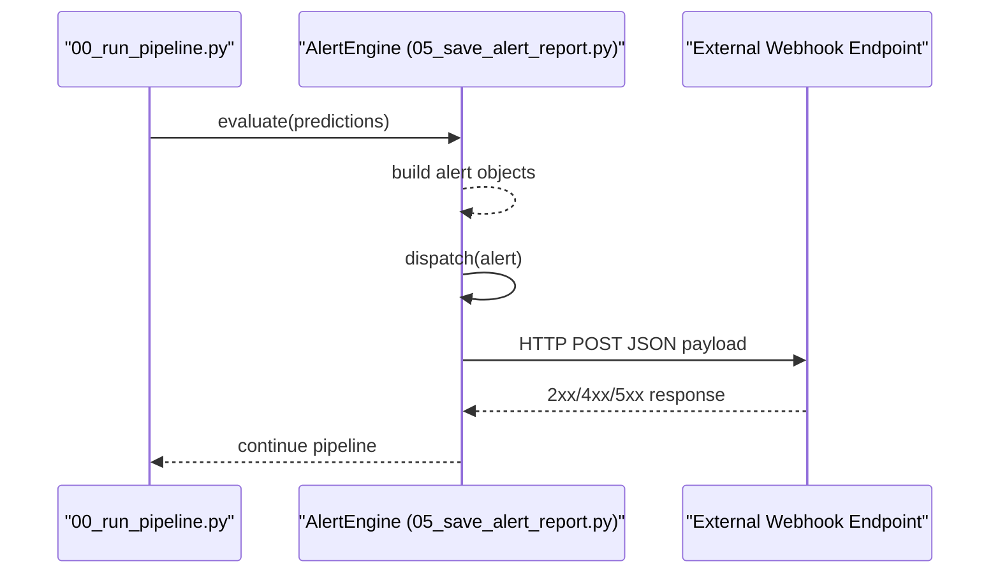
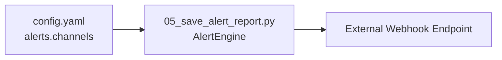

# Webhook Integration

<cite>
**Referenced Files in This Document**
- [README.md](file://README.md)
- [config.yaml](file://config.yaml)
- [05_save_alert_report.py](file://05_save_alert_report.py)
- [00_run_pipeline.py](file://00_run_pipeline.py)
- [pipeline_utils.py](file://pipeline_utils.py)
</cite>

## Table of Contents
1. [Introduction](#introduction)
2. [Project Structure](#project-structure)
3. [Core Components](#core-components)
4. [Architecture Overview](#architecture-overview)
5. [Detailed Component Analysis](#detailed-component-analysis)
6. [Dependency Analysis](#dependency-analysis)
7. [Performance Considerations](#performance-considerations)
8. [Troubleshooting Guide](#troubleshooting-guide)
9. [Conclusion](#conclusion)
10. [Appendices](#appendices)

## Introduction
This document describes the webhook notification system used by the Aditya-L1 Solar Flare Forecasting Pipeline to integrate with external monitoring and alerting platforms. It explains the alert payload structure, how alerts are triggered, and how to configure and consume the webhook endpoint. It also covers retry behavior, timeouts, and security considerations, along with integration examples for common systems.

## Project Structure
The webhook integration lives within the alerting subsystem of the pipeline. The key files involved are:
- Configuration defines alert thresholds and webhook channel settings.
- The alert evaluation engine computes alert events and dispatches them to configured channels.
- The master pipeline orchestrator coordinates all steps and triggers alert evaluation.

**Diagram sources**
- [00_run_pipeline.py:63-146](file://00_run_pipeline.py#L63-L146)
- [config.yaml:79-89](file://config.yaml#L79-L89)
- [05_save_alert_report.py:222-298](file://05_save_alert_report.py#L222-L298)

**Section sources**
- [00_run_pipeline.py:63-146](file://00_run_pipeline.py#L63-L146)
- [config.yaml:79-89](file://config.yaml#L79-L89)

## Core Components
- Alert thresholds and channels are configured centrally.
- The alert engine evaluates predictions against thresholds and emits alert events.
- Dispatch routes alerts to configured channels, including webhooks.

Key responsibilities:
- Threshold evaluation and alert creation.
- Channel selection and delivery (webhook, email, logs).
- Webhook delivery uses an HTTP POST with JSON payload and a fixed timeout.

**Section sources**
- [config.yaml:79-89](file://config.yaml#L79-L89)
- [05_save_alert_report.py:222-298](file://05_save_alert_report.py#L222-L298)

## Architecture Overview
The webhook is part of the alert dispatch mechanism. When a prediction breaches a configured threshold, an alert object is created and sent to all enabled channels. If the webhook channel is enabled, the alert is posted to the configured URL.

**Diagram sources**
- [00_run_pipeline.py:108-113](file://00_run_pipeline.py#L108-L113)
- [05_save_alert_report.py:222-298](file://05_save_alert_report.py#L222-L298)

## Detailed Component Analysis

### Alert Payload Structure
The webhook payload is a JSON object representing a single alert event. It includes identifiers, severity, threshold metadata, and a human-readable message.

Fields included in the alert payload:
- alert_id: Unique identifier for the alert.
- pred_id: Reference to the prediction record associated with the alert.
- severity: One of CRITICAL, WARNING, HIGH RISK, STORM WATCH, WATCH.
- threshold_name: Name of the threshold key that was exceeded.
- threshold_value: Threshold percentage used for comparison.
- actual_value: Actual computed percentage that exceeded the threshold.
- message: Human-readable description of the alert.

Example payload shape:
- alert_id: string
- pred_id: string
- severity: string
- threshold_name: string
- threshold_value: number (0..1)
- actual_value: number (0..1)
- message: string

Notes:
- The payload is constructed during alert evaluation and sent via HTTP POST to the configured webhook URL.
- The webhook endpoint receives the alert object directly; no wrapper envelope is added.

**Section sources**
- [05_save_alert_report.py:246-265](file://05_save_alert_report.py#L246-L265)
- [05_save_alert_report.py:250-258](file://05_save_alert_report.py#L250-L258)

### Trigger Conditions and Severity Levels
Alerts are triggered when specific probabilistic predictions exceed configured thresholds. The thresholds and severity mapping are defined in configuration.

Trigger conditions and severities:
- X-Class probability > 50% → CRITICAL
- M-Class probability > 70% → WARNING
- CME probability > 60% → HIGH RISK
- Geomagnetic storm risk > 55% → STORM WATCH
- General flare probability > 40% → WATCH

These thresholds are configurable and evaluated per prediction.

**Section sources**
- [README.md:175-185](file://README.md#L175-L185)
- [config.yaml:80-85](file://config.yaml#L80-L85)
- [05_save_alert_report.py:229-244](file://05_save_alert_report.py#L229-L244)

### Webhook Endpoint Configuration
The webhook channel is configured under alerts.channels. It includes:
- type: webhook
- enabled: boolean flag to enable/disable
- url: the target endpoint URL (resolved from environment variable)

Environment variable:
- ALERT_WEBHOOK_URL: Provides the webhook URL used by the pipeline.

Timeout and retry behavior:
- Timeout: Fixed 10 seconds for the HTTP POST.
- Retry: The pipeline applies a general retry/backoff to individual steps; however, the webhook dispatch itself does not implement retries.

Security considerations:
- The pipeline does not add authentication headers or signatures to the webhook request.
- It is strongly recommended to secure the endpoint with HTTPS and implement your own authentication/signature verification at the receiving system.

**Section sources**
- [config.yaml:86-89](file://config.yaml#L86-L89)
- [README.md:78-81](file://README.md#L78-L81)
- [05_save_alert_report.py:295-297](file://05_save_alert_report.py#L295-L297)
- [00_run_pipeline.py:41-61](file://00_run_pipeline.py#L41-L61)

### Request Format and Delivery
- Method: HTTP POST
- Content-Type: application/json
- Body: The alert object (no envelope)
- Headers: None added by the pipeline (no custom headers)
- Timeout: 10 seconds
- Authentication: None added by the pipeline (use endpoint-side auth)

Delivery flow:
- The alert engine iterates through enabled channels and posts the alert to the webhook URL.

**Section sources**
- [05_save_alert_report.py:267-297](file://05_save_alert_report.py#L267-L297)

### Response Expectations
- The pipeline does not read or process the webhook response.
- The endpoint should return a successful HTTP status (2xx) to indicate acceptance.
- Any non-success response is logged as a dispatch failure by the pipeline.

**Section sources**
- [05_save_alert_report.py:277-278](file://05_save_alert_report.py#L277-L278)

### Complete Webhook Payload Examples
Below are example payloads for each severity level. These represent typical alert objects emitted by the pipeline when thresholds are exceeded.

- CRITICAL
  - severity: "CRITICAL"
  - threshold_name: "x_class_critical_pct"
  - threshold_value: 0.5
  - actual_value: > 0.5
  - message: Describes X-Class probability exceeding threshold

- WARNING
  - severity: "WARNING"
  - threshold_name: "m_class_warning_pct"
  - threshold_value: 0.7
  - actual_value: > 0.7
  - message: Describes M-Class probability exceeding threshold

- HIGH RISK
  - severity: "HIGH RISK"
  - threshold_name: "cme_high_risk_pct"
  - threshold_value: 0.6
  - actual_value: > 0.6
  - message: Describes CME probability exceeding threshold

- STORM WATCH
  - severity: "STORM WATCH"
  - threshold_name: "geomag_storm_pct"
  - threshold_value: 0.55
  - actual_value: > 0.55
  - message: Describes geomagnetic storm risk and label

- WATCH
  - severity: "WATCH"
  - threshold_name: "flare_watch_pct"
  - threshold_value: 0.4
  - actual_value: > 0.4
  - message: Describes general flare probability watch

Note: The exact values depend on the latest prediction outputs.

**Section sources**
- [05_save_alert_report.py:229-244](file://05_save_alert_report.py#L229-L244)
- [README.md:175-185](file://README.md#L175-L185)

### Integration Examples

#### Slack
- Create an incoming webhook URL in Slack.
- Enable the webhook channel in configuration and set the URL.
- Slack will receive the alert object as JSON. You can parse and format it into a Slack message.

#### PagerDuty
- Use an integration endpoint compatible with your chosen service (e.g., Generic V2).
- Enable the webhook channel and set the integration URL.
- The alert object can be mapped to the service’s event schema.

#### Custom Web Application
- Expose an HTTP endpoint that accepts POST with application/json body.
- Parse the alert object and route to internal systems (e.g., ticketing, chat, monitoring).
- Return 2xx to acknowledge receipt.

Security recommendations:
- Enforce HTTPS at the endpoint.
- Implement signature verification or shared secret authentication at the endpoint.
- Rate limit and throttle inbound requests to protect your system.

**Section sources**
- [config.yaml:86-89](file://config.yaml#L86-L89)
- [README.md:78-81](file://README.md#L78-L81)

### Security Considerations
- Transport security: Use HTTPS for the webhook endpoint.
- Authentication: The pipeline does not add authentication headers. Implement endpoint-side authentication (e.g., shared secret, HMAC signature verification).
- Rate limiting: Apply rate limits at the endpoint to prevent abuse.
- Signature verification: If desired, implement signature verification at the endpoint using a shared secret or cryptographic signature scheme.

**Section sources**
- [05_save_alert_report.py:295-297](file://05_save_alert_report.py#L295-L297)

## Dependency Analysis
The webhook depends on:
- Configuration for enabling and URL resolution.
- The alert engine for constructing the payload.
- The requests library for outbound HTTP POST.

**Diagram sources**
- [config.yaml:86-89](file://config.yaml#L86-L89)
- [05_save_alert_report.py:267-297](file://05_save_alert_report.py#L267-L297)

**Section sources**
- [config.yaml:86-89](file://config.yaml#L86-L89)
- [05_save_alert_report.py:267-297](file://05_save_alert_report.py#L267-L297)

## Performance Considerations
- The webhook call uses a short timeout to keep pipeline execution responsive.
- There is no built-in retry for webhook failures; failures are logged and the pipeline continues.
- If high reliability is required, implement retries at the receiving endpoint.

**Section sources**
- [05_save_alert_report.py:295-297](file://05_save_alert_report.py#L295-L297)
- [00_run_pipeline.py:41-61](file://00_run_pipeline.py#L41-L61)

## Troubleshooting Guide
Common issues and resolutions:
- Endpoint unreachable or slow
  - Symptom: Dispatch errors logged by the pipeline.
  - Action: Verify network reachability, DNS, firewall, and endpoint availability. Reduce latency or increase timeout at the endpoint.
- Non-2xx response
  - Symptom: Dispatch failure logged.
  - Action: Ensure the endpoint returns 2xx on success. Investigate endpoint-side errors.
- Authentication failures
  - Symptom: 401/403 responses.
  - Action: Implement endpoint-side authentication and ensure the pipeline’s requests meet requirements.
- Misconfigured URL
  - Symptom: Requests fail immediately.
  - Action: Confirm ALERT_WEBHOOK_URL is exported and the channel is enabled.
- Rate limiting
  - Symptom: Requests dropped or delayed.
  - Action: Apply rate limits at the endpoint and consider batching if appropriate.

**Section sources**
- [05_save_alert_report.py:277-278](file://05_save_alert_report.py#L277-L278)
- [README.md:78-81](file://README.md#L78-L81)
- [config.yaml:86-89](file://config.yaml#L86-L89)

## Conclusion
The webhook integration provides a simple, JSON-based alert delivery mechanism suitable for external monitoring systems. It is designed for minimal overhead and relies on the receiving system to implement transport security, authentication, and reliability measures such as retries and rate limiting.

## Appendices

### Appendix A: Configuration Reference
- alerts.thresholds
  - m_class_warning_pct: 70
  - x_class_critical_pct: 50
  - cme_high_risk_pct: 60
  - geomag_storm_pct: 55
  - flare_watch_pct: 40
- alerts.channels
  - type: webhook
  - enabled: false
  - url: ${ALERT_WEBHOOK_URL}

Environment variables:
- ALERT_WEBHOOK_URL: Target webhook URL.

**Section sources**
- [config.yaml:80-89](file://config.yaml#L80-L89)
- [README.md:78-81](file://README.md#L78-L81)