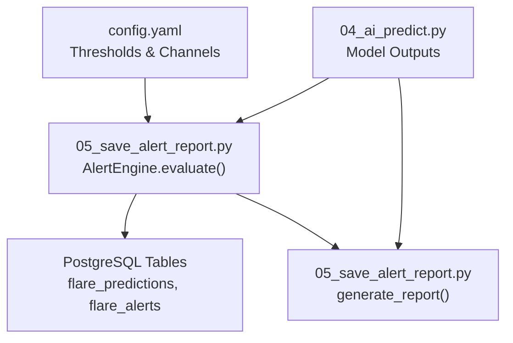
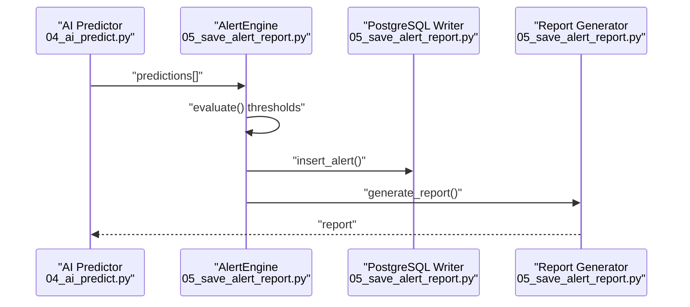
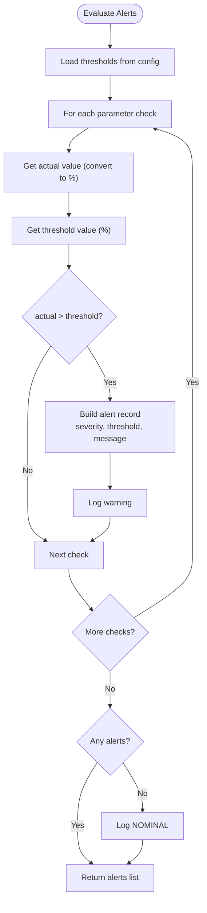
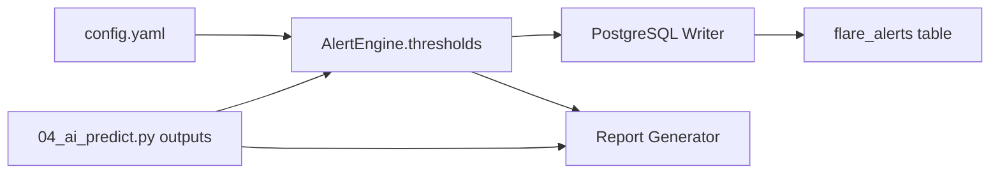

# Alert Classification and Thresholds

<cite>
**Referenced Files in This Document**
- [config.yaml](file://config.yaml)
- [05_save_alert_report.py](file://05_save_alert_report.py)
- [README.md](file://README.md)
- [pipeline_utils.py](file://pipeline_utils.py)
- [04_ai_predict.py](file://04_ai_predict.py)
- [00_run_pipeline.py](file://00_run_pipeline.py)
</cite>

## Table of Contents
1. [Introduction](#introduction)
2. [Project Structure](#project-structure)
3. [Core Components](#core-components)
4. [Architecture Overview](#architecture-overview)
5. [Detailed Component Analysis](#detailed-component-analysis)
6. [Dependency Analysis](#dependency-analysis)
7. [Performance Considerations](#performance-considerations)
8. [Troubleshooting Guide](#troubleshooting-guide)
9. [Conclusion](#conclusion)

## Introduction
This document describes the alert classification system that evaluates space weather model outputs against configurable thresholds to produce a five-tier severity hierarchy: CRITICAL, WARNING, HIGH RISK, STORM WATCH, and WATCH. It explains the specific probability thresholds, the evaluation algorithm, and how different space weather parameters (flare probabilities, CME probabilities, and geomagnetic risk) influence alert severity. It also provides examples of typical scenarios and guidance for handling edge cases and threshold crossing events.

## Project Structure
The alert classification system is part of the Aditya-L1 Solar Flare Forecasting Pipeline. The relevant components are:
- Configuration defines thresholds and alert channels
- AI prediction step generates model outputs including probabilities and risk metrics
- Alert evaluation step compares outputs to thresholds and fires alerts
- Reporting step aggregates results and actions

**Diagram sources**
- [config.yaml:79-89](file://config.yaml#L79-L89)
- [04_ai_predict.py:368-395](file://04_ai_predict.py#L368-L395)
- [05_save_alert_report.py:222-265](file://05_save_alert_report.py#L222-L265)
- [05_save_alert_report.py:47-116](file://05_save_alert_report.py#L47-L116)
- [05_save_alert_report.py:340-425](file://05_save_alert_report.py#L340-L425)

**Section sources**
- [config.yaml:79-89](file://config.yaml#L79-L89)
- [04_ai_predict.py:368-395](file://04_ai_predict.py#L368-L395)
- [05_save_alert_report.py:222-265](file://05_save_alert_report.py#L222-L265)
- [05_save_alert_report.py:47-116](file://05_save_alert_report.py#L47-L116)
- [05_save_alert_report.py:340-425](file://05_save_alert_report.py#L340-L425)

## Core Components
- Threshold configuration: Defines the percentage thresholds for each alert tier and alert delivery channels.
- Prediction outputs: The AI ensemble produces probabilities for flare classes, CME occurrence, and geomagnetic storm risk.
- Alert evaluation: Compares each output against thresholds and emits alerts with severity and messages.
- Reporting: Aggregates alert status, recommended actions, and threshold evaluations into a structured JSON report.

Key thresholds (as configured):
- x_class_critical_pct: 50%
- m_class_warning_pct: 70%
- cme_high_risk_pct: 60%
- geomag_storm_pct: 55%
- flare_watch_pct: 40%

These thresholds are loaded and used by the alert evaluation engine.

**Section sources**
- [config.yaml:80-85](file://config.yaml#L80-L85)
- [05_save_alert_report.py:224](file://05_save_alert_report.py#L224)
- [05_save_alert_report.py:229-244](file://05_save_alert_report.py#L229-L244)

## Architecture Overview
The alert classification pipeline operates as follows:
- The AI prediction step computes flare probabilities, CME probability, and geomagnetic storm risk.
- The alert evaluation step compares these outputs to configured thresholds and creates alert records.
- Alerts are persisted to the database and optionally dispatched via configured channels.
- A structured JSON report is generated, including alert status and recommended actions.

**Diagram sources**
- [04_ai_predict.py:402-448](file://04_ai_predict.py#L402-L448)
- [05_save_alert_report.py:226-265](file://05_save_alert_report.py#L226-L265)
- [05_save_alert_report.py:190-211](file://05_save_alert_report.py#L190-L211)
- [05_save_alert_report.py:340-425](file://05_save_alert_report.py#L340-L425)

## Detailed Component Analysis

### Alert Thresholds and Severity Hierarchy
The system uses a five-tier severity hierarchy:
- CRITICAL: Triggered when X-class probability exceeds the configured x_class_critical_pct threshold (default 50%).
- WARNING: Triggered when M-class probability exceeds the configured m_class_warning_pct threshold (default 70%).
- HIGH RISK: Triggered when CME probability exceeds the configured cme_high_risk_pct threshold (default 60%).
- STORM WATCH: Triggered when geomagnetic storm risk exceeds the configured geomag_storm_pct threshold (default 55%).
- WATCH: Triggered when general flare probability exceeds the configured flare_watch_pct threshold (default 40%).

Each alert includes severity, threshold name/value, actual value, and a descriptive message.

**Section sources**
- [config.yaml:80-85](file://config.yaml#L80-L85)
- [05_save_alert_report.py:229-244](file://05_save_alert_report.py#L229-L244)
- [README.md:175-186](file://README.md#L175-L186)

### Alert Evaluation Algorithm
The evaluation algorithm iterates through a predefined set of checks. For each check:
- Extract the actual value from the prediction dictionary (converted to percentage).
- Retrieve the configured threshold percentage from the thresholds configuration.
- If the actual value exceeds the threshold, construct an alert record with severity, threshold metadata, and a message.
- Log the alert and collect it for persistence and reporting.

Edge cases handled:
- If no thresholds are exceeded, the system logs NOMINAL conditions.
- Thresholds are configurable; default values are applied if keys are missing.

**Diagram sources**
- [05_save_alert_report.py:226-265](file://05_save_alert_report.py#L226-L265)

**Section sources**
- [05_save_alert_report.py:226-265](file://05_save_alert_report.py#L226-L265)

### Relationship Between Space Weather Parameters and Alert Severity
The AI prediction step produces outputs that feed the alert evaluation:
- Flare probability: General probability of a significant flare occurring.
- M-class and X-class probabilities: Derived from class probabilities; X-class drives CRITICAL severity.
- CME probability: Correlated with solar eruption and interplanetary propagation; drives HIGH RISK.
- Geomagnetic storm risk: Combined from CME probability, Kp index, and IMF Bz; drives STORM WATCH.
- Confidence score: Reflects model agreement; used in reporting and recommended actions.

These outputs are used directly by the alert evaluation engine to compute severities.

**Section sources**
- [04_ai_predict.py:368-395](file://04_ai_predict.py#L368-L395)
- [05_save_alert_report.py:229-244](file://05_save_alert_report.py#L229-L244)

### Typical Scenarios and Probability Ranges
Below are representative scenarios aligned with the configured thresholds. These illustrate the approximate ranges that trigger each alert tier.

- CRITICAL (X-class > 50%): High likelihood of an X-class event; immediate action required.
- WARNING (M-class > 70%): Elevated chance of M-class or stronger; heightened monitoring.
- HIGH RISK (CME > 60%): Significant CME probability; notify satellite operators.
- STORM WATCH (Geomagnetic storm risk > 55%): Geomagnetic activity increasing; advise power grid operators.
- WATCH (General flare probability > 40%): General watch active; monitor more frequently.

Note: These ranges reflect the configured thresholds and are illustrative. Actual probabilities are expressed as percentages in the model outputs and reports.

**Section sources**
- [config.yaml:80-85](file://config.yaml#L80-L85)
- [README.md:175-186](file://README.md#L175-L186)

### Threshold Crossing Events and Edge Cases
- Threshold crossing: An alert is fired when the actual value crosses above the configured threshold. Subsequent updates with higher probabilities will continue to trigger alerts until conditions normalize.
- Nominal conditions: When no thresholds are exceeded, the system logs NOMINAL conditions.
- Missing data: If a parameter is absent from the prediction dictionary, it defaults to zero during evaluation.
- Channel dispatch: Alerts are dispatched to configured channels (log/email/webhook) if enabled.

Recommended handling:
- For transient crossings, maintain continuous monitoring and adjust cadence as recommended by the report’s action guidance.
- For sustained high-risk conditions, escalate actions according to the recommended action text in the report.

**Section sources**
- [05_save_alert_report.py:246-265](file://05_save_alert_report.py#L246-L265)
- [05_save_alert_report.py:267-297](file://05_save_alert_report.py#L267-L297)
- [05_save_alert_report.py:428-446](file://05_save_alert_report.py#L428-L446)

### Alert Delivery Channels
Configurable channels include:
- Log: Default channel for alert logging.
- Email: Sends alerts to configured recipients via SMTP.
- Webhook: Posts alerts to a configured URL endpoint.

Channel enablement and configuration are defined in the configuration file.

**Section sources**
- [config.yaml:86-89](file://config.yaml#L86-L89)
- [05_save_alert_report.py:267-297](file://05_save_alert_report.py#L267-L297)

### Database Schema for Alerts
Alerts are persisted to the database with fields capturing severity, threshold metadata, and messages. The schema is created automatically on first run.

Key alert table fields:
- alert_id: Unique identifier
- pred_id: Foreign key to the prediction record
- alert_time: Timestamp of alert firing
- severity: One of CRITICAL, WARNING, HIGH RISK, STORM WATCH, WATCH
- threshold_name: Threshold key (e.g., x_class_critical_pct)
- threshold_value: Threshold value (fraction)
- actual_value: Actual measured value (fraction)
- message: Descriptive alert message

Indexes support efficient querying by severity and time.

**Section sources**
- [05_save_alert_report.py:47-116](file://05_save_alert_report.py#L47-L116)

### Reporting and Recommended Actions
The report includes:
- alert_status: Top severity among active alerts or NOMINAL
- active_alerts: List of severity and messages
- recommended_action: Action guidance based on top severity
- threshold_evaluation: Boolean indicators for each threshold crossing

Recommended actions vary by severity:
- CRITICAL: Immediate action for satellites and public advisories
- WARNING/HIGH RISK: Increased monitoring and operator briefings
- STORM WATCH: Power grid and GNSS provider notifications
- WATCH: Frequent monitoring and on-call duty

**Section sources**
- [05_save_alert_report.py:400-446](file://05_save_alert_report.py#L400-L446)
- [README.md:175-186](file://README.md#L175-L186)

## Dependency Analysis
The alert classification depends on:
- Configuration thresholds and channels
- AI prediction outputs (probabilities and risk metrics)
- Database persistence for predictions and alerts
- Logging and optional email/webhook dispatch

**Diagram sources**
- [config.yaml:79-89](file://config.yaml#L79-L89)
- [04_ai_predict.py:368-395](file://04_ai_predict.py#L368-L395)
- [05_save_alert_report.py:224](file://05_save_alert_report.py#L224)
- [05_save_alert_report.py:47-116](file://05_save_alert_report.py#L47-L116)
- [05_save_alert_report.py:340-425](file://05_save_alert_report.py#L340-L425)

**Section sources**
- [config.yaml:79-89](file://config.yaml#L79-L89)
- [04_ai_predict.py:368-395](file://04_ai_predict.py#L368-L395)
- [05_save_alert_report.py:224](file://05_save_alert_report.py#L224)
- [05_save_alert_report.py:47-116](file://05_save_alert_report.py#L47-L116)
- [05_save_alert_report.py:340-425](file://05_save_alert_report.py#L340-L425)

## Performance Considerations
- Threshold evaluation is O(n) with respect to the number of checks (fixed small constant).
- Database writes are batched per prediction; alert insertion occurs per alert.
- Email/webhook dispatch is asynchronous per alert; failures are logged and do not block the pipeline.
- Recommendations:
  - Keep thresholds reasonable to minimize false positives while maintaining responsiveness.
  - Monitor alert volume and adjust cadence or thresholds as needed.
  - Ensure database connectivity and network endpoints for email/webhooks are reliable.

[No sources needed since this section provides general guidance]

## Troubleshooting Guide
Common issues and resolutions:
- No alerts fired despite high probabilities:
  - Verify thresholds in configuration and ensure they are not overly strict.
  - Confirm prediction outputs include the expected fields.
- Email/webhook failures:
  - Check channel configuration and credentials.
  - Review logs for dispatch errors.
- Database write failures:
  - Confirm PostgreSQL availability and credentials.
  - Check table creation and permissions.
- Missing data fields:
  - Ensure the prediction step supplies all required fields.
  - Validate feature engineering and preprocessing stages.

**Section sources**
- [05_save_alert_report.py:267-297](file://05_save_alert_report.py#L267-L297)
- [05_save_alert_report.py:118-141](file://05_save_alert_report.py#L118-L141)
- [05_save_alert_report.py:262-265](file://05_save_alert_report.py#L262-L265)

## Conclusion
The alert classification system provides a robust, configurable framework for translating model outputs into actionable space weather alerts. By comparing key probabilities and risk metrics against thresholds, it enables timely and appropriate responses across the five-tier severity hierarchy. Proper configuration, monitoring, and adherence to recommended actions ensure effective space weather operations.