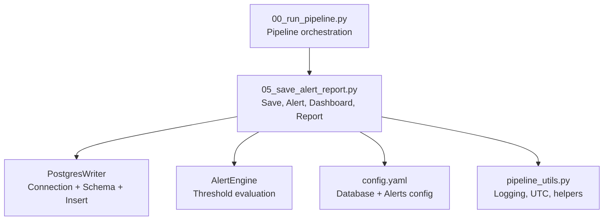
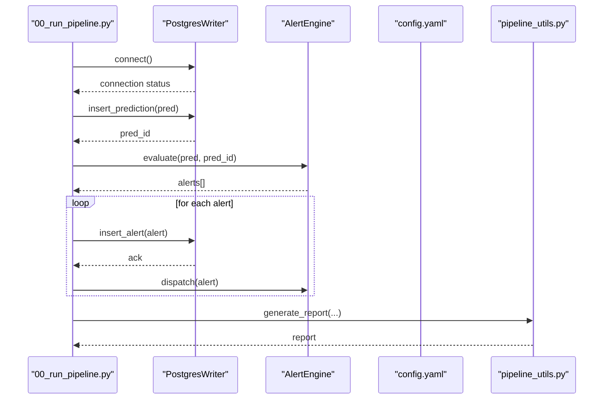
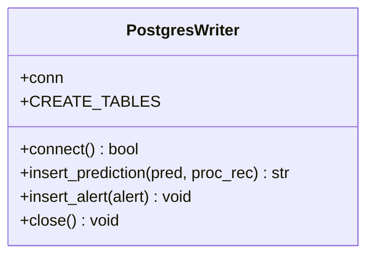
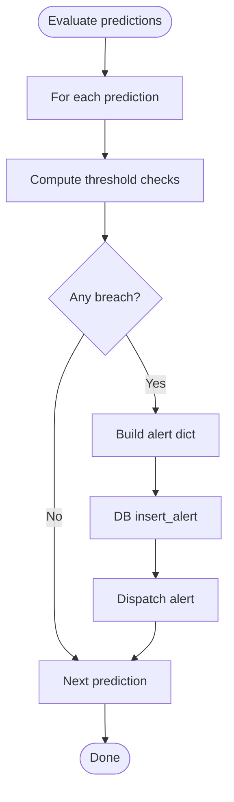
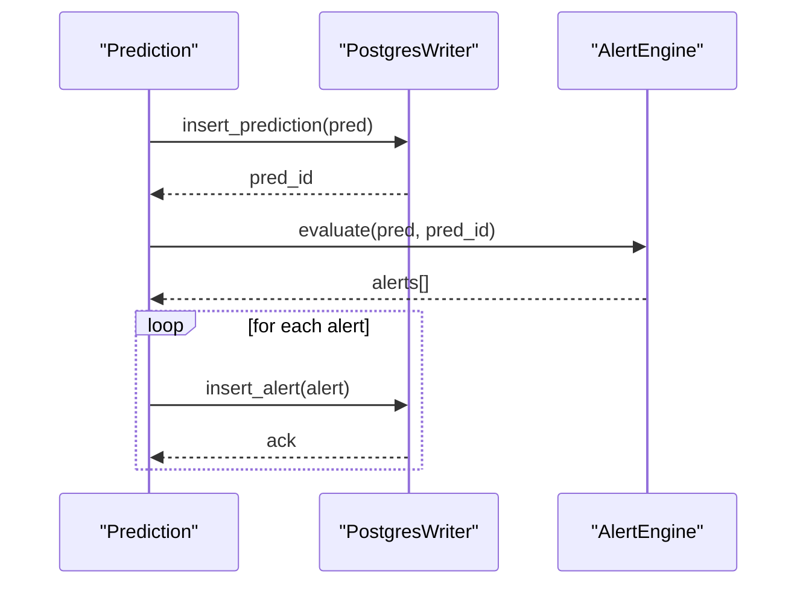
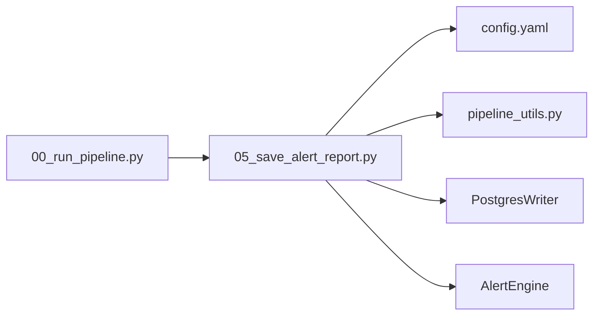

# Alert Database Storage

<cite>
**Referenced Files in This Document**
- [00_run_pipeline.py](file://00_run_pipeline.py)
- [05_save_alert_report.py](file://05_save_alert_report.py)
- [config.yaml](file://config.yaml)
- [pipeline_utils.py](file://pipeline_utils.py)
</cite>

## Table of Contents
1. [Introduction](#introduction)
2. [Project Structure](#project-structure)
3. [Core Components](#core-components)
4. [Architecture Overview](#architecture-overview)
5. [Detailed Component Analysis](#detailed-component-analysis)
6. [Dependency Analysis](#dependency-analysis)
7. [Performance Considerations](#performance-considerations)
8. [Troubleshooting Guide](#troubleshooting-guide)
9. [Conclusion](#conclusion)
10. [Appendices](#appendices)

## Introduction
This document describes the PostgreSQL alert storage system used by the Aditya-L1 Solar Flare Forecasting Pipeline. It covers the alert persistence workflow, the database schema for alerts, the database writer implementation, configuration, connectivity behavior, and practical query patterns for retrieval and monitoring.

## Project Structure
The alert storage is implemented in a single module responsible for saving predictions and evaluating/firing alerts. The pipeline orchestrator coordinates the end-to-end flow, invoking the alert/report step after inference.

**Diagram sources**
- [00_run_pipeline.py:63-121](file://00_run_pipeline.py#L63-L121)
- [05_save_alert_report.py:452-502](file://05_save_alert_report.py#L452-L502)
- [config.yaml:79-104](file://config.yaml#L79-L104)
- [pipeline_utils.py:25-41](file://pipeline_utils.py#L25-L41)

**Section sources**
- [00_run_pipeline.py:63-121](file://00_run_pipeline.py#L63-L121)
- [05_save_alert_report.py:452-502](file://05_save_alert_report.py#L452-L502)
- [config.yaml:79-104](file://config.yaml#L79-L104)
- [pipeline_utils.py:25-41](file://pipeline_utils.py#L25-L41)

## Core Components
- PostgresWriter: Manages PostgreSQL connection, creates schema on first run, inserts predictions and alerts, and handles rollback on errors.
- AlertEngine: Evaluates predictions against thresholds and generates alert records.
- Configuration: Database connectivity and alert thresholds are loaded from config.
- Utilities: Logging, UTC timestamp formatting, and shared state.

Key responsibilities:
- Automatic schema creation for pipeline runs, raw observations, predictions, and alerts.
- Idempotent inserts using primary keys and conflict handling.
- Simulation mode when PostgreSQL driver is unavailable.

**Section sources**
- [05_save_alert_report.py:47-216](file://05_save_alert_report.py#L47-L216)
- [05_save_alert_report.py:222-298](file://05_save_alert_report.py#L222-L298)
- [config.yaml:79-104](file://config.yaml#L79-L104)
- [pipeline_utils.py:43-64](file://pipeline_utils.py#L43-L64)

## Architecture Overview
End-to-end flow from prediction to alert persistence and reporting.

**Diagram sources**
- [00_run_pipeline.py:108-113](file://00_run_pipeline.py#L108-L113)
- [05_save_alert_report.py:464-495](file://05_save_alert_report.py#L464-L495)
- [05_save_alert_report.py:143-188](file://05_save_alert_report.py#L143-L188)
- [05_save_alert_report.py:190-211](file://05_save_alert_report.py#L190-L211)
- [05_save_alert_report.py:267-298](file://05_save_alert_report.py#L267-L298)

## Detailed Component Analysis

### Database Writer: PostgresWriter
- Purpose: Encapsulates PostgreSQL connectivity, schema creation, and insertion operations for predictions and alerts.
- Connection management:
  - Attempts to import the PostgreSQL driver; if unavailable, operates in simulation mode and logs inserts without writing.
  - Uses configuration values for host, port, database name, user, and password.
  - Establishes a connection with a short timeout and executes schema creation immediately upon connect.
- Schema creation:
  - Creates pipeline runs, raw observations, predictions, and alerts tables.
  - Adds indexes for efficient time-range queries and severity filtering.
- Insertion operations:
  - insert_prediction: Generates a deterministic pred_id, inserts prediction metadata, and stores JSON blobs for class probabilities and model outputs.
  - insert_alert: Inserts alert records with alert_id, pred_id, alert_time, severity, threshold details, and message.
  - Conflict handling: Uses upsert semantics to avoid duplicates on primary keys.
  - Error handling: Rollback on exceptions and logs errors.

**Diagram sources**
- [05_save_alert_report.py:47-216](file://05_save_alert_report.py#L47-L216)

**Section sources**
- [05_save_alert_report.py:118-141](file://05_save_alert_report.py#L118-L141)
- [05_save_alert_report.py:143-188](file://05_save_alert_report.py#L143-L188)
- [05_save_alert_report.py:190-211](file://05_save_alert_report.py#L190-L211)

### Alert Evaluation: AlertEngine
- Purpose: Translates prediction outputs into alert records based on configurable thresholds.
- Thresholds: Loaded from configuration and compared against prediction metrics.
- Severity levels: CRITICAL, WARNING, HIGH RISK, STORM WATCH, WATCH.
- Alert metadata: alert_id, pred_id, severity, threshold_name, threshold_value, actual_value, message.
- Dispatch: Supports logging, email, and webhook channels.

**Diagram sources**
- [05_save_alert_report.py:222-265](file://05_save_alert_report.py#L222-L265)
- [05_save_alert_report.py:190-211](file://05_save_alert_report.py#L190-L211)
- [05_save_alert_report.py:267-298](file://05_save_alert_report.py#L267-L298)

**Section sources**
- [05_save_alert_report.py:222-265](file://05_save_alert_report.py#L222-L265)
- [05_save_alert_report.py:267-298](file://05_save_alert_report.py#L267-L298)

### Database Connectivity and Configuration
- Database configuration:
  - Host, port, database name, user, password are read from environment-expanded configuration.
  - Pool size is defined in configuration; however, the writer maintains a single connection per run.
- Optional simulation mode:
  - If the PostgreSQL driver is not available, the writer logs inserts and returns placeholder identifiers.
- Connection error handling:
  - Connection failures are logged and the writer reports inability to connect.

**Section sources**
- [config.yaml:91-97](file://config.yaml#L91-L97)
- [config.yaml:98-104](file://config.yaml#L98-L104)
- [05_save_alert_report.py:121-141](file://05_save_alert_report.py#L121-L141)

### Alert Persistence Workflow
- UUID generation:
  - pred_id is generated deterministically from a UUID prefix.
  - alert_id is generated deterministically from a UUID prefix.
- Timestamp handling:
  - Prediction records include observation time and prediction time.
  - Alert records include alert_time set at insertion time.
- Conflict resolution:
  - Upsert on pred_id and alert_id prevents duplicate writes.
- Persistence order:
  - Predictions are inserted first; alerts are inserted afterward and linked via pred_id.

**Diagram sources**
- [05_save_alert_report.py:143-188](file://05_save_alert_report.py#L143-L188)
- [05_save_alert_report.py:190-211](file://05_save_alert_report.py#L190-L211)
- [05_save_alert_report.py:222-265](file://05_save_alert_report.py#L222-L265)

**Section sources**
- [05_save_alert_report.py:143-188](file://05_save_alert_report.py#L143-L188)
- [05_save_alert_report.py:190-211](file://05_save_alert_report.py#L190-L211)
- [05_save_alert_report.py:222-265](file://05_save_alert_report.py#L222-L265)

### Alert Table Schema
The alerts table captures fired alerts with metadata and linkage to predictions.

- alert_id: Primary key, unique identifier for each alert.
- pred_id: Foreign key referencing the prediction record.
- alert_time: Timestamp when the alert was persisted.
- severity: Human-readable severity level.
- threshold_name: Name of the evaluated threshold.
- threshold_value: Threshold value used for comparison.
- actual_value: Actual computed value that triggered the alert.
- message: Descriptive message summarizing the alert condition.
- dispatched: Boolean flag indicating whether the alert was dispatched.

Indexes:
- Index on severity for fast filtering by severity level.
- Additional indexes exist for predictions on observation time.

**Section sources**
- [05_save_alert_report.py:100-116](file://05_save_alert_report.py#L100-L116)

### SQL Query Patterns for Retrieval and Monitoring
Common patterns for querying alerts and integrating with dashboards:

- Retrieve recent alerts ordered by time:
  - SELECT alert_id, pred_id, alert_time, severity, threshold_name, threshold_value, actual_value FROM flare_alerts ORDER BY alert_time DESC LIMIT 50;
- Filter by severity:
  - SELECT * FROM flare_alerts WHERE severity IN ('CRITICAL','WARNING','HIGH RISK','STORM WATCH','WATCH') ORDER BY alert_time DESC;
- Count alerts by severity:
  - SELECT severity, COUNT(*) FROM flare_alerts GROUP BY severity ORDER BY severity;
- Historical analysis by day:
  - SELECT DATE(alert_time AT TIME ZONE 'UTC') AS day, severity, COUNT(*) FROM flare_alerts GROUP BY day, severity ORDER BY day DESC, severity;
- Join with predictions to enrich context:
  - SELECT a.alert_id, a.severity, a.threshold_name, a.alert_time, p.predicted_flare_class, p.flare_probability FROM flare_alerts a JOIN flare_predictions p ON a.pred_id = p.pred_id ORDER BY a.alert_time DESC;

These patterns support dashboard integration and operational reporting.

**Section sources**
- [05_save_alert_report.py:100-116](file://05_save_alert_report.py#L100-L116)

## Dependency Analysis
- Internal dependencies:
  - Alert step depends on configuration for thresholds and database settings.
  - Alert step depends on utilities for logging and timestamp formatting.
  - Alert step depends on the orchestration script for sequencing.
- External dependencies:
  - PostgreSQL driver availability determines real vs. simulation mode.
  - Network connectivity for external data sources (fallback) is handled in earlier pipeline stages.

**Diagram sources**
- [05_save_alert_report.py:37-40](file://05_save_alert_report.py#L37-L40)
- [00_run_pipeline.py:63-121](file://00_run_pipeline.py#L63-L121)

**Section sources**
- [05_save_alert_report.py:37-40](file://05_save_alert_report.py#L37-L40)
- [00_run_pipeline.py:63-121](file://00_run_pipeline.py#L63-L121)

## Performance Considerations
- Connection lifecycle:
  - The writer opens a single connection per run and closes it at the end. This avoids connection pooling overhead and simplifies error handling.
- Batch operations:
  - Current implementation inserts one prediction and one alert at a time. For high-volume scenarios, consider batching inserts and using prepared statements.
- Indexing strategy:
  - Index on alert_time is not defined in the schema; adding an index on alert_time would improve time-range queries.
  - Index on severity is present; consider composite indexes for frequent filters (e.g., severity + alert_time).
- Upsert semantics:
  - Using primary-key conflict handling avoids duplicate writes and reduces write amplification.
- JSON fields:
  - Storing JSON blobs enables flexible schema evolution but can increase storage and complicate joins. Consider extracting frequently queried fields if needed.
- Simulation mode:
  - In environments without PostgreSQL, inserts are logged rather than executed, preventing runtime errors and enabling development/testing.

[No sources needed since this section provides general guidance]

## Troubleshooting Guide
- Connection failures:
  - Symptoms: Errors during connection or schema creation.
  - Actions: Verify database credentials and network connectivity; confirm PostgreSQL driver installation.
- Missing PostgreSQL driver:
  - Behavior: Simulation mode activates; inserts are logged but not written.
  - Actions: Install the PostgreSQL driver to enable real writes.
- Insert errors:
  - Symptoms: Exceptions during insert operations.
  - Actions: Review logs for error messages; ensure primary keys are unique and values conform to column types.
- Threshold misconfiguration:
  - Symptoms: Unexpected alert firing or lack thereof.
  - Actions: Validate threshold values in configuration and ensure prediction metrics are populated.

**Section sources**
- [05_save_alert_report.py:121-141](file://05_save_alert_report.py#L121-L141)
- [05_save_alert_report.py:184-187](file://05_save_alert_report.py#L184-L187)
- [05_save_alert_report.py:209-211](file://05_save_alert_report.py#L209-L211)

## Conclusion
The alert storage system provides robust, idempotent persistence for solar flare alerts with clear separation between evaluation and storage. It supports operational monitoring via configurable thresholds and integrates seamlessly with the broader pipeline. For high-volume deployments, consider adding indexes on alert_time and optimizing insert patterns.

## Appendices

### Appendix A: Configuration Reference
- Database configuration keys:
  - host, port, name, user, password, pool_size, tables (raw_observations, processed_features, predictions, alerts, pipeline_runs)
- Alerts configuration keys:
  - thresholds (m_class_warning_pct, x_class_critical_pct, cme_high_risk_pct, geomag_storm_pct, flare_watch_pct)
  - channels (log, email, webhook)

**Section sources**
- [config.yaml:91-104](file://config.yaml#L91-L104)
- [config.yaml:79-89](file://config.yaml#L79-L89)