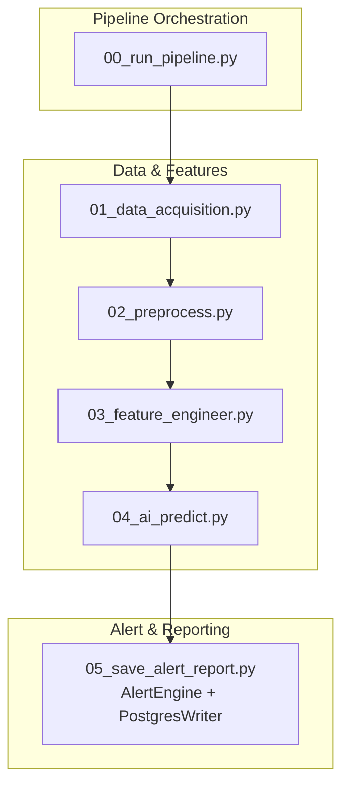
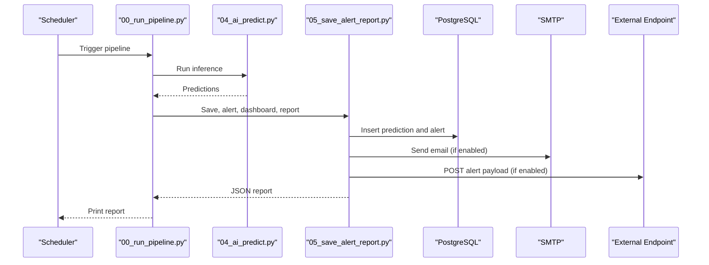
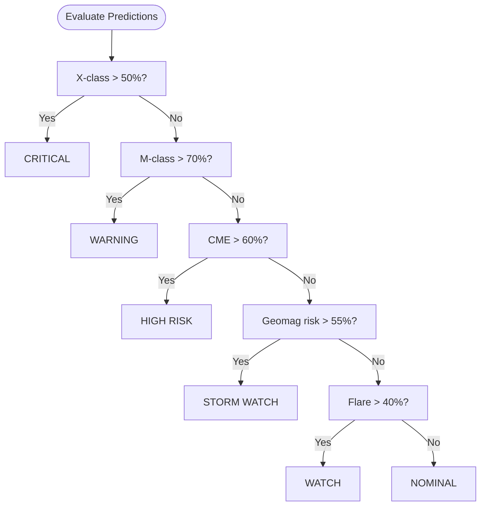
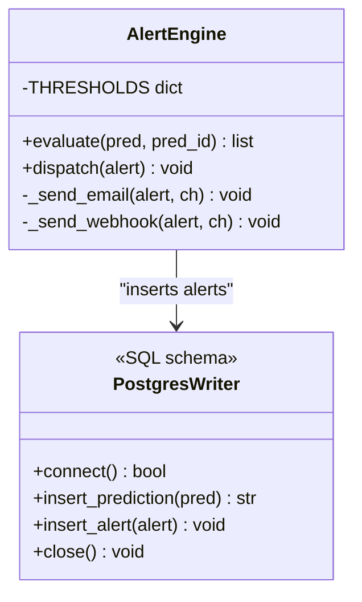
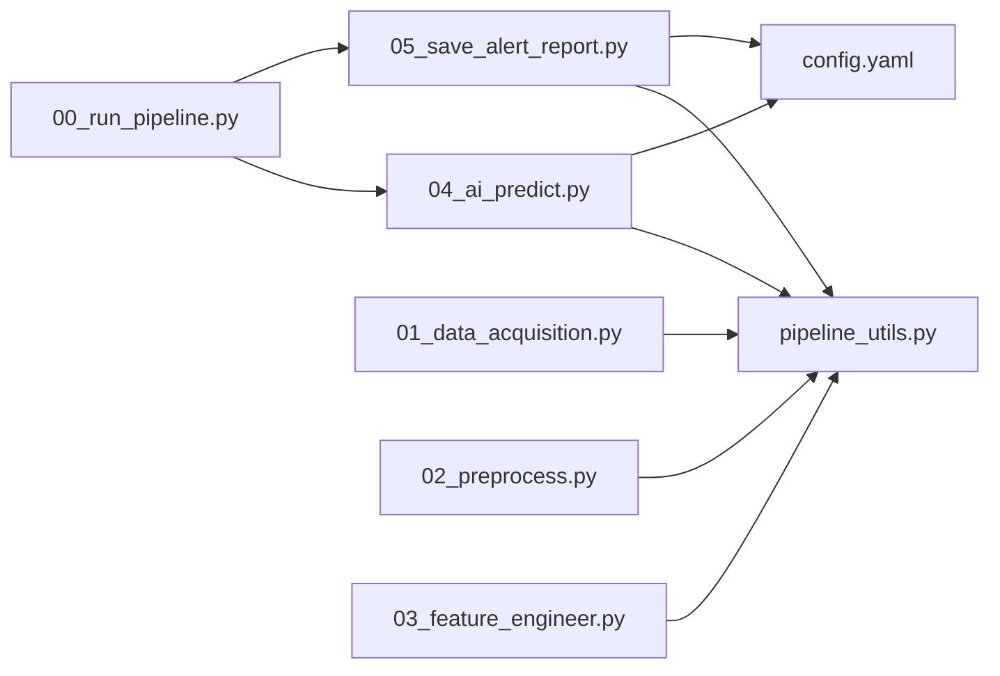

# Alert System

<cite>
**Referenced Files in This Document**
- [README.md](file://README.md)
- [config.yaml](file://config.yaml)
- [00_run_pipeline.py](file://00_run_pipeline.py)
- [01_data_acquisition.py](file://01_data_acquisition.py)
- [02_preprocess.py](file://02_preprocess.py)
- [03_feature_engineer.py](file://03_feature_engineer.py)
- [04_ai_predict.py](file://04_ai_predict.py)
- [05_save_alert_report.py](file://05_save_alert_report.py)
- [pipeline_utils.py](file://pipeline_utils.py)
</cite>

## Table of Contents
1. [Introduction](#introduction)
2. [Project Structure](#project-structure)
3. [Core Components](#core-components)
4. [Architecture Overview](#architecture-overview)
5. [Detailed Component Analysis](#detailed-component-analysis)
6. [Dependency Analysis](#dependency-analysis)
7. [Performance Considerations](#performance-considerations)
8. [Troubleshooting Guide](#troubleshooting-guide)
9. [Conclusion](#conclusion)
10. [Appendices](#appendices)

## Introduction
This document describes the alert system for the Aditya-L1 Solar Flare Forecasting Pipeline. It covers the multi-tier alert classification scheme, the alert evaluation process using ensemble model outputs and space weather parameters, and the multi-channel notification delivery mechanism. It also documents configuration options, escalation behavior, duplicate suppression, historical alert tracking, payload formatting, integration hooks, and resolution workflows.

## Project Structure
The alert system is part of a five-step pipeline orchestrated by a master entry point. The alert evaluation and notification occur in the final step, which also persists predictions and generates a structured JSON report.

**Diagram sources**
- [00_run_pipeline.py:63-121](file://00_run_pipeline.py#L63-L121)
- [01_data_acquisition.py:350-452](file://01_data_acquisition.py#L350-L452)
- [02_preprocess.py:230-409](file://02_preprocess.py#L230-L409)
- [03_feature_engineer.py:199-249](file://03_feature_engineer.py#L199-L249)
- [04_ai_predict.py:402-448](file://04_ai_predict.py#L402-L448)
- [05_save_alert_report.py:452-502](file://05_save_alert_report.py#L452-L502)

**Section sources**
- [00_run_pipeline.py:13-23](file://00_run_pipeline.py#L13-L23)
- [01_data_acquisition.py:8-14](file://01_data_acquisition.py#L8-L14)
- [02_preprocess.py:8-17](file://02_preprocess.py#L8-L17)
- [03_feature_engineer.py:5-27](file://03_feature_engineer.py#L5-L27)
- [04_ai_predict.py:7-24](file://04_ai_predict.py#L7-L24)
- [05_save_alert_report.py:14-13](file://05_save_alert_report.py#L14-L13)

## Core Components
- Alert classification and thresholds: The alert system evaluates five probabilistic conditions against configurable percentage thresholds and assigns severity levels.
- Alert evaluation engine: Evaluates predictions and emits alerts when thresholds are exceeded.
- Notification channels: Supports logging, email, and webhook delivery.
- Persistence and reporting: Writes predictions and alerts to PostgreSQL (when available) and produces a structured JSON report.
- Historical tracking: Maintains pipeline state and last run metadata for diagnostics and recovery.

Key configuration locations:
- Thresholds and channels: [config.yaml:79-89](file://config.yaml#L79-L89)
- Thresholds documentation: [README.md:175-185](file://README.md#L175-L185)

**Section sources**
- [config.yaml:79-89](file://config.yaml#L79-L89)
- [README.md:175-185](file://README.md#L175-L185)
- [05_save_alert_report.py:222-266](file://05_save_alert_report.py#L222-L266)

## Architecture Overview
The alert system integrates tightly with the AI forecasting pipeline. After predictions are generated, the alert engine evaluates them against thresholds and dispatches notifications. Predictions and alerts are persisted to a database when available, and a structured JSON report is produced for downstream systems.

**Diagram sources**
- [00_run_pipeline.py:108-113](file://00_run_pipeline.py#L108-L113)
- [04_ai_predict.py:402-448](file://04_ai_predict.py#L402-L448)
- [05_save_alert_report.py:452-502](file://05_save_alert_report.py#L452-L502)

## Detailed Component Analysis

### Alert Classification and Thresholds
The alert system defines five severity tiers and corresponding probability thresholds evaluated against ensemble model outputs and space weather parameters.

Severity levels and thresholds:
- CRITICAL: X-class probability > 50%
- WARNING: M-class probability > 70%
- HIGH RISK: CME probability > 60%
- STORM WATCH: Geomagnetic storm risk > 55%
- WATCH: General flare probability > 40%

These thresholds are configurable in the configuration file and documented in the README.

**Diagram sources**
- [05_save_alert_report.py:229-244](file://05_save_alert_report.py#L229-L244)
- [README.md:175-185](file://README.md#L175-L185)

**Section sources**
- [README.md:175-185](file://README.md#L175-L185)
- [config.yaml:80-85](file://config.yaml#L80-L85)
- [05_save_alert_report.py:222-266](file://05_save_alert_report.py#L222-L266)

### Alert Evaluation Engine
The alert engine evaluates each prediction against the configured thresholds and returns a list of alerts. Each alert includes a severity label, threshold name/value, actual value, and a human-readable message. Alerts are inserted into the database and dispatched to configured channels.

Key behaviors:
- Threshold comparison: Uses configured percentages from the configuration file.
- Message construction: Provides contextual messages indicating the condition and severity.
- Dispatch loop: Iterates through enabled channels and sends notifications.

**Diagram sources**
- [05_save_alert_report.py:222-298](file://05_save_alert_report.py#L222-L298)

**Section sources**
- [05_save_alert_report.py:222-298](file://05_save_alert_report.py#L222-L298)

### Multi-Channel Notification Delivery
Notifications are delivered through configured channels. The dispatcher iterates through enabled channels and invokes the appropriate handler.

Channels:
- Log: Enabled by default in configuration; logs alert entries.
- Email: Disabled by default; requires SMTP host and recipient list.
- Webhook: Disabled by default; requires a target URL.

Delivery specifics:
- Email: Sends a simple text message with severity, time, and message.
- Webhook: Posts the alert dictionary as JSON to the configured URL.
- Log: Emits a warning-level log entry.

**Section sources**
- [config.yaml:86-89](file://config.yaml#L86-L89)
- [05_save_alert_report.py:267-298](file://05_save_alert_report.py#L267-L298)

### Escalation Procedures and Recommended Actions
Escalation and recommended actions are derived from the highest severity alert. The system provides tailored guidance for each tier.

Escalation and actions:
- CRITICAL: Immediate action required for satellites and public advisories.
- WARNING/HIGH RISK: Increased monitoring and preparation for SEP event protocols.
- STORM WATCH: Alert power grid operators and GNSS providers; monitor Kp index.
- WATCH: Monitor more frequently; brief on-call duty.

**Section sources**
- [05_save_alert_report.py:428-446](file://05_save_alert_report.py#L428-L446)

### Duplicate Suppression Mechanisms
The pipeline prevents duplicate processing of the same data by computing checksums and maintaining a rolling history of recent checksums in pipeline state. This ensures that identical records are not reprocessed and avoids redundant alerts.

Mechanisms:
- Checksum computation for raw and processed records.
- Duplicate detection using a rolling list of recent checksums.
- Rolling window maintains a bounded number of stored checksums.

**Section sources**
- [01_data_acquisition.py:331-344](file://01_data_acquisition.py#L331-L344)
- [02_preprocess.py:230-409](file://02_preprocess.py#L230-L409)

### Historical Alert Tracking
Historical tracking is achieved through:
- Pipeline state persistence for run metadata and last files.
- Database persistence of predictions and alerts when available.
- Structured JSON report generation for downstream consumption.

Tracking artifacts:
- Pipeline runs table with run metadata.
- Predictions table with model outputs and probabilities.
- Alerts table with severity, thresholds, and dispatch status.

**Section sources**
- [05_save_alert_report.py:47-116](file://05_save_alert_report.py#L47-L116)
- [05_save_alert_report.py:460-502](file://05_save_alert_report.py#L460-L502)

### Configuration Options
The alert system is highly configurable via the central configuration file.

Key areas:
- Thresholds: Percentage thresholds for each alert type.
- Channels: Enable/disable and configure log/email/webhook channels.
- Database: Connection settings and table names.
- Pipeline: Logging level, retries, and scheduling.

Environment variables:
- SMTP host for email delivery.
- Alert webhook URL for external integrations.
- Database connection parameters.

**Section sources**
- [config.yaml:79-104](file://config.yaml#L79-L104)
- [README.md:62-83](file://README.md#L62-L83)

### Alert Payload Formatting and Integration
The alert payload is a dictionary suitable for webhook delivery and internal processing. The final JSON report includes a canonical schema consumable by downstream systems.

Payload highlights:
- Alert dictionary: alert_id, severity, threshold_name/value, actual_value, message.
- JSON report: includes alert_status, active_alerts, recommended_action, and threshold evaluation flags.

Integration hooks:
- Webhook endpoint receives alert payload.
- JSON report written to disk for external systems to consume.

**Section sources**
- [05_save_alert_report.py:267-298](file://05_save_alert_report.py#L267-L298)
- [05_save_alert_report.py:340-426](file://05_save_alert_report.py#L340-L426)

### Resolution Workflows
Resolution is implicit in the alert evaluation:
- When a condition drops below its threshold, no new alert is emitted for that condition.
- The system continues operating under NOMINAL conditions until new thresholds are met.
- The JSON report reflects the current alert_status and active alerts.

**Section sources**
- [05_save_alert_report.py:222-266](file://05_save_alert_report.py#L222-L266)
- [05_save_alert_report.py:400-406](file://05_save_alert_report.py#L400-L406)

## Dependency Analysis
The alert system depends on the pipeline orchestration and the AI prediction step. It also relies on shared utilities for configuration loading, logging, and state management.

**Diagram sources**
- [00_run_pipeline.py:35-40](file://00_run_pipeline.py#L35-L40)
- [04_ai_predict.py:32-40](file://04_ai_predict.py#L32-L40)
- [05_save_alert_report.py:32-40](file://05_save_alert_report.py#L32-L40)
- [pipeline_utils.py:25-41](file://pipeline_utils.py#L25-L41)

**Section sources**
- [00_run_pipeline.py:35-40](file://00_run_pipeline.py#L35-L40)
- [04_ai_predict.py:32-40](file://04_ai_predict.py#L32-L40)
- [05_save_alert_report.py:32-40](file://05_save_alert_report.py#L32-L40)
- [pipeline_utils.py:25-41](file://pipeline_utils.py#L25-L41)

## Performance Considerations
- Threshold evaluation is O(n) per prediction, where n is the number of alert conditions.
- Email and webhook dispatch incur network overhead; enable only when needed.
- Database writes are conditional and idempotent; failures are logged and retried at the pipeline level.
- The pipeline includes retry logic and timing for each step to improve robustness.

[No sources needed since this section provides general guidance]

## Troubleshooting Guide
Common issues and remedies:
- No new data: The acquisition step may detect no new records and exit early. Check data sources and credentials.
- Data source failures: If both PRADAN and NOAA are unavailable, the pipeline reports failure and suggests checking connectivity.
- Email delivery errors: Verify SMTP host and recipient configuration; ensure environment variables are set.
- Webhook failures: Confirm the webhook URL is reachable and accepts JSON payloads.
- Database connectivity: If PostgreSQL is unavailable, the system operates in simulation mode; install and configure psycopg2 for full persistence.
- Pipeline errors: The orchestrator captures exceptions, logs critical errors, and prints a minimal failure report.

**Section sources**
- [01_data_acquisition.py:402-407](file://01_data_acquisition.py#L402-L407)
- [05_save_alert_report.py:277-279](file://05_save_alert_report.py#L277-L279)
- [05_save_alert_report.py:121-141](file://05_save_alert_report.py#L121-L141)
- [00_run_pipeline.py:122-141](file://00_run_pipeline.py#L122-L141)

## Conclusion
The alert system provides a robust, configurable framework for evaluating space weather forecasts and notifying stakeholders across multiple channels. Its design emphasizes reliability, historical tracking, and extensibility for integration with external monitoring systems.

[No sources needed since this section summarizes without analyzing specific files]

## Appendices

### Typical Alert Scenarios and Recommended Actions
- CRITICAL: X-class probability exceeds threshold; initiate satellite safe-mode protocols and issue advisories.
- WARNING/HIGH RISK: M-class or CME probability exceeds threshold; increase monitoring cadence and prepare SEP protocols.
- STORM WATCH: Geomagnetic storm risk exceeds threshold; alert power grid operators and GNSS providers.
- WATCH: General flare probability exceeds threshold; increase monitoring frequency.

**Section sources**
- [README.md:175-185](file://README.md#L175-L185)
- [05_save_alert_report.py:428-446](file://05_save_alert_report.py#L428-L446)