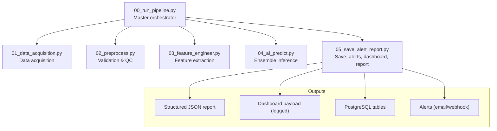
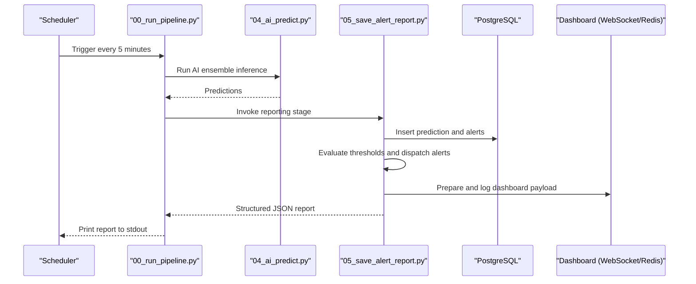
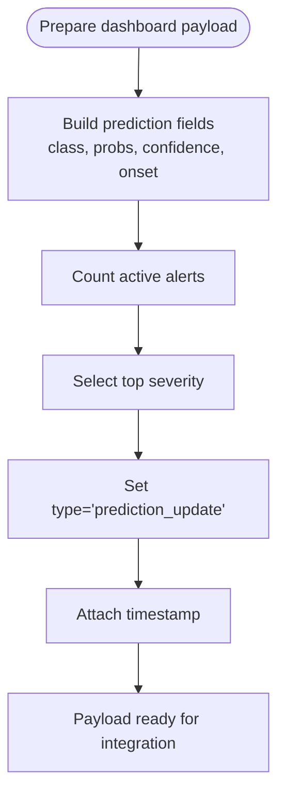
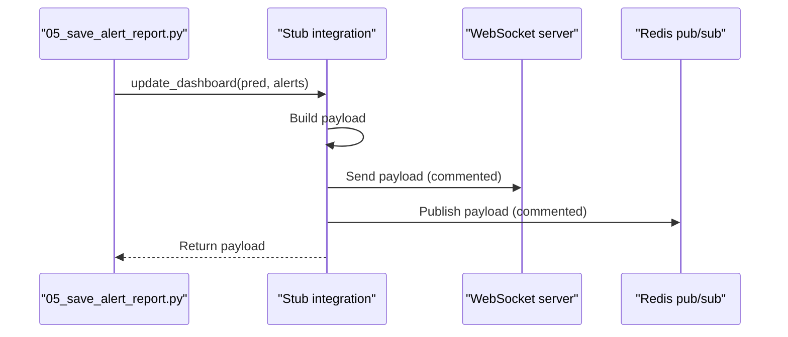
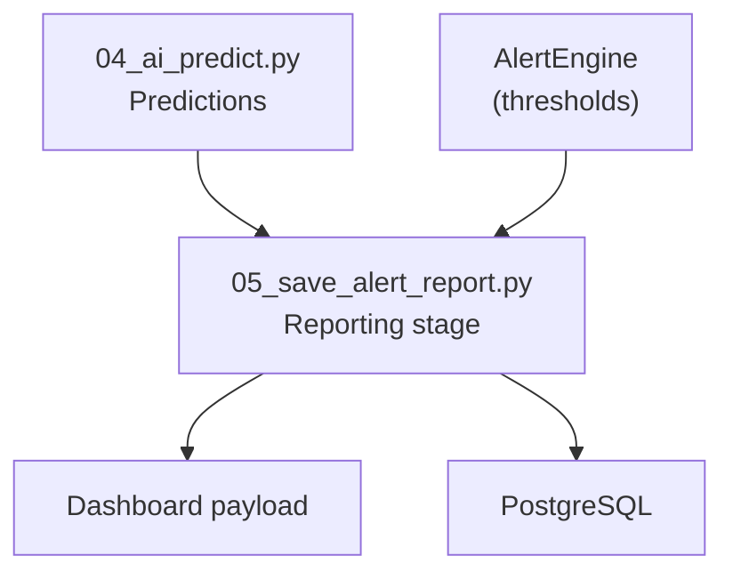

# Dashboard Integration and Payload

<cite>
**Referenced Files in This Document**
- [README.md](file://README.md)
- [config.yaml](file://config.yaml)
- [00_run_pipeline.py](file://00_run_pipeline.py)
- [05_save_alert_report.py](file://05_save_alert_report.py)
- [pipeline_utils.py](file://pipeline_utils.py)
- [01_data_acquisition.py](file://01_data_acquisition.py)
- [02_preprocess.py](file://02_preprocess.py)
- [03_feature_engineer.py](file://03_feature_engineer.py)
- [04_ai_predict.py](file://04_ai_predict.py)
</cite>

## Table of Contents
1. [Introduction](#introduction)
2. [Project Structure](#project-structure)
3. [Core Components](#core-components)
4. [Architecture Overview](#architecture-overview)
5. [Detailed Component Analysis](#detailed-component-analysis)
6. [Dependency Analysis](#dependency-analysis)
7. [Performance Considerations](#performance-considerations)
8. [Troubleshooting Guide](#troubleshooting-guide)
9. [Conclusion](#conclusion)
10. [Appendices](#appendices)

## Introduction
This document explains the dashboard integration system for real-time monitoring and visualization of solar flare forecasting outputs. It documents the dashboard payload structure, including prediction updates, alert counts, and severity indicators. It also describes the stub implementation for pushing live updates to WebSocket servers or Redis pub/sub systems, and provides guidance for integrating with monitoring dashboards, alert displays, and operational consoles. The document covers payload fields such as flare class predictions, probability percentages, confidence scores, and onset time estimates, and includes integration patterns for custom dashboard implementations.

## Project Structure
The pipeline is orchestrated by a master entry point that coordinates data acquisition, preprocessing, feature engineering, AI inference, and reporting. The dashboard update occurs as part of the reporting stage, where a structured payload is prepared and logged for downstream consumption.



**Diagram sources**
- [00_run_pipeline.py:63-121](file://00_run_pipeline.py#L63-L121)
- [05_save_alert_report.py:452-502](file://05_save_alert_report.py#L452-L502)

**Section sources**
- [00_run_pipeline.py:63-121](file://00_run_pipeline.py#L63-L121)
- [05_save_alert_report.py:452-502](file://05_save_alert_report.py#L452-L502)

## Core Components
- Dashboard payload preparation: The reporting stage constructs a compact payload containing the latest prediction and alert summary for real-time dashboards.
- Stub integration: The payload is prepared and logged; the stub shows how to integrate with WebSocket servers or Redis pub/sub systems.
- Structured JSON report: A canonical JSON report is generated for automated processing and archival.

Key payload fields include:
- Prediction: predicted flare class, probabilities for C, M, and X classes, confidence score, and estimated onset time.
- Alert summary: alert count and top severity indicator.
- Metadata: timestamp and pipeline status.

**Section sources**
- [05_save_alert_report.py:304-333](file://05_save_alert_report.py#L304-L333)
- [README.md:206-227](file://README.md#L206-L227)

## Architecture Overview
The dashboard integration is part of the reporting stage. After predictions are computed, the system evaluates thresholds, persists data to PostgreSQL, dispatches alerts, prepares a dashboard payload, and generates a structured JSON report.



**Diagram sources**
- [00_run_pipeline.py:108-116](file://00_run_pipeline.py#L108-L116)
- [05_save_alert_report.py:452-502](file://05_save_alert_report.py#L452-L502)

## Detailed Component Analysis

### Dashboard Payload Structure
The dashboard payload is constructed to summarize the latest prediction and alert state for real-time visualization.

Fields:
- type: "prediction_update"
- timestamp: UTC timestamp of the payload
- prediction:
  - flare_class: Predicted class (e.g., A, B, C, M, X)
  - flare_prob_pct: Combined probability of C-class or above
  - x_prob_pct: X-class probability
  - m_prob_pct: M-class probability
  - cme_prob_pct: Coronal Mass Ejection probability
  - geo_risk: Geomagnetic storm label
  - confidence_pct: Confidence score percentage
  - onset_utc: Estimated onset time in UTC
- alert_count: Number of active alerts
- top_severity: Highest severity among active alerts, or "NOMINAL"

Integration stub:
- The payload is prepared and logged; the stub includes commented code showing how to publish to Redis or send via WebSocket.



**Diagram sources**
- [05_save_alert_report.py:304-333](file://05_save_alert_report.py#L304-L333)

**Section sources**
- [05_save_alert_report.py:304-333](file://05_save_alert_report.py#L304-L333)

### Stub Implementation for WebSocket and Redis
The reporting stage includes a stub for pushing the dashboard payload to external systems. The stub logs the payload and shows commented examples for:
- Redis pub/sub: publish to a channel suitable for dashboard clients
- WebSocket: send the payload to connected clients

Integration points:
- Replace the logging line with actual WebSocket send or Redis publish calls.
- Ensure the payload conforms to the documented structure.



**Diagram sources**
- [05_save_alert_report.py:304-333](file://05_save_alert_report.py#L304-L333)

**Section sources**
- [05_save_alert_report.py:304-333](file://05_save_alert_report.py#L304-L333)

### Payload Fields and Semantics
- Flare class prediction: predicted_flare_class
- Probabilities:
  - flare_probability (combined C-class or above)
  - m_class_probability
  - x_class_probability
- Confidence score: confidence_score (percentage)
- Estimated onset: estimated_onset_utc (UTC)
- Geomagnetic risk: geomagnetic_storm_label
- Alert summary: alert_count and top_severity

These fields align with the canonical JSON report schema and are designed for straightforward visualization and alerting.

**Section sources**
- [README.md:206-227](file://README.md#L206-L227)
- [05_save_alert_report.py:340-425](file://05_save_alert_report.py#L340-L425)

### Integration Patterns for Dashboards and Operational Consoles
- WebSocket server: Connect a WebSocket endpoint to receive the payload and broadcast to subscribed clients.
- Redis pub/sub: Publish the payload to a channel; dashboard clients subscribe and render updates.
- HTTP polling: Expose an endpoint serving the latest payload; clients poll periodically.
- Email/webhook: Use existing alert channels to notify operators; extend to include dashboard payload if desired.

Operational console integration:
- Use the alert_count and top_severity to drive status indicators and color-coded displays.
- Render probability bars and confidence metrics for quick situational awareness.

**Section sources**
- [05_save_alert_report.py:267-298](file://05_save_alert_report.py#L267-L298)
- [05_save_alert_report.py:304-333](file://05_save_alert_report.py#L304-L333)

### Example Payload Consumption by Dashboard Technologies
- React/Vue/Angular dashboards: Subscribe to WebSocket or poll HTTP endpoint; update charts and status cards.
- Grafana: Use a WebSocket or HTTP data source plugin to ingest the payload and build panels.
- Real-time alert boards: Display top_severity and alert_count prominently; show probability trends over time.

[No sources needed since this section provides general guidance]

## Dependency Analysis
The dashboard payload depends on the AI prediction outputs and alert evaluation results. The reporting stage aggregates these into a compact payload and persists predictions and alerts to PostgreSQL.



**Diagram sources**
- [04_ai_predict.py:402-448](file://04_ai_predict.py#L402-L448)
- [05_save_alert_report.py:222-265](file://05_save_alert_report.py#L222-L265)
- [05_save_alert_report.py:452-502](file://05_save_alert_report.py#L452-L502)

**Section sources**
- [04_ai_predict.py:402-448](file://04_ai_predict.py#L402-L448)
- [05_save_alert_report.py:222-265](file://05_save_alert_report.py#L222-L265)
- [05_save_alert_report.py:452-502](file://05_save_alert_report.py#L452-L502)

## Performance Considerations
- Frequency: The pipeline runs every 5 minutes; dashboard updates should align with this cadence to avoid unnecessary churn.
- Payload size: Keep the dashboard payload minimal; include only essential fields for real-time rendering.
- Scaling:
  - WebSocket: Use horizontal scaling with load balancers and sticky sessions if needed.
  - Redis: Use a dedicated Redis instance or cluster; monitor memory usage and publish rates.
  - HTTP polling: Implement efficient caching and conditional GETs to reduce bandwidth.
- Backpressure: If traffic spikes occur, consider batching updates or throttling to maintain responsiveness.
- Persistence: PostgreSQL writes are optional; simulation mode avoids DB overhead when not available.

[No sources needed since this section provides general guidance]

## Troubleshooting Guide
Common issues and resolutions:
- No new data: The acquisition step may detect no new records; the pipeline exits early. Check data sources and network connectivity.
- PostgreSQL unavailable: If psycopg2 is not installed, writes are simulated; ensure dependencies are installed for production.
- Alert dispatch failures: Email or webhook dispatch errors are logged; verify SMTP or webhook endpoint configurations.
- Dashboard payload not received: Confirm the stub integration is enabled and the WebSocket/Redis endpoints are reachable.

**Section sources**
- [01_data_acquisition.py:392-424](file://01_data_acquisition.py#L392-L424)
- [05_save_alert_report.py:118-141](file://05_save_alert_report.py#L118-L141)
- [05_save_alert_report.py:267-298](file://05_save_alert_report.py#L267-L298)

## Conclusion
The dashboard integration system provides a lightweight, extensible mechanism for real-time monitoring and visualization. The structured dashboard payload encapsulates the latest prediction and alert state, while the stub implementation demonstrates how to connect to WebSocket servers or Redis pub/sub systems. By aligning dashboard updates with the pipeline cadence and following the integration patterns described, operators can maintain situational awareness and respond promptly to evolving space weather conditions.

[No sources needed since this section summarizes without analyzing specific files]

## Appendices

### Canonical JSON Report Schema (for reference)
The canonical JSON report includes comprehensive fields for automated processing and archival. While the dashboard payload focuses on real-time updates, the report schema provides a complete audit trail.

```mermaid
erDiagram
RUNS {
text run_id PK
timestamptz run_time
text source_used
integer records_fetched
text pipeline_status
real elapsed_s
}
RAW {
text obs_id PK
timestamptz obs_time
text source
double precision solexs_1_8A_Wm2
double precision hel1os_20_60_cts
double precision spectral_gamma
real kp_index
real solar_wind_speed
real imf_bz
}
PREDICTIONS {
text pred_id PK
timestamptz obs_time
timestamptz prediction_time
text source
text predicted_class
text predicted_flux_class
real flare_probability
real m_class_probability
real x_class_probability
real cme_probability
real geomagnetic_risk
text geomagnetic_label
real confidence_score
timestamptz estimated_onset_utc
}
ALERTS {
text alert_id PK
text pred_id FK
timestamptz alert_time
text severity
text threshold_name
real threshold_value
real actual_value
text message
}
RUNS ||--o{ RAW : "produces"
RAW ||--o{ PREDICTIONS : "predicts"
PREDICTIONS ||--o{ ALERTS : "generates"
```

**Diagram sources**
- [05_save_alert_report.py:47-116](file://05_save_alert_report.py#L47-L116)

**Section sources**
- [README.md:206-227](file://README.md#L206-L227)
- [05_save_alert_report.py:47-116](file://05_save_alert_report.py#L47-L116)