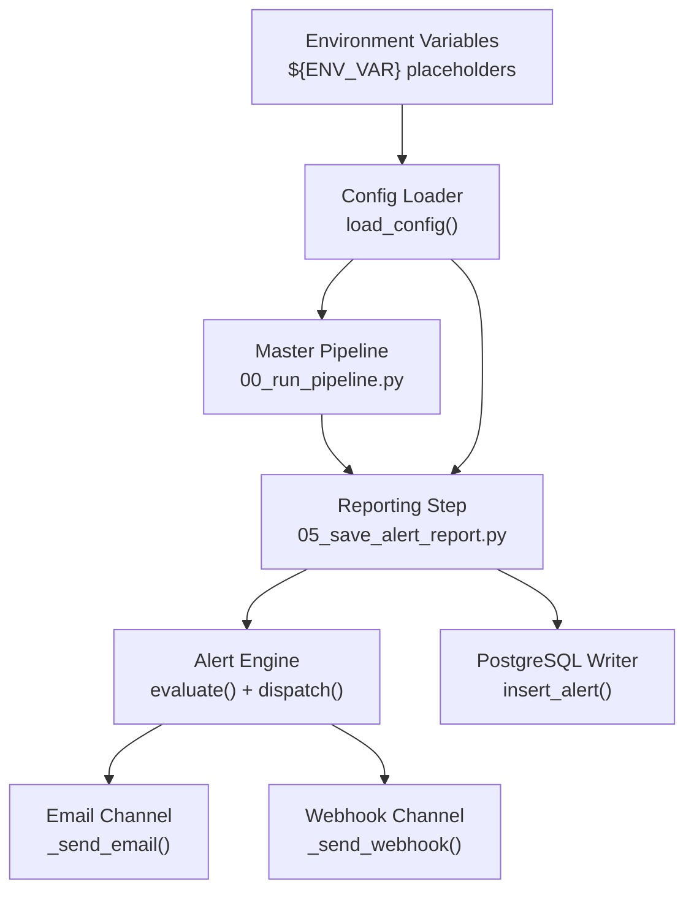
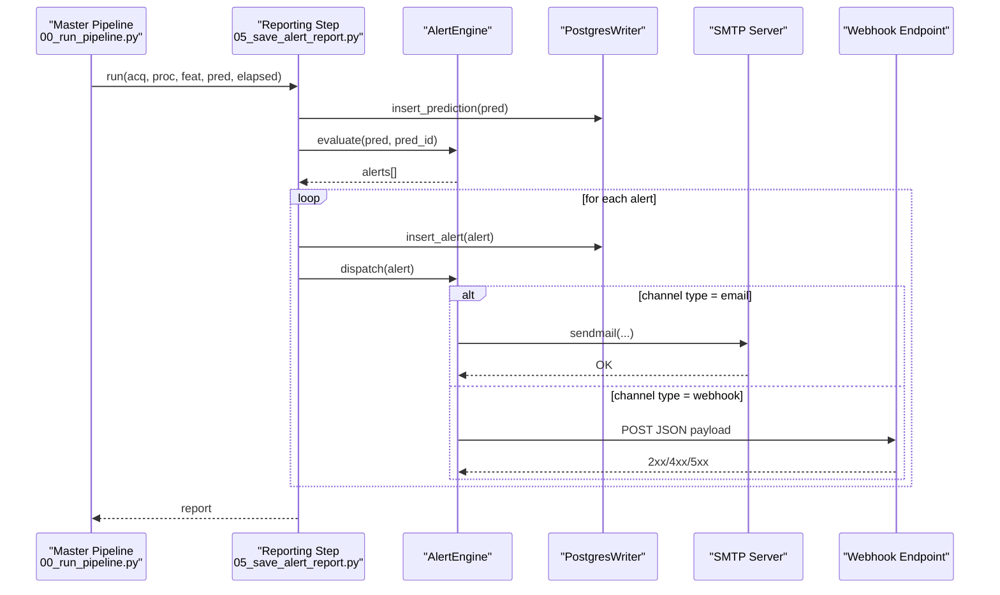
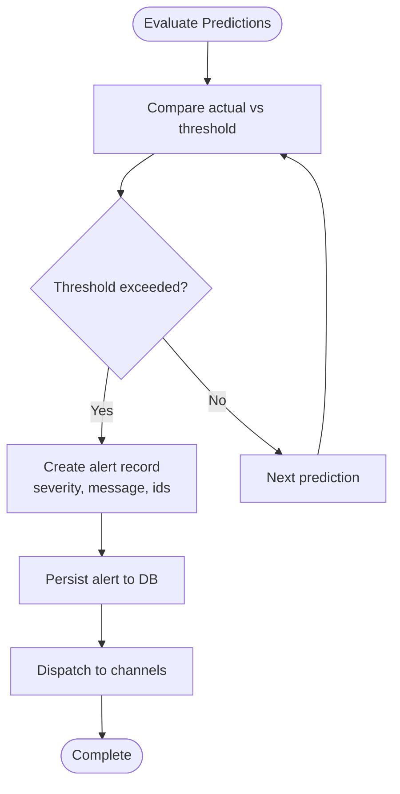
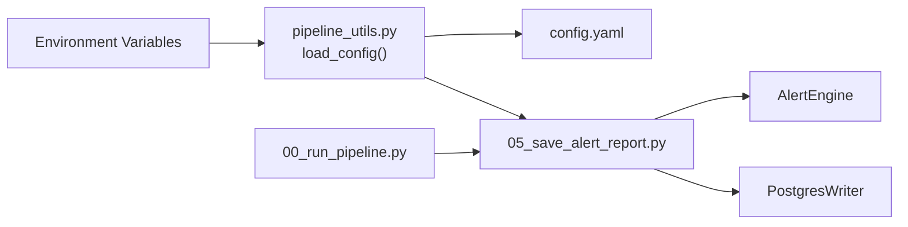

# Notification Channels and Delivery

<cite>
**Referenced Files in This Document**
- [config.yaml](file://config.yaml)
- [README.md](file://README.md)
- [05_save_alert_report.py](file://05_save_alert_report.py)
- [pipeline_utils.py](file://pipeline_utils.py)
- [00_run_pipeline.py](file://00_run_pipeline.py)
</cite>

## Table of Contents
1. [Introduction](#introduction)
2. [Project Structure](#project-structure)
3. [Core Components](#core-components)
4. [Architecture Overview](#architecture-overview)
5. [Detailed Component Analysis](#detailed-component-analysis)
6. [Dependency Analysis](#dependency-analysis)
7. [Performance Considerations](#performance-considerations)
8. [Troubleshooting Guide](#troubleshooting-guide)
9. [Conclusion](#conclusion)
10. [Appendices](#appendices)

## Introduction
This document describes the multi-channel alert notification system used by the Aditya-L1 Solar Flare Forecasting Pipeline. It focuses on how alerts are evaluated, persisted, and delivered via email and webhook channels. It covers configuration, delivery mechanics, error handling, and operational guidance for reliable alerting in space weather monitoring.

## Project Structure
The alert system spans a small set of focused modules:
- Configuration defines alert channels and thresholds.
- The alert evaluation and dispatch logic resides in the reporting step.
- Utilities provide configuration loading and logging.
- The master pipeline orchestrates steps and invokes the reporting step.

**Diagram sources**
- [00_run_pipeline.py:108-112](file://00_run_pipeline.py#L108-L112)
- [05_save_alert_report.py:267-297](file://05_save_alert_report.py#L267-L297)
- [pipeline_utils.py:25-40](file://pipeline_utils.py#L25-L40)

**Section sources**
- [00_run_pipeline.py:108-112](file://00_run_pipeline.py#L108-L112)
- [05_save_alert_report.py:267-297](file://05_save_alert_report.py#L267-L297)
- [pipeline_utils.py:25-40](file://pipeline_utils.py#L25-L40)

## Core Components
- Alert thresholds and channel configuration are defined under the alerts section in the configuration.
- The AlertEngine evaluates predictions against thresholds and dispatches alerts to configured channels.
- Email delivery uses SMTP with a fixed sender address and dynamic recipients list.
- Webhook delivery posts JSON payloads to a configurable URL.
- Alerts are persisted to PostgreSQL when available; otherwise, operations are logged in simulation mode.

Key configuration locations:
- Alerts thresholds and channels: [config.yaml:79-89](file://config.yaml#L79-L89)
- Environment variable expansion in configuration: [pipeline_utils.py:25-40](file://pipeline_utils.py#L25-L40)

Delivery logic:
- Email dispatch: [05_save_alert_report.py:280-293](file://05_save_alert_report.py#L280-L293)
- Webhook dispatch: [05_save_alert_report.py:295-297](file://05_save_alert_report.py#L295-L297)
- Alert persistence: [05_save_alert_report.py:190-211](file://05_save_alert_report.py#L190-L211)

**Section sources**
- [config.yaml:79-89](file://config.yaml#L79-L89)
- [pipeline_utils.py:25-40](file://pipeline_utils.py#L25-L40)
- [05_save_alert_report.py:190-211](file://05_save_alert_report.py#L190-L211)
- [05_save_alert_report.py:280-297](file://05_save_alert_report.py#L280-L297)

## Architecture Overview
The alert lifecycle:
1. Predictions are generated and stored.
2. The AlertEngine evaluates each prediction against thresholds.
3. Breached thresholds produce alert records.
4. Alerts are persisted to the database and dispatched to configured channels.
5. A structured JSON report is generated and saved.

**Diagram sources**
- [00_run_pipeline.py:108-112](file://00_run_pipeline.py#L108-L112)
- [05_save_alert_report.py:452-502](file://05_save_alert_report.py#L452-L502)
- [05_save_alert_report.py:222-266](file://05_save_alert_report.py#L222-L266)
- [05_save_alert_report.py:280-297](file://05_save_alert_report.py#L280-L297)

## Detailed Component Analysis

### Alert Thresholds and Channels
- Thresholds define severity boundaries for flare probability, M-class probability, CME probability, geomagnetic storm risk, and general flare watch.
- Channels include:
  - log: internal logging
  - email: SMTP-based delivery with recipients and SMTP host
  - webhook: HTTP POST to a URL with JSON payload

Configuration references:
- Thresholds: [config.yaml:80-85](file://config.yaml#L80-L85)
- Channels: [config.yaml:86-89](file://config.yaml#L86-L89)

Operational notes:
- Channels are evaluated in order; disabled channels are skipped.
- Recipients and SMTP host are taken from the channel configuration.
- Webhook URL is taken from the channel configuration.

**Section sources**
- [config.yaml:80-89](file://config.yaml#L80-L89)

### Alert Evaluation and Dispatch
- The AlertEngine computes breaches for each prediction and emits alert records with severity and messages.
- Dispatch iterates through enabled channels and calls the appropriate handler for each channel type.

Key implementation references:
- Evaluation: [05_save_alert_report.py:222-266](file://05_save_alert_report.py#L222-L266)
- Dispatch loop: [05_save_alert_report.py:267-279](file://05_save_alert_report.py#L267-L279)

**Diagram sources**
- [05_save_alert_report.py:222-266](file://05_save_alert_report.py#L222-L266)
- [05_save_alert_report.py:190-211](file://05_save_alert_report.py#L190-L211)
- [05_save_alert_report.py:267-279](file://05_save_alert_report.py#L267-L279)

**Section sources**
- [05_save_alert_report.py:222-266](file://05_save_alert_report.py#L222-L266)
- [05_save_alert_report.py:267-279](file://05_save_alert_report.py#L267-L279)

### Email Notification Implementation
- SMTP configuration:
  - Host is taken from the channel configuration (smtp_host).
  - Port is fixed to 587.
  - Sender address is fixed.
  - Recipients are taken from the channel configuration (recipients).
- Message composition:
  - Subject line includes severity.
  - Body includes severity, timestamp, message, and alert ID.
- Delivery:
  - Uses SMTP sendmail with a context-managed connection.
  - Logs success upon completion.

References:
- Email handler: [05_save_alert_report.py:280-293](file://05_save_alert_report.py#L280-L293)
- Configuration keys: [config.yaml:86-89](file://config.yaml#L86-L89)

Security considerations:
- SMTP host is sourced from environment variables via configuration expansion.
- Credentials are not embedded in code; they are expected to be configured at the SMTP server level or via environment variables.

Template structure:
- Subject: "[Aditya-L1 SFF] {severity} — Solar Flare Alert"
- Body: severity, timestamp, message, alert ID

**Section sources**
- [05_save_alert_report.py:280-293](file://05_save_alert_report.py#L280-L293)
- [config.yaml:86-89](file://config.yaml#L86-L89)
- [pipeline_utils.py:25-40](file://pipeline_utils.py#L25-L40)

### Webhook Integration
- URL configuration:
  - Channel URL is taken from the channel configuration (url).
- Payload:
  - JSON body is the alert record itself.
- HTTP handling:
  - Uses an HTTP client with a short timeout.
  - Logs success upon completion.

References:
- Webhook handler: [05_save_alert_report.py:295-297](file://05_save_alert_report.py#L295-L297)
- Configuration keys: [config.yaml:86-89](file://config.yaml#L86-L89)

Endpoint requirements:
- Accepts HTTP POST requests.
- Expects JSON payload matching the alert record structure.
- Should respond with a successful HTTP status code to indicate receipt.

**Section sources**
- [05_save_alert_report.py:295-297](file://05_save_alert_report.py#L295-L297)
- [config.yaml:86-89](file://config.yaml#L86-L89)

### Alert Persistence and Reliability
- When PostgreSQL is available, alerts are inserted into a dedicated table.
- When unavailable, operations are logged in simulation mode.
- Persistence occurs before dispatch to ensure delivery attempts are made even if subsequent steps fail.

References:
- Insert alert: [05_save_alert_report.py:190-211](file://05_save_alert_report.py#L190-L211)
- PostgreSQL availability detection: [05_save_alert_report.py:24-31](file://05_save_alert_report.py#L24-L31)

**Section sources**
- [05_save_alert_report.py:190-211](file://05_save_alert_report.py#L190-L211)
- [05_save_alert_report.py:24-31](file://05_save_alert_report.py#L24-L31)

## Dependency Analysis
- The reporting step depends on:
  - Configuration loader for alerts and database settings.
  - AlertEngine for evaluation and dispatch.
  - PostgresWriter for persistence.
- The master pipeline orchestrates the reporting step and passes results forward.
- Environment variables are expanded during configuration loading.

**Diagram sources**
- [pipeline_utils.py:25-40](file://pipeline_utils.py#L25-L40)
- [05_save_alert_report.py:37-40](file://05_save_alert_report.py#L37-L40)
- [00_run_pipeline.py:108-112](file://00_run_pipeline.py#L108-L112)

**Section sources**
- [pipeline_utils.py:25-40](file://pipeline_utils.py#L25-L40)
- [05_save_alert_report.py:37-40](file://05_save_alert_report.py#L37-L40)
- [00_run_pipeline.py:108-112](file://00_run_pipeline.py#L108-L112)

## Performance Considerations
- Email and webhook calls are synchronous within the reporting step. For high-frequency runs, consider batching or asynchronous delivery to avoid blocking the pipeline.
- Network timeouts are short for webhook calls; adjust if endpoints are slow.
- Database writes occur before dispatch to minimize risk of losing alerts if later steps fail.

[No sources needed since this section provides general guidance]

## Troubleshooting Guide
Common issues and remedies:
- Email delivery fails
  - Verify SMTP host configuration and network access.
  - Confirm recipients list is populated.
  - Check SMTP server logs for rejection reasons.
  - References: [05_save_alert_report.py:280-293](file://05_save_alert_report.py#L280-L293), [config.yaml:86-89](file://config.yaml#L86-L89)
- Webhook delivery fails
  - Confirm endpoint URL is reachable and accepts POST requests.
  - Validate endpoint responds with a successful HTTP status.
  - References: [05_save_alert_report.py:295-297](file://05_save_alert_report.py#L295-L297), [config.yaml:86-89](file://config.yaml#L86-L89)
- Alerts not persisted
  - Ensure PostgreSQL is available and credentials are correct.
  - Check logs for connection or insertion errors.
  - References: [05_save_alert_report.py:24-31](file://05_save_alert_report.py#L24-L31), [05_save_alert_report.py:190-211](file://05_save_alert_report.py#L190-L211)
- Misconfigured thresholds
  - Adjust thresholds in configuration to match operational requirements.
  - References: [config.yaml:80-85](file://config.yaml#L80-L85)
- Environment variables not loaded
  - Ensure environment variables are exported before running the pipeline.
  - References: [pipeline_utils.py:25-40](file://pipeline_utils.py#L25-L40), [README.md:62-84](file://README.md#L62-L84)

**Section sources**
- [05_save_alert_report.py:280-297](file://05_save_alert_report.py#L280-L297)
- [05_save_alert_report.py:190-211](file://05_save_alert_report.py#L190-L211)
- [config.yaml:80-89](file://config.yaml#L80-L89)
- [pipeline_utils.py:25-40](file://pipeline_utils.py#L25-L40)
- [README.md:62-84](file://README.md#L62-L84)

## Conclusion
The alert notification system provides a straightforward, extensible foundation for delivering space weather alerts via email and webhook channels. Configuration-driven channels enable flexible deployments, while environment variable expansion secures sensitive settings. The reporting step persists alerts to a database when available and dispatches them immediately, ensuring reliable alerting across cron-triggered runs.

[No sources needed since this section summarizes without analyzing specific files]

## Appendices

### Configuration Examples
- Enable email channel:
  - Set channel type to email and provide recipients and SMTP host.
  - Reference: [config.yaml:86-89](file://config.yaml#L86-L89)
- Enable webhook channel:
  - Set channel type to webhook and provide URL.
  - Reference: [config.yaml:86-89](file://config.yaml#L86-L89)
- Environment variables:
  - Export SMTP host and webhook URL prior to running the pipeline.
  - Reference: [README.md:62-84](file://README.md#L62-L84)

**Section sources**
- [config.yaml:86-89](file://config.yaml#L86-L89)
- [README.md:62-84](file://README.md#L62-L84)

### Security Considerations
- SMTP credentials are not embedded in code; rely on server-side configuration or environment variables.
- Store secrets in environment variables and avoid committing them to source control.
- Reference: [pipeline_utils.py:25-40](file://pipeline_utils.py#L25-L40)

**Section sources**
- [pipeline_utils.py:25-40](file://pipeline_utils.py#L25-L40)

### Monitoring Techniques
- Inspect logs for alert dispatch outcomes and errors.
- Track database inserts for alert persistence.
- Validate webhook endpoint response codes and latency.
- References:
  - Logging setup: [pipeline_utils.py:43-64](file://pipeline_utils.py#L43-L64)
  - Alert persistence: [05_save_alert_report.py:190-211](file://05_save_alert_report.py#L190-L211)
  - Webhook dispatch: [05_save_alert_report.py:295-297](file://05_save_alert_report.py#L295-L297)

**Section sources**
- [pipeline_utils.py:43-64](file://pipeline_utils.py#L43-L64)
- [05_save_alert_report.py:190-211](file://05_save_alert_report.py#L190-L211)
- [05_save_alert_report.py:295-297](file://05_save_alert_report.py#L295-L297)