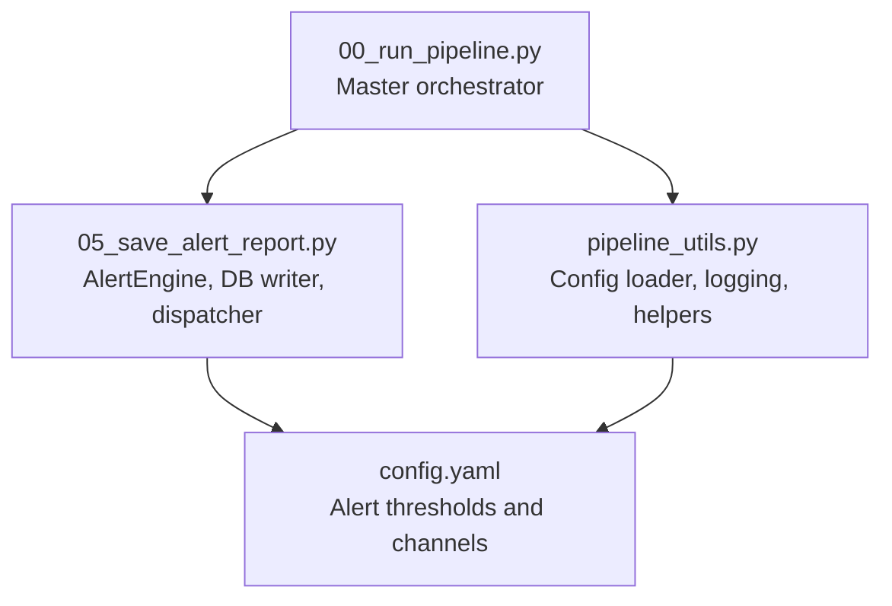
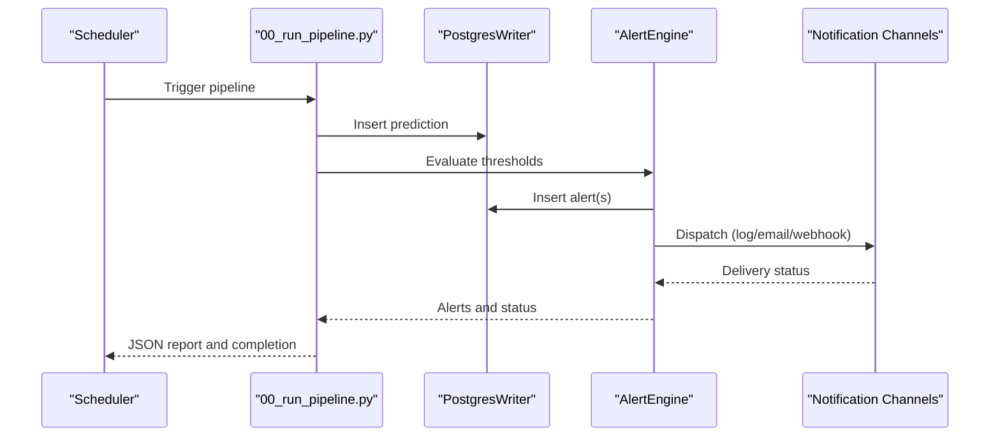
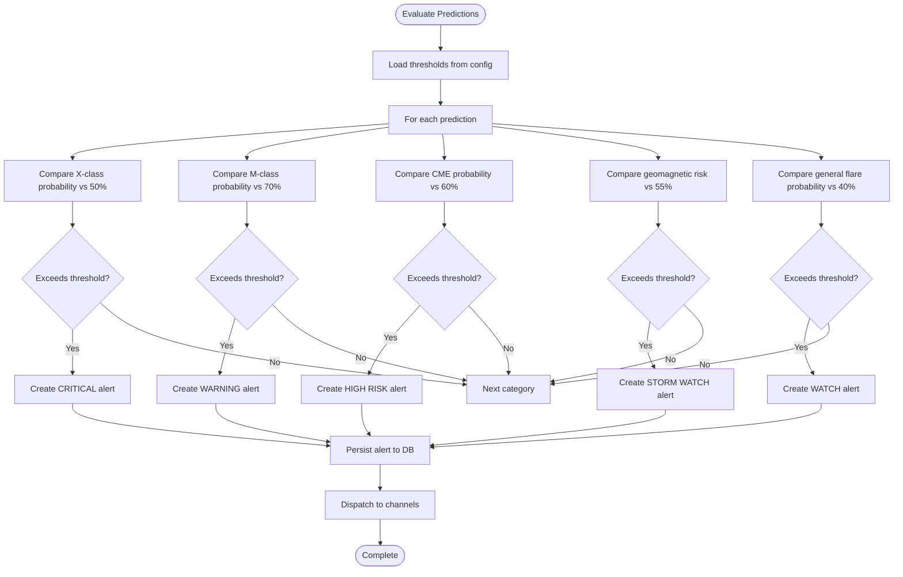
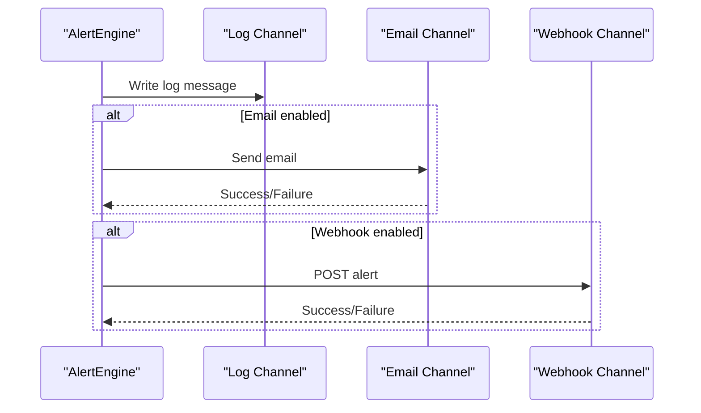
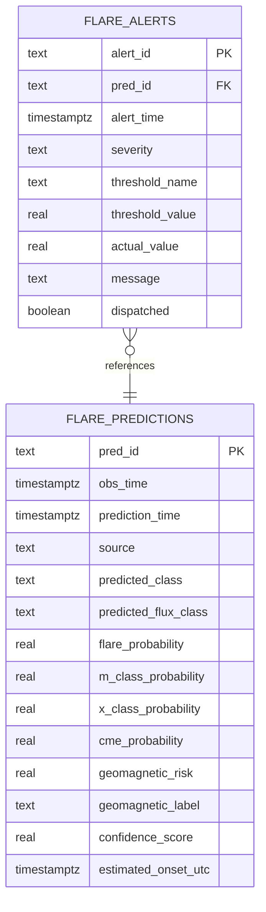
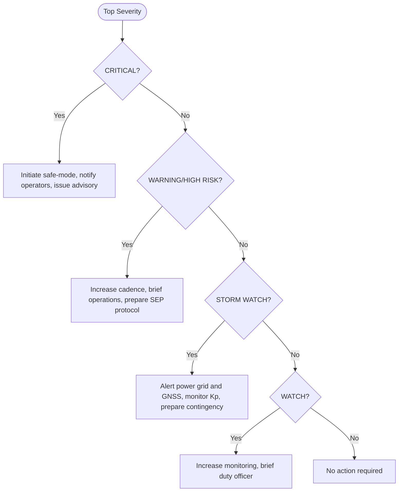
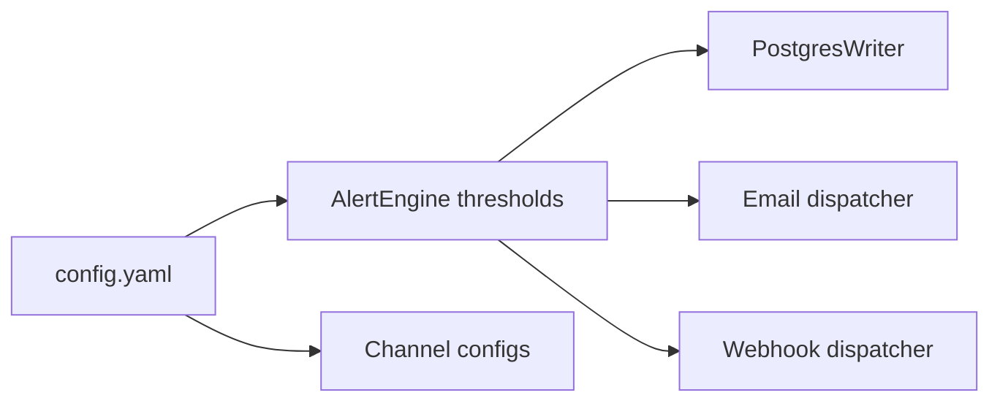

# Alert Configurations

<cite>
**Referenced Files in This Document**
- [config.yaml](file://config.yaml)
- [README.md](file://README.md)
- [05_save_alert_report.py](file://05_save_alert_report.py)
- [pipeline_utils.py](file://pipeline_utils.py)
- [00_run_pipeline.py](file://00_run_pipeline.py)
</cite>

## Table of Contents
1. [Introduction](#introduction)
2. [Project Structure](#project-structure)
3. [Core Components](#core-components)
4. [Architecture Overview](#architecture-overview)
5. [Detailed Component Analysis](#detailed-component-analysis)
6. [Dependency Analysis](#dependency-analysis)
7. [Performance Considerations](#performance-considerations)
8. [Troubleshooting Guide](#troubleshooting-guide)
9. [Conclusion](#conclusion)
10. [Appendices](#appendices)

## Introduction
This document provides comprehensive guidance for configuring and operating the alert system within the Aditya-L1 Solar Flare Forecasting Pipeline. It focuses on:
- Probability thresholds for alert categories
- Alert classification hierarchy and severity levels
- Notification channels: log output, email, and webhook integrations
- Practical examples for customizing thresholds across operational contexts
- Managing alert suppression rules and tracking alert history
- Delivery status and channel-specific error handling

## Project Structure
The alert system spans configuration, evaluation, persistence, and notification dispatch. The primary configuration resides in a central YAML file, while the alert evaluation and dispatch logic live in a dedicated module. The master pipeline orchestrator coordinates the end-to-end flow.

**Diagram sources**
- [config.yaml:79-89](file://config.yaml#L79-L89)
- [pipeline_utils.py:25-41](file://pipeline_utils.py#L25-L41)
- [00_run_pipeline.py:35-38](file://00_run_pipeline.py#L35-L38)
- [05_save_alert_report.py:37-40](file://05_save_alert_report.py#L37-L40)

**Section sources**
- [config.yaml:79-89](file://config.yaml#L79-L89)
- [pipeline_utils.py:25-41](file://pipeline_utils.py#L25-L41)
- [00_run_pipeline.py:35-38](file://00_run_pipeline.py#L35-L38)
- [05_save_alert_report.py:37-40](file://05_save_alert_report.py#L37-L40)

## Core Components
- Alert thresholds: Defined under the alerts section in the configuration file. These are percentage-based thresholds for five categories:
  - m_class_warning_pct: 70%
  - x_class_critical_pct: 50%
  - cme_high_risk_pct: 60%
  - geomag_storm_pct: 55%
  - flare_watch_pct: 40%

- Notification channels: Three channels are supported:
  - Log output: Enabled by default
  - Email: Disabled by default; requires SMTP host and recipient list
  - Webhook: Disabled by default; requires a URL endpoint

- Classification hierarchy and severity:
  - CRITICAL: X-class probability threshold
  - WARNING: M-class probability threshold
  - HIGH RISK: CME probability threshold
  - STORM WATCH: Geomagnetic storm risk threshold
  - WATCH: General flare probability threshold

- Escalation procedures:
  - The system evaluates thresholds and dispatches alerts to enabled channels.
  - Recommended actions vary by severity and are derived from the alert evaluation logic.

**Section sources**
- [config.yaml:79-89](file://config.yaml#L79-L89)
- [README.md:175-185](file://README.md#L175-L185)
- [05_save_alert_report.py:226-265](file://05_save_alert_report.py#L226-L265)
- [05_save_alert_report.py:428-445](file://05_save_alert_report.py#L428-L445)

## Architecture Overview
The alert lifecycle integrates configuration loading, prediction ingestion, threshold evaluation, database persistence, and notification dispatch.

**Diagram sources**
- [00_run_pipeline.py:108-113](file://00_run_pipeline.py#L108-L113)
- [05_save_alert_report.py:464-479](file://05_save_alert_report.py#L464-L479)
- [05_save_alert_report.py:267-297](file://05_save_alert_report.py#L267-L297)

## Detailed Component Analysis

### Alert Thresholds and Classification
- Thresholds are loaded from the configuration and evaluated against prediction outputs.
- The evaluation compares each category’s probability against its configured percentage threshold and emits alerts accordingly.
- Severity levels are mapped to categories as follows:
  - CRITICAL: X-class probability
  - WARNING: M-class probability
  - HIGH RISK: CME probability
  - STORM WATCH: Geomagnetic storm risk
  - WATCH: General flare probability

**Diagram sources**
- [config.yaml:80-85](file://config.yaml#L80-L85)
- [05_save_alert_report.py:226-265](file://05_save_alert_report.py#L226-L265)

**Section sources**
- [config.yaml:80-85](file://config.yaml#L80-L85)
- [05_save_alert_report.py:226-265](file://05_save_alert_report.py#L226-L265)

### Notification Channels
- Log output: Enabled by default; messages are logged at warning/info levels depending on outcome.
- Email: Disabled by default; requires SMTP host and recipient list. On successful send, a confirmation is logged.
- Webhook: Disabled by default; requires a URL endpoint. On successful post, a confirmation is logged.

Delivery failures are caught and logged per channel.

**Diagram sources**
- [config.yaml:86-89](file://config.yaml#L86-L89)
- [05_save_alert_report.py:267-297](file://05_save_alert_report.py#L267-L297)

**Section sources**
- [config.yaml:86-89](file://config.yaml#L86-L89)
- [05_save_alert_report.py:267-297](file://05_save_alert_report.py#L267-L297)

### Alert History Tracking and Persistence
- Alerts are persisted to a dedicated table with fields for severity, threshold name/value, actual value, and message.
- A convenience index on severity supports efficient querying by severity level.
- The persistence layer simulates writes when the database driver is unavailable.

**Diagram sources**
- [05_save_alert_report.py:49-116](file://05_save_alert_report.py#L49-L116)
- [05_save_alert_report.py:190-212](file://05_save_alert_report.py#L190-L212)

**Section sources**
- [05_save_alert_report.py:49-116](file://05_save_alert_report.py#L49-L116)
- [05_save_alert_report.py:190-212](file://05_save_alert_report.py#L190-L212)

### Escalation Procedures and Recommendations
- The system computes a recommended action based on the highest severity alert:
  - CRITICAL: Immediate action for satellites and public advisories
  - WARNING/HIGH RISK: Elevated watch with increased monitoring cadence
  - STORM WATCH: Alert power grid operators and GNSS providers
  - WATCH: Increased monitoring without immediate satellite action

**Diagram sources**
- [05_save_alert_report.py:428-445](file://05_save_alert_report.py#L428-L445)

**Section sources**
- [05_save_alert_report.py:428-445](file://05_save_alert_report.py#L428-L445)

## Dependency Analysis
- Configuration dependency: The alert system depends on the centralized configuration for thresholds and channel settings.
- Runtime dependency: The alert evaluation relies on prediction outputs and the database writer for persistence.
- External dependency: Email dispatch depends on SMTP availability; webhook dispatch depends on network reachability.

**Diagram sources**
- [config.yaml:79-89](file://config.yaml#L79-L89)
- [05_save_alert_report.py:224-225](file://05_save_alert_report.py#L224-L225)
- [05_save_alert_report.py:267-297](file://05_save_alert_report.py#L267-L297)

**Section sources**
- [config.yaml:79-89](file://config.yaml#L79-L89)
- [05_save_alert_report.py:224-225](file://05_save_alert_report.py#L224-L225)
- [05_save_alert_report.py:267-297](file://05_save_alert_report.py#L267-L297)

## Performance Considerations
- Threshold evaluation is O(n) per prediction, where n is the number of categories.
- Email and webhook dispatch are synchronous per alert; consider asynchronous queuing for high-volume scenarios.
- Logging overhead is minimal compared to I/O operations; ensure log rotation is configured appropriately.

## Troubleshooting Guide
- Email delivery failures:
  - Verify SMTP host and credentials are set via environment variables.
  - Confirm recipient list is populated and reachable.
  - Review logs for error messages during dispatch.

- Webhook delivery failures:
  - Ensure the URL is reachable and accepts POST requests.
  - Check network connectivity and firewall rules.
  - Inspect logs for exceptions raised during dispatch.

- Database write failures:
  - Confirm PostgreSQL driver installation and credentials.
  - Validate connection parameters and permissions.
  - Check logs for connection errors or constraint violations.

- Alert suppression:
  - Disable channels selectively by setting enabled to false.
  - Adjust thresholds to reduce false positives in low-probability environments.

**Section sources**
- [config.yaml:86-89](file://config.yaml#L86-L89)
- [05_save_alert_report.py:277-278](file://05_save_alert_report.py#L277-L278)
- [05_save_alert_report.py:139-141](file://05_save_alert_report.py#L139-L141)

## Conclusion
The alert system provides a flexible, configurable framework for probabilistic space weather monitoring. By tuning thresholds and enabling appropriate channels, operators can tailor the system to diverse operational contexts while maintaining robust logging and persistence for auditability and historical tracking.

## Appendices

### Threshold Settings Reference
- m_class_warning_pct: 70%
- x_class_critical_pct: 50%
- cme_high_risk_pct: 60%
- geomag_storm_pct: 55%
- flare_watch_pct: 40%

These values are loaded from the configuration and used to compare against prediction probabilities.

**Section sources**
- [config.yaml:80-85](file://config.yaml#L80-L85)

### Channel Configuration Reference
- Log output: enabled
- Email: disabled; requires smtp_host and recipients
- Webhook: disabled; requires url

Channel enablement and parameters are defined in the configuration.

**Section sources**
- [config.yaml:86-89](file://config.yaml#L86-L89)

### Example Scenarios
- Customizing thresholds for different operational contexts:
  - Higher sensitivity: Lower thresholds (e.g., reduce x_class_critical_pct to 45%)
  - Lower noise: Higher thresholds (e.g., increase m_class_warning_pct to 75%)
- Configuring multiple channels:
  - Enable email and webhook simultaneously; ensure environment variables are set for secure delivery
- Managing alert suppression:
  - Temporarily disable email or webhook by setting enabled to false
  - Adjust thresholds to suppress frequent low-severity alerts

**Section sources**
- [config.yaml:80-89](file://config.yaml#L80-L89)