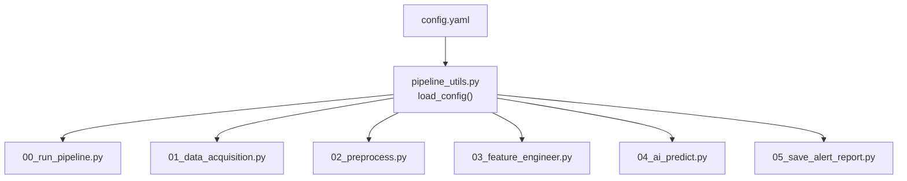
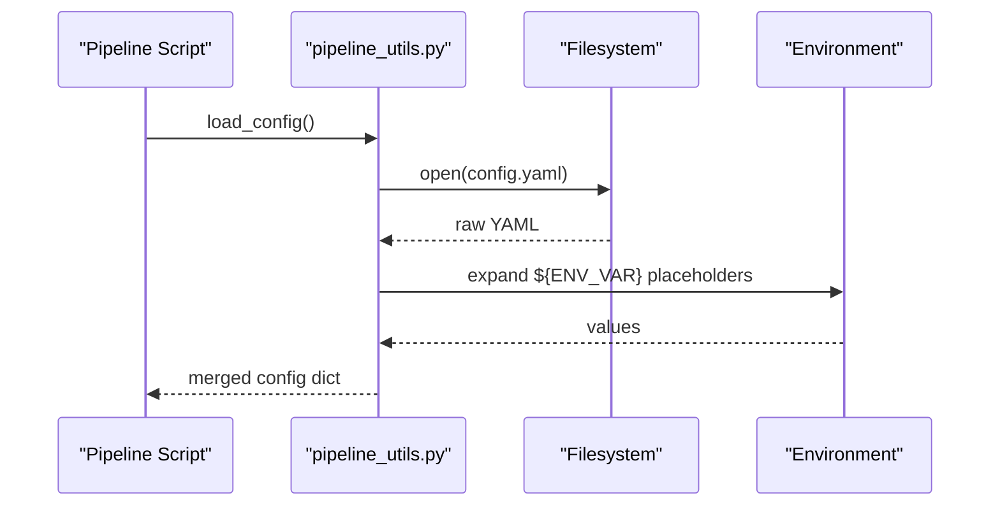
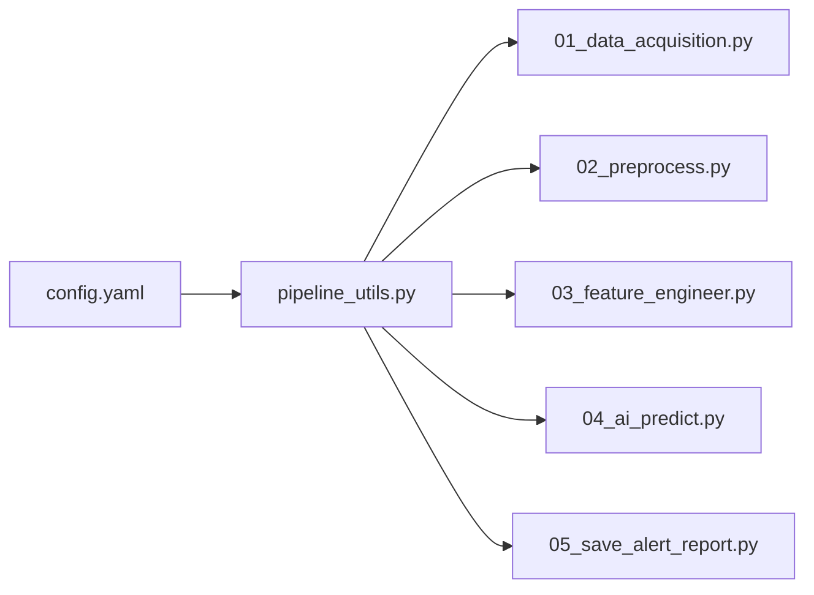

# Configuration Management

<cite>
**Referenced Files in This Document**
- [config.yaml](file://config.yaml)
- [README.md](file://README.md)
- [pipeline_utils.py](file://pipeline_utils.py)
- [00_run_pipeline.py](file://00_run_pipeline.py)
- [01_data_acquisition.py](file://01_data_acquisition.py)
- [02_preprocess.py](file://02_preprocess.py)
- [03_feature_engineer.py](file://03_feature_engineer.py)
- [04_ai_predict.py](file://04_ai_predict.py)
- [05_save_alert_report.py](file://05_save_alert_report.py)
</cite>

## Table of Contents
1. [Introduction](#introduction)
2. [Project Structure](#project-structure)
3. [Core Components](#core-components)
4. [Architecture Overview](#architecture-overview)
5. [Detailed Component Analysis](#detailed-component-analysis)
6. [Dependency Analysis](#dependency-analysis)
7. [Performance Considerations](#performance-considerations)
8. [Troubleshooting Guide](#troubleshooting-guide)
9. [Conclusion](#conclusion)
10. [Appendices](#appendices)

## Introduction
This document describes the centralized configuration management system for the Aditya-L1 Solar Flare Forecasting Pipeline. The system uses a single YAML configuration file with environment variable expansion to define all runtime settings across the pipeline. It covers instrument settings, model parameters, alert thresholds, database connections, and operational settings. It also documents configuration validation, defaults, override mechanisms, security considerations, and practical customization examples.

## Project Structure
The configuration system centers around a single YAML file and a shared loader utility. All pipeline scripts import the configuration via the utility module.

**Diagram sources**
- [config.yaml](file://config.yaml)
- [pipeline_utils.py](file://pipeline_utils.py)
- [00_run_pipeline.py](file://00_run_pipeline.py)
- [01_data_acquisition.py](file://01_data_acquisition.py)
- [02_preprocess.py](file://02_preprocess.py)
- [03_feature_engineer.py](file://03_feature_engineer.py)
- [04_ai_predict.py](file://04_ai_predict.py)
- [05_save_alert_report.py](file://05_save_alert_report.py)

**Section sources**
- [config.yaml](file://config.yaml)
- [pipeline_utils.py](file://pipeline_utils.py)
- [README.md](file://README.md)

## Core Components
- Centralized YAML configuration with environment variable expansion
- Configuration sections:
  - Pipeline scheduling and logging
  - Data acquisition (PRADAN credentials and fallback)
  - Instrument definitions and storage paths
  - Preprocessing parameters
  - Feature engineering windows
  - Model architecture and ensemble weights
  - Alert thresholds and channels
  - Database connection and table names
- Loader utility expands ${ENV_VAR} placeholders at runtime

Key behaviors:
- Environment variables are expanded in-place for all string values
- Missing environment variables are preserved as literal placeholders
- Scripts access configuration via a shared loader

**Section sources**
- [config.yaml](file://config.yaml)
- [pipeline_utils.py](file://pipeline_utils.py)

## Architecture Overview
The configuration architecture is a layered approach: a single source of truth in YAML, with environment variable expansion performed at load time. All pipeline modules depend on the shared loader to obtain configuration.

**Diagram sources**
- [pipeline_utils.py](file://pipeline_utils.py)
- [config.yaml](file://config.yaml)

## Detailed Component Analysis

### Configuration File Structure
The configuration file defines the following top-level sections:
- pipeline: pipeline identity, scheduling, logging, retries
- data: PRADAN credentials and fallback endpoints, storage directories and retention
- instruments: per-instrument band definitions and units
- preprocessing: quality control and normalization parameters
- features: temporal window and rolling windows
- models: sequence length, feature dimension, ensemble weights, and model-specific parameters
- alerts: probability thresholds and alert channels
- database: connection parameters and table names

Parameter ranges and notes:
- Probability thresholds are percentages (0–100); comparisons are made against normalized probabilities
- Ensemble weights must sum to approximately 1.0
- Storage paths are relative to pipeline root
- Database credentials support environment variable substitution

Security considerations:
- PRADAN credentials are loaded from environment variables
- Database credentials are loaded from environment variables
- Email SMTP host and alert webhook URL are loaded from environment variables
- Never commit secrets to version control; use a .env file and source it before running

**Section sources**
- [config.yaml](file://config.yaml)
- [README.md](file://README.md)

### Configuration Loading and Expansion
The loader performs:
- Safe YAML loading
- Recursive expansion of ${ENV_VAR} placeholders in strings, lists, and dictionaries
- Preservation of unknown placeholders as literals

Operational implications:
- If an environment variable is unset, the placeholder remains unchanged
- Scripts should handle missing values gracefully (e.g., PRADAN fallback)

**Section sources**
- [pipeline_utils.py](file://pipeline_utils.py)

### Pipeline Settings (pipeline)
- name, version: pipeline identity
- cron_schedule, retrain_schedule: scheduling directives
- log_level: logging verbosity
- max_retries, retry_delay_seconds: step-level retry policy

Usage:
- The master orchestrator reads these to configure step execution and logging

**Section sources**
- [config.yaml](file://config.yaml)
- [00_run_pipeline.py](file://00_run_pipeline.py)

### Data Acquisition Settings (data)
- pradan: base_url, username, password, instruments, data_level, format, look_back_hours
- noaa_fallback: enabled flag and endpoint URLs for X-ray, flares, Kp index, solar wind
- storage: raw_dir, processed_dir, features_dir, archive_days

Behavior:
- PRADAN credentials are read from environment variables
- If PRADAN credentials are missing, the pipeline falls back to NOAA SWPC endpoints
- Look-back window controls the time range for PRADAN queries

**Section sources**
- [config.yaml](file://config.yaml)
- [01_data_acquisition.py](file://01_data_acquisition.py)

### Instrument Definitions (instruments)
- SoLEXS: band definitions with wavelength ranges, GOES equivalence, and units
- HEL1OS: band definitions with energy ranges, units, and derived quantities

Usage:
- These definitions inform preprocessing and feature extraction logic

**Section sources**
- [config.yaml](file://config.yaml)
- [02_preprocess.py](file://02_preprocess.py)
- [03_feature_engineer.py](file://03_feature_engineer.py)

### Preprocessing Parameters (preprocessing)
- missing_value_strategy: interpolation method
- max_gap_minutes: gap detection threshold
- outlier_sigma_threshold: sigma-clipping threshold
- normalization: log10 min-max scaling
- sync_tolerance_seconds: acceptable time difference between instruments
- duplicate_window_seconds: deduplication window

Usage:
- Applied in preprocessing to validate, normalize, and align data

**Section sources**
- [config.yaml](file://config.yaml)
- [02_preprocess.py](file://02_preprocess.py)

### Feature Engineering Settings (features)
- temporal_window_minutes: aggregation window for temporal features
- rolling_windows: list of rolling window sizes for statistics

Usage:
- Controls feature extraction windows and rolling statistics computation

**Section sources**
- [config.yaml](file://config.yaml)
- [03_feature_engineer.py](file://03_feature_engineer.py)

### Model Parameters (models)
- sequence_length: temporal sequence length for recurrent models
- feature_dim: number of features per timestep
- ensemble_weights: weights for LSTM, GRU, Transformer, XGBoost
- LSTM, GRU, Transformer, XGBoost: architecture and checkpoint paths

Notes:
- Ensemble weights must sum to approximately 1.0
- Model paths are relative to pipeline root
- If model weights are missing, surrogate models are used

**Section sources**
- [config.yaml](file://config.yaml)
- [04_ai_predict.py](file://04_ai_predict.py)

### Alert Thresholds and Channels (alerts)
- thresholds: probability cutoffs for X-class, M-class, CME, geomagnetic storm, and general flare
- channels: list of alert delivery channels (log, email, webhook)
  - email: recipients and smtp_host
  - webhook: url

Behavior:
- Thresholds are evaluated against normalized probabilities
- Channels are processed in order; only enabled channels are used

**Section sources**
- [config.yaml](file://config.yaml)
- [05_save_alert_report.py](file://05_save_alert_report.py)

### Database Connections (database)
- host, port, name, user, password: PostgreSQL connection parameters
- pool_size: connection pool size
- tables: names for raw, processed, predictions, alerts, and runs

Behavior:
- Connection uses environment variables if provided
- Tables are created on first run if PostgreSQL is available

**Section sources**
- [config.yaml](file://config.yaml)
- [05_save_alert_report.py](file://05_save_alert_report.py)

### Configuration Validation, Defaults, and Overrides
- Validation:
  - YAML is validated during load
  - Missing environment variables remain as placeholders
  - Scripts handle missing values gracefully (e.g., PRADAN fallback)
- Defaults:
  - Numeric defaults are defined in configuration
  - Missing optional fields fall back to safe defaults in scripts
- Overrides:
  - Environment variables override configuration placeholders
  - Command-line arguments are not used in this codebase

Practical override mechanism:
- Set environment variables before running the pipeline
- Example: export PRADAN_USERNAME=...; export DB_HOST=...

**Section sources**
- [pipeline_utils.py](file://pipeline_utils.py)
- [01_data_acquisition.py](file://01_data_acquisition.py)
- [05_save_alert_report.py](file://05_save_alert_report.py)

### Security Considerations
- Store secrets in environment variables or a .env file
- Do not commit secrets to version control
- Use least-privilege database credentials
- Restrict access to alert webhook URLs and SMTP hosts
- Rotate credentials periodically

**Section sources**
- [README.md](file://README.md)
- [config.yaml](file://config.yaml)

### Practical Customization Examples

#### Customizing Thresholds for Different Operational Contexts
- Adjust thresholds under alerts.thresholds to reflect operational risk tolerance
- Example: increase M-class warning threshold for higher-risk scenarios
- Example: decrease CME high-risk threshold for sensitive assets

Impact:
- Changes immediately affect alert evaluation and messaging

**Section sources**
- [config.yaml](file://config.yaml)
- [05_save_alert_report.py](file://05_save_alert_report.py)

#### Configuring Multiple Model Variants
- Add new model entries under models with distinct model_path values
- Adjust ensemble_weights to balance contributions
- Ensure model checkpoints exist or rely on surrogate models

Impact:
- New variants are evaluated alongside existing models

**Section sources**
- [config.yaml](file://config.yaml)
- [04_ai_predict.py](file://04_ai_predict.py)

#### Setting Up Alert Channels
- Enable/disable channels under alerts.channels
- Configure email recipients and SMTP host
- Configure webhook URL for external systems

Impact:
- Enabled channels receive alerts; disabled channels are ignored

**Section sources**
- [config.yaml](file://config.yaml)
- [05_save_alert_report.py](file://05_save_alert_report.py)

## Dependency Analysis
Configuration dependencies across modules:

**Diagram sources**
- [config.yaml](file://config.yaml)
- [pipeline_utils.py](file://pipeline_utils.py)
- [01_data_acquisition.py](file://01_data_acquisition.py)
- [02_preprocess.py](file://02_preprocess.py)
- [03_feature_engineer.py](file://03_feature_engineer.py)
- [04_ai_predict.py](file://04_ai_predict.py)
- [05_save_alert_report.py](file://05_save_alert_report.py)

**Section sources**
- [config.yaml](file://config.yaml)
- [pipeline_utils.py](file://pipeline_utils.py)
- [01_data_acquisition.py](file://01_data_acquisition.py)
- [02_preprocess.py](file://02_preprocess.py)
- [03_feature_engineer.py](file://03_feature_engineer.py)
- [04_ai_predict.py](file://04_ai_predict.py)
- [05_save_alert_report.py](file://05_save_alert_report.py)

## Performance Considerations
- Environment variable expansion occurs once per load; keep configuration minimal and static
- Large configurations do not impact runtime performance significantly
- Ensure database credentials are correct to avoid connection retries

[No sources needed since this section provides general guidance]

## Troubleshooting Guide
Common configuration issues and resolutions:
- PRADAN login failures: verify PRADAN_USERNAME and PRADAN_PASSWORD environment variables
- Database connection errors: verify DB_HOST, DB_NAME, DB_USER, DB_PASSWORD
- Missing model weights: ensure model checkpoints exist or rely on surrogate models
- Alert delivery failures: verify SMTP host and webhook URL environment variables
- Unexpanded placeholders: confirm environment variables are exported before running

**Section sources**
- [README.md](file://README.md)
- [01_data_acquisition.py](file://01_data_acquisition.py)
- [05_save_alert_report.py](file://05_save_alert_report.py)
- [pipeline_utils.py](file://pipeline_utils.py)

## Conclusion
The pipeline’s configuration system provides a centralized, environment-aware YAML configuration with robust defaults and flexible overrides. By separating concerns across sections and expanding environment variables at load time, the system enables secure, repeatable deployments across diverse operational contexts. Proper use of environment variables and careful tuning of thresholds and model weights ensures reliable forecasting and alerting.

[No sources needed since this section summarizes without analyzing specific files]

## Appendices

### Configuration Parameter Reference
- pipeline: name, version, cron_schedule, retrain_schedule, log_level, max_retries, retry_delay_seconds
- data.pradan: base_url, username, password, instruments, data_level, format, look_back_hours
- data.noaa_fallback: enabled, xray_6h, xray_1d, flares_7d, kp_index, scales, solar_wind_plasma, solar_wind_mag
- data.storage: raw_dir, processed_dir, features_dir, archive_days
- instruments.SoLEXS.bands: name, range_angstrom, goes_equivalent, unit
- instruments.HEL1OS.bands: name, range_keV, unit
- preprocessing: missing_value_strategy, max_gap_minutes, outlier_sigma_threshold, normalization, sync_tolerance_seconds, duplicate_window_seconds
- features: temporal_window_minutes, rolling_windows
- models: sequence_length, feature_dim, ensemble_weights, LSTM, GRU, Transformer, XGBoost
- alerts.thresholds: m_class_warning_pct, x_class_critical_pct, cme_high_risk_pct, geomag_storm_pct, flare_watch_pct
- alerts.channels: type, enabled, recipients, smtp_host, url
- database: host, port, name, user, password, pool_size, tables

**Section sources**
- [config.yaml](file://config.yaml)