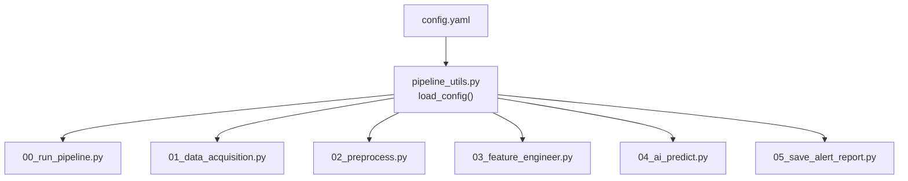
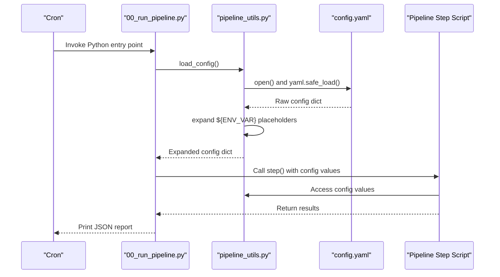
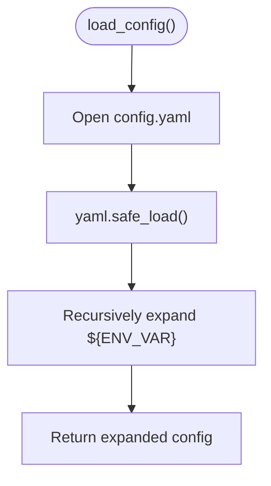
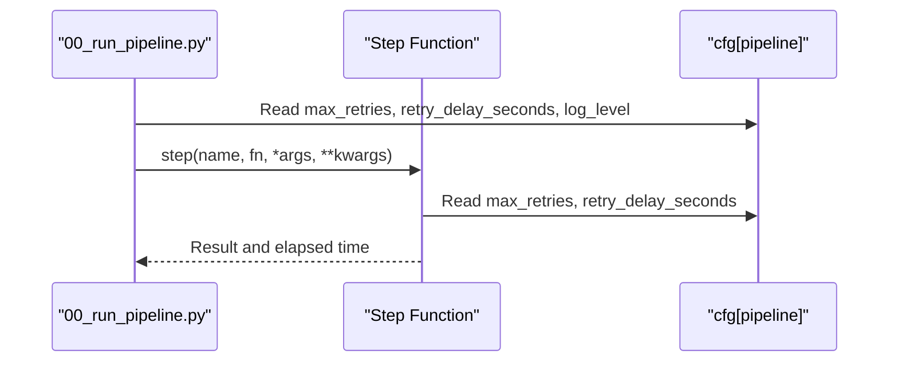
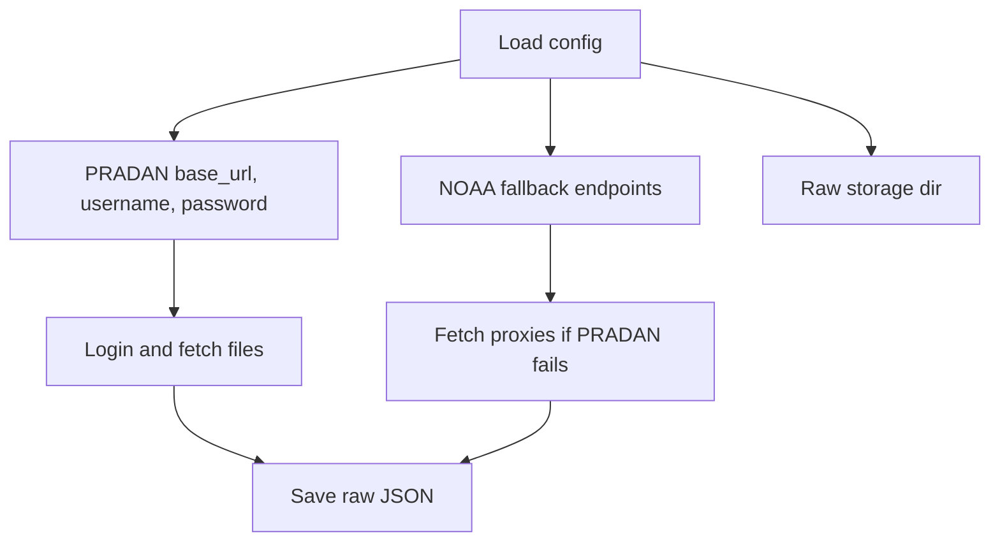
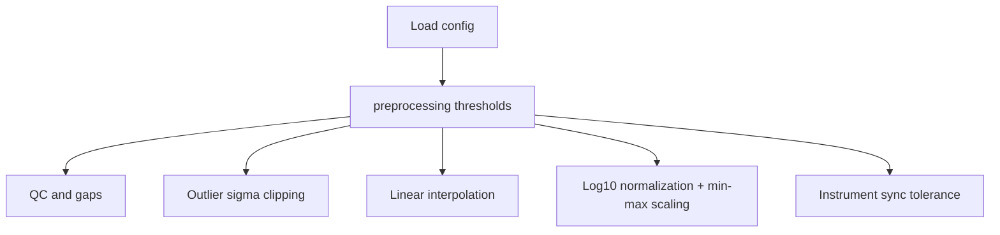
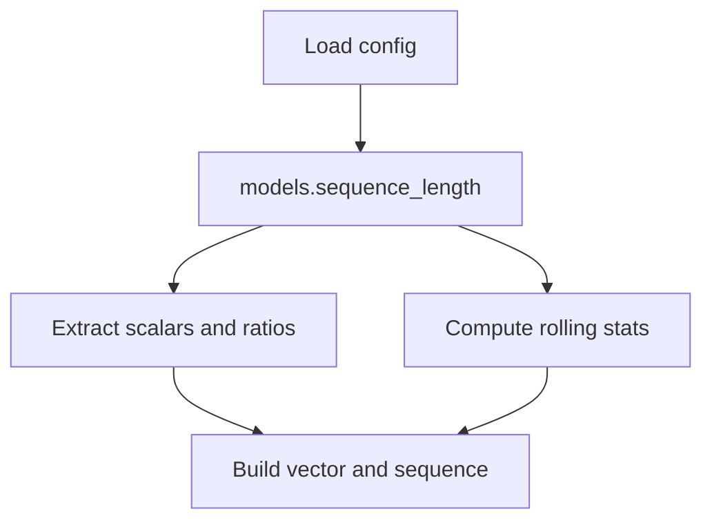
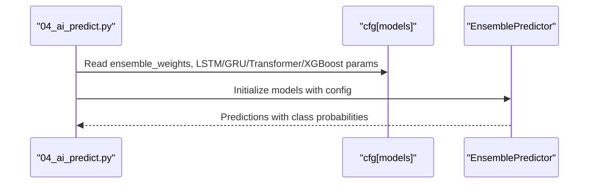
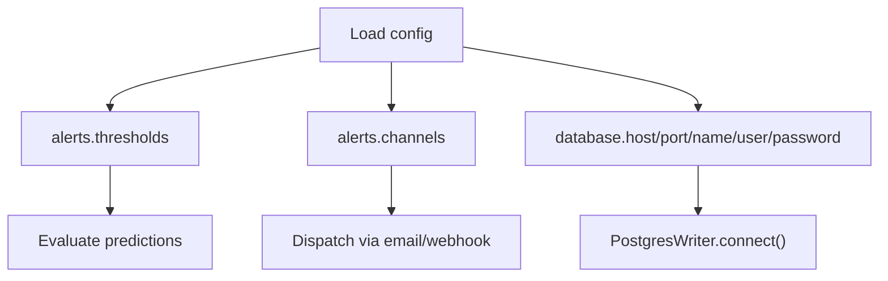
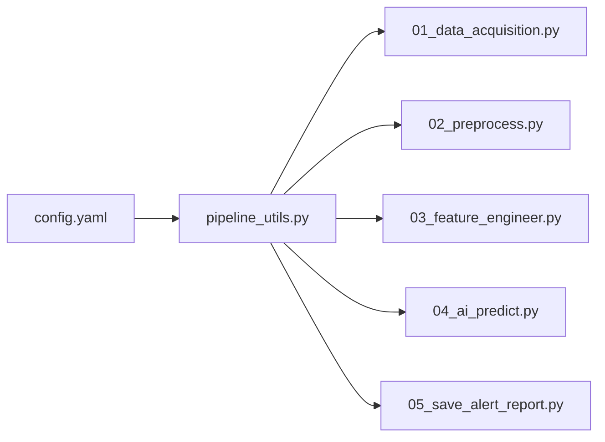

# Core Configuration Structure

<cite>
**Referenced Files in This Document**
- [config.yaml](file://config.yaml)
- [pipeline_utils.py](file://pipeline_utils.py)
- [00_run_pipeline.py](file://00_run_pipeline.py)
- [01_data_acquisition.py](file://01_data_acquisition.py)
- [02_preprocess.py](file://02_preprocess.py)
- [03_feature_engineer.py](file://03_feature_engineer.py)
- [04_ai_predict.py](file://04_ai_predict.py)
- [05_save_alert_report.py](file://05_save_alert_report.py)
- [README.md](file://README.md)
</cite>

## Table of Contents
1. [Introduction](#introduction)
2. [Project Structure](#project-structure)
3. [Core Components](#core-components)
4. [Architecture Overview](#architecture-overview)
5. [Detailed Component Analysis](#detailed-component-analysis)
6. [Dependency Analysis](#dependency-analysis)
7. [Performance Considerations](#performance-considerations)
8. [Troubleshooting Guide](#troubleshooting-guide)
9. [Conclusion](#conclusion)

## Introduction
This document explains the core configuration structure and YAML format used by the Aditya-L1 Solar Flare Forecasting Pipeline. It covers the hierarchical organization of configuration sections, environment variable expansion, configuration loading and validation, parameter precedence, and best practices for managing configuration across environments. The pipeline orchestrates eight steps, each consuming configuration values to drive data acquisition, preprocessing, feature engineering, AI inference, persistence, alerting, and reporting.

## Project Structure
The configuration system centers around a single YAML file and a shared utility that loads and expands environment variables. Scripts across the pipeline import the shared utility to access configuration values.

**Diagram sources**
- [config.yaml:1-104](file://config.yaml#L1-L104)
- [pipeline_utils.py:25-41](file://pipeline_utils.py#L25-L41)
- [00_run_pipeline.py:35-38](file://00_run_pipeline.py#L35-L38)
- [01_data_acquisition.py:34-41](file://01_data_acquisition.py#L34-L41)
- [02_preprocess.py:26-33](file://02_preprocess.py#L26-L33)
- [03_feature_engineer.py:35-42](file://03_feature_engineer.py#L35-L42)
- [04_ai_predict.py:32-39](file://04_ai_predict.py#L32-L39)
- [05_save_alert_report.py:32-39](file://05_save_alert_report.py#L32-L39)

**Section sources**
- [config.yaml:1-104](file://config.yaml#L1-L104)
- [pipeline_utils.py:17-41](file://pipeline_utils.py#L17-L41)
- [README.md:7-32](file://README.md#L7-L32)

## Core Components
- Configuration file: Central YAML defining pipeline orchestration, data acquisition, preprocessing, feature engineering, model parameters, alerts, and database settings.
- Configuration loader: Loads YAML and expands ${ENV_VAR} placeholders using environment variables.
- Orchestration script: Uses configuration to schedule retries and logging levels.
- Step scripts: Each step reads configuration for behavior, paths, thresholds, and model settings.

Key configuration sections:
- pipeline: name, version, scheduling, logging, retry policy
- data: PRADAN credentials and endpoints, NOAA fallback endpoints, storage directories and retention
- instruments: instrument-specific band definitions and units
- preprocessing: quality control and normalization parameters
- features: temporal window and rolling windows for feature extraction
- models: sequence length, feature dimension, ensemble weights, and per-model hyperparameters and model paths
- alerts: probability thresholds and alert channels (log, email, webhook)
- database: connection parameters and table names

Environment variable expansion:
- Values containing ${ENV_VAR} are expanded using os.getenv, preserving literal ${VAR} when the environment variable is unset.

**Section sources**
- [config.yaml:6-104](file://config.yaml#L6-L104)
- [pipeline_utils.py:25-41](file://pipeline_utils.py#L25-L41)
- [00_run_pipeline.py:41-61](file://00_run_pipeline.py#L41-L61)

## Architecture Overview
The configuration architecture is a centralized, hierarchical YAML with environment variable expansion performed at load time. Each pipeline step imports the shared utility to access configuration values.

**Diagram sources**
- [00_run_pipeline.py:35-38](file://00_run_pipeline.py#L35-L38)
- [pipeline_utils.py:25-41](file://pipeline_utils.py#L25-L41)
- [config.yaml:1-104](file://config.yaml#L1-L104)

## Detailed Component Analysis

### Configuration Loading and Expansion
- Load YAML safely and expand ${ENV_VAR} placeholders recursively across strings, lists, and dictionaries.
- Unset environment variables remain as literal ${VAR} tokens.
- Configuration is cached per process via a single load per script.

**Diagram sources**
- [pipeline_utils.py:25-41](file://pipeline_utils.py#L25-L41)

**Section sources**
- [pipeline_utils.py:25-41](file://pipeline_utils.py#L25-L41)

### Pipeline Orchestration
- Controls scheduling, logging level, and retry behavior.
- Orchestrator script uses these values to wrap each step with timing, retries, and error handling.

**Diagram sources**
- [00_run_pipeline.py:41-61](file://00_run_pipeline.py#L41-L61)
- [config.yaml:6-13](file://config.yaml#L6-L13)

**Section sources**
- [00_run_pipeline.py:41-61](file://00_run_pipeline.py#L41-L61)
- [config.yaml:6-13](file://config.yaml#L6-L13)

### Data Acquisition
- Reads PRADAN base URL and credentials from configuration.
- Uses NOAA fallback endpoints when PRADAN credentials are not set.
- Stores raw outputs under configured directories.

**Diagram sources**
- [01_data_acquisition.py:40-43](file://01_data_acquisition.py#L40-L43)
- [01_data_acquisition.py:60-63](file://01_data_acquisition.py#L60-L63)
- [01_data_acquisition.py:209-210](file://01_data_acquisition.py#L209-L210)
- [config.yaml:15-40](file://config.yaml#L15-L40)

**Section sources**
- [01_data_acquisition.py:40-43](file://01_data_acquisition.py#L40-L43)
- [01_data_acquisition.py:60-63](file://01_data_acquisition.py#L60-L63)
- [01_data_acquisition.py:209-210](file://01_data_acquisition.py#L209-L210)
- [config.yaml:15-40](file://config.yaml#L15-L40)

### Preprocessing
- Applies QC, outlier removal, interpolation, normalization, and synchronization based on configuration.
- Uses preprocessing thresholds and normalization strategy from configuration.

**Diagram sources**
- [02_preprocess.py:31-38](file://02_preprocess.py#L31-L38)
- [02_preprocess.py:126-224](file://02_preprocess.py#L126-L224)
- [config.yaml:54-61](file://config.yaml#L54-L61)

**Section sources**
- [02_preprocess.py:31-38](file://02_preprocess.py#L31-L38)
- [02_preprocess.py:126-224](file://02_preprocess.py#L126-L224)
- [config.yaml:54-61](file://config.yaml#L54-L61)

### Feature Engineering
- Builds 17-dimensional feature vectors and sequences using configuration-defined sequence length.
- Writes features to configured directories.

**Diagram sources**
- [03_feature_engineer.py:40-46](file://03_feature_engineer.py#L40-L46)
- [03_feature_engineer.py:92-193](file://03_feature_engineer.py#L92-L193)
- [config.yaml:66-77](file://config.yaml#L66-L77)

**Section sources**
- [03_feature_engineer.py:40-46](file://03_feature_engineer.py#L40-L46)
- [03_feature_engineer.py:92-193](file://03_feature_engineer.py#L92-L193)
- [config.yaml:66-77](file://config.yaml#L66-L77)

### AI Ensemble Inference
- Loads per-model hyperparameters and model paths from configuration.
- Uses ensemble weights to combine predictions from LSTM, GRU, Transformer, and XGBoost.
- Falls back to surrogate models when trained weights are not present.

**Diagram sources**
- [04_ai_predict.py:37-41](file://04_ai_predict.py#L37-L41)
- [04_ai_predict.py:246-396](file://04_ai_predict.py#L246-L396)
- [config.yaml:66-77](file://config.yaml#L66-L77)

**Section sources**
- [04_ai_predict.py:37-41](file://04_ai_predict.py#L37-L41)
- [04_ai_predict.py:246-396](file://04_ai_predict.py#L246-L396)
- [config.yaml:66-77](file://config.yaml#L66-L77)

### Alerts and Database
- Evaluates thresholds from configuration and dispatches alerts to configured channels.
- Persists predictions and alerts to PostgreSQL using configuration-defined connection parameters and table names.

**Diagram sources**
- [05_save_alert_report.py:37-41](file://05_save_alert_report.py#L37-L41)
- [05_save_alert_report.py:222-266](file://05_save_alert_report.py#L222-L266)
- [05_save_alert_report.py:118-142](file://05_save_alert_report.py#L118-L142)
- [config.yaml:79-104](file://config.yaml#L79-L104)

**Section sources**
- [05_save_alert_report.py:37-41](file://05_save_alert_report.py#L37-L41)
- [05_save_alert_report.py:222-266](file://05_save_alert_report.py#L222-L266)
- [05_save_alert_report.py:118-142](file://05_save_alert_report.py#L118-L142)
- [config.yaml:79-104](file://config.yaml#L79-L104)

## Dependency Analysis
- Central dependency: All pipeline scripts depend on pipeline_utils.load_config().
- Configuration sections are consumed by specific steps:
  - data and instruments: acquisition and preprocessing
  - preprocessing: preprocessing
  - features and models: feature engineering and AI inference
  - alerts: alert evaluation and dispatch
  - database: persistence layer

**Diagram sources**
- [config.yaml:1-104](file://config.yaml#L1-L104)
- [pipeline_utils.py:25-41](file://pipeline_utils.py#L25-L41)
- [01_data_acquisition.py:34-41](file://01_data_acquisition.py#L34-L41)
- [02_preprocess.py:26-33](file://02_preprocess.py#L26-L33)
- [03_feature_engineer.py:35-42](file://03_feature_engineer.py#L35-L42)
- [04_ai_predict.py:32-39](file://04_ai_predict.py#L32-L39)
- [05_save_alert_report.py:32-39](file://05_save_alert_report.py#L32-L39)

**Section sources**
- [config.yaml:1-104](file://config.yaml#L1-L104)
- [pipeline_utils.py:25-41](file://pipeline_utils.py#L25-L41)

## Performance Considerations
- Environment variable expansion occurs once per process; keep configuration small and static.
- Use minimal logging levels in production to reduce I/O overhead.
- Ensure database connection parameters are correct to avoid connection timeouts and retries.

[No sources needed since this section provides general guidance]

## Troubleshooting Guide
Common configuration-related issues and resolutions:
- Missing environment variables:
  - PRADAN credentials and database credentials are expanded from environment variables. If unset, ${VAR} remains literal and causes failures. Set environment variables before sourcing .env or invoking cron.
- Invalid YAML:
  - Ensure indentation and quoting are correct. The loader uses safe YAML parsing; malformed YAML will raise errors during load.
- Incorrect paths:
  - Verify storage directories exist and are writable. The loader creates logs and state directories as needed, but raw/processed/features directories must be writable.
- Parameter precedence:
  - Configuration values are read directly from the YAML and environment-expanded at load time. There is no explicit override mechanism; environment variables take precedence over literal ${VAR} tokens.
- Alert channels:
  - Email requires SMTP host; webhook requires a reachable URL. Ensure these are configured and accessible from the runtime environment.

**Section sources**
- [pipeline_utils.py:25-41](file://pipeline_utils.py#L25-L41)
- [README.md:62-84](file://README.md#L62-L84)
- [config.yaml:15-19](file://config.yaml#L15-L19)
- [config.yaml:86-89](file://config.yaml#L86-L89)
- [config.yaml:91-96](file://config.yaml#L91-L96)

## Conclusion
The pipeline’s configuration system is a centralized, hierarchical YAML with robust environment variable expansion. Each step consumes configuration values to control behavior, paths, thresholds, and model parameters. Proper environment setup, careful YAML formatting, and adherence to parameter precedence rules ensure reliable operation across development and production environments.