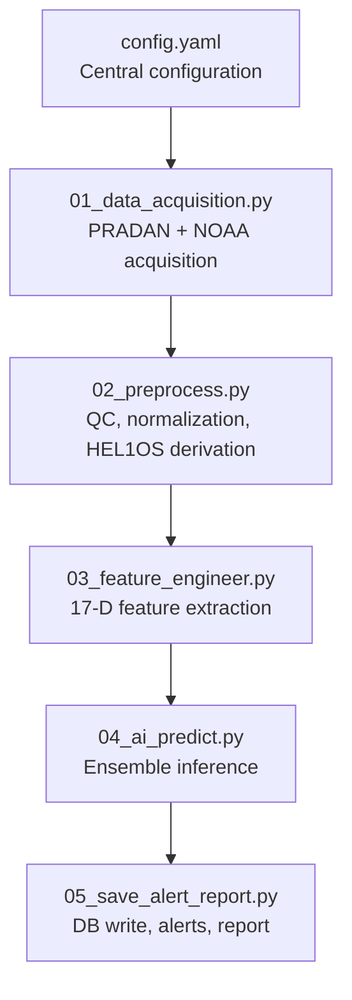
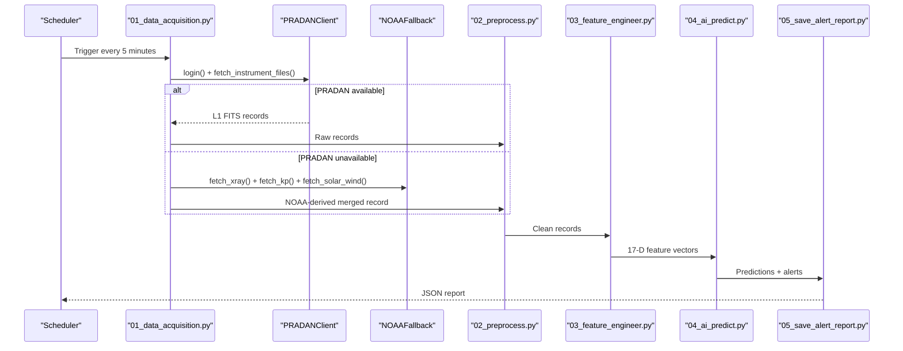
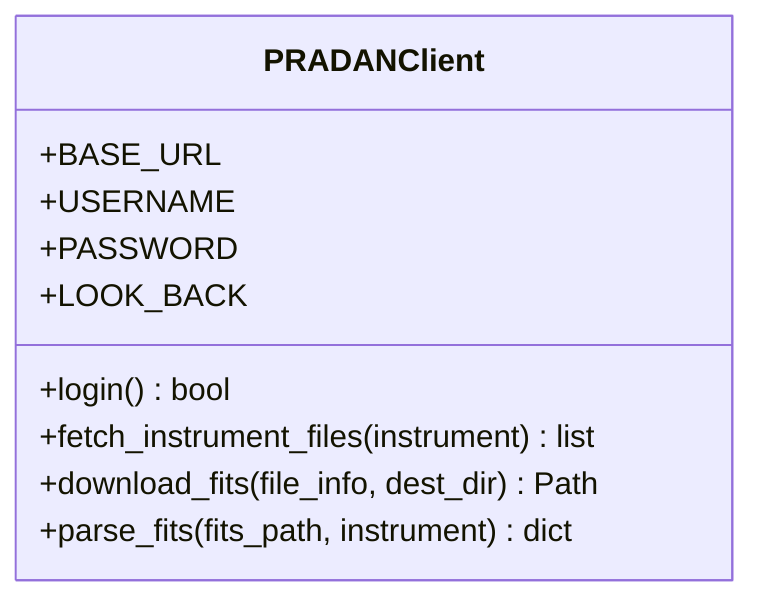
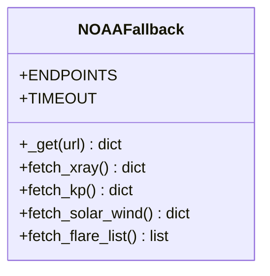
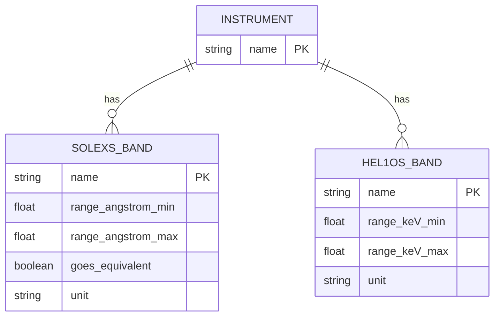
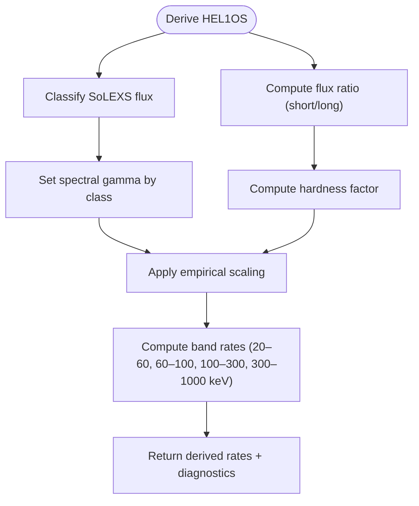
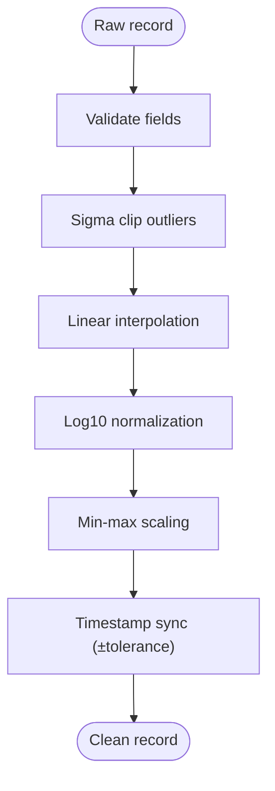
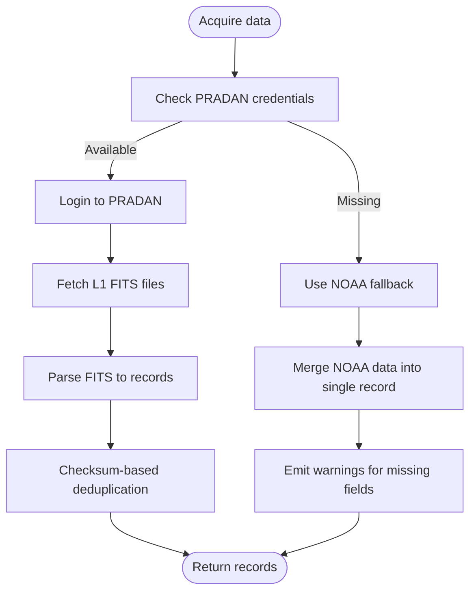
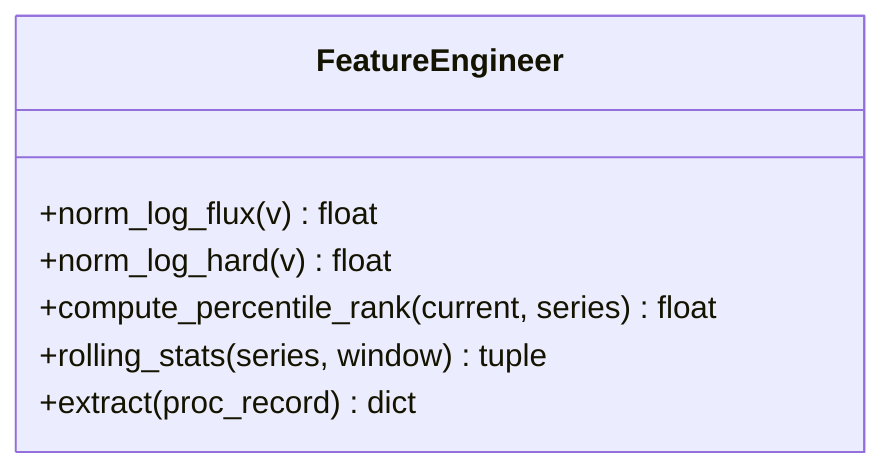
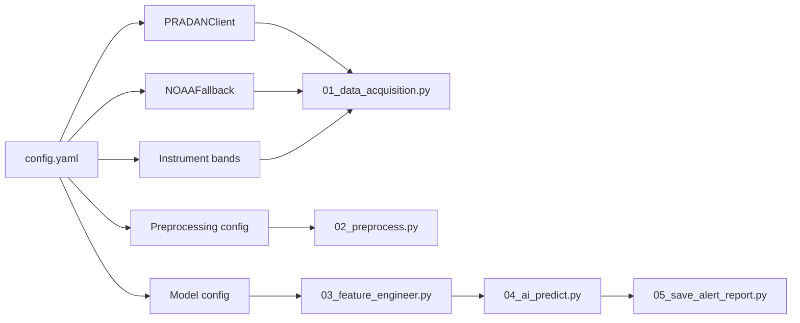

# Instrument Settings

<cite>
**Referenced Files in This Document**
- [config.yaml](file://config.yaml)
- [01_data_acquisition.py](file://01_data_acquisition.py)
- [02_preprocess.py](file://02_preprocess.py)
- [03_feature_engineer.py](file://03_feature_engineer.py)
- [04_ai_predict.py](file://04_ai_predict.py)
- [05_save_alert_report.py](file://05_save_alert_report.py)
- [README.md](file://README.md)
</cite>

## Table of Contents
1. [Introduction](#introduction)
2. [Project Structure](#project-structure)
3. [Core Components](#core-components)
4. [Architecture Overview](#architecture-overview)
5. [Detailed Component Analysis](#detailed-component-analysis)
6. [Dependency Analysis](#dependency-analysis)
7. [Performance Considerations](#performance-considerations)
8. [Troubleshooting Guide](#troubleshooting-guide)
9. [Conclusion](#conclusion)

## Introduction
This document describes the instrument configuration settings that control data acquisition from PRADAN and NOAA sources. It covers PRADAN credentials and authentication, supported instruments (SoLEXS and HEL1OS), data levels and formats, NOAA fallback endpoints, instrument-specific band configurations, wavelength/energy ranges, units, calibration parameters, data quality flags, preprocessing settings, instrument selection criteria, data availability monitoring, and fallback mechanisms when primary instruments fail.

## Project Structure
The pipeline is organized into discrete steps, each responsible for a stage of the forecasting workflow. The configuration file centralizes all settings, including instrument definitions, preprocessing parameters, and model configurations.

**Diagram sources**
- [config.yaml:15-104](file://config.yaml#L15-L104)
- [01_data_acquisition.py:349-452](file://01_data_acquisition.py#L349-L452)
- [02_preprocess.py:230-409](file://02_preprocess.py#L230-L409)
- [03_feature_engineer.py:199-249](file://03_feature_engineer.py#L199-L249)
- [04_ai_predict.py:402-448](file://04_ai_predict.py#L402-L448)
- [05_save_alert_report.py:452-502](file://05_save_alert_report.py#L452-L502)

**Section sources**
- [README.md:7-32](file://README.md#L7-L32)
- [config.yaml:15-104](file://config.yaml#L15-L104)

## Core Components
- PRADAN client configuration: base URL, credentials, supported instruments, data level, format, and look-back window.
- NOAA fallback configuration: endpoints for X-ray observations, solar wind, Kp index, and space weather scales.
- Instrument definitions: SoLEXS and HEL1OS band configurations, wavelength/energy ranges, and units.
- Preprocessing configuration: missing value strategy, gap tolerance, outlier detection, normalization, synchronization, and duplicate handling.
- Feature engineering configuration: sequence length and rolling windows used for modeling.

**Section sources**
- [config.yaml:16-52](file://config.yaml#L16-L52)
- [config.yaml:54-61](file://config.yaml#L54-L61)
- [config.yaml:62-77](file://config.yaml#L62-L77)

## Architecture Overview
The acquisition step attempts PRADAN first; if credentials are missing or unavailable, it falls back to NOAA SWPC endpoints. The preprocessing step validates and normalizes data, derives HEL1OS when needed, and synchronizes instruments. Feature engineering extracts a fixed-size vector for modeling. The AI step performs ensemble inference and generates alerts and reports.

**Diagram sources**
- [01_data_acquisition.py:365-433](file://01_data_acquisition.py#L365-L433)
- [02_preprocess.py:230-409](file://02_preprocess.py#L230-L409)
- [03_feature_engineer.py:199-249](file://03_feature_engineer.py#L199-L249)
- [04_ai_predict.py:402-448](file://04_ai_predict.py#L402-L448)
- [05_save_alert_report.py:452-502](file://05_save_alert_report.py#L452-L502)

## Detailed Component Analysis

### PRADAN Configuration
- Base URL: configured under the PRADAN section.
- Authentication: username and password are read from environment variables and used to log in to the PRADAN portal.
- Instruments: SoLEXS and HEL1OS are supported.
- Data level and format: Level-1 FITS files.
- Look-back window: controls the time range for fetching new files.

**Diagram sources**
- [01_data_acquisition.py:50-193](file://01_data_acquisition.py#L50-L193)

**Section sources**
- [config.yaml:16-23](file://config.yaml#L16-L23)
- [01_data_acquisition.py:60-67](file://01_data_acquisition.py#L60-L67)
- [01_data_acquisition.py:69-87](file://01_data_acquisition.py#L69-L87)
- [01_data_acquisition.py:89-120](file://01_data_acquisition.py#L89-L120)
- [01_data_acquisition.py:121-144](file://01_data_acquisition.py#L121-L144)
- [01_data_acquisition.py:145-193](file://01_data_acquisition.py#L145-L193)

### NOAA Fallback Configuration
- Enabled flag: controls whether fallback is used.
- Endpoints:
  - X-ray 6-hour and 1-day averages.
  - 7-day confirmed flares.
  - Planetary Kp index.
  - Solar wind plasma and magnetic field.
  - Space weather scales.

**Diagram sources**
- [01_data_acquisition.py:199-325](file://01_data_acquisition.py#L199-L325)

**Section sources**
- [config.yaml:25-34](file://config.yaml#L25-L34)
- [01_data_acquisition.py:212-221](file://01_data_acquisition.py#L212-L221)
- [01_data_acquisition.py:222-268](file://01_data_acquisition.py#L222-L268)
- [01_data_acquisition.py:270-283](file://01_data_acquisition.py#L270-L283)
- [01_data_acquisition.py:285-307](file://01_data_acquisition.py#L285-L307)
- [01_data_acquisition.py:309-324](file://01_data_acquisition.py#L309-L324)

### Instrument Definitions and Band Configurations
- SoLEXS bands:
  - Band 1 (1–8 Angstrom): W/m2, GOES equivalent.
  - Band 2 (0.5–4 Angstrom): W/m2, GOES equivalent.
  - Band 3 (8–20 Angstrom): W/m2, not GOES equivalent.
- HEL1OS bands:
  - 20–60 keV: counts/s.
  - 60–100 keV: counts/s.
  - 100–300 keV: counts/s.
  - 300–1000 keV: counts/s.

**Diagram sources**
- [config.yaml:42-52](file://config.yaml#L42-L52)

**Section sources**
- [config.yaml:42-52](file://config.yaml#L42-L52)

### Data Quality Flags and Calibration Parameters
- Data quality flags:
  - SoLEXS: quality flags included in lightcurve data.
  - HEL1OS: quality flags included in rates data.
- Calibration parameters:
  - Derived HEL1OS count rates from SoLEXS soft X-ray flux using a spectral model.
  - Spectral gamma derived from flux classification.
  - Hardness factor computed from flux ratio.

**Diagram sources**
- [02_preprocess.py:169-205](file://02_preprocess.py#L169-L205)

**Section sources**
- [01_data_acquisition.py:170-188](file://01_data_acquisition.py#L170-L188)
- [02_preprocess.py:169-205](file://02_preprocess.py#L169-L205)

### Preprocessing Settings
- Missing value strategy: linear interpolation.
- Maximum gap minutes: 10 minutes.
- Outlier detection: sigma clipping with a configurable threshold.
- Normalization: log10 transform followed by min-max scaling.
- Synchronization tolerance: seconds for aligning SoLEXS and HEL1OS timestamps.
- Duplicate handling: checksum-based deduplication.

**Diagram sources**
- [02_preprocess.py:126-224](file://02_preprocess.py#L126-L224)

**Section sources**
- [config.yaml:54-61](file://config.yaml#L54-L61)
- [02_preprocess.py:128-168](file://02_preprocess.py#L128-L168)
- [02_preprocess.py:207-224](file://02_preprocess.py#L207-L224)

### Instrument Selection Criteria and Availability Monitoring
- Primary selection: PRADAN credentials present → use native SoLEXS/HEL1OS L1 FITS.
- Fallback selection: if PRADAN login fails or credentials are missing → use NOAA SWPC endpoints.
- Availability monitoring:
  - Acquisition step checks for new data and returns “NO_NEW_DATA” if none.
  - Deduplication prevents reprocessing identical records.
  - Warnings are emitted for missing or low-cadence data.

**Diagram sources**
- [01_data_acquisition.py:365-433](file://01_data_acquisition.py#L365-L433)

**Section sources**
- [01_data_acquisition.py:365-433](file://01_data_acquisition.py#L365-L433)

### Feature Extraction and Modeling Inputs
- Features include:
  - SoLEXS: log10 soft flux, peak 60-min, 0.5–4A band, flux ratio, rise/acceleration rates.
  - HEL1OS: log10 band rates, hard/soft ratio, spectral gamma.
  - Ancillary: Kp index, solar wind speed/density, IMF Bz.
  - Temporal statistics: percentile rank, rolling mean/std.
- Sequence construction: 60 steps × 17 features for recurrent models.

**Diagram sources**
- [03_feature_engineer.py:52-192](file://03_feature_engineer.py#L52-L192)

**Section sources**
- [config.yaml:62-64](file://config.yaml#L62-L64)
- [03_feature_engineer.py:52-91](file://03_feature_engineer.py#L52-L91)
- [03_feature_engineer.py:92-192](file://03_feature_engineer.py#L92-L192)

## Dependency Analysis
- Configuration dependencies:
  - PRADAN base URL and credentials are loaded from config and environment variables.
  - NOAA endpoints are loaded from config.
  - Instrument band definitions are loaded from config.
  - Preprocessing and modeling parameters are loaded from config.
- Runtime dependencies:
  - PRADAN client depends on requests session and environment variables.
  - NOAA client depends on requests and JSON parsing.
  - Preprocessing depends on numpy and scipy for statistics.
  - AI step depends on PyTorch and XGBoost if available.

**Diagram sources**
- [config.yaml:16-104](file://config.yaml#L16-L104)
- [01_data_acquisition.py:50-193](file://01_data_acquisition.py#L50-L193)
- [02_preprocess.py:126-224](file://02_preprocess.py#L126-L224)
- [03_feature_engineer.py:52-192](file://03_feature_engineer.py#L52-L192)
- [04_ai_predict.py:63-127](file://04_ai_predict.py#L63-L127)
- [05_save_alert_report.py:47-116](file://05_save_alert_report.py#L47-L116)

**Section sources**
- [config.yaml:16-104](file://config.yaml#L16-L104)
- [01_data_acquisition.py:50-193](file://01_data_acquisition.py#L50-L193)
- [02_preprocess.py:126-224](file://02_preprocess.py#L126-L224)
- [03_feature_engineer.py:52-192](file://03_feature_engineer.py#L52-L192)
- [04_ai_predict.py:63-127](file://04_ai_predict.py#L63-L127)
- [05_save_alert_report.py:47-116](file://05_save_alert_report.py#L47-L116)

## Performance Considerations
- Network timeouts: PRADAN and NOAA clients use explicit timeouts to prevent hangs.
- Deduplication: checksum-based filtering reduces redundant processing.
- Interpolation and normalization: efficient vectorized operations minimize overhead.
- Model loading: optional deep learning models are loaded only if weights exist; otherwise, surrogate models are used.

[No sources needed since this section provides general guidance]

## Troubleshooting Guide
- PRADAN login failures:
  - Verify environment variables for username/password.
  - Check base URL and network connectivity.
- Missing or low-cadence NOAA data:
  - Inspect endpoint reachability and response format.
  - Review warnings for insufficient records or missing fields.
- Preprocessing errors:
  - Validate that required fields are present.
  - Adjust sigma clipping and interpolation thresholds.
- Model inference issues:
  - Confirm model weights exist for PyTorch/XGBoost.
  - Use surrogate models if weights are missing.

**Section sources**
- [01_data_acquisition.py:69-87](file://01_data_acquisition.py#L69-L87)
- [01_data_acquisition.py:212-221](file://01_data_acquisition.py#L212-L221)
- [02_preprocess.py:51-98](file://02_preprocess.py#L51-L98)
- [04_ai_predict.py:113-127](file://04_ai_predict.py#L113-L127)

## Conclusion
The instrument configuration integrates PRADAN and NOAA sources with robust fallback and preprocessing. PRADAN provides native L1 FITS for SoLEXS and HEL1OS, while NOAA serves as a reliable proxy when credentials are unavailable. Instrument-specific band definitions, quality flags, and derived HEL1OS rates enable consistent feature extraction and modeling. The configuration supports flexible preprocessing and modeling parameters, ensuring reliable operation under varying data availability conditions.