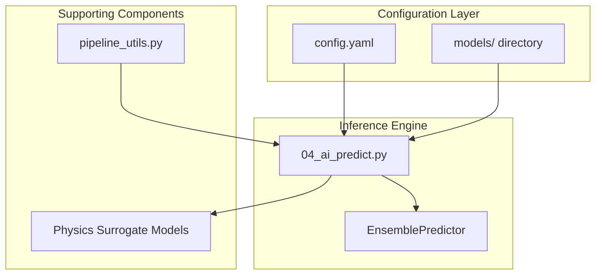
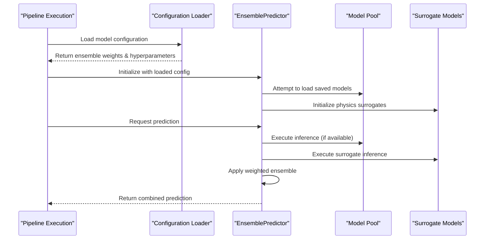
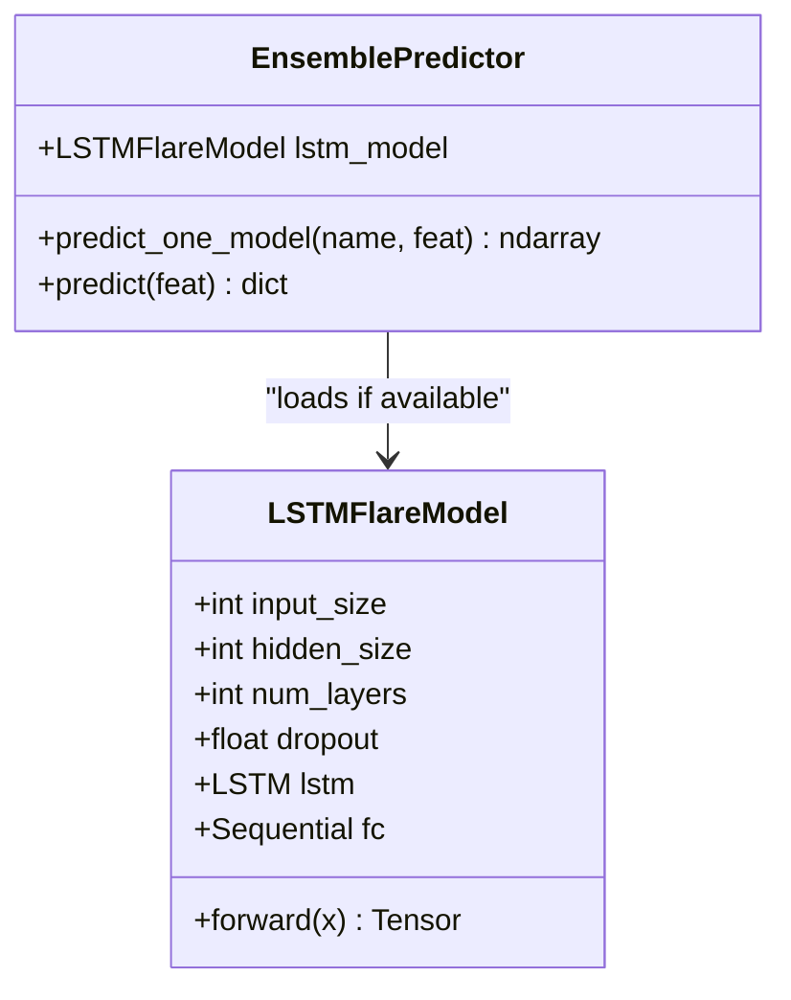
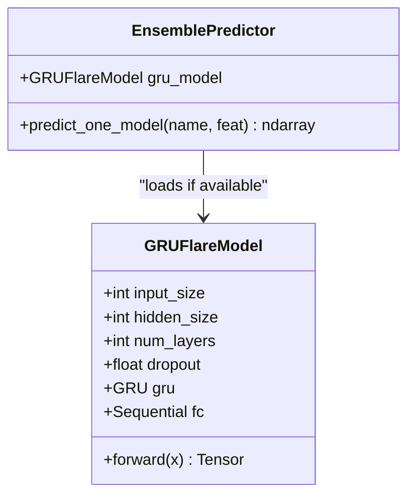
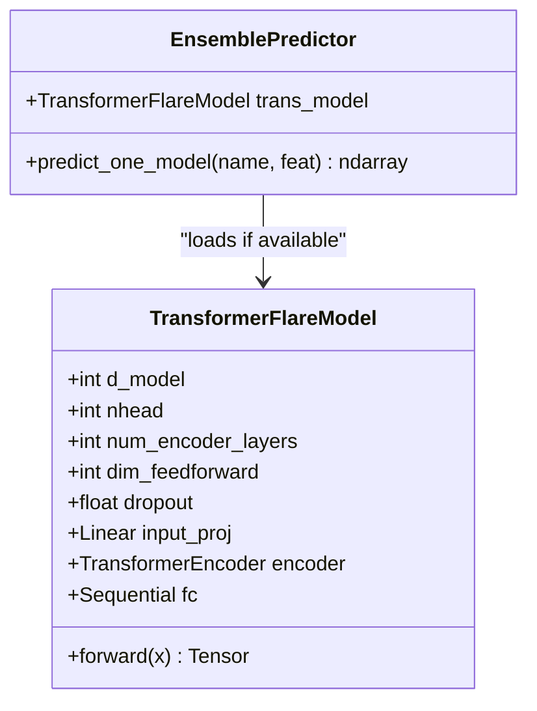
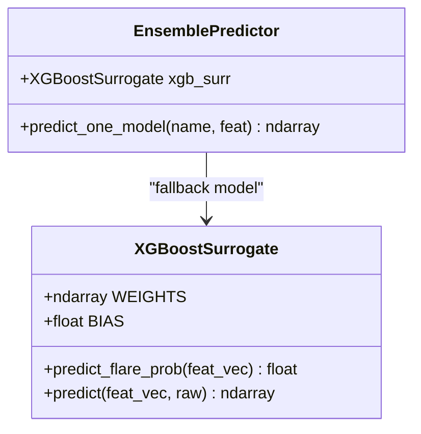
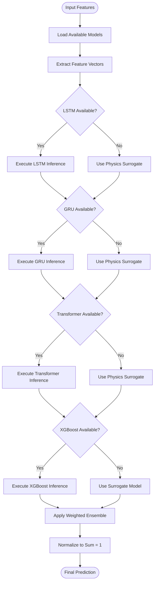
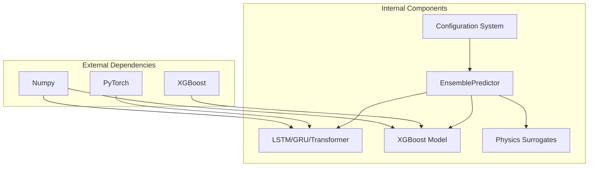

# Model Parameters

<cite>
**Referenced Files in This Document**
- [config.yaml](file://config.yaml)
- [04_ai_predict.py](file://04_ai_predict.py)
- [README.md](file://README.md)
- [pipeline_utils.py](file://pipeline_utils.py)
</cite>

## Table of Contents
1. [Introduction](#introduction)
2. [Project Structure](#project-structure)
3. [Core Components](#core-components)
4. [Architecture Overview](#architecture-overview)
5. [Detailed Component Analysis](#detailed-component-analysis)
6. [Dependency Analysis](#dependency-analysis)
7. [Performance Considerations](#performance-considerations)
8. [Troubleshooting Guide](#troubleshooting-guide)
9. [Conclusion](#conclusion)

## Introduction
This document provides comprehensive documentation for the machine learning model configuration parameters and ensemble settings used in the Aditya-L1 Solar Flare Forecasting Pipeline. The system employs a four-model ensemble architecture combining deep learning models (LSTM, GRU, Transformer) with gradient boosting (XGBoost) to predict solar flare probabilities and associated space weather risks.

The ensemble configuration utilizes carefully tuned weights to balance the strengths of each model type: LSTM (0.30), GRU (0.25), Transformer (0.30), and XGBoost (0.15). These weights reflect the models' respective capabilities in capturing temporal patterns, handling sequential data efficiently, modeling long-range dependencies, and leveraging gradient boosting advantages.

## Project Structure
The model configuration is centralized in the configuration system with clear separation between model definitions, hyperparameters, and ensemble settings:

**Diagram sources**
- [config.yaml:66-77](file://config.yaml#L66-L77)
- [04_ai_predict.py:246-395](file://04_ai_predict.py#L246-L395)

**Section sources**
- [config.yaml:1-104](file://config.yaml#L1-L104)
- [README.md:190-203](file://README.md#L190-L203)

## Core Components

### Ensemble Architecture Configuration
The ensemble system implements a weighted voting mechanism with the following architecture:

| Model Type | Weight | Purpose | Input Format |
|------------|--------|---------|--------------|
| LSTM | 0.30 | Temporal pattern recognition | 60×17 sequence tensor |
| GRU | 0.25 | Lightweight recurrent baseline | 60×17 sequence tensor |
| Transformer | 0.30 | Long-range dependency capture | 60×17 sequence tensor |
| XGBoost | 0.15 | Gradient boosted trees | 17-dimensional vector |

### Sequence and Feature Configuration
The system operates on standardized input dimensions:
- **sequence_length**: 60 time steps representing 60 minutes of historical data
- **feature_dim**: 17-dimensional feature vector containing solar observation metrics
- **input_shape**: LSTM/GRU/Transformer models process sequences of shape (batch, 60, 17)
- **vector_input**: XGBoost processes 17-dimensional feature vectors

### Model Path Resolution
Each model maintains explicit path configurations for deployment flexibility:
- LSTM: `models/lstm_v1.pt`
- GRU: `models/gru_v1.pt`
- Transformer: `models/transformer_v1.pt`
- XGBoost: `models/xgboost_v1.json`

**Section sources**
- [config.yaml:66-77](file://config.yaml#L66-L77)
- [04_ai_predict.py:246-395](file://04_ai_predict.py#L246-L395)

## Architecture Overview

**Diagram sources**
- [04_ai_predict.py:246-395](file://04_ai_predict.py#L246-L395)
- [pipeline_utils.py:25-40](file://pipeline_utils.py#L25-L40)

The architecture implements graceful degradation: when trained weights are unavailable, the system automatically falls back to physics-informed surrogate models while maintaining consistent output formatting.

## Detailed Component Analysis

### LSTM Model Configuration
The LSTM implementation serves as the primary temporal pattern recognizer:

**Diagram sources**
- [04_ai_predict.py:64-78](file://04_ai_predict.py#L64-L78)
- [04_ai_predict.py:246-253](file://04_ai_predict.py#L246-L253)

**Hyperparameters**: hidden_size: 128, num_layers: 3, dropout: 0.2
**Output**: 5-class probability distribution [A, B, C, M, X]
**Input**: 60×17 sequence tensor

### GRU Model Configuration
The GRU provides efficient recurrent baseline functionality:

**Diagram sources**
- [04_ai_predict.py:80-93](file://04_ai_predict.py#L80-L93)
- [04_ai_predict.py:255-259](file://04_ai_predict.py#L255-L259)

**Hyperparameters**: hidden_size: 128, num_layers: 2, dropout: 0.2
**Output**: 5-class probability distribution [A, B, C, M, X]
**Input**: 60×17 sequence tensor

### Transformer Model Configuration
The Transformer captures long-range dependencies through attention mechanisms:

**Diagram sources**
- [04_ai_predict.py:95-110](file://04_ai_predict.py#L95-L110)
- [04_ai_predict.py:261-267](file://04_ai_predict.py#L261-L267)

**Hyperparameters**: d_model: 64, nhead: 8, num_encoder_layers: 4, dim_feedforward: 256, dropout: 0.1
**Output**: 5-class probability distribution [A, B, C, M, X]
**Input**: 60×17 sequence tensor

### XGBoost Model Configuration
The XGBoost model provides gradient boosting capabilities on scalar features:

**Diagram sources**
- [04_ai_predict.py:192-237](file://04_ai_predict.py#L192-L237)
- [04_ai_predict.py:269-270](file://04_ai_predict.py#L269-L270)

**Hyperparameters**: n_estimators: 500, max_depth: 6, learning_rate: 0.05, subsample: 0.8, colsample_bytree: 0.8
**Output**: 5-class probability distribution [A, B, C, M, X]
**Input**: 17-dimensional feature vector

### Ensemble Prediction Workflow
The ensemble combines individual model predictions through weighted averaging:

**Diagram sources**
- [04_ai_predict.py:310-395](file://04_ai_predict.py#L310-L395)

**Section sources**
- [04_ai_predict.py:64-110](file://04_ai_predict.py#L64-L110)
- [04_ai_predict.py:246-395](file://04_ai_predict.py#L246-L395)

## Dependency Analysis

**Diagram sources**
- [04_ai_predict.py:42-57](file://04_ai_predict.py#L42-L57)
- [config.yaml:66-77](file://config.yaml#L66-L77)

The system demonstrates loose coupling between components, enabling independent development and testing of each model type while maintaining cohesive ensemble functionality.

**Section sources**
- [04_ai_predict.py:42-57](file://04_ai_predict.py#L42-L57)
- [config.yaml:66-77](file://config.yaml#L66-L77)

## Performance Considerations

### Model Selection Criteria
The ensemble weights reflect strategic model selection based on performance characteristics:

- **LSTM (0.30)**: Highest weight due to superior temporal pattern recognition for solar flare forecasting
- **Transformer (0.30)**: Equal weight recognizing attention mechanisms' effectiveness in capturing long-range dependencies
- **GRU (0.25)**: Balanced weight for computational efficiency versus LSTM complexity
- **XGBoost (0.15)**: Lower weight reflecting gradient boosting's strength in handling tabular features

### Performance Tuning Guidelines
1. **Input Dimensionality**: Maintain 60×17 input format for sequence models; ensure 17-dimensional vectors for XGBoost
2. **Memory Management**: LSTM and Transformer require significant memory; consider batch processing for large datasets
3. **Model Loading**: Implement lazy loading to minimize startup overhead
4. **Fallback Strategy**: Physics surrogates provide reliable baselines when trained models are unavailable

### Deployment Considerations
- **Model Storage**: Place trained weights in `models/` directory with versioned filenames
- **Environment Detection**: Automatic detection of PyTorch and XGBoost availability
- **Graceful Degradation**: System continues operation with surrogate models if trained weights are missing
- **Path Resolution**: Configuration-driven model path specification enables flexible deployment environments

**Section sources**
- [README.md:189-203](file://README.md#L189-L203)
- [04_ai_predict.py:113-126](file://04_ai_predict.py#L113-L126)

## Troubleshooting Guide

### Common Issues and Solutions

**Model Loading Failures**
- Verify model files exist in `models/` directory
- Check file permissions and accessibility
- Ensure correct model architecture matches configuration parameters

**Missing Dependencies**
- Install PyTorch for deep learning models: `pip install torch`
- Install XGBoost for gradient boosting: `pip install xgboost`
- Verify NumPy compatibility for numerical computations

**Configuration Mismatches**
- Validate sequence_length (60) matches training data preparation
- Confirm feature_dim (17) aligns with feature engineering pipeline
- Ensure ensemble weights sum to approximately 1.0

**Performance Issues**
- Monitor memory usage during LSTM/Transformer inference
- Consider reducing batch sizes for resource-constrained environments
- Implement caching for repeated predictions

### Debugging Strategies
1. Enable verbose logging to track model loading and inference progress
2. Test individual model predictions before ensemble execution
3. Validate input data format against expected dimensions
4. Monitor confidence scores to assess model reliability

**Section sources**
- [04_ai_predict.py:113-126](file://04_ai_predict.py#L113-L126)
- [README.md:62-84](file://README.md#L62-L84)

## Conclusion

The Aditya-L1 Solar Flare Forecasting Pipeline implements a sophisticated four-model ensemble architecture designed for robust solar flare prediction. The configuration system provides comprehensive control over model parameters while maintaining flexibility for deployment across various environments.

Key strengths of the current configuration include:
- **Balanced Ensemble Weights**: Strategic weighting reflects each model's unique capabilities
- **Robust Fallback Mechanisms**: Physics surrogates ensure system reliability
- **Flexible Deployment**: Configuration-driven model paths enable easy adaptation
- **Comprehensive Error Handling**: Graceful degradation prevents system failures

Future enhancements could include dynamic weight adjustment based on model performance, automated model retraining scheduling, and expanded support for additional model architectures. The current system provides a solid foundation for operational space weather monitoring with proven reliability and adaptability.