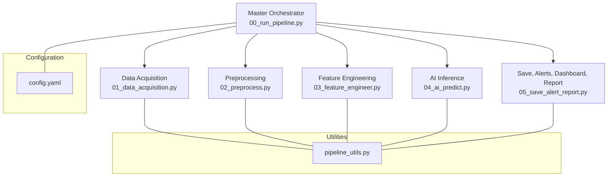
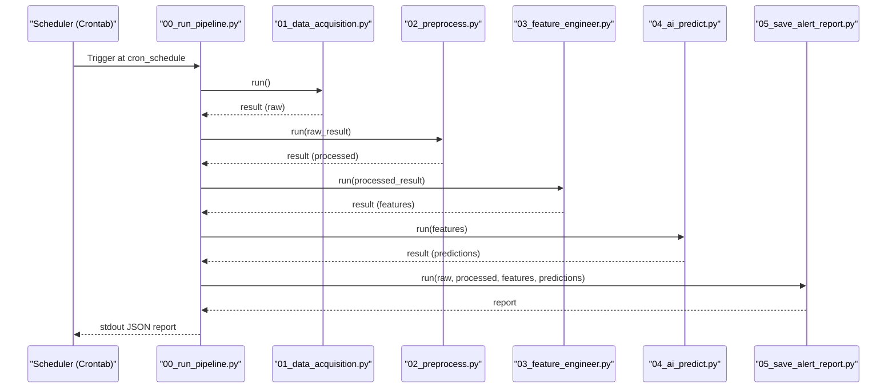
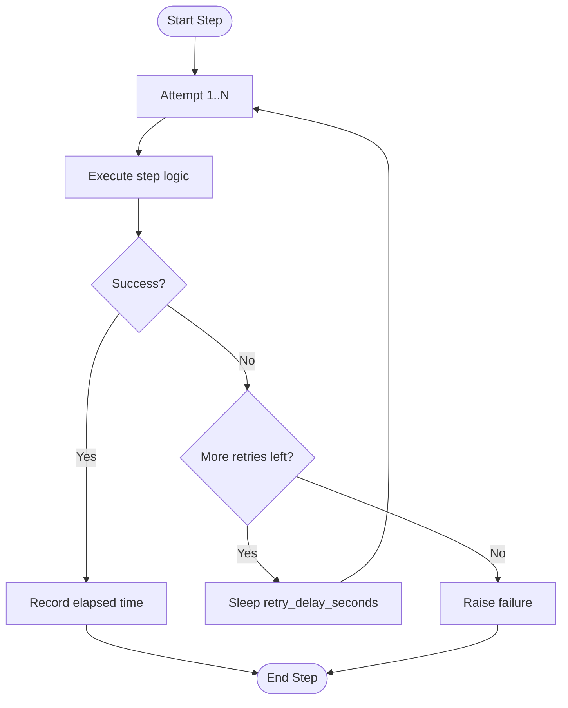
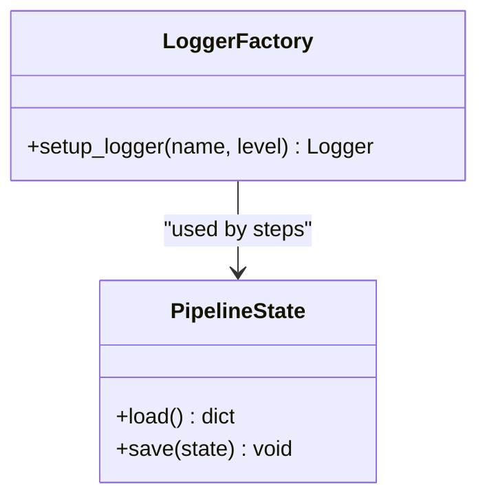
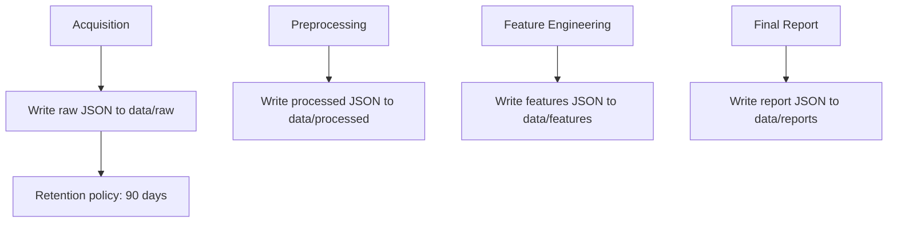
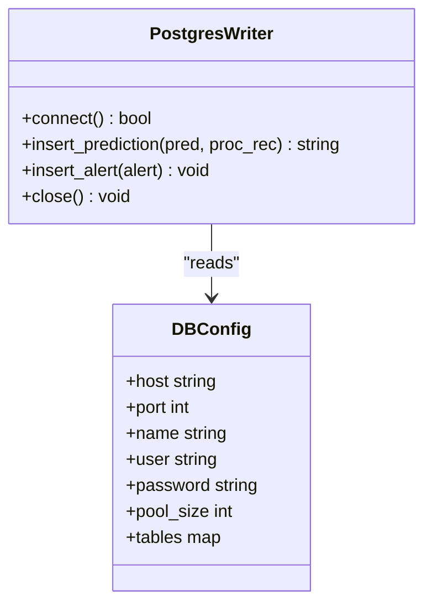
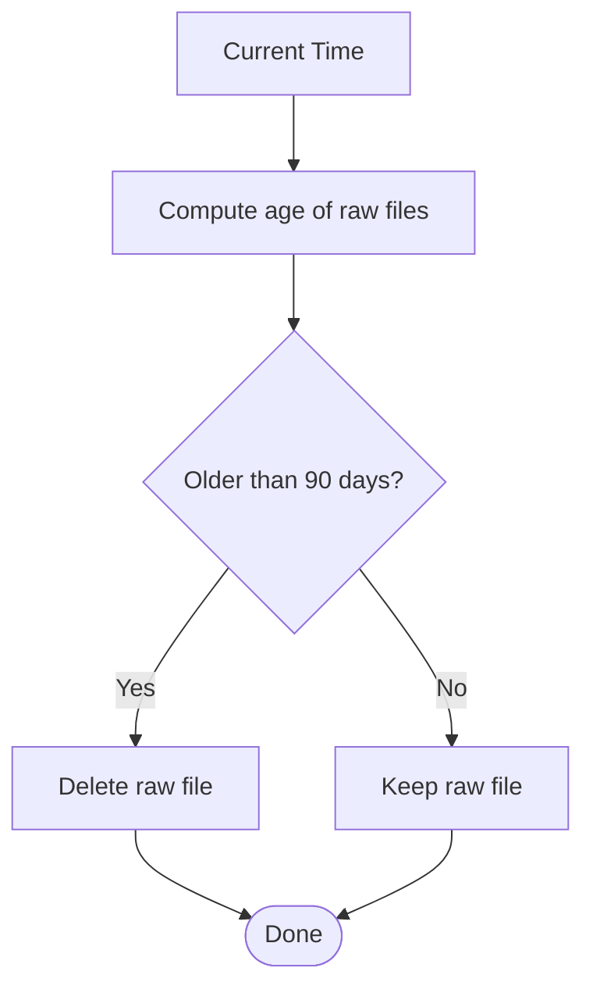
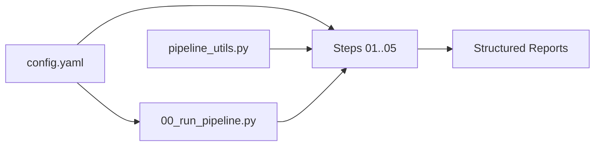

# Operational Settings

<cite>
**Referenced Files in This Document**
- [config.yaml](file://config.yaml)
- [00_run_pipeline.py](file://00_run_pipeline.py)
- [pipeline_utils.py](file://pipeline_utils.py)
- [README.md](file://README.md)
- [01_data_acquisition.py](file://01_data_acquisition.py)
- [02_preprocess.py](file://02_preprocess.py)
- [03_feature_engineer.py](file://03_feature_engineer.py)
- [04_ai_predict.py](file://04_ai_predict.py)
- [05_save_alert_report.py](file://05_save_alert_report.py)
</cite>

## Table of Contents
1. [Introduction](#introduction)
2. [Project Structure](#project-structure)
3. [Core Components](#core-components)
4. [Architecture Overview](#architecture-overview)
5. [Detailed Component Analysis](#detailed-component-analysis)
6. [Dependency Analysis](#dependency-analysis)
7. [Performance Considerations](#performance-considerations)
8. [Troubleshooting Guide](#troubleshooting-guide)
9. [Conclusion](#conclusion)
10. [Appendices](#appendices)

## Introduction
This document explains the operational pipeline settings for the Aditya-L1 Solar Flare Forecasting Pipeline. It covers scheduling, logging, storage, database connections, and maintenance parameters. It also provides practical guidance for customizing schedules, configuring logging levels, optimizing storage and retention, and setting up backups and monitoring.

## Project Structure
The pipeline is organized around a master orchestrator and modular steps. Configuration is centralized in a YAML file, and shared utilities handle logging, state persistence, and JSON I/O.

**Diagram sources**
- [00_run_pipeline.py:63-147](file://00_run_pipeline.py#L63-L147)
- [config.yaml:6-13](file://config.yaml#L6-L13)
- [pipeline_utils.py:17-22](file://pipeline_utils.py#L17-L22)

**Section sources**
- [README.md:7-32](file://README.md#L7-L32)
- [00_run_pipeline.py:1-24](file://00_run_pipeline.py#L1-L24)
- [config.yaml:6-13](file://config.yaml#L6-L13)

## Core Components
This section documents the operational settings defined in the configuration and how they are used across the pipeline.

- Scheduling
  - cron_schedule: "*/5 * * * *" — runs every 5 minutes
  - retrain_schedule: "0 2 * * *" — nightly retraining at 2 AM
- Logging
  - log_level: "INFO" — default logging level for all modules
- Retries and Backoff
  - max_retries: 3 — number of attempts per step
  - retry_delay_seconds: 30 — seconds to wait between retries
- Storage
  - raw_dir: "data/raw"
  - processed_dir: "data/processed"
  - features_dir: "data/features"
  - archive_days: 90 — retention period for raw data
- Database
  - host, port, name, user, password — resolved from environment variables
  - pool_size: 5 — connection pool size (note: actual pool usage depends on driver)
  - tables: mapped names for raw, processed features, predictions, alerts, and runs

These settings are loaded centrally and propagated to each step via shared utilities.

**Section sources**
- [config.yaml:9-13](file://config.yaml#L9-L13)
- [config.yaml:35-39](file://config.yaml#L35-L39)
- [config.yaml:91-104](file://config.yaml#L91-L104)
- [pipeline_utils.py:25-40](file://pipeline_utils.py#L25-L40)
- [00_run_pipeline.py:37-38](file://00_run_pipeline.py#L37-L38)

## Architecture Overview
The pipeline orchestrator coordinates eight steps. Each step reads configuration, logs at the configured level, and persists intermediate artifacts to disk. The final step writes predictions to PostgreSQL (when available) and emits a structured JSON report.

**Diagram sources**
- [00_run_pipeline.py:72-118](file://00_run_pipeline.py#L72-L118)
- [README.md:114-133](file://README.md#L114-L133)

## Detailed Component Analysis

### Scheduling and Retries
- cron_schedule controls the master orchestrator’s execution cadence.
- retrain_schedule is documented in the README for nightly model retraining.
- The orchestrator applies a retry loop per step with max_retries and retry_delay_seconds.

**Diagram sources**
- [00_run_pipeline.py:41-61](file://00_run_pipeline.py#L41-L61)
- [config.yaml:12-13](file://config.yaml#L12-L13)

**Section sources**
- [config.yaml:9-13](file://config.yaml#L9-L13)
- [00_run_pipeline.py:41-61](file://00_run_pipeline.py#L41-L61)
- [README.md:128-132](file://README.md#L128-L132)

### Logging Configuration
- All modules use a shared logger factory that sets the level from configuration.
- Logs are written to both console and a daily rotating file under logs/.

**Diagram sources**
- [pipeline_utils.py:43-64](file://pipeline_utils.py#L43-L64)
- [00_run_pipeline.py:37-38](file://00_run_pipeline.py#L37-L38)

**Section sources**
- [pipeline_utils.py:43-64](file://pipeline_utils.py#L43-L64)
- [config.yaml:11](file://config.yaml#L11](file://config.yaml#L11)

### Storage and Archive Retention
- Raw data is stored under data/raw, processed under data/processed, and features under data/features.
- Archive retention for raw data is configured as 90 days.
- Steps create output files named with timestamps and persist them to their respective directories.

**Diagram sources**
- [config.yaml:36-39](file://config.yaml#L36-L39)
- [01_data_acquisition.py:441-442](file://01_data_acquisition.py#L441-L442)
- [02_preprocess.py:380-389](file://02_preprocess.py#L380-L389)
- [03_feature_engineer.py:233-235](file://03_feature_engineer.py#L233-L235)
- [README.md:26-31](file://README.md#L26-L31)

**Section sources**
- [config.yaml:35-39](file://config.yaml#L35-L39)
- [01_data_acquisition.py:441-442](file://01_data_acquisition.py#L441-L442)
- [02_preprocess.py:380-389](file://02_preprocess.py#L380-L389)
- [03_feature_engineer.py:233-235](file://03_feature_engineer.py#L233-L235)
- [README.md:26-31](file://README.md#L26-L31)

### Database Connection Settings
- Host, port, database name, user, and password are resolved from environment variables.
- The pipeline creates tables on first run and writes predictions and alerts to PostgreSQL when available.
- pool_size is defined in configuration; actual pooling behavior depends on the PostgreSQL driver used.

**Diagram sources**
- [05_save_alert_report.py:118-141](file://05_save_alert_report.py#L118-L141)
- [config.yaml:91-104](file://config.yaml#L91-L104)

**Section sources**
- [config.yaml:91-104](file://config.yaml#L91-L104)
- [05_save_alert_report.py:118-141](file://05_save_alert_report.py#L118-L141)

### Maintenance Windows and Retention
- Retention for raw data is configured to 90 days.
- The orchestrator writes structured JSON reports to data/reports for downstream consumption.
- The README describes nightly retraining at 2 AM via a separate cron job.

**Diagram sources**
- [config.yaml:39](file://config.yaml#L39)
- [README.md:128-132](file://README.md#L128-L132)

**Section sources**
- [config.yaml:39](file://config.yaml#L39)
- [README.md:128-132](file://README.md#L128-L132)

## Dependency Analysis
The pipeline depends on configuration-driven settings and shared utilities. The orchestrator depends on configuration for scheduling and logging, while each step depends on configuration for storage paths and thresholds.

**Diagram sources**
- [config.yaml:6-13](file://config.yaml#L6-L13)
- [00_run_pipeline.py:37-38](file://00_run_pipeline.py#L37-L38)
- [pipeline_utils.py:17-22](file://pipeline_utils.py#L17-L22)

**Section sources**
- [config.yaml:6-13](file://config.yaml#L6-L13)
- [00_run_pipeline.py:37-38](file://00_run_pipeline.py#L37-L38)
- [pipeline_utils.py:17-22](file://pipeline_utils.py#L17-L22)

## Performance Considerations
- Retry backoff reduces thrashing during transient failures.
- Logging at INFO is suitable for production; DEBUG can be used for troubleshooting.
- Storage paths are created on demand; ensure adequate disk space for raw, processed, and features directories.
- PostgreSQL writes are idempotent; duplicates are ignored on conflict.

[No sources needed since this section provides general guidance]

## Troubleshooting Guide
- If PostgreSQL is unavailable, writes are simulated; verify driver installation and environment variables.
- If acquisition fails, check PRADAN credentials and network connectivity.
- If no new data is detected, the pipeline exits early; verify data sources and look-back windows.
- Adjust log_level to DEBUG for detailed diagnostics; logs rotate daily.

**Section sources**
- [05_save_alert_report.py:122-141](file://05_save_alert_report.py#L122-L141)
- [01_data_acquisition.py:70-87](file://01_data_acquisition.py#L70-L87)
- [00_run_pipeline.py:83-89](file://00_run_pipeline.py#L83-L89)
- [pipeline_utils.py:43-64](file://pipeline_utils.py#L43-L64)

## Conclusion
The pipeline’s operational settings are centralized in config.yaml and enforced consistently across steps. Scheduling, logging, storage, and database parameters are designed for reliability and observability. The provided examples show how to customize schedules, configure logging, and manage storage and retention.

[No sources needed since this section summarizes without analyzing specific files]

## Appendices

### Customizing Schedules
- cron_schedule: Modify to adjust acquisition cadence (e.g., every minute or every 15 minutes).
- retrain_schedule: Adjust nightly retraining time to align with maintenance windows.

**Section sources**
- [config.yaml:9-10](file://config.yaml#L9-L10)
- [README.md:128-132](file://README.md#L128-L132)

### Configuring Logging Levels
- log_level: Set to INFO for production, DEBUG for development and diagnostics.

**Section sources**
- [config.yaml:11](file://config.yaml#L11)
- [pipeline_utils.py:43-46](file://pipeline_utils.py#L43-L46)

### Optimizing Storage and Retention
- raw_dir, processed_dir, features_dir: Ensure sufficient disk space and permissions.
- archive_days: Align retention with compliance and storage budgets.

**Section sources**
- [config.yaml:36-39](file://config.yaml#L36-L39)

### Backup Strategies
- Back up PostgreSQL tables regularly using pg_dump or equivalent.
- Back up pipeline artifacts in data/ and logs/ directories to offsite storage.

**Section sources**
- [05_save_alert_report.py:49-116](file://05_save_alert_report.py#L49-L116)
- [README.md:26-31](file://README.md#L26-L31)

### Maintenance Windows and Monitoring
- Schedule maintenance windows aligned with retrain_schedule.
- Monitor logs in logs/, alerts via configured channels, and database health.

**Section sources**
- [README.md:128-132](file://README.md#L128-L132)
- [05_save_alert_report.py:267-297](file://05_save_alert_report.py#L267-L297)