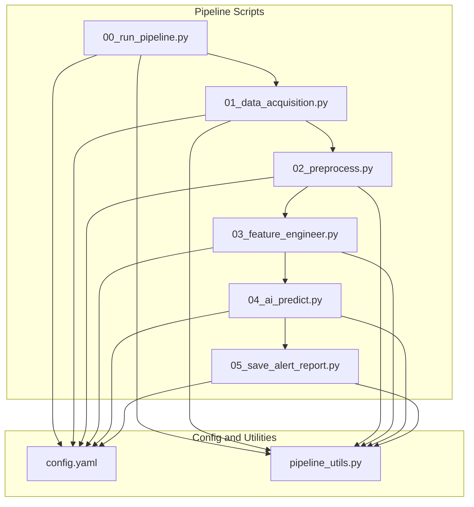
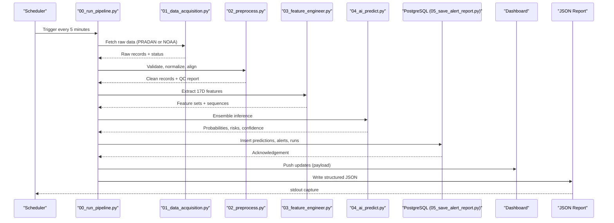
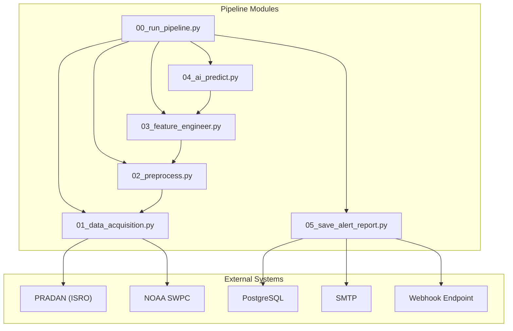

# Data Models and Schemas

<cite>
**Referenced Files in This Document**
- [README.md](file://README.md)
- [config.yaml](file://config.yaml)
- [pipeline_utils.py](file://pipeline_utils.py)
- [00_run_pipeline.py](file://00_run_pipeline.py)
- [01_data_acquisition.py](file://01_data_acquisition.py)
- [02_preprocess.py](file://02_preprocess.py)
- [03_feature_engineer.py](file://03_feature_engineer.py)
- [04_ai_predict.py](file://04_ai_predict.py)
- [05_save_alert_report.py](file://05_save_alert_report.py)
</cite>

## Table of Contents
1. [Introduction](#introduction)
2. [Project Structure](#project-structure)
3. [Core Components](#core-components)
4. [Architecture Overview](#architecture-overview)
5. [Detailed Component Analysis](#detailed-component-analysis)
6. [Dependency Analysis](#dependency-analysis)
7. [Performance Considerations](#performance-considerations)
8. [Troubleshooting Guide](#troubleshooting-guide)
9. [Conclusion](#conclusion)
10. [Appendices](#appendices)

## Introduction
This document provides comprehensive data model documentation for the Aditya-L1 Solar Flare Forecasting Pipeline. It covers:
- Raw observation record schema for SoLEXS and HEL1OS data formats, timestamps, and quality flags
- Processed feature vector structure (17-dimensional), normalization schemes, and data types
- Prediction output schema including probability distributions, confidence scores, and classification results
- PostgreSQL database schema with automatic table creation, indexing strategies, and relationships
- JSON report format with standardized fields, data types, and validation rules
- Data lifecycle management including retention policies, archival procedures, and historical analysis support
- Data validation rules, integrity constraints, and transformation pipelines between different data formats

## Project Structure
The pipeline is organized as a sequence of modular scripts orchestrated by a master runner. Configuration is centralized in a YAML file, and shared utilities handle logging, state persistence, and classification helpers.

**Diagram sources**
- [00_run_pipeline.py:1-146](file://00_run_pipeline.py#L1-L146)
- [config.yaml:1-104](file://config.yaml#L1-L104)
- [pipeline_utils.py:1-123](file://pipeline_utils.py#L1-L123)

**Section sources**
- [00_run_pipeline.py:1-146](file://00_run_pipeline.py#L1-L146)
- [config.yaml:1-104](file://config.yaml#L1-L104)
- [pipeline_utils.py:1-123](file://pipeline_utils.py#L1-L123)

## Core Components
- Raw Observation Records: Structured dictionaries containing SoLEXS and HEL1OS measurements, timestamps, and quality flags. Supports both native PRADAN L1 FITS and NOAA SWPC fallback modes.
- Processed Features: Clean, normalized, and aligned records suitable for AI modeling, including derived HEL1OS counts and ancillary space weather parameters.
- Feature Vectors: 17-dimensional vectors for each observation, including temporal statistics and normalized physical quantities.
- Predictions: Multi-output forecasts including class probabilities, CME risk, geomagnetic storm likelihood, confidence scores, and onset estimates.
- PostgreSQL Schema: Automatic creation of tables for raw observations, processed features, predictions, alerts, and pipeline runs with indexes for efficient querying.
- JSON Reports: Canonical structured output for automation and dashboards, including thresholds, actions, and system health indicators.

**Section sources**
- [01_data_acquisition.py:1-458](file://01_data_acquisition.py#L1-L458)
- [02_preprocess.py:1-422](file://02_preprocess.py#L1-L422)
- [03_feature_engineer.py:1-265](file://03_feature_engineer.py#L1-L265)
- [04_ai_predict.py:1-466](file://04_ai_predict.py#L1-L466)
- [05_save_alert_report.py:1-507](file://05_save_alert_report.py#L1-L507)
- [README.md:137-228](file://README.md#L137-L228)

## Architecture Overview
End-to-end data flow from acquisition to reporting and persistence.

**Diagram sources**
- [00_run_pipeline.py:63-142](file://00_run_pipeline.py#L63-L142)
- [01_data_acquisition.py:350-452](file://01_data_acquisition.py#L350-L452)
- [02_preprocess.py:230-409](file://02_preprocess.py#L230-L409)
- [03_feature_engineer.py:199-249](file://03_feature_engineer.py#L199-L249)
- [04_ai_predict.py:402-448](file://04_ai_predict.py#L402-L448)
- [05_save_alert_report.py:452-502](file://05_save_alert_report.py#L452-L502)

## Detailed Component Analysis

### Raw Observation Record Schema
Raw records originate from either PRADAN L1 FITS or NOAA SWPC fallback. They include:
- Instrument identifiers and source metadata
- SoLEXS measurements: band fluxes, peak flux, derivatives, and timeseries
- HEL1OS measurements: count rates across energy bands
- Ancillary parameters: Kp index, solar wind speed/density, IMF Bz
- Quality flags and checksums for deduplication
- Timestamps and optional quality flags arrays

Key characteristics:
- Timestamps are ISO 8601 UTC strings
- SoLEXS bands include 1–8 Å, 0.5–4 Å, and 8–20 Å
- HEL1OS bands include 20–60 keV, 60–100 keV, 100–300 keV, and 300–1000 keV
- Quality flags indicate data validity for each time bin
- NOAA fallback records combine GOES XRS proxies and derived HEL1OS counts

Normalization and transformations:
- Timeseries are cleaned via sigma clipping and linear interpolation
- Flux values are log10 transformed and min-max scaled to [0,1]
- HEL1OS counts are derived from SoLEXS flux and spectral ratio when native data is unavailable

Retention and archival:
- Raw JSON files are stored under a dedicated directory and retained for a configurable number of days

**Section sources**
- [01_data_acquisition.py:145-193](file://01_data_acquisition.py#L145-L193)
- [01_data_acquisition.py:222-324](file://01_data_acquisition.py#L222-L324)
- [01_data_acquisition.py:331-452](file://01_data_acquisition.py#L331-L452)
- [02_preprocess.py:45-120](file://02_preprocess.py#L45-L120)
- [02_preprocess.py:126-224](file://02_preprocess.py#L126-L224)
- [config.yaml:35-40](file://config.yaml#L35-L40)

### Processed Feature Vector Structure
After preprocessing, each record becomes a normalized, validated dictionary with:
- SoLEXS normalized fields: log10 flux, peak over 60 min, ratios, rise/acceleration
- HEL1OS normalized fields: log10 count rates, hard/soft ratios, spectral index
- Ancillary normalized fields: Kp, solar wind speed/density, IMF Bz
- Temporal statistics: percentile rank, rolling mean/std dev over 15-min windows

The 17-dimensional vector is composed as:
- [0] log10 soft flux
- [1] log10 soft peak 60min
- [2] log10 soft 0.5–4A
- [3] flux ratio short/long
- [4] dF/dt normalized
- [5] d2F/dt2 normalized
- [6] log10 hard 20–60 keV
- [7] log10 hard 60–100 keV
- [8] hard/soft ratio
- [9] spectral gamma normalized
- [10] Kp normalized
- [11] solar wind speed normalized
- [12] solar wind density normalized
- [13] IMF Bz normalized
- [14] flux percentile in 24h
- [15] rolling mean normalized (15-min)
- [16] rolling std dev (15-min)

Normalization schemes:
- Log10 transform for fluxes and hard X-ray counts, followed by min-max scaling to [0,1]
- Ratio-based features are clipped to [0,1]
- Derivatives are normalized by characteristic scales
- Rolling statistics normalize mean by log10 flux and std by mean

Sequences for temporal models:
- A (60, 17) tensor is constructed by replicating scalar features along the time axis and overriding the first channel with the actual time-varying flux

**Section sources**
- [README.md:151-172](file://README.md#L151-L172)
- [03_feature_engineer.py:52-193](file://03_feature_engineer.py#L52-L193)
- [03_feature_engineer.py:199-249](file://03_feature_engineer.py#L199-L249)

### Prediction Output Schema
The ensemble predictor produces:
- Predicted flare class (A/B/C/M/X)
- Predicted flux class (e.g., M3.2)
- Class probabilities (A, B, C, M, X)
- Flare probability (C or above)
- M-class and X-class probabilities
- CME probability (association with coronal mass ejections)
- Geomagnetic storm risk and label
- Confidence score derived from prediction entropy
- Estimated onset time and onset window
- Model outputs and weights used

Quality flags and thresholds:
- Thresholds for critical/warning/high-risk/storm/watch levels are configurable
- Alerts are generated when any metric exceeds its threshold

**Section sources**
- [04_ai_predict.py:246-395](file://04_ai_predict.py#L246-L395)
- [04_ai_predict.py:402-448](file://04_ai_predict.py#L402-L448)
- [README.md:175-185](file://README.md#L175-L185)

### PostgreSQL Database Schema
The pipeline creates and maintains the following tables on first run (idempotent):

- pipeline_runs
  - Purpose: Track each pipeline run
  - Columns: run_id (PK), run_time (TIMESTAMPTZ), source_used, records_fetched, pipeline_status, elapsed_s, warnings (JSONB)
  - Indexes: None (run-level aggregation)

- solexs_hel1os_raw
  - Purpose: Store raw L1 observations
  - Columns: obs_id (PK), obs_time (TIMESTAMPTZ), source, SoLEXS and HEL1OS numeric fields, ancillary values, raw_json (JSONB)
  - Notes: JSONB stores the original raw record for audit and replay

- flare_predictions
  - Purpose: Store AI predictions
  - Columns: pred_id (PK), obs_time (TIMESTAMPTZ), prediction_time (TIMESTAMPTZ), source, predicted_class, predicted_flux_class, flare_probability, m_class_probability, x_class_probability, cme_probability, geomagnetic_risk, geomagnetic_label, confidence_score, estimated_onset_utc (TIMESTAMPTZ), class_probs_json (JSONB), model_outputs_json (JSONB)
  - Indexes: obs_time DESC (for recent-first queries)

- flare_alerts
  - Purpose: Store fired alerts
  - Columns: alert_id (PK), pred_id (FK to flare_predictions), alert_time (TIMESTAMPTZ), severity, threshold_name, threshold_value, actual_value, message, dispatched (BOOLEAN)
  - Indexes: severity (for filtering by severity)

Constraints and relationships:
- Foreground keys: flare_alerts.pred_id → flare_predictions.pred_id
- Unique constraints: Primary keys on all tables
- JSONB fields enable flexible storage of structured outputs for downstream analytics

Automatic creation and simulation:
- On first run, the writer connects to PostgreSQL and executes the CREATE TABLE statements
- If psycopg2 is unavailable, writes are simulated and logged

Indexing strategies:
- Primary keys are implicit via PRIMARY KEY declarations
- Additional indexes are created for frequent time-range queries and severity filtering

**Section sources**
- [05_save_alert_report.py:47-116](file://05_save_alert_report.py#L47-L116)
- [05_save_alert_report.py:118-216](file://05_save_alert_report.py#L118-L216)

### JSON Report Format
The canonical JSON report includes:
- Run metadata: run_id, timestamp, pipeline_version, elapsed_seconds, pipeline_status
- Data acquisition: source_used, data_points_processed, status
- Data quality: records_validated, records_passed, warnings
- Prediction outputs: timestamp, data_points_processed, flare_probability, predicted_flare_class, predicted_flux_class, class_probabilities (percentages), cme_probability, geomagnetic_risk, geomagnetic_risk_score, confidence_score, estimated_onset_utc, onset_window_minutes
- AI ensemble: models, weights
- Alerts: alert_status, active_alerts, recommended_action
- Threshold evaluation: boolean flags for configured thresholds
- System health: pipeline_ok, prediction_id, db_write, dashboard

Validation rules:
- Percentages are formatted as "XX.X%"
- Confidence and risk scores are percentages
- Onset time is ISO 8601 UTC
- Severity labels are standardized

**Section sources**
- [README.md:206-228](file://README.md#L206-L228)
- [05_save_alert_report.py:340-425](file://05_save_alert_report.py#L340-L425)

### Data Lifecycle Management
- Retention policy: Raw data is retained for a configurable number of days
- Archival procedures: Not explicitly implemented; raw files are stored under a dedicated directory
- Historical analysis support: Predictions and alerts are persisted in PostgreSQL with indexes enabling time-range queries
- Integrity constraints: Unique keys prevent duplicates; JSONB enables auditability; checksums prevent duplicate processing

**Section sources**
- [config.yaml:35-40](file://config.yaml#L35-L40)
- [01_data_acquisition.py:331-452](file://01_data_acquisition.py#L331-L452)
- [05_save_alert_report.py:47-116](file://05_save_alert_report.py#L47-L116)

### Data Validation Rules and Transformation Pipelines
- Validation rules:
  - Presence of obs_time
  - Flux ranges for SoLEXS and NOAA proxies
  - Minimum cadence for timeseries
  - Gap detection and warnings
- Transformation pipelines:
  - Sigma clipping to remove outliers
  - Linear interpolation for missing values
  - Log10 normalization followed by min-max scaling
  - Spectral model derivation of HEL1OS counts from SoLEXS flux and ratio
  - Time synchronization tolerance for instrument alignment

**Section sources**
- [02_preprocess.py:45-120](file://02_preprocess.py#L45-L120)
- [02_preprocess.py:126-224](file://02_preprocess.py#L126-L224)
- [02_preprocess.py:230-409](file://02_preprocess.py#L230-L409)
- [03_feature_engineer.py:52-193](file://03_feature_engineer.py#L52-L193)

## Dependency Analysis
High-level dependencies among pipeline components and external systems.

**Diagram sources**
- [00_run_pipeline.py:72-113](file://00_run_pipeline.py#L72-L113)
- [01_data_acquisition.py:49-144](file://01_data_acquisition.py#L49-L144)
- [01_data_acquisition.py:199-324](file://01_data_acquisition.py#L199-L324)
- [05_save_alert_report.py:24-31](file://05_save_alert_report.py#L24-L31)
- [05_save_alert_report.py:267-298](file://05_save_alert_report.py#L267-L298)

**Section sources**
- [00_run_pipeline.py:1-146](file://00_run_pipeline.py#L1-L146)
- [01_data_acquisition.py:1-458](file://01_data_acquisition.py#L1-L458)
- [05_save_alert_report.py:1-507](file://05_save_alert_report.py#L1-L507)

## Performance Considerations
- Data ingestion cadence: Every 5 minutes via cron
- Memory footprint: Feature extraction and prediction operate on compact arrays; sequences are fixed-length tensors
- Network latency: PRADAN and NOAA endpoints introduce variability; timeouts and retries are handled in acquisition
- Database writes: Batched inserts are idempotent; JSONB storage allows flexible querying but may increase storage overhead
- Model inference: Ensemble weights balance accuracy and speed; surrogate models ensure operation without trained weights

[No sources needed since this section provides general guidance]

## Troubleshooting Guide
Common issues and remedies:
- Missing credentials: PRADAN login failures lead to fallback to NOAA; verify environment variables
- Data source unavailability: Acquisition fails if both PRADAN and NOAA are unreachable; check connectivity and timeouts
- PostgreSQL not installed: Writes are simulated; install psycopg2-binary to enable persistence
- No new data: Deduplication detects identical records; wait for fresh data or adjust checksum logic
- Prediction errors: Surrogate models are used when trained weights are absent; ensure model files are present

**Section sources**
- [01_data_acquisition.py:69-87](file://01_data_acquisition.py#L69-L87)
- [01_data_acquisition.py:402-407](file://01_data_acquisition.py#L402-L407)
- [05_save_alert_report.py:121-141](file://05_save_alert_report.py#L121-L141)
- [03_feature_engineer.py:199-249](file://03_feature_engineer.py#L199-L249)

## Conclusion
The pipeline defines robust data models and schemas for SoLEXS/HEL1OS observations, normalized features, and AI-driven predictions. PostgreSQL tables are created automatically with indexes tailored for operational queries. The JSON report provides a standardized interface for automation and dashboards. Validation and transformation pipelines ensure data integrity, while retention and archival policies support historical analysis.

[No sources needed since this section summarizes without analyzing specific files]

## Appendices

### Appendix A: Raw Observation Record Fields
- Instrument: SoLEXS or HEL1OS
- Source: PRADAN_L1_FITS, NOAA_SWPC_GOES_XRS, NOAA_SWPC, or derived proxies
- SoLEXS fields: band_1_8A_Wm2, band_0_4A_Wm2, band_8_20A_Wm2, peak_flux_60min_Wm2, dF_dt_Wm2s, d2F_dt2_Wm2s2, flux_ratio_short_long, timeseries_* arrays
- HEL1OS fields: band_20_60keV, band_60_100keV, band_100_300keV, band_300_1000keV, spectral_gamma, hardness_factor
- Ancillary: kp_index, solar_wind_speed_km_s, solar_wind_density_n_cc, imf_bz_nT
- Quality flags: optional arrays indicating data validity per time bin
- Timestamps: obs_time (UTC), timestamps for timeseries

**Section sources**
- [01_data_acquisition.py:145-193](file://01_data_acquisition.py#L145-L193)
- [02_preprocess.py:299-337](file://02_preprocess.py#L299-L337)

### Appendix B: Processed Record Fields
- Normalized SoLEXS: band_1_8A_Wm2, band_0_4A_Wm2, peak_flux_60min_Wm2, dF_dt_Wm2s, d2F_dt2_Wm2s2, flux_ratio_short_long, timeseries_* (normalized)
- Derived HEL1OS: band_20_60keV, band_60_100keV, band_100_300keV, band_300_1000keV, spectral_gamma, hardness_factor
- Ancillary: kp_index, solar_wind_speed_km_s, solar_wind_density_n_cc, imf_bz_nT
- QC: validity, interpolated percentage, gaps, instrument_sync

**Section sources**
- [02_preprocess.py:299-337](file://02_preprocess.py#L299-L337)

### Appendix C: Feature Vector Index Mapping
- Index 0: log10_soft_flux
- Index 1: log10_soft_peak_60min
- Index 2: log10_soft_0_4A
- Index 3: flux_ratio_short_long
- Index 4: dF_dt_norm
- Index 5: d2F_dt2_norm
- Index 6: log10_hard_20_60keV
- Index 7: log10_hard_60_100keV
- Index 8: flux_ratio_hard_soft
- Index 9: spectral_gamma_norm
- Index 10: kp_index_norm
- Index 11: solar_wind_speed_norm
- Index 12: solar_wind_density_norm
- Index 13: imf_bz_norm
- Index 14: flux_percentile_24h
- Index 15: rolling_mean_norm_15min
- Index 16: rolling_std_15min

**Section sources**
- [README.md:151-172](file://README.md#L151-L172)
- [03_feature_engineer.py:172-181](file://03_feature_engineer.py#L172-L181)

### Appendix D: Prediction Output Fields
- predicted_flare_class: A/B/C/M/X
- predicted_flux_class: e.g., M3.2
- class_probabilities: A, B, C, M, X (percentages)
- flare_probability: C or above
- m_class_probability: M or X
- x_class_probability: X
- cme_probability: CME association
- geomagnetic_risk: score
- geomagnetic_storm_label: G-level
- confidence_score: entropy-derived
- estimated_onset_utc: ISO 8601 UTC
- onset_window_minutes: [low, high]
- model_outputs: per-model probabilities
- ensemble_weights: applied weights

**Section sources**
- [04_ai_predict.py:310-395](file://04_ai_predict.py#L310-L395)

### Appendix E: PostgreSQL Schema Details
- pipeline_runs: run_id (PK), run_time, source_used, records_fetched, pipeline_status, elapsed_s, warnings (JSONB)
- solexs_hel1os_raw: obs_id (PK), obs_time, source, numeric fields, raw_json (JSONB)
- flare_predictions: pred_id (PK), obs_time, prediction_time, source, predicted_class, predicted_flux_class, probabilities, risks, confidence_score, estimated_onset_utc, class_probs_json (JSONB), model_outputs_json (JSONB)
- flare_alerts: alert_id (PK), pred_id (FK), alert_time, severity, threshold_name, threshold_value, actual_value, message, dispatched

Indexes:
- idx_pred_obs_time: obs_time DESC
- idx_alert_severity: severity

**Section sources**
- [05_save_alert_report.py:47-116](file://05_save_alert_report.py#L47-L116)

### Appendix F: JSON Report Fields
- run_id, timestamp, pipeline_version, elapsed_seconds, pipeline_status
- data_acquisition: source_used, data_points_processed, status
- data_quality: records_validated, records_passed, warnings
- timestamp, data_points_processed, flare_probability, predicted_flare_class, predicted_flux_class, class_probabilities, cme_probability, geomagnetic_risk, geomagnetic_risk_score, confidence_score, estimated_onset_utc, onset_window_minutes
- ai_ensemble: models, weights
- alert_status, active_alerts, recommended_action
- threshold_evaluation: boolean flags
- system_health: pipeline_ok, prediction_id, db_write, dashboard

**Section sources**
- [README.md:206-228](file://README.md#L206-L228)
- [05_save_alert_report.py:340-425](file://05_save_alert_report.py#L340-L425)