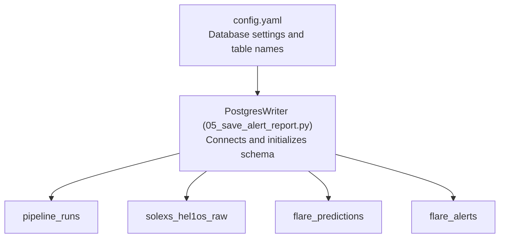
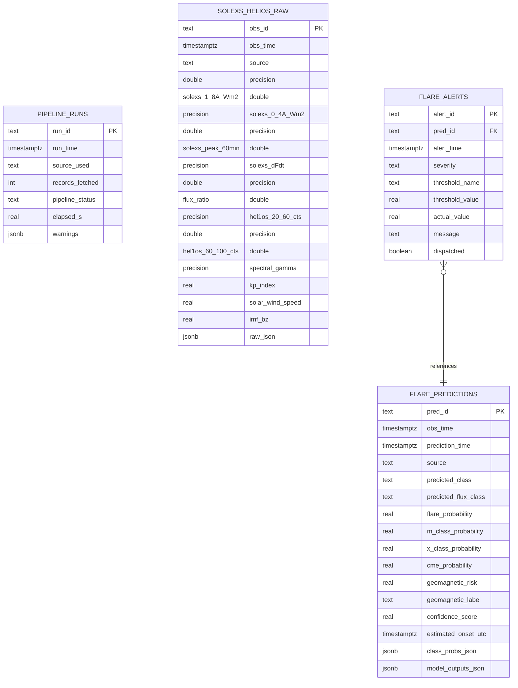
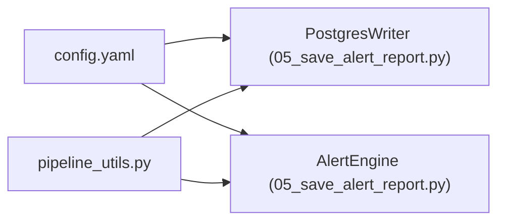

# Database Schema

<cite>
**Referenced Files in This Document**
- [config.yaml](file://config.yaml)
- [05_save_alert_report.py](file://05_save_alert_report.py)
- [pipeline_utils.py](file://pipeline_utils.py)
</cite>

## Table of Contents
1. [Introduction](#introduction)
2. [Project Structure](#project-structure)
3. [Core Components](#core-components)
4. [Architecture Overview](#architecture-overview)
5. [Detailed Component Analysis](#detailed-component-analysis)
6. [Dependency Analysis](#dependency-analysis)
7. [Performance Considerations](#performance-considerations)
8. [Troubleshooting Guide](#troubleshooting-guide)
9. [Conclusion](#conclusion)
10. [Appendices](#appendices)

## Introduction
This document describes the PostgreSQL schema used by the Aditya-L1 Solar Flare Forecasting Pipeline. It focuses on four main tables:
- pipeline_runs: Execution tracking for pipeline runs
- solexs_hel1os_raw: Original L1 observations (SoLEXS + HEL1OS) plus auxiliary space weather indices
- flare_predictions: Model outputs and probabilities
- flare_alerts: Alert notifications fired against predictions

It documents table structures, primary keys, foreign keys, data types, constraints, automatic schema creation, idempotent initialization, indexing strategies, JSONB usage, time-series query patterns, and migration considerations.

## Project Structure
The database schema is initialized and used by the pipeline’s step 5–8 script. Configuration for database credentials and table names is centralized in the configuration file.

**Diagram sources**
- [config.yaml:91-103](file://config.yaml#L91-L103)
- [05_save_alert_report.py:47-116](file://05_save_alert_report.py#L47-L116)

**Section sources**
- [config.yaml:91-103](file://config.yaml#L91-L103)
- [05_save_alert_report.py:47-116](file://05_save_alert_report.py#L47-L116)

## Core Components
- PostgresWriter: Manages database connection, creates tables and indexes, inserts predictions and alerts.
- AlertEngine: Evaluates predictions against thresholds and generates alerts.
- Configuration: Provides database credentials and table names.

Key behaviors:
- Automatic schema creation on first run using idempotent statements.
- JSONB columns for flexible storage of structured outputs.
- Indexes optimized for time-series queries and alert filtering.
- Conflict handling to prevent duplicate writes.

**Section sources**
- [05_save_alert_report.py:47-116](file://05_save_alert_report.py#L47-L116)
- [config.yaml:91-103](file://config.yaml#L91-L103)

## Architecture Overview
The pipeline writes predictions and alerts into PostgreSQL. Alerts reference predictions via a foreign key. Indexes support frequent time-range and severity-based queries.

**Diagram sources**
- [05_save_alert_report.py:50-116](file://05_save_alert_report.py#L50-L116)

## Detailed Component Analysis

### pipeline_runs
Purpose: Track each pipeline run lifecycle, including timing, source used, fetched record count, status, elapsed time, and warnings captured during the run.

Schema highlights:
- Primary key: run_id
- Data types: text, timestamptz, integer, text, real, jsonb
- Constraints: NOT NULL on run_time; JSONB for warnings
- Idempotent creation: CREATE TABLE IF NOT EXISTS

Typical usage:
- Inserted at the start of a run with run_id, run_time, and other metadata.
- Updated later with pipeline_status and elapsed_s.

Indexing:
- Not explicitly indexed in the initialization script; consider adding an index on run_time for chronological queries.

**Section sources**
- [05_save_alert_report.py:50-59](file://05_save_alert_report.py#L50-L59)

### solexs_hel1os_raw
Purpose: Store original L1 observations and auxiliary space weather indices for SoLEXS and HEL1OS instruments.

Schema highlights:
- Primary key: obs_id
- Data types: text, timestamptz, numeric (double precision and real)
- Instrumental fields: SoLEXS band fluxes, peak flux over 60 minutes, derivative, flux ratio; HEL1OS counts for multiple energy channels; spectral gamma
- Auxiliary indices: kp_index, solar_wind_speed, imf_bz
- Flexible storage: raw_json (JSONB) for unstructured or evolving payloads
- Constraints: NOT NULL on obs_time; JSONB for raw_json

Typical usage:
- Inserted after data acquisition and preprocessing.
- Supports time-series analysis via obs_time.

Indexing:
- No explicit indexes in initialization; consider indexing obs_time for time-range queries.

**Section sources**
- [05_save_alert_report.py:61-78](file://05_save_alert_report.py#L61-L78)

### flare_predictions
Purpose: Persist model outputs and derived metrics for each observation time window.

Schema highlights:
- Primary key: pred_id
- Data types: text, timestamptz, real, jsonb
- Predictions: predicted class, predicted flux class, probabilities for C-, M-, X-class flares, CME probability, geomagnetic risk and label, confidence score, estimated onset time
- Flexible storage: class_probs_json and model_outputs_json (JSONB)
- Constraints: NOT NULL on obs_time and prediction_time; JSONB for structured outputs
- Idempotent creation: CREATE TABLE IF NOT EXISTS

Typical usage:
- Inserted after AI prediction step.
- Used to evaluate thresholds and generate alerts.

Indexing:
- Index on obs_time (descending) for efficient time-range queries.

**Section sources**
- [05_save_alert_report.py:80-98](file://05_save_alert_report.py#L80-L98)

### flare_alerts
Purpose: Record alerts triggered when model outputs exceed configured thresholds.

Schema highlights:
- Primary key: alert_id
- Foreign key: pred_id references flare_predictions(pred_id)
- Data types: text, timestamptz, real, boolean
- Fields: alert_time, severity, threshold_name, threshold_value, actual_value, message, dispatched
- Constraints: NOT NULL on alert_time; DEFAULT FALSE on dispatched
- Idempotent creation: CREATE TABLE IF NOT EXISTS

Typical usage:
- Inserted after evaluating thresholds.
- Dispatched to configured channels (log/email/webhook).

Indexing:
- Index on severity for filtering by alert level.

**Section sources**
- [05_save_alert_report.py:100-111](file://05_save_alert_report.py#L100-L111)

### Automatic Schema Creation and Idempotency
- Initialization SQL is embedded in the writer class and executed on first connect.
- Uses CREATE TABLE IF NOT EXISTS for all tables.
- Creates indexes for time-series and severity filtering.
- Ensures idempotency by avoiding errors if tables already exist.

Operational flow:
- On instantiation, PostgresWriter attempts to connect to the database.
- Executes the CREATE TABLES statement.
- Commits the transaction and logs readiness.

**Section sources**
- [05_save_alert_report.py:47-116](file://05_save_alert_report.py#L47-L116)

### Index Strategies for Performance
- Index on flare_predictions(obs_time DESC): Optimizes time-range queries and chronological ordering.
- Index on flare_alerts(severity): Optimizes filtering by alert severity.

These indexes align with typical analytical workloads:
- Aggregating recent predictions by time windows
- Filtering alerts by severity for operational dashboards

**Section sources**
- [05_save_alert_report.py:113-116](file://05_save_alert_report.py#L113-L116)

### JSONB Column Usage
- class_probs_json: Stores per-class probability distributions.
- model_outputs_json: Stores raw outputs from individual models.
- raw_json: Stores original instrument payload or evolving structures.

Benefits:
- Flexible schema evolution without altering fixed columns.
- Efficient storage and querying of semi-structured data.
- Allows downstream analytics to extract and transform as needed.

Considerations:
- Use appropriate GIN or specialized JSONB operators for complex queries.
- Consider decomposing frequently accessed subfields into typed columns if query patterns become stable.

**Section sources**
- [05_save_alert_report.py:80-98](file://05_save_alert_report.py#L80-L98)
- [05_save_alert_report.py:61-78](file://05_save_alert_report.py#L61-L78)

### Data Validation Rules and Constraints
- NOT NULL constraints on critical timestamps and counts ensure data quality.
- JSONB fields are validated by the application before insertion; malformed JSON will cause runtime errors.
- Unique constraints via primary keys prevent duplicates for pred_id and alert_id.
- Foreign key constraint ensures referential integrity between alerts and predictions.

Conflict handling:
- ON CONFLICT (pred_id) DO NOTHING prevents duplicate predictions.
- ON CONFLICT (alert_id) DO NOTHING prevents duplicate alerts.

**Section sources**
- [05_save_alert_report.py:154-181](file://05_save_alert_report.py#L154-L181)
- [05_save_alert_report.py:196-207](file://05_save_alert_report.py#L196-L207)
- [05_save_alert_report.py:100-111](file://05_save_alert_report.py#L100-L111)

### Referential Integrity
- flare_alerts.pred_id references flare_predictions.pred_id.
- Enforced by foreign key definition; maintains consistency between predictions and alerts.

Operational impact:
- Prevents orphaned alerts.
- Enables joins for alert-to-prediction analysis.

**Section sources**
- [05_save_alert_report.py:100-111](file://05_save_alert_report.py#L100-L111)

### Time-Series Query Patterns
Common queries:
- Retrieve recent predictions within a time window: ORDER BY obs_time DESC with LIMIT.
- Aggregate alerts by severity over a period: GROUP BY severity.
- Join alerts to predictions for detailed reporting.

Indexes support:
- obs_time descending on predictions
- severity on alerts

**Section sources**
- [05_save_alert_report.py:113-116](file://05_save_alert_report.py#L113-L116)

### Migration Procedures for Schema Evolution
Current state:
- Schema is initialized automatically on first run.
- No explicit migration scripts are present in the repository.

Recommended approach:
- Add a version field to pipeline_runs or a dedicated migrations table.
- Implement a migration runner that applies incremental changes.
- Preserve backward compatibility by adding new columns with defaults and populating historical rows where feasible.
- Use ALTER TABLE statements guarded by IF NOT EXISTS checks for idempotency.

[No sources needed since this section provides general guidance]

## Dependency Analysis
- PostgresWriter depends on configuration for database credentials and table names.
- AlertEngine depends on configuration thresholds and channels.
- The pipeline orchestrator invokes PostgresWriter to persist predictions and alerts.

**Diagram sources**
- [config.yaml:91-103](file://config.yaml#L91-L103)
- [05_save_alert_report.py:32-40](file://05_save_alert_report.py#L32-L40)
- [pipeline_utils.py:32-35](file://pipeline_utils.py#L32-L35)

**Section sources**
- [config.yaml:91-103](file://config.yaml#L91-L103)
- [05_save_alert_report.py:32-40](file://05_save_alert_report.py#L32-L40)
- [pipeline_utils.py:32-35](file://pipeline_utils.py#L32-L35)

## Performance Considerations
- Use indexes on frequently filtered or sorted columns:
  - obs_time on flare_predictions
  - severity on flare_alerts
- Consider partitioning large tables by time if ingestion volume grows substantially.
- Normalize JSONB fields into typed columns if specific subfields are queried often.
- Batch inserts and transactions reduce overhead for bulk writes.
- Connection pooling and timeouts are configured in the database settings.

[No sources needed since this section provides general guidance]

## Troubleshooting Guide
Common issues and resolutions:
- Connection failures: Verify database credentials and network connectivity; check timeout settings.
- Missing psycopg2: The writer falls back to simulation mode; install psycopg2 to enable writes.
- Duplicate entries: ON CONFLICT clauses prevent duplicates; ensure unique identifiers are generated correctly.
- JSON parsing errors: Validate JSON payloads before insertion; handle encoding issues in raw_json/class_probs_json/model_outputs_json.
- Foreign key violations: Ensure pred_id exists in flare_predictions before inserting alerts.

**Section sources**
- [05_save_alert_report.py:121-141](file://05_save_alert_report.py#L121-L141)
- [05_save_alert_report.py:154-181](file://05_save_alert_report.py#L154-L181)
- [05_save_alert_report.py:196-207](file://05_save_alert_report.py#L196-L207)

## Conclusion
The PostgreSQL schema for the Aditya-L1 SFF Pipeline is designed for reliability, flexibility, and performance. It uses idempotent initialization, JSONB for evolving data, and targeted indexes for time-series analytics. The foreign key relationship between alerts and predictions ensures referential integrity. As the pipeline evolves, adopt a migration strategy to safely evolve the schema while preserving data continuity.

[No sources needed since this section summarizes without analyzing specific files]

## Appendices

### Appendix A: Field Definitions and Types
- pipeline_runs
  - run_id: text (PK)
  - run_time: timestamptz (NOT NULL)
  - source_used: text
  - records_fetched: integer
  - pipeline_status: text
  - elapsed_s: real
  - warnings: jsonb

- solexs_hel1os_raw
  - obs_id: text (PK)
  - obs_time: timestamptz (NOT NULL)
  - source: text
  - solexs_1_8A_Wm2: double precision
  - solexs_0_4A_Wm2: double precision
  - solexs_peak_60min: double precision
  - solexs_dFdt: double precision
  - flux_ratio: double precision
  - hel1os_20_60_cts: double precision
  - hel1os_60_100_cts: double precision
  - spectral_gamma: double precision
  - kp_index: real
  - solar_wind_speed: real
  - imf_bz: real
  - raw_json: jsonb

- flare_predictions
  - pred_id: text (PK)
  - obs_time: timestamptz (NOT NULL)
  - prediction_time: timestamptz (NOT NULL)
  - source: text
  - predicted_class: text
  - predicted_flux_class: text
  - flare_probability: real
  - m_class_probability: real
  - x_class_probability: real
  - cme_probability: real
  - geomagnetic_risk: real
  - geomagnetic_label: text
  - confidence_score: real
  - estimated_onset_utc: timestamptz
  - class_probs_json: jsonb
  - model_outputs_json: jsonb

- flare_alerts
  - alert_id: text (PK)
  - pred_id: text (FK to flare_predictions.pred_id)
  - alert_time: timestamptz (NOT NULL)
  - severity: text
  - threshold_name: text
  - threshold_value: real
  - actual_value: real
  - message: text
  - dispatched: boolean (DEFAULT FALSE)

**Section sources**
- [05_save_alert_report.py:50-116](file://05_save_alert_report.py#L50-L116)

### Appendix B: Initialization and Connection Details
- Credentials are loaded from configuration and environment variables.
- Connection timeout is set; on failure, the writer logs an error and returns False.
- Schema creation is committed immediately upon successful connection.

**Section sources**
- [config.yaml:91-103](file://config.yaml#L91-L103)
- [05_save_alert_report.py:121-141](file://05_save_alert_report.py#L121-L141)