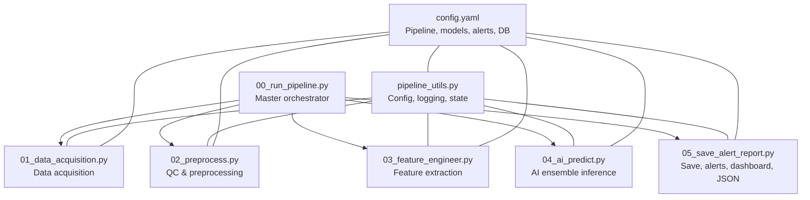
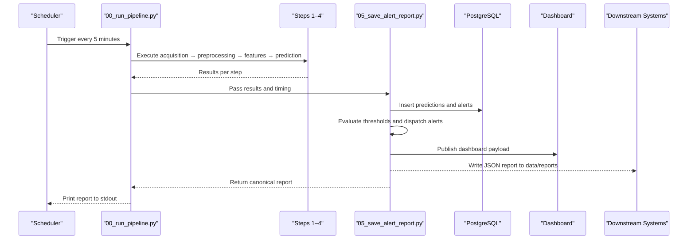
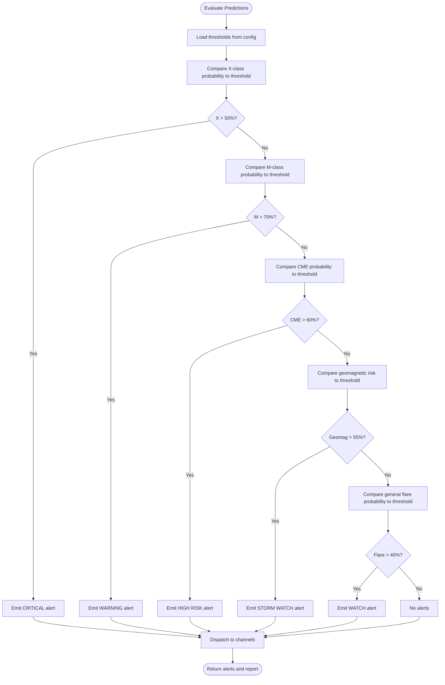
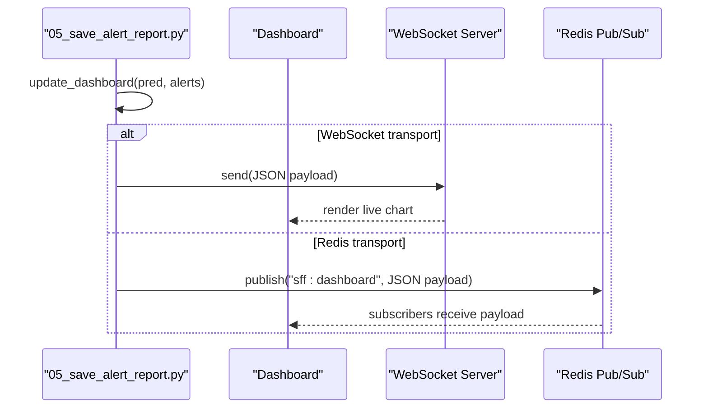
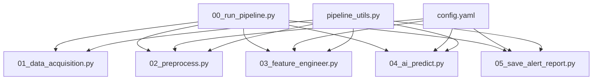

# Output and Reporting Formats

<cite>
**Referenced Files in This Document**
- [00_run_pipeline.py](file://00_run_pipeline.py)
- [01_data_acquisition.py](file://01_data_acquisition.py)
- [02_preprocess.py](file://02_preprocess.py)
- [03_feature_engineer.py](file://03_feature_engineer.py)
- [04_ai_predict.py](file://04_ai_predict.py)
- [05_save_alert_report.py](file://05_save_alert_report.py)
- [pipeline_utils.py](file://pipeline_utils.py)
- [config.yaml](file://config.yaml)
- [README.md](file://README.md)
</cite>

## Table of Contents
1. [Introduction](#introduction)
2. [Project Structure](#project-structure)
3. [Core Components](#core-components)
4. [Architecture Overview](#architecture-overview)
5. [Detailed Component Analysis](#detailed-component-analysis)
6. [Dependency Analysis](#dependency-analysis)
7. [Performance Considerations](#performance-considerations)
8. [Troubleshooting Guide](#troubleshooting-guide)
9. [Conclusion](#conclusion)
10. [Appendices](#appendices)

## Introduction
This document describes the structured JSON report format and standardized output schemas produced by the Aditya-L1 Solar Flare Forecasting Pipeline. It covers the canonical report structure including pipeline metadata, data acquisition status, quality control results, and prediction outputs. It explains the field hierarchy for timestamps, probability assessments, confidence scores, and recommended actions. It documents the alert evaluation schema with severity classifications, threshold comparisons, and action recommendations. It also outlines the dashboard payload format for real-time visualization, WebSocket message structures, and integration-ready API responses. Finally, it provides examples of complete report structures, validation rules, and downstream system consumption patterns.

## Project Structure
The pipeline is composed of eight orchestrated steps. The master orchestrator coordinates data acquisition, preprocessing, feature engineering, AI inference, persistence, alerting, dashboard updates, and JSON report generation. Shared utilities provide configuration loading, logging, state management, and helper functions.

**Diagram sources**
- [00_run_pipeline.py:63-121](file://00_run_pipeline.py#L63-L121)
- [01_data_acquisition.py:350-452](file://01_data_acquisition.py#L350-L452)
- [02_preprocess.py:230-409](file://02_preprocess.py#L230-L409)
- [03_feature_engineer.py:199-249](file://03_feature_engineer.py#L199-L249)
- [04_ai_predict.py:402-448](file://04_ai_predict.py#L402-L448)
- [05_save_alert_report.py:452-502](file://05_save_alert_report.py#L452-L502)
- [pipeline_utils.py:25-96](file://pipeline_utils.py#L25-L96)
- [config.yaml:6-104](file://config.yaml#L6-L104)

**Section sources**
- [00_run_pipeline.py:63-121](file://00_run_pipeline.py#L63-L121)
- [README.md:7-32](file://README.md#L7-L32)

## Core Components
This section focuses on the canonical structured JSON report produced by the pipeline and the alert evaluation schema used to derive severity and recommended actions.

- Canonical structured JSON report:
  - Contains pipeline metadata, data acquisition status, data quality metrics, prediction outputs, alert status, and system health indicators.
  - Uses percentages for probabilities and risk scores, ISO 8601 timestamps, and human-readable labels for severity and storm categories.
  - Includes a threshold evaluation section with boolean flags indicating whether specific thresholds were exceeded.
  - Provides a recommended action string tailored to the highest alert severity.

- Alert evaluation schema:
  - Evaluates multiple probabilistic outputs against configurable thresholds to produce severity classifications.
  - Supports multiple channels for alert dispatch (logging, email, webhook).
  - Generates alert records with identifiers, severities, messages, and threshold comparisons.

- Dashboard payload format:
  - Designed for real-time visualization and WebSocket/Redis publishing.
  - Includes prediction summaries, alert counts, and top severity.

- Integration-ready API responses:
  - The JSON report is designed for downstream systems (operators, dashboards, APIs) to consume without additional transformation.

**Section sources**
- [05_save_alert_report.py:340-425](file://05_save_alert_report.py#L340-L425)
- [05_save_alert_report.py:222-265](file://05_save_alert_report.py#L222-L265)
- [05_save_alert_report.py:304-333](file://05_save_alert_report.py#L304-L333)
- [config.yaml:79-97](file://config.yaml#L79-L97)

## Architecture Overview
The pipeline’s final stage aggregates outputs from earlier steps and produces a unified JSON report. The alert engine evaluates predictions against thresholds and dispatches notifications. The dashboard payload is prepared for real-time visualization.

**Diagram sources**
- [00_run_pipeline.py:72-116](file://00_run_pipeline.py#L72-L116)
- [05_save_alert_report.py:452-502](file://05_save_alert_report.py#L452-L502)

## Detailed Component Analysis

### Canonical Structured JSON Report Schema
The canonical report consolidates pipeline metadata, acquisition and QC status, prediction outputs, alert status, and system health. It is generated by the final stage and written to disk for downstream consumption.

Key fields and hierarchy:
- Pipeline metadata
  - run_id: Unique identifier for the pipeline run.
  - timestamp: ISO 8601 UTC timestamp of report creation.
  - pipeline_version: Version string from configuration.
  - elapsed_seconds: Total runtime of the pipeline.
  - pipeline_status: Status string from the prediction step.
- Data acquisition
  - source_used: Source of the input data (PRADAN or NOAA fallback).
  - data_points_processed: Number of records processed.
  - status: Acquisition status string.
- Data quality
  - records_validated: Number of records validated in preprocessing.
  - records_passed: Number of records passed QC.
  - warnings: List of warnings encountered during preprocessing.
- Prediction outputs
  - timestamp: Observation timestamp for the prediction.
  - data_points_processed: Same as acquisition data_points_processed.
  - flare_probability: Percentage string.
  - predicted_flare_class: Predicted class letter (e.g., A–X).
  - predicted_flux_class: Predicted flux class (e.g., M2.3).
  - class_probabilities: Map of class to percentage string.
  - cme_probability: Percentage string.
  - geomagnetic_risk: Human-readable label (e.g., HIGH (G3)).
  - geomagnetic_risk_score: Percentage string.
  - confidence_score: Percentage string.
  - estimated_onset_utc: ISO 8601 onset time.
  - onset_window_minutes: Two-element array with min/max window.
  - ai_ensemble: Models used and ensemble weights.
  - threshold_evaluation: Boolean flags for threshold breaches.
- Alerting
  - alert_status: Highest severity among active alerts or NOMINAL.
  - active_alerts: List of alert objects with severity and message.
  - recommended_action: Action string based on highest severity.
- System health
  - pipeline_ok: Boolean indicator.
  - prediction_id: Identifier for the prediction record.
  - db_write: Indicates whether PostgreSQL was used or simulated.
  - dashboard: Status of dashboard payload preparation.

Validation rules:
- Percentages are formatted as “XX.X%” strings.
- ISO 8601 timestamps use Zulu time suffix.
- Numeric fields are rounded to four decimals or one decimal depending on context.
- Missing fields are omitted or defaulted to “N/A”.

Example structure outline:
- See the example in the README under “JSON Output Schema”.

**Section sources**
- [05_save_alert_report.py:340-425](file://05_save_alert_report.py#L340-L425)
- [05_save_alert_report.py:428-446](file://05_save_alert_report.py#L428-L446)
- [README.md:206-227](file://README.md#L206-L227)

### Alert Evaluation Schema and Recommended Actions
The alert engine compares probabilistic outputs against configurable thresholds and assigns severity levels. It generates alert records and dispatches them to configured channels.

Severity classifications and thresholds:
- CRITICAL: X-class probability > 50%.
- WARNING: M-class probability > 70%.
- HIGH RISK: CME probability > 60%.
- STORM WATCH: Geomagnetic storm risk > 55%.
- WATCH: General flare probability > 40%.

Dispatch channels:
- Logging: Always enabled for visibility.
- Email: Enabled conditionally with recipients and SMTP host.
- Webhook: Enabled conditionally with a URL.

Recommended actions:
- NOMINAL: Continue standard monitoring.
- CRITICAL: Initiate satellite safe-mode protocols, notify operators, issue advisories.
- WARNING/HIGH RISK: Increase sampling cadence, brief operations team, prepare SEP protocol.
- STORM WATCH: Alert power grid and GNSS providers, monitor Kp index.
- WATCH: Monitor more frequently, brief on-call duty officer.

**Diagram sources**
- [05_save_alert_report.py:222-265](file://05_save_alert_report.py#L222-L265)
- [config.yaml:79-89](file://config.yaml#L79-L89)

**Section sources**
- [05_save_alert_report.py:222-265](file://05_save_alert_report.py#L222-L265)
- [config.yaml:79-89](file://config.yaml#L79-L89)

### Dashboard Payload Format and WebSocket Message Structures
The dashboard payload is prepared for real-time visualization and can be pushed via WebSocket or Redis pub/sub. The implementation logs and returns the payload; production deployments can replace the stub with actual transport.

Fields:
- type: Event type string (e.g., “prediction_update”).
- timestamp: ISO 8601 UTC timestamp.
- prediction: Prediction summary with class, probabilities, risk label, confidence, and onset.
- alert_count: Integer count of active alerts.
- top_severity: Highest severity among active alerts or “NOMINAL”.

WebSocket message structure:
- The payload is a JSON object suitable for sending over WebSocket connections.
- The implementation includes a TODO comment indicating where to integrate WebSocket or Redis publishing.

**Diagram sources**
- [05_save_alert_report.py:304-333](file://05_save_alert_report.py#L304-L333)

**Section sources**
- [05_save_alert_report.py:304-333](file://05_save_alert_report.py#L304-L333)

### Integration-Ready API Responses
The JSON report is designed for direct integration with downstream systems. It includes:
- Canonical fields for ingestion by dashboards and APIs.
- Percent-encoded probabilities and risk scores for readability.
- ISO 8601 timestamps for interoperability.
- Recommended actions for automated response orchestration.

Consumption patterns:
- Dashboards can subscribe to WebSocket or poll the JSON report files.
- APIs can expose the report via a GET endpoint serving the latest report.
- Operators can parse the report to trigger automated actions based on alert_status and recommended_action.

**Section sources**
- [05_save_alert_report.py:492-493](file://05_save_alert_report.py#L492-L493)
- [README.md:206-227](file://README.md#L206-L227)

## Dependency Analysis
The final stage depends on outputs from earlier steps and configuration for thresholds and channels. The orchestrator coordinates the pipeline and passes results to the reporting stage.

**Diagram sources**
- [00_run_pipeline.py:72-116](file://00_run_pipeline.py#L72-L116)
- [05_save_alert_report.py:452-502](file://05_save_alert_report.py#L452-L502)
- [config.yaml:6-104](file://config.yaml#L6-L104)

**Section sources**
- [00_run_pipeline.py:72-116](file://00_run_pipeline.py#L72-L116)
- [05_save_alert_report.py:452-502](file://05_save_alert_report.py#L452-L502)

## Performance Considerations
- The JSON report is lightweight and suitable for frequent writes and reads.
- Percent formatting avoids floating-point precision artifacts in downstream displays.
- Threshold evaluations are constant-time checks over a small set of fields.
- The dashboard payload excludes heavy model outputs to reduce bandwidth.

## Troubleshooting Guide
Common issues and resolutions:
- Missing PostgreSQL: The writer logs a simulation mode message and continues. Enable the driver to persist predictions and alerts.
- Alert dispatch failures: Errors are logged per channel; verify SMTP host or webhook URL configuration.
- No new data: The acquisition step may return “NO_NEW_DATA”; the orchestrator exits early.
- Pipeline errors: The orchestrator captures exceptions, saves failure state, and prints a minimal failure report.

**Section sources**
- [05_save_alert_report.py:121-141](file://05_save_alert_report.py#L121-L141)
- [05_save_alert_report.py:267-279](file://05_save_alert_report.py#L267-L279)
- [00_run_pipeline.py:122-141](file://00_run_pipeline.py#L122-L141)

## Conclusion
The pipeline produces a canonical, standardized JSON report enriched with timestamps, probabilities, confidence scores, and actionable recommendations. The alert evaluation schema provides robust severity classification and dispatch mechanisms. The dashboard payload format enables real-time visualization, and the integration-ready API responses support downstream automation. Together, these outputs enable reliable, automated space weather monitoring and decision-making.

## Appendices

### Field Reference and Examples
- Example canonical report structure: See the example in the README under “JSON Output Schema”.
- Thresholds and severities: See the table in the README under “Alert Thresholds”.

**Section sources**
- [README.md:206-227](file://README.md#L206-L227)
- [README.md:175-185](file://README.md#L175-L185)