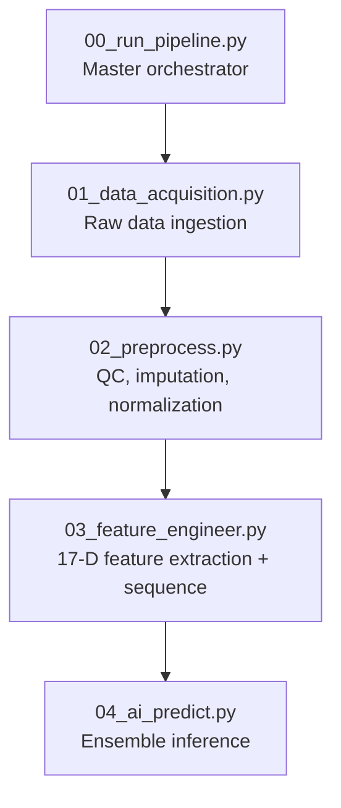
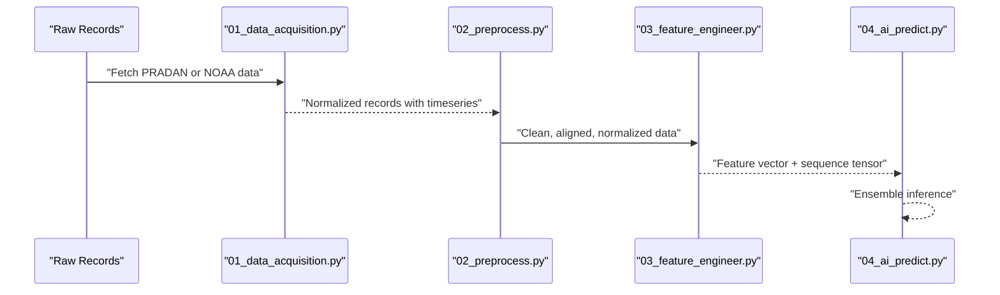
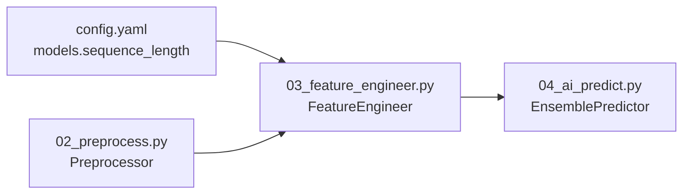

# Processed Feature Vectors

<cite>
**Referenced Files in This Document**
- [00_run_pipeline.py](file://00_run_pipeline.py)
- [01_data_acquisition.py](file://01_data_acquisition.py)
- [02_preprocess.py](file://02_preprocess.py)
- [03_feature_engineer.py](file://03_feature_engineer.py)
- [04_ai_predict.py](file://04_ai_predict.py)
- [README.md](file://README.md)
- [config.yaml](file://config.yaml)
- [pipeline_utils.py](file://pipeline_utils.py)
</cite>

## Table of Contents
1. [Introduction](#introduction)
2. [Project Structure](#project-structure)
3. [Core Components](#core-components)
4. [Architecture Overview](#architecture-overview)
5. [Detailed Component Analysis](#detailed-component-analysis)
6. [Dependency Analysis](#dependency-analysis)
7. [Performance Considerations](#performance-considerations)
8. [Troubleshooting Guide](#troubleshooting-guide)
9. [Conclusion](#conclusion)

## Introduction
This document describes the processed feature vector structure and the transformation pipeline used to prepare solar X-ray observations for forecasting. It focuses on the 17-dimensional feature space, including rolling statistics, temporal correlations, and normalized space weather parameters. It explains how raw observations are transformed into AI-ready tensors for deep learning models, and documents the relationships among raw inputs, derived features, normalization schemes, and sequence construction.

## Project Structure
The pipeline is composed of discrete steps orchestrated by a master entry point. The feature engineering step extracts the 17-dimensional vector and constructs a fixed-length sequence tensor for temporal models.

**Diagram sources**
- [00_run_pipeline.py:63-121](file://00_run_pipeline.py#L63-L121)
- [01_data_acquisition.py:350-452](file://01_data_acquisition.py#L350-L452)
- [02_preprocess.py:230-409](file://02_preprocess.py#L230-L409)
- [03_feature_engineer.py:199-249](file://03_feature_engineer.py#L199-L249)
- [04_ai_predict.py:402-448](file://04_ai_predict.py#L402-L448)

**Section sources**
- [00_run_pipeline.py:13-24](file://00_run_pipeline.py#L13-L24)
- [README.md:7-32](file://README.md#L7-L32)

## Core Components
- Data acquisition: pulls native Aditya-L1 data (SoLEXS/HEL1OS) from PRADAN or proxies via NOAA SWPC.
- Preprocessing: validates, detects gaps, removes outliers, interpolates missing values, aligns instruments, derives HEL1OS bands when needed, and normalizes fluxes.
- Feature engineering: computes 17 scalar features and builds a (60, 17) sequence tensor for temporal models.
- AI prediction: ensembles LSTM, GRU, Transformer, and XGBoost to produce probabilistic forecasts.

Key configuration for feature engineering and modeling resides in the central configuration file.

**Section sources**
- [config.yaml:62-77](file://config.yaml#L62-L77)
- [03_feature_engineer.py:48-46](file://03_feature_engineer.py#L48-L46)

## Architecture Overview
The feature extraction pipeline transforms raw observations into a standardized 17-dimensional vector and a sequence tensor consumed by deep learning models.

**Diagram sources**
- [01_data_acquisition.py:350-452](file://01_data_acquisition.py#L350-L452)
- [02_preprocess.py:230-409](file://02_preprocess.py#L230-L409)
- [03_feature_engineer.py:199-249](file://03_feature_engineer.py#L199-L249)
- [04_ai_predict.py:402-448](file://04_ai_predict.py#L402-L448)

## Detailed Component Analysis

### Feature Vector Definition and Extraction
The 17-dimensional feature vector is constructed from:
- Soft X-ray diagnostics from SoLEXS
- Hard X-ray diagnostics from HEL1OS (or derived)
- Space weather parameters (Kp, solar wind speed/density, IMF Bz)
- Temporal statistics computed from the recent flux timeseries

Feature names and sources are defined in the feature engine module and summarized in the project documentation.

- Feature indices and names:
  - Index 0: log10 soft flux (SoLEXS 1–8 Å)
  - Index 1: log10 soft peak over last 60 minutes
  - Index 2: log10 soft flux (SoLEXS 0.5–4 Å)
  - Index 3: short-to-long flux ratio (spectral hardness)
  - Index 4: flux rise rate normalized
  - Index 5: flux acceleration normalized
  - Index 6: log10 hard flux (HEL1OS 20–60 keV)
  - Index 7: log10 hard flux (HEL1OS 60–100 keV)
  - Index 8: hard-to-soft ratio
  - Index 9: spectral gamma (normalized)
  - Index 10: Kp index normalized
  - Index 11: solar wind speed normalized
  - Index 12: solar wind density normalized
  - Index 13: IMF Bz normalized
  - Index 14: current flux percentile rank in past 24 hours
  - Index 15: 15-minute rolling mean normalized
  - Index 16: 15-minute rolling standard deviation

Normalization schemes:
- Log10 normalization for fluxes with a bounded range to map physical fluxes to [0,1].
- Min-max scaling using predefined bounds for soft and hard X-ray fluxes.
- Feature-wise normalization for space weather parameters using typical ranges.

Temporal statistics:
- Percentile rank computed against a 24-hour distribution of flux values.
- Rolling mean and standard deviation computed over the last 15 points of the timeseries.

Sequence tensor construction:
- A fixed-length sequence of 60 time steps is built.
- The first feature (log10 soft flux) is replaced at each step with the corresponding observed value from the timeseries.
- Other features are replicated across time to form a (60, 17) tensor suitable for LSTM/GRU/Transformer.

**Section sources**
- [03_feature_engineer.py:9-27](file://03_feature_engineer.py#L9-L27)
- [03_feature_engineer.py:52-193](file://03_feature_engineer.py#L52-L193)
- [README.md:151-172](file://README.md#L151-L172)
- [config.yaml:66-68](file://config.yaml#L66-L68)

### Data Transformation Techniques and Normalization
- Flux normalization:
  - Log10 transform is applied to convert highly skewed flux distributions into approximately normal distributions.
  - Min-max scaling maps log10 fluxes to [0,1] using predefined bounds for A-class to extreme X-class ranges.
- Space weather normalization:
  - Kp scaled to [0,1] by dividing by 9.
  - Solar wind speed and density scaled by typical magnitudes.
  - IMF Bz scaled by ±20 nT to [-1,1].
- Derivation of HEL1OS bands:
  - When native HEL1OS data is unavailable, hard X-ray bands are derived from SoLEXS soft flux and the short-to-long ratio using an empirical spectral model.
  - Spectral index gamma is estimated based on the current flux class.

Quality control and imputation:
- Outlier detection via sigma clipping.
- Missing value imputation via linear interpolation.
- Gap detection and reporting.
- Instrument synchronization checks between SoLEXS and HEL1OS.

**Section sources**
- [02_preprocess.py:126-224](file://02_preprocess.py#L126-L224)
- [02_preprocess.py:169-205](file://02_preprocess.py#L169-L205)
- [03_feature_engineer.py:54-69](file://03_feature_engineer.py#L54-L69)

### Feature Extraction Methodology
- Time-window analysis:
  - Uses a 60-minute window to compute peak flux and derivative metrics.
  - Maintains a rolling window of 15 points for mean and standard deviation.
- Spectral analysis:
  - Computes short-to-long ratio and spectral gamma.
  - Derives hard X-ray bands when needed using an empirical model.
- Correlation metrics:
  - Hard-to-soft ratio and percentile rank reflect temporal and spectral relationships.

Sequence tensor construction:
- Builds a (60, 17) tensor by repeating scalar features across time and replacing the first feature with the actual observed flux at each step.
- Pads the sequence with the earliest value if the timeseries is shorter than 60 steps.

**Section sources**
- [03_feature_engineer.py:78-91](file://03_feature_engineer.py#L78-L91)
- [03_feature_engineer.py:143-166](file://03_feature_engineer.py#L143-L166)
- [config.yaml:63-64](file://config.yaml#L63-L64)

### Relationship Between Raw Inputs and Derived Features
- Raw inputs:
  - SoLEXS 1–8 Å and 0.5–4 Å fluxes, peak over 60 minutes, derivatives, and timeseries.
  - HEL1OS bands (when available) or derived bands.
  - Ancillary parameters: Kp index, solar wind speed/density, IMF Bz.
- Derived features:
  - Normalized logarithmic fluxes and ratios.
  - Normalized temporal derivatives and rolling statistics.
  - Normalized space weather parameters.

Mathematical formulations:
- Log10 normalization: f_log = log10(max(f, floor)).
- Min-max scaling: f_norm = clamp((f_log - min)/(max - min), 0, 1).
- Percentile rank: computed using the 24-hour distribution of flux values.
- Rolling statistics: mean and std computed over the last 15 points and normalized similarly to flux.

Parameter dependencies:
- Hard-to-soft ratio depends on the ratio of HEL1OS to SoLEXS fluxes.
- Spectral gamma depends on the current flux class and short-to-long ratio.
- IMF Bz normalization influences geospace risk estimates.

**Section sources**
- [03_feature_engineer.py:60-90](file://03_feature_engineer.py#L60-L90)
- [03_feature_engineer.py:102-146](file://03_feature_engineer.py#L102-L146)
- [02_preprocess.py:169-205](file://02_preprocess.py#L169-L205)

### Sequence Tensor Construction for Deep Learning Models
- Fixed length: 60 time steps.
- First channel: actual observed log10 flux at each step.
- Remaining channels: repeated scalar features from the current timestep.
- Padding: if fewer than 60 steps are available, pad the front with the earliest normalized flux value.

This construction enables:
- LSTM/GRU to learn temporal dynamics.
- Transformer to leverage attention over the full sequence.
- XGBoost to operate on the scalar vector representation.

**Section sources**
- [03_feature_engineer.py:150-166](file://03_feature_engineer.py#L150-L166)
- [config.yaml:67](file://config.yaml#L67)

### Feature Importance Considerations
- The surrogate XGBoost model demonstrates feature importance via learned weights, indicating strong dependence on:
  - log10 soft flux
  - log10 soft peak over 60 minutes
  - dF/dt normalized
  - flux percentile rank in 24 hours
- These features are prioritized in the ensemble because they capture both current activity and temporal trends.

**Section sources**
- [04_ai_predict.py:198-237](file://04_ai_predict.py#L198-L237)

### Missing Value Imputation Strategies and Quality Control
- Missing value imputation:
  - Linear interpolation replaces NaN values in the timeseries.
- Outlier handling:
  - Sigma clipping replaces values beyond a threshold from the mean with NaN prior to interpolation.
- Gap detection:
  - Identifies gaps in the 1-minute cadence and reports maximum gap duration.
- Instrument synchronization:
  - Checks timestamp alignment between SoLEXS and HEL1OS within a tolerance.

These controls ensure robust feature extraction even under partial data availability.

**Section sources**
- [02_preprocess.py:128-151](file://02_preprocess.py#L128-L151)
- [02_preprocess.py:99-119](file://02_preprocess.py#L99-L119)
- [02_preprocess.py:207-224](file://02_preprocess.py#L207-L224)

## Dependency Analysis
The feature extraction step depends on:
- Clean, normalized records from preprocessing.
- Configuration specifying sequence length and feature dimensions.
- Ancillary parameters for space weather normalization.

**Diagram sources**
- [config.yaml:66-68](file://config.yaml#L66-L68)
- [02_preprocess.py:230-409](file://02_preprocess.py#L230-L409)
- [03_feature_engineer.py:199-249](file://03_feature_engineer.py#L199-L249)
- [04_ai_predict.py:402-448](file://04_ai_predict.py#L402-L448)

**Section sources**
- [03_feature_engineer.py:45](file://03_feature_engineer.py#L45)
- [config.yaml:66-68](file://config.yaml#L66-L68)

## Performance Considerations
- Computational efficiency:
  - Rolling statistics and percentile ranking are computed over small windows (15 and 24 hours respectively), minimizing overhead.
- Memory footprint:
  - Sequence tensor is fixed-size (60×17), enabling efficient batching for deep learning models.
- Robustness:
  - Interpolation and sigma clipping reduce noise and gaps, improving model stability.

[No sources needed since this section provides general guidance]

## Troubleshooting Guide
Common issues and remedies:
- No new data:
  - The acquisition step may return “NO_NEW_DATA” if the deduplication logic detects no fresh records.
- Preprocessing failures:
  - If no valid records remain after QC, the pipeline halts early with an error message.
- Feature extraction errors:
  - Exceptions during feature extraction are logged and do not halt the pipeline; warnings are accumulated.
- Model loading:
  - If trained model weights are missing, the pipeline falls back to physics-based surrogates for inference.

**Section sources**
- [00_run_pipeline.py:77-83](file://00_run_pipeline.py#L77-L83)
- [00_run_pipeline.py:90-92](file://00_run_pipeline.py#L90-L92)
- [00_run_pipeline.py:99-101](file://00_run_pipeline.py#L99-L101)
- [03_feature_engineer.py:229-232](file://03_feature_engineer.py#L229-L232)
- [04_ai_predict.py:113-127](file://04_ai_predict.py#L113-L127)

## Conclusion
The feature engineering pipeline converts raw solar X-ray observations into a standardized 17-dimensional vector and a fixed-length sequence tensor. It applies robust normalization, imputation, and quality control to ensure reliable inputs for deep learning models. The resulting features capture spectral hardness, temporal dynamics, and space weather conditions, enabling accurate forecasting through an ensemble of LSTM, GRU, Transformer, and XGBoost models.