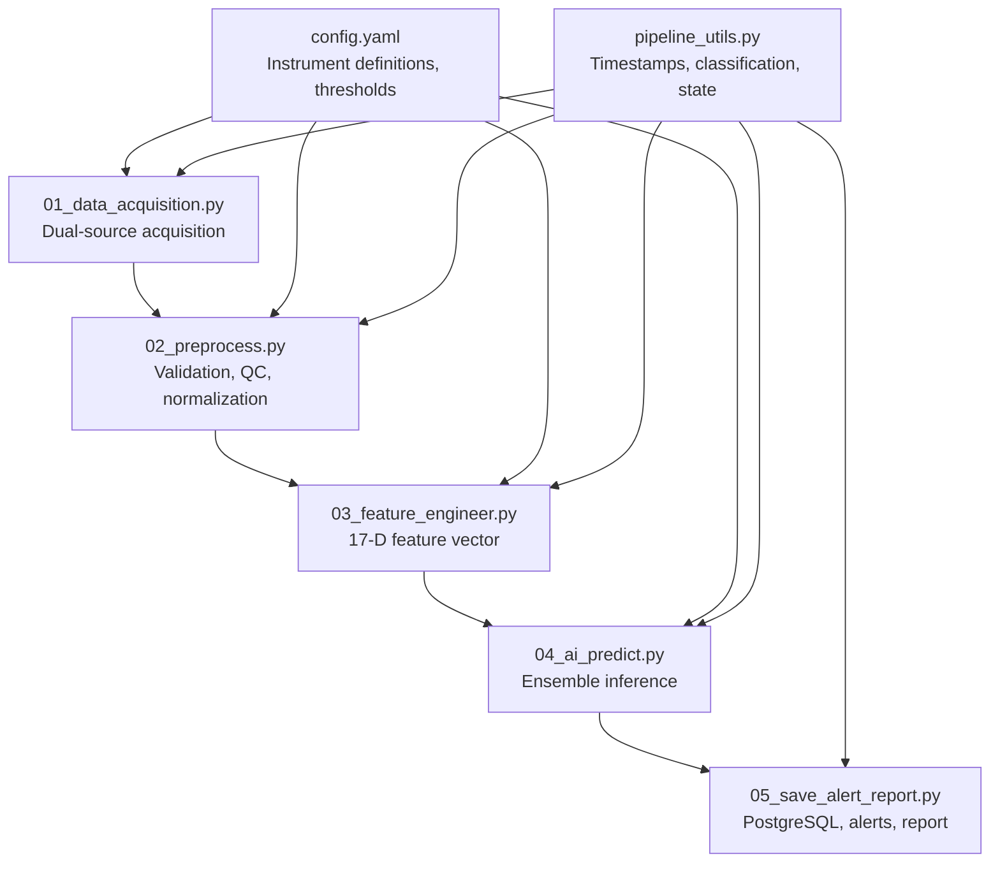
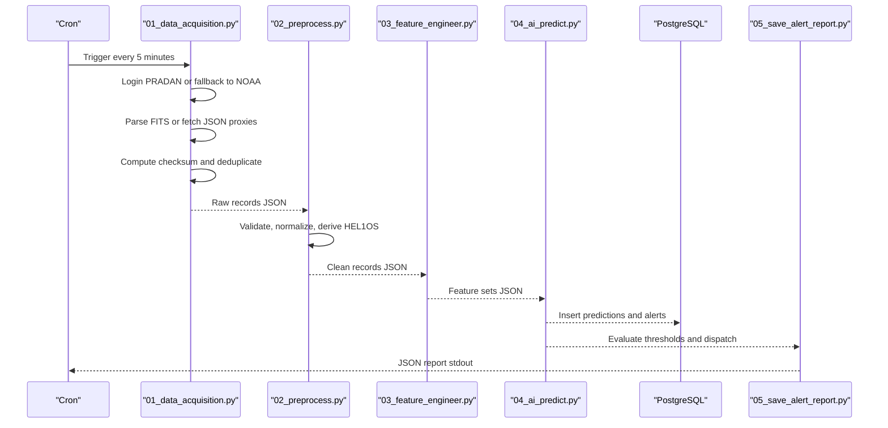
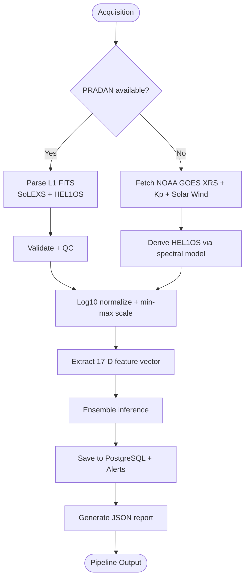
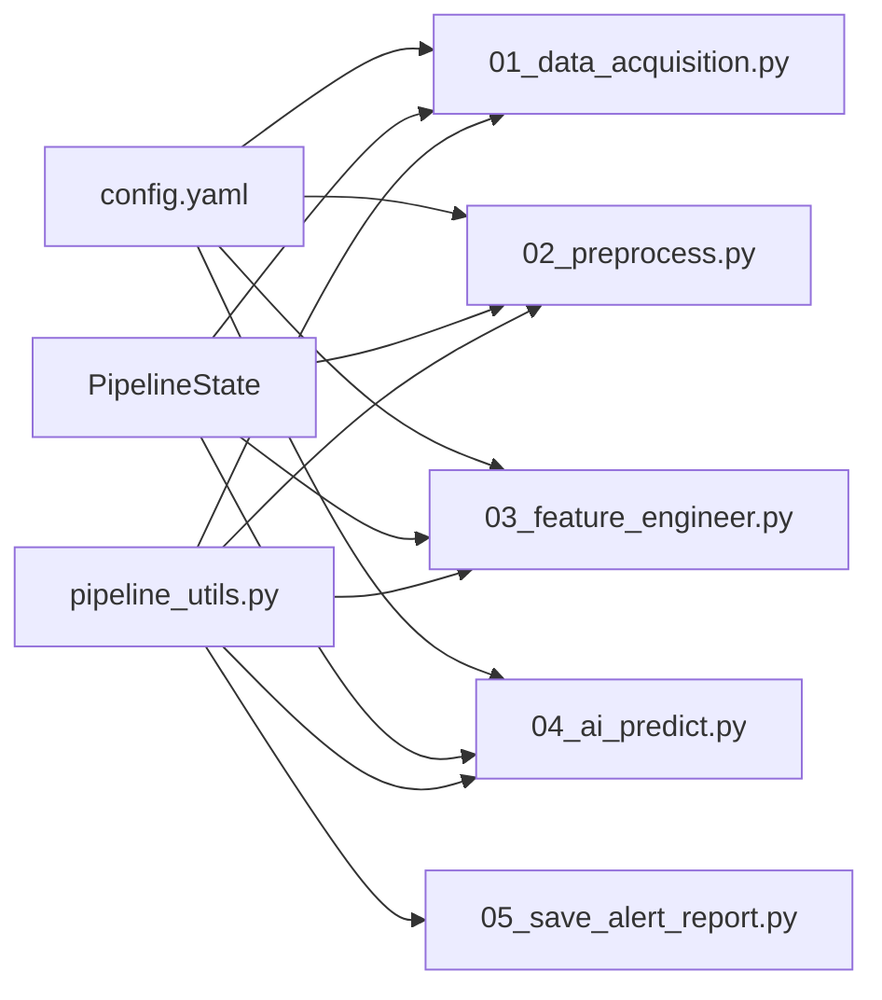

# Raw Data Formats

<cite>
**Referenced Files in This Document**
- [README.md](file://README.md)
- [config.yaml](file://config.yaml)
- [01_data_acquisition.py](file://01_data_acquisition.py)
- [02_preprocess.py](file://02_preprocess.py)
- [03_feature_engineer.py](file://03_feature_engineer.py)
- [04_ai_predict.py](file://04_ai_predict.py)
- [05_save_alert_report.py](file://05_save_alert_report.py)
- [pipeline_utils.py](file://pipeline_utils.py)
</cite>

## Table of Contents
1. [Introduction](#introduction)
2. [Project Structure](#project-structure)
3. [Core Components](#core-components)
4. [Architecture Overview](#architecture-overview)
5. [Detailed Component Analysis](#detailed-component-analysis)
6. [Dependency Analysis](#dependency-analysis)
7. [Performance Considerations](#performance-considerations)
8. [Troubleshooting Guide](#troubleshooting-guide)
9. [Conclusion](#conclusion)

## Introduction
This document describes the raw data formats used in the pipeline, focusing on SoLEXS and HEL1OS instruments. It explains:
- SoLEXS data structure: 1–8 Å and 0.5–4 Å channel measurements, peak flux, and derivative analysis
- HEL1OS data format: energy channel counts (20–60 and 60–100 keV), derived spectral gamma parameters, and quality flags
- Timestamp formats, validation rules, and checksum-based deduplication
- Field definitions, data types, units, and expected ranges
- Dual-source data acquisition from PRADAN (native) and NOAA fallback, including transformations and quality control

## Project Structure
The pipeline is organized into discrete steps that handle acquisition, validation, preprocessing, feature extraction, inference, and reporting. The raw data formats are defined primarily in the acquisition and preprocessing stages, with derived formats used downstream.

**Diagram sources**
- [01_data_acquisition.py:1-458](file://01_data_acquisition.py#L1-L458)
- [02_preprocess.py:1-422](file://02_preprocess.py#L1-L422)
- [03_feature_engineer.py:1-265](file://03_feature_engineer.py#L1-L265)
- [04_ai_predict.py:1-466](file://04_ai_predict.py#L1-L466)
- [05_save_alert_report.py:1-507](file://05_save_alert_report.py#L1-L507)
- [config.yaml:1-104](file://config.yaml#L1-L104)
- [pipeline_utils.py:1-123](file://pipeline_utils.py#L1-L123)

**Section sources**
- [README.md:1-228](file://README.md#L1-L228)
- [config.yaml:1-104](file://config.yaml#L1-L104)

## Core Components
- SoLEXS (Aditya-L1): native L1 FITS with lightcurve and spectrum HDUs; includes 1–8 Å, 0.5–4 Å, and 8–20 Å channels; peak flux and quality flags
- HEL1OS (Aditya-L1): native L1 FITS with rates HDU; includes 20–60 keV, 60–100 keV, 100–300 keV, and 300–1000 keV channels; quality flags
- NOAA SWPC fallback: GOES XRS proxy for SoLEXS (1–8 Å and 0.5–4 Å), derived HEL1OS hard X-ray channels via spectral model, Kp index, and solar wind parameters

**Section sources**
- [config.yaml:41-52](file://config.yaml#L41-L52)
- [01_data_acquisition.py:145-193](file://01_data_acquisition.py#L145-L193)
- [02_preprocess.py:169-205](file://02_preprocess.py#L169-L205)

## Architecture Overview
The pipeline transforms raw data into normalized, validated records and then into AI-ready features. The acquisition stage handles dual-source ingestion and deduplication; preprocessing validates and derives missing HEL1OS channels; feature engineering extracts a fixed 17-D vector; inference produces probabilistic forecasts; reporting persists results and triggers alerts.

**Diagram sources**
- [01_data_acquisition.py:350-452](file://01_data_acquisition.py#L350-L452)
- [02_preprocess.py:230-409](file://02_preprocess.py#L230-L409)
- [03_feature_engineer.py:199-249](file://03_feature_engineer.py#L199-L249)
- [04_ai_predict.py:402-448](file://04_ai_predict.py#L402-L448)
- [05_save_alert_report.py:452-502](file://05_save_alert_report.py#L452-L502)

## Detailed Component Analysis

### SoLEXS Instrument Data Structure
- Native L1 FITS (PRADAN):
  - HDU layout: [PRIMARY, LIGHTCURVE, SPECTRUM, HEADER]
  - Lightcurve fields:
    - obs_time: ISO 8601 UTC timestamp
    - exposure_s: exposure duration in seconds
    - band_1_8A_Wm2: mean flux in W/m²
    - band_0_4A_Wm2: mean flux in W/m²
    - band_8_20A_Wm2: mean flux in W/m²
    - peak_flux_Wm2: maximum 1–8 Å flux in the record
    - timeseries: 1–8 Å flux time series (list)
    - quality_flags: quality flags (list)
  - Units: W/m² for flux channels; seconds for exposure
  - Expected ranges:
    - Flux channels: typical range aligned with A-class to extreme X-class
    - Quality flags: integer flags indicating data validity per pixel/time bin

- Derived fields in preprocessing:
  - peak_flux_60min_Wm2: peak over the last 60 minutes
  - dF_dt_Wm2s: derivative over the last 10 minutes
  - d2F_dt2_Wm2s2: second derivative over 5–10 minute windows
  - flux_ratio_short_long: ratio of 0.5–4 Å to 1–8 Å

- Validation rules:
  - Presence of obs_time and required flux fields
  - Flux values within physical bounds (e.g., 1e-9 to 1e-2 W/m²)
  - Minimum number of records for reliable derivatives

**Section sources**
- [01_data_acquisition.py:145-193](file://01_data_acquisition.py#L145-L193)
- [02_preprocess.py:89-97](file://02_preprocess.py#L89-L97)
- [02_preprocess.py:266-377](file://02_preprocess.py#L266-L377)

### HEL1OS Instrument Data Structure
- Native L1 FITS (PRADAN):
  - HDU layout: [PRIMARY, COUNTS_1, COUNTS_2, RATES, HEADER]
  - Rates HDU fields:
    - obs_time: ISO 8601 UTC timestamp
    - exposure_s: exposure duration in seconds
    - band_20_60keV_cts_s: mean count rate in counts/s
    - band_60_100keV_cts_s: mean count rate in counts/s
    - band_100_300keV_cts_s: mean count rate in counts/s
    - band_300_1000keV_cts_s: mean count rate in counts/s
    - quality_flags: quality flags (list)
  - Units: counts/s for rate channels; seconds for exposure
  - Expected ranges:
    - Count rates: non-negative values; typical ranges depend on solar activity
    - Quality flags: integer flags indicating data validity

- Derived fields (fallback mode):
  - band_20_60keV_cts_s, band_60_100keV_cts_s, band_100_300keV_cts_s, band_300_1000keV_cts_s: computed from SoLEXS soft flux and spectral ratio
  - spectral_gamma: derived spectral index based on flare class and ratio diagnostics
  - hardness_factor: ratio-dependent factor influencing hard channel scaling
  - Uncertainty: approximate ±30–40% vs measured counts

**Section sources**
- [01_data_acquisition.py:175-188](file://01_data_acquisition.py#L175-L188)
- [02_preprocess.py:169-205](file://02_preprocess.py#L169-L205)

### NOAA SWPC Fallback Data Format
- GOES XRS proxy for SoLEXS:
  - band_1_8A: dictionary with keys:
    - timeseries: last 120 points (1–8 Å)
    - timestamps: corresponding ISO 8601 UTC timestamps
    - latest: current 1–8 Å flux
    - peak_60min: peak over last 60 minutes
    - mean: average over available period
    - peak: overall maximum observed
    - dFdt: derivative over last 10 minutes
    - d2Fdt2: second derivative over 5–10 minute windows
    - n_records: number of records used
  - band_0_4A: similar structure for 0.5–4 Å
  - flux_ratio_short_long: ratio of 0.5–4 Å to 1–8 Å
- Kp index:
  - kp_index: current planetary Kp index
  - kp_index_24h: last 24 hours of Kp values
- Solar wind:
  - speed_km_s: solar wind speed in km/s
  - density_n_cc: solar wind density in n/cc
  - temperature_K: solar wind temperature in K
  - imf_bz_nT: IMF Bz in nT
  - imf_bt_nT: IMF magnitude in nT

**Section sources**
- [01_data_acquisition.py:222-307](file://01_data_acquisition.py#L222-L307)

### Timestamp Formats and Validation
- Timestamps:
  - ISO 8601 UTC: "YYYY-MM-DDTHH:MM:SSZ"
  - Used for obs_time, timestamps, and pipeline timestamps
- Validation:
  - Presence of obs_time
  - Gap detection in 1-minute GOES XRS timeseries
  - Minimum cadence thresholds for reliable derivatives

**Section sources**
- [02_preprocess.py:99-120](file://02_preprocess.py#L99-L120)
- [02_preprocess.py:108-119](file://02_preprocess.py#L108-L119)

### Data Validation Rules
- SoLEXS native:
  - Required fields: obs_time, band_1_8A, band_0_4A
  - Flux range: 1e-9 to 1e-2 W/m²
- NOAA proxy:
  - Required: band_1_8A latest flux
  - Range warning: 1e-9 to 1e-2 W/m²
  - Gap warnings: insufficient cadence (<10 records)

**Section sources**
- [02_preprocess.py:70-87](file://02_preprocess.py#L70-L87)
- [02_preprocess.py:89-97](file://02_preprocess.py#L89-L97)

### Checksum-Based Deduplication
- Purpose: prevent reprocessing identical records across cron runs
- Mechanism:
  - Compute SHA-256 hash of normalized JSON representation of the record
  - Store last N checksums in pipeline state
  - Skip if checksum matches recent history
- Windowing:
  - 1-minute granularity for NOAA fallback
  - Recent history kept (bounded size)

**Section sources**
- [01_data_acquisition.py:331-344](file://01_data_acquisition.py#L331-L344)
- [01_data_acquisition.py:419-424](file://01_data_acquisition.py#L419-L424)

### Dual-Source Data Acquisition and Transformation
- PRADAN (native):
  - Login and file query within look-back window
  - Download and parse FITS into structured dictionaries
  - Quality flags and exposure metadata retained
- NOAA fallback:
  - Fetch GOES XRS 6-hour dataset and derive SoLEXS channels
  - Compute spectral ratio and derive HEL1OS rates via empirical model
  - Impute missing Kp and solar wind values with warnings
- Synchronization:
  - Single merged record for NOAA fallback
  - Timestamp tolerance for SoLEXS/HEL1OS alignment in native mode

**Section sources**
- [01_data_acquisition.py:49-193](file://01_data_acquisition.py#L49-L193)
- [01_data_acquisition.py:199-325](file://01_data_acquisition.py#L199-L325)
- [02_preprocess.py:207-224](file://02_preprocess.py#L207-L224)

### HEL1OS Spectral Gamma Derivation
- Inputs:
  - SoLEXS soft flux (W/m²)
  - Ratio of 0.5–4 Å to 1–8 Å
- Method:
  - Classify flux to select spectral gamma baseline
  - Compute hardness factor from ratio
  - Apply empirical scaling to derive hard channel rates
- Outputs:
  - band_20_60keV_cts_s, band_60_100keV_cts_s, band_100_300keV_cts_s, band_300_1000keV_cts_s
  - spectral_gamma, hardness_factor
  - Uncertainty estimate

**Section sources**
- [02_preprocess.py:169-205](file://02_preprocess.py#L169-L205)

### Field Definitions, Types, Units, and Ranges
- SoLEXS native (PRADAN L1 FITS):
  - obs_time: string (ISO 8601 UTC)
  - exposure_s: float (seconds)
  - band_1_8A_Wm2: float (W/m²)
  - band_0_4A_Wm2: float (W/m²)
  - band_8_20A_Wm2: float (W/m²)
  - peak_flux_Wm2: float (W/m²)
  - timeseries: list of floats (W/m²)
  - quality_flags: list of integers
- HEL1OS native (PRADAN L1 FITS):
  - obs_time: string (ISO 8601 UTC)
  - exposure_s: float (seconds)
  - band_20_60keV_cts_s: float (counts/s)
  - band_60_100keV_cts_s: float (counts/s)
  - band_100_300keV_cts_s: float (counts/s)
  - band_300_1000keV_cts_s: float (counts/s)
  - quality_flags: list of integers
- NOAA fallback:
  - band_1_8A: dictionary with timeseries, timestamps, latest, peak_60min, mean, peak, dFdt, d2Fdt2, n_records
  - band_0_4A: similar structure
  - flux_ratio_short_long: float
  - kp_index: float
  - kp_index_24h: list of floats
  - speed_km_s: float (km/s)
  - density_n_cc: float (n/cc)
  - temperature_K: float (K)
  - imf_bz_nT: float (nT)
  - imf_bt_nT: float (nT)
- Derived HEL1OS (fallback):
  - band_20_60keV_cts_s, band_60_100keV_cts_s, band_100_300keV_cts_s, band_300_1000keV_cts_s: floats (counts/s)
  - spectral_gamma: float
  - hardness_factor: float
  - uncertainty_pct: float

**Section sources**
- [01_data_acquisition.py:145-193](file://01_data_acquisition.py#L145-L193)
- [01_data_acquisition.py:222-307](file://01_data_acquisition.py#L222-L307)
- [02_preprocess.py:169-205](file://02_preprocess.py#L169-L205)

### Data Flow Through the Pipeline

**Diagram sources**
- [01_data_acquisition.py:350-452](file://01_data_acquisition.py#L350-L452)
- [02_preprocess.py:230-409](file://02_preprocess.py#L230-L409)
- [03_feature_engineer.py:199-249](file://03_feature_engineer.py#L199-L249)
- [04_ai_predict.py:402-448](file://04_ai_predict.py#L402-L448)
- [05_save_alert_report.py:452-502](file://05_save_alert_report.py#L452-L502)

## Dependency Analysis
- Acquisition depends on:
  - PRADAN client for native data
  - NOAA endpoints for fallback
  - Pipeline state for deduplication
- Preprocessing depends on:
  - Configuration for normalization and thresholds
  - Validation utilities for gap detection and sigma clipping
- Feature engineering depends on:
  - Normalization constants and percentile computations
- Inference depends on:
  - Ensemble weights and surrogate models
- Reporting depends on:
  - Database schema and alert thresholds

**Diagram sources**
- [config.yaml:1-104](file://config.yaml#L1-L104)
- [01_data_acquisition.py:350-452](file://01_data_acquisition.py#L350-L452)
- [02_preprocess.py:230-409](file://02_preprocess.py#L230-L409)
- [03_feature_engineer.py:199-249](file://03_feature_engineer.py#L199-L249)
- [04_ai_predict.py:402-448](file://04_ai_predict.py#L402-L448)
- [05_save_alert_report.py:452-502](file://05_save_alert_report.py#L452-L502)
- [pipeline_utils.py:82-96](file://pipeline_utils.py#L82-L96)

**Section sources**
- [config.yaml:1-104](file://config.yaml#L1-L104)
- [pipeline_utils.py:82-96](file://pipeline_utils.py#L82-L96)

## Performance Considerations
- Deduplication reduces redundant processing by hashing normalized records and maintaining a bounded history
- Linear interpolation and sigma clipping minimize impact of missing or outlier data in 1-minute GOES XRS timeseries
- Normalization (log10 + min-max) stabilizes feature scales for ML models
- Rolling statistics and percentile ranking provide robust temporal summaries

[No sources needed since this section provides general guidance]

## Troubleshooting Guide
- Missing PRADAN credentials:
  - Acquisition skips native data and falls back to NOAA
  - Verify environment variables and network connectivity
- No new data:
  - NOAA fallback computes checksum based on minute-granularity timestamp; identical minute yields “NO_NEW_DATA”
- Validation failures:
  - Missing obs_time or flux fields cause errors
  - Flux out of expected range triggers warnings
  - Insufficient cadence (<10 records) triggers interpolation warnings
- Derivation issues:
  - If SoLEXS flux is unavailable, defaults are used for 0.5–4 Å and ratios
  - Missing Kp or solar wind values are imputed with warnings

**Section sources**
- [01_data_acquisition.py:392-439](file://01_data_acquisition.py#L392-L439)
- [02_preprocess.py:51-97](file://02_preprocess.py#L51-L97)
- [02_preprocess.py:287-294](file://02_preprocess.py#L287-L294)

## Conclusion
The pipeline defines clear raw data formats for SoLEXS and HEL1OS, with robust validation, normalization, and fallback mechanisms. The checksum-based deduplication ensures efficient processing, while derived HEL1OS channels enable forecasting even when native data is unavailable. The documented field definitions, units, and ranges support consistent ingestion and downstream analytics.