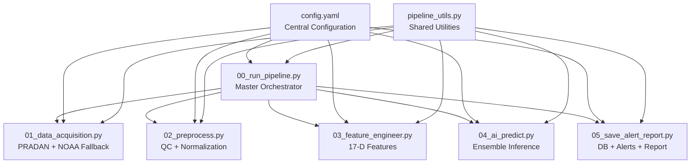
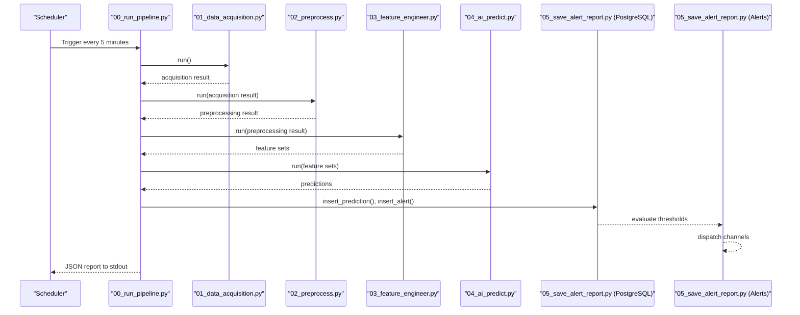
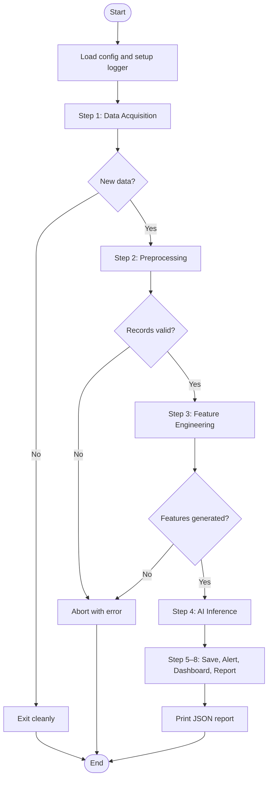
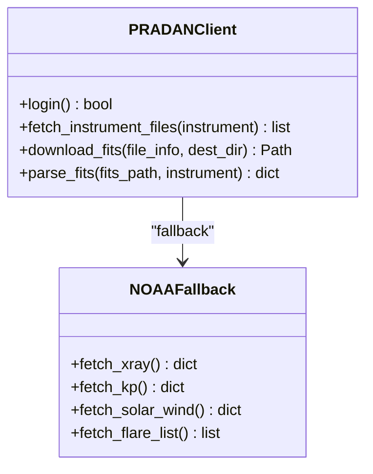
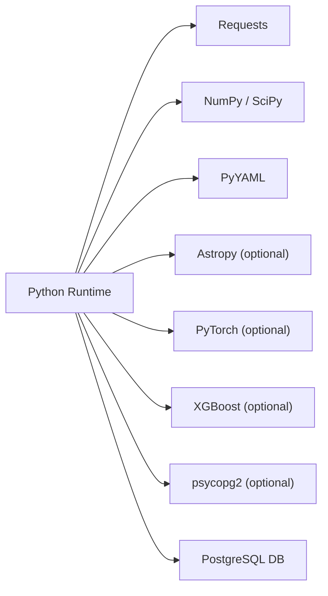
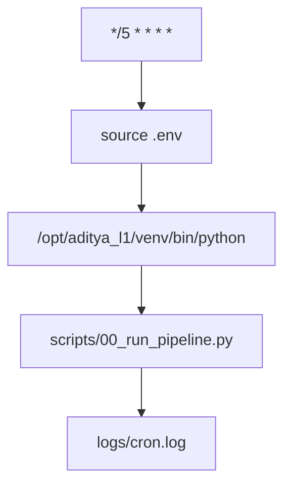

# Deployment Guide

<cite>
**Referenced Files in This Document**
- [README.md](file://README.md)
- [config.yaml](file://config.yaml)
- [00_run_pipeline.py](file://00_run_pipeline.py)
- [01_data_acquisition.py](file://01_data_acquisition.py)
- [02_preprocess.py](file://02_preprocess.py)
- [03_feature_engineer.py](file://03_feature_engineer.py)
- [04_ai_predict.py](file://04_ai_predict.py)
- [05_save_alert_report.py](file://05_save_alert_report.py)
- [pipeline_utils.py](file://pipeline_utils.py)
</cite>

## Table of Contents
1. [Introduction](#introduction)
2. [Project Structure](#project-structure)
3. [Core Components](#core-components)
4. [Architecture Overview](#architecture-overview)
5. [Detailed Component Analysis](#detailed-component-analysis)
6. [Dependency Analysis](#dependency-analysis)
7. [Production Environment Setup](#production-environment-setup)
8. [Security Hardening](#security-hardening)
9. [Performance Optimization](#performance-optimization)
10. [CRON Job Configuration](#cron-job-configuration)
11. [Environment Management](#environment-management)
12. [Scaling Considerations](#scaling-considerations)
13. [Backup and Recovery](#backup-and-recovery)
14. [Monitoring and Observability](#monitoring-and-observability)
15. [Deployment Checklists](#deployment-checklists)
16. [Rollback Procedures](#rollback-procedures)
17. [Operational Runbooks](#operational-runbooks)
18. [Integration with IT Infrastructure](#integration-with-it-infrastructure)
19. [Compliance Requirements](#compliance-requirements)
20. [Conclusion](#conclusion)

## Introduction
This guide documents the production deployment of the Aditya-L1 Solar Flare Forecasting Pipeline. It covers environment setup, security hardening, performance tuning, automated pipeline execution via CRON, environment management, scaling, backup/recovery, monitoring, and operational procedures tailored for space weather forecasting operations.

## Project Structure
The pipeline is organized as a modular Python application with a master orchestrator and step-specific modules. Configuration is centralized in a YAML file with environment variable expansion support.

**Diagram sources**
- [00_run_pipeline.py:1-146](file://00_run_pipeline.py#L1-L146)
- [config.yaml:1-104](file://config.yaml#L1-L104)
- [pipeline_utils.py:1-123](file://pipeline_utils.py#L1-L123)

**Section sources**
- [README.md:7-32](file://README.md#L7-L32)
- [config.yaml:6-104](file://config.yaml#L6-L104)

## Core Components
- Master Orchestrator: Executes pipeline steps sequentially with retries and error handling.
- Data Acquisition: Fetches native Aditya-L1 data from PRADAN with fallback to NOAA SWPC.
- Preprocessing: Validates, cleans, normalizes, and aligns multi-source observations.
- Feature Engineering: Builds 17-dimensional feature vectors and temporal sequences.
- AI Inference: Ensemble of LSTM, GRU, Transformer, and XGBoost with surrogate fallback.
- Persistence and Alerts: Writes predictions to PostgreSQL, evaluates thresholds, dispatches alerts, and generates JSON reports.

**Section sources**
- [00_run_pipeline.py:41-142](file://00_run_pipeline.py#L41-L142)
- [01_data_acquisition.py:50-452](file://01_data_acquisition.py#L50-L452)
- [02_preprocess.py:45-409](file://02_preprocess.py#L45-L409)
- [03_feature_engineer.py:52-249](file://03_feature_engineer.py#L52-L249)
- [04_ai_predict.py:63-448](file://04_ai_predict.py#L63-L448)
- [05_save_alert_report.py:47-502](file://05_save_alert_report.py#L47-L502)

## Architecture Overview
End-to-end flow from scheduled triggers to persistence and alerting.

**Diagram sources**
- [00_run_pipeline.py:72-121](file://00_run_pipeline.py#L72-L121)
- [01_data_acquisition.py:350-452](file://01_data_acquisition.py#L350-L452)
- [02_preprocess.py:230-409](file://02_preprocess.py#L230-L409)
- [03_feature_engineer.py:199-249](file://03_feature_engineer.py#L199-L249)
- [04_ai_predict.py:402-448](file://04_ai_predict.py#L402-L448)
- [05_save_alert_report.py:452-502](file://05_save_alert_report.py#L452-L502)

## Detailed Component Analysis

### Master Orchestrator (00_run_pipeline.py)
- Orchestrates pipeline steps with timing, retries, and error handling.
- Supports early exit when no new data is available.
- Logs failures and persists state for next run awareness.

**Diagram sources**
- [00_run_pipeline.py:63-142](file://00_run_pipeline.py#L63-L142)

**Section sources**
- [00_run_pipeline.py:41-142](file://00_run_pipeline.py#L41-L142)

### Data Acquisition (01_data_acquisition.py)
- PRADAN client authenticates and downloads L1 FITS files.
- NOAA SWPC fallback provides real-time proxies for SoLEXS and ancillary data.
- Deduplicates records using checksums stored in persistent state.

**Diagram sources**
- [01_data_acquisition.py:50-325](file://01_data_acquisition.py#L50-L325)

**Section sources**
- [01_data_acquisition.py:50-452](file://01_data_acquisition.py#L50-L452)

### Preprocessing (02_preprocess.py)
- Validates records, detects gaps, clips outliers, interpolates missing values.
- Normalizes fluxes and derives HEL1OS features from spectral model when needed.
- Synchronizes instruments and prepares normalized time series.

**Section sources**
- [02_preprocess.py:45-409](file://02_preprocess.py#L45-L409)

### Feature Engineering (03_feature_engineer.py)
- Extracts 17-dimensional feature vector and builds temporal sequences.
- Computes rolling statistics, percentile ranks, and derived ratios.

**Section sources**
- [03_feature_engineer.py:52-249](file://03_feature_engineer.py#L52-L249)

### AI Inference (04_ai_predict.py)
- Loads trained models if available; otherwise uses calibrated surrogates.
- Implements weighted ensemble inference and computes derived quantities (CME, onset, geomagnetic risk).

**Section sources**
- [04_ai_predict.py:63-448](file://04_ai_predict.py#L63-L448)

### Persistence and Alerts (05_save_alert_report.py)
- Creates tables on first run and inserts predictions and alerts.
- Evaluates thresholds and dispatches alerts via log/email/webhook.
- Generates structured JSON report consumable by downstream systems.

**Section sources**
- [05_save_alert_report.py:47-502](file://05_save_alert_report.py#L47-L502)

## Dependency Analysis
- Python runtime and libraries are declared in the quick-start instructions.
- Optional deep learning and ML libraries enable model loading; surrogates are used when unavailable.
- PostgreSQL driver enables persistence; simulation mode when unavailable.

**Diagram sources**
- [README.md:44-58](file://README.md#L44-L58)

**Section sources**
- [README.md:44-58](file://README.md#L44-L58)

## Production Environment Setup

### Server Requirements
- Operating System: Linux (Ubuntu/CentOS recommended).
- CPU: Multi-core capable of handling concurrent preprocessing and inference.
- Memory: Minimum 8 GB RAM; 16+ GB recommended for GPU acceleration.
- Storage: SSD-backed disk for fast I/O; sufficient capacity for raw/processed/features and logs.
- Network: Outbound access to PRADAN and NOAA endpoints; inbound access for alert webhooks if applicable.

### Software Stack
- Python 3.8+ with virtual environment isolation.
- PostgreSQL 12+ for persistence.
- Optional: CUDA-enabled PyTorch for GPU acceleration.

**Section sources**
- [README.md:38-58](file://README.md#L38-L58)
- [README.md:87-95](file://README.md#L87-L95)

## Security Hardening
- Secrets Management
  - Store credentials in environment variables (.env) and restrict file permissions.
  - Use OS-level secret stores or vault integrations for production deployments.
- Least Privilege
  - Run pipeline under dedicated service account with minimal filesystem privileges.
  - Limit network egress to required endpoints only.
- Transport Security
  - Enforce TLS for database connections and external API calls.
- Audit Logging
  - Enable system audit logs for sensitive operations.

[No sources needed since this section provides general guidance]

## Performance Optimization
- Concurrency and Parallelism
  - Use separate worker processes for independent runs if scaling horizontally.
- I/O Optimization
  - Prefer SSD storage; compress logs and archive old raw data.
- Model Inference
  - Enable GPU acceleration when available; tune batch sizes and memory usage.
- Data Processing
  - Minimize redundant computations; reuse intermediate artifacts via state files.

[No sources needed since this section provides general guidance]

## CRON Job Configuration
- Primary Pipeline Execution
  - Schedule every 5 minutes to align with data cadence.
  - Source environment and activate virtual environment before invoking the orchestrator.
- Retraining
  - Schedule nightly model retraining at 2 AM.
- Resource Limits
  - Use ulimit and systemd service limits to constrain memory and CPU usage.
- Monitoring
  - Redirect stdout/stderr to dedicated log files for ingestion by log collectors.

**Diagram sources**
- [README.md:114-133](file://README.md#L114-L133)

**Section sources**
- [README.md:114-133](file://README.md#L114-L133)
- [config.yaml:9-10](file://config.yaml#L9-L10)

## Environment Management
- Credential Storage
  - PRADAN credentials, database credentials, SMTP host, and webhook URL are sourced from environment variables.
- Configuration Deployment
  - Centralize configuration in config.yaml with environment variable placeholders.
  - Use configuration management tools to deploy and rotate secrets.
- State Persistence
  - Pipeline state is persisted to a JSON file to coordinate between runs.

**Section sources**
- [README.md:62-83](file://README.md#L62-L83)
- [config.yaml:16-96](file://config.yaml#L16-L96)
- [pipeline_utils.py:82-96](file://pipeline_utils.py#L82-L96)

## Scaling Considerations
- Horizontal Scaling
  - Deploy multiple pipeline instances behind a scheduler to distribute load.
- Vertical Scaling
  - Increase CPU/memory resources for heavy preprocessing/inference tasks.
- Load Balancing
  - Use a queue-based system (e.g., Celery) to decouple scheduling from execution.
- Resource Allocation
  - Reserve dedicated CPU cores for model inference; limit concurrent database writes.

[No sources needed since this section provides general guidance]

## Backup and Recovery
- Data Backups
  - Regular PostgreSQL logical backups with point-in-time recovery.
  - Archive raw and processed datasets offsite.
- Disaster Recovery
  - Maintain immutable snapshots of trained models.
  - Test restoration procedures quarterly.
- Maintenance Windows
  - Schedule maintenance during low-space-weather activity periods.

[No sources needed since this section provides general guidance]

## Monitoring and Observability
- Logging
  - Daily rotating logs per module; centralize with syslog or ELK stack.
- Metrics
  - Track pipeline duration, throughput, alert frequencies, and database latency.
- Alerting
  - Integrate with monitoring systems to notify on failures and SLA breaches.

[No sources needed since this section provides general guidance]

## Deployment Checklists
- Pre-deployment
  - Verify environment variables and database connectivity.
  - Confirm model files placement and library availability.
- First Run
  - Execute manual pipeline run to initialize database schema.
- Go-Live
  - Enable CRON jobs, configure alerts, and monitor initial runs.
- Ongoing
  - Review logs, metrics, and alert history weekly.

[No sources needed since this section provides general guidance]

## Rollback Procedures
- Revert to Previous Version
  - Keep previous release artifacts and switch symlinked paths.
- Database Rollback
  - Restore from last known good backup; re-run pipeline to reconcile state.
- Temporary Disable
  - Pause CRON jobs and revert to manual execution until issues are resolved.

[No sources needed since this section provides general guidance]

## Operational Runbooks
- Common Issues
  - PRADAN authentication failures: verify credentials and network access.
  - Missing models: ensure model files are present or rely on surrogates.
  - Database connection errors: check credentials and firewall rules.
- Escalation
  - Define escalation matrix for different severities of alerts.

[No sources needed since this section provides general guidance]

## Integration with IT Infrastructure
- Identity and Access Management
  - Integrate with enterprise identity providers for credential management.
- Network Segmentation
  - Place pipeline in DMZ or secure segment with controlled egress.
- SIEM Integration
  - Forward logs and alerts to SIEM for correlation and incident response.

[No sources needed since this section provides general guidance]

## Compliance Requirements
- Data Handling
  - Ensure adherence to data export/import regulations for PRADAN and NOAA data.
- Audit Trails
  - Maintain logs of all pipeline executions and alert dispatches.
- Security Controls
  - Align with organizational security baselines and periodic assessments.

[No sources needed since this section provides general guidance]

## Conclusion
This guide provides a comprehensive blueprint for deploying the Aditya-L1 Solar Flare Forecasting Pipeline in production. By following the outlined practices for environment setup, security, performance, automation, monitoring, and operations, you can achieve reliable, scalable, and compliant space weather forecasting capabilities.