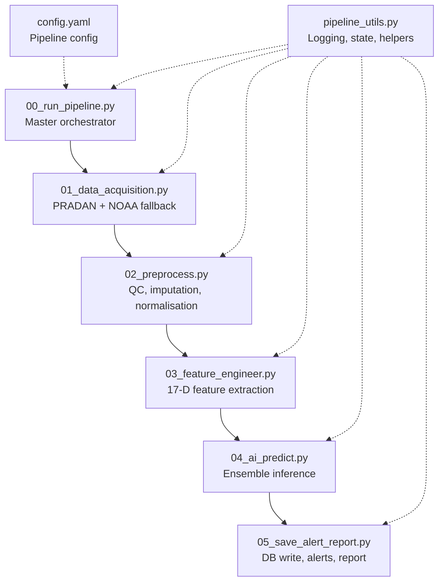
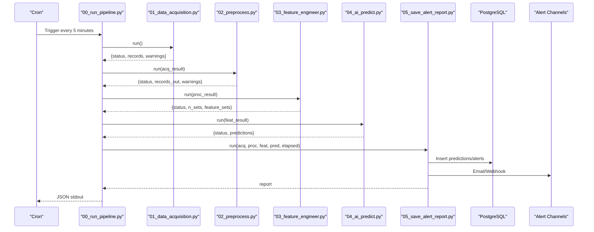
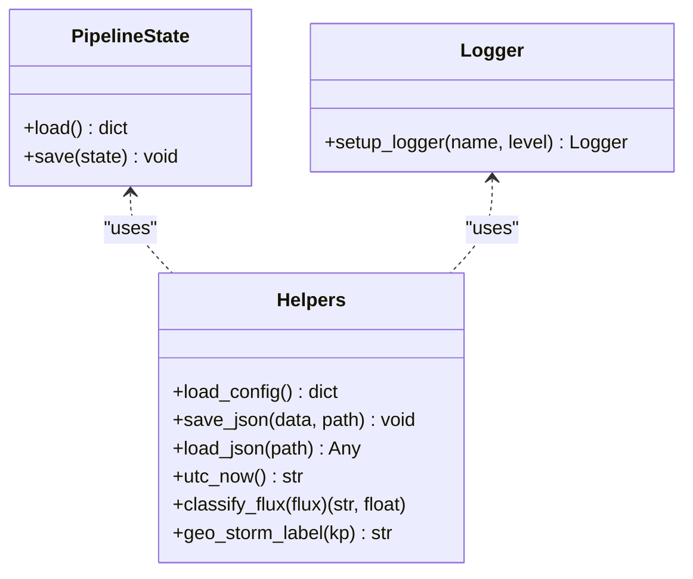
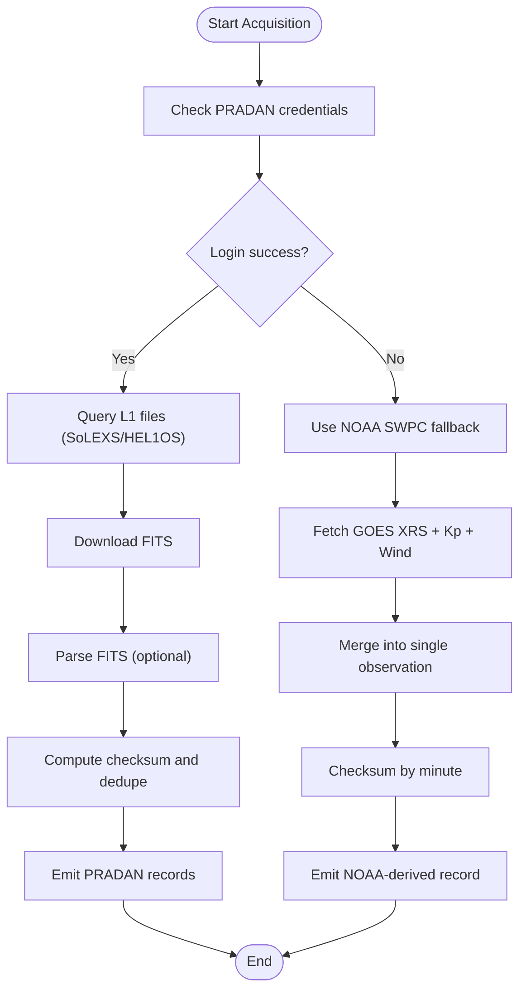
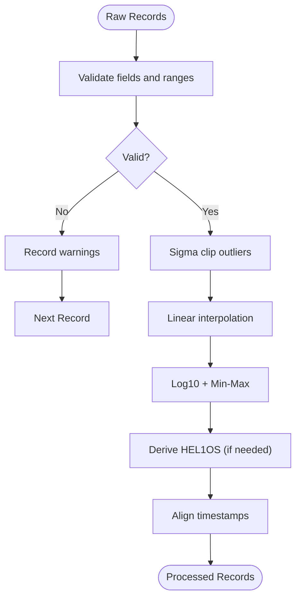
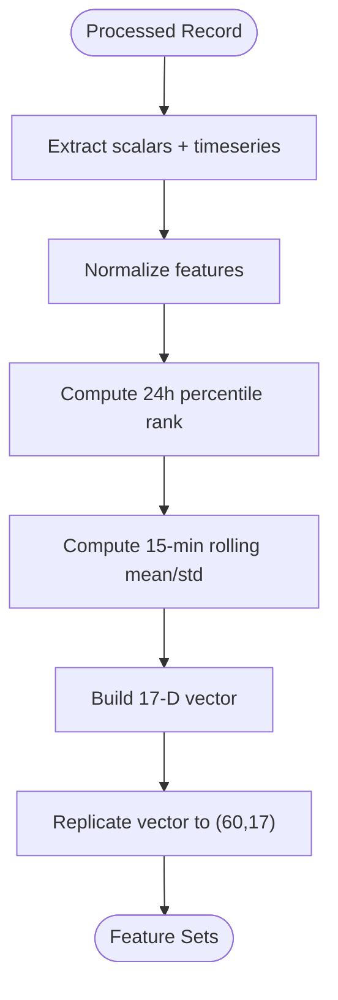
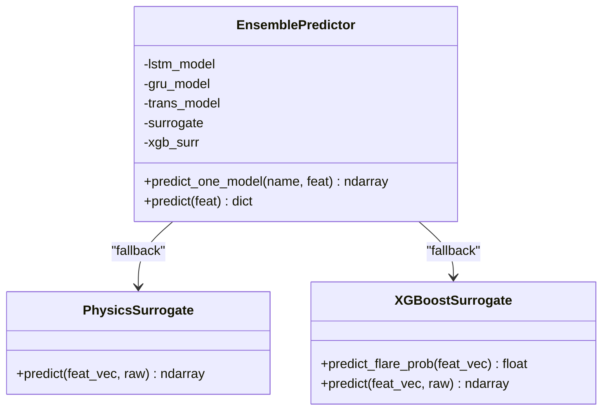
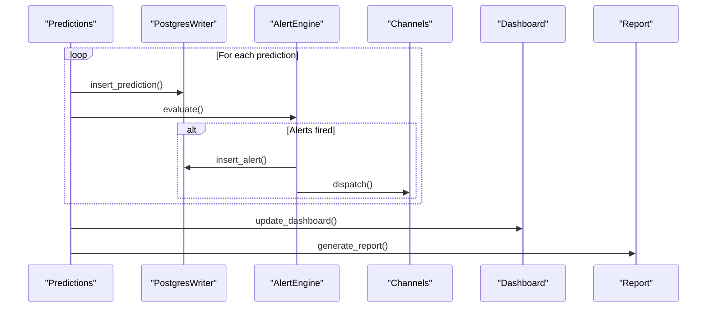
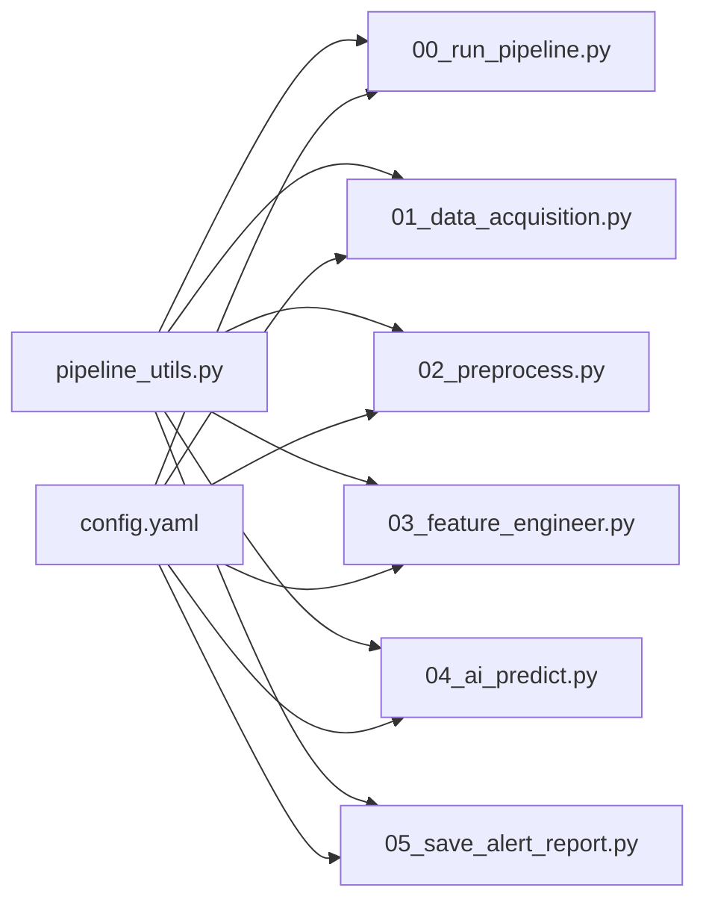

# Development Guide

<cite>
**Referenced Files in This Document**
- [README.md](file://README.md)
- [config.yaml](file://config.yaml)
- [pipeline_utils.py](file://pipeline_utils.py)
- [00_run_pipeline.py](file://00_run_pipeline.py)
- [01_data_acquisition.py](file://01_data_acquisition.py)
- [02_preprocess.py](file://02_preprocess.py)
- [03_feature_engineer.py](file://03_feature_engineer.py)
- [04_ai_predict.py](file://04_ai_predict.py)
- [05_save_alert_report.py](file://05_save_alert_report.py)
</cite>

## Table of Contents
1. [Introduction](#introduction)
2. [Project Structure](#project-structure)
3. [Core Components](#core-components)
4. [Architecture Overview](#architecture-overview)
5. [Detailed Component Analysis](#detailed-component-analysis)
6. [Dependency Analysis](#dependency-analysis)
7. [Performance Considerations](#performance-considerations)
8. [Testing Procedures](#testing-procedures)
9. [Model Development Workflows](#model-development-workflows)
10. [Contribution Guidelines](#contribution-guidelines)
11. [Development Environment Setup](#development-environment-setup)
12. [Debugging and Profiling](#debugging-and-profiling)
13. [Common Development Tasks](#common-development-tasks)
14. [Release Procedures and Versioning](#release-procedures-and-versioning)
15. [Troubleshooting Guide](#troubleshooting-guide)
16. [Conclusion](#conclusion)

## Introduction
This guide documents the Aditya-L1 Solar Flare Forecasting Pipeline for contributors and extension developers. It explains the modular architecture, coding standards, development workflow, testing procedures, model development, and operational practices. The pipeline integrates real-time data from ISRO PRADAN and NOAA SWPC, validates and preprocesses observations, extracts AI-ready features, runs an ensemble of machine learning models, evaluates alert thresholds, persists results to PostgreSQL, and emits structured JSON reports.

## Project Structure
The repository follows a linear, stepwise pipeline with explicit entry points and shared utilities. Each step is a standalone script that reads previous outputs from disk via a lightweight state mechanism and writes its own artifacts to dedicated directories.

**Diagram sources**
- [00_run_pipeline.py:1-146](file://00_run_pipeline.py#L1-L146)
- [01_data_acquisition.py:1-458](file://01_data_acquisition.py#L1-L458)
- [02_preprocess.py:1-422](file://02_preprocess.py#L1-L422)
- [03_feature_engineer.py:1-265](file://03_feature_engineer.py#L1-L265)
- [04_ai_predict.py:1-466](file://04_ai_predict.py#L1-L466)
- [05_save_alert_report.py:1-507](file://05_save_alert_report.py#L1-L507)
- [config.yaml:1-104](file://config.yaml#L1-L104)
- [pipeline_utils.py:1-123](file://pipeline_utils.py#L1-L123)

**Section sources**
- [README.md:7-32](file://README.md#L7-L32)
- [00_run_pipeline.py:13-24](file://00_run_pipeline.py#L13-L24)
- [config.yaml:6-104](file://config.yaml#L6-L104)
- [pipeline_utils.py:17-22](file://pipeline_utils.py#L17-L22)

## Core Components
- Shared utilities: centralized logging, state persistence, JSON I/O, classification helpers, and UTC timestamping.
- Data acquisition: PRADAN client with FITS download and optional parsing; NOAA fallback for proxies and ancillary data.
- Preprocessing: validation, outlier removal, interpolation, normalization, and HEL1OS derivation from spectral model.
- Feature engineering: 17-dimensional feature extraction and temporal sequence construction.
- AI prediction: ensemble of LSTM, GRU, Transformer, and XGBoost with surrogate fallbacks.
- Persistence and alerts: PostgreSQL writer (schema creation), alert evaluation, dispatch to channels, dashboard payload, and structured JSON report.

**Section sources**
- [pipeline_utils.py:25-123](file://pipeline_utils.py#L25-L123)
- [01_data_acquisition.py:50-193](file://01_data_acquisition.py#L50-L193)
- [02_preprocess.py:45-224](file://02_preprocess.py#L45-L224)
- [03_feature_engineer.py:52-193](file://03_feature_engineer.py#L52-L193)
- [04_ai_predict.py:63-395](file://04_ai_predict.py#L63-L395)
- [05_save_alert_report.py:47-333](file://05_save_alert_report.py#L47-L333)

## Architecture Overview
The pipeline is a cron-driven, modular workflow with explicit step boundaries and shared state. Each step writes intermediate artifacts and updates a small JSON state file to coordinate retries and deduplication across runs.

**Diagram sources**
- [00_run_pipeline.py:72-121](file://00_run_pipeline.py#L72-L121)
- [01_data_acquisition.py:350-452](file://01_data_acquisition.py#L350-L452)
- [02_preprocess.py:230-409](file://02_preprocess.py#L230-L409)
- [03_feature_engineer.py:199-249](file://03_feature_engineer.py#L199-L249)
- [04_ai_predict.py:402-448](file://04_ai_predict.py#L402-L448)
- [05_save_alert_report.py:452-502](file://05_save_alert_report.py#L452-L502)

## Detailed Component Analysis

### Shared Utilities and State Management
- Centralized YAML config loader with environment variable expansion.
- Rotating daily loggers with console and file handlers.
- Persistent state stored as a small JSON file to coordinate deduplication and cross-step continuity.
- Classification and geostorm labeling helpers.

**Diagram sources**
- [pipeline_utils.py:82-123](file://pipeline_utils.py#L82-L123)

**Section sources**
- [pipeline_utils.py:25-123](file://pipeline_utils.py#L25-L123)

### Data Acquisition (PRADAN + NOAA)
- PRADANClient handles login, file discovery, download, and optional FITS parsing into structured records.
- NOAAFallback fetches GOES XRS, Kp index, solar wind, and recent flares; constructs a merged observation record when native data is unavailable.
- Deduplication via checksums stored in state; handles 1-minute granularity for fallback mode.

**Diagram sources**
- [01_data_acquisition.py:50-452](file://01_data_acquisition.py#L50-L452)

**Section sources**
- [01_data_acquisition.py:50-452](file://01_data_acquisition.py#L50-L452)

### Preprocessing and Validation
- DataValidator enforces presence of timestamps and instrument-appropriate fields; performs gap detection on timeseries.
- Preprocessor applies sigma clipping, linear interpolation, log10 normalization, and min-max scaling; derives HEL1OS bands from spectral model when needed; aligns instruments by timestamp tolerance.

**Diagram sources**
- [02_preprocess.py:45-224](file://02_preprocess.py#L45-L224)

**Section sources**
- [02_preprocess.py:45-409](file://02_preprocess.py#L45-L409)

### Feature Engineering
- Extracts 17-dimensional vector and builds a 60×17 sequence tensor by repeating scalar features and overriding the first channel with the time-varying flux series.
- Uses percentile ranking, rolling statistics, and normalized physical quantities.

**Diagram sources**
- [03_feature_engineer.py:52-193](file://03_feature_engineer.py#L52-L193)

**Section sources**
- [03_feature_engineer.py:52-249](file://03_feature_engineer.py#L52-L249)

### AI Ensemble Inference
- Loads optional PyTorch models (LSTM, GRU, Transformer) and XGBoost; otherwise uses calibrated physics surrogates.
- Computes weighted ensemble, CME probability, onset time estimation, geostorm risk, and confidence score.

**Diagram sources**
- [04_ai_predict.py:246-395](file://04_ai_predict.py#L246-L395)

**Section sources**
- [04_ai_predict.py:63-448](file://04_ai_predict.py#L63-L448)

### Persistence, Alerts, Dashboard, and Reports
- PostgresWriter creates tables on first run, inserts predictions and alerts, and closes connections.
- AlertEngine evaluates thresholds and dispatches to configured channels (email/webhook).
- Dashboard stub prepares payload for WebSocket/Redis push.
- generate_report produces a canonical JSON report for automation and downstream systems.

**Diagram sources**
- [05_save_alert_report.py:47-502](file://05_save_alert_report.py#L47-L502)

**Section sources**
- [05_save_alert_report.py:47-502](file://05_save_alert_report.py#L47-L502)

## Dependency Analysis
- Internal dependencies: each step imports shared utilities; steps communicate via filesystem and state.
- External libraries: requests, numpy, scipy, astropy (optional), psycopg2 (optional), torch, xgboost.
- Configuration-driven: all paths, thresholds, and model parameters are defined in config.yaml.

**Diagram sources**
- [pipeline_utils.py:1-123](file://pipeline_utils.py#L1-L123)
- [00_run_pipeline.py:1-35](file://00_run_pipeline.py#L1-L35)
- [01_data_acquisition.py:34-37](file://01_data_acquisition.py#L34-L37)
- [02_preprocess.py:26-29](file://02_preprocess.py#L26-L29)
- [03_feature_engineer.py:35-38](file://03_feature_engineer.py#L35-L38)
- [04_ai_predict.py:32-35](file://04_ai_predict.py#L32-L35)
- [05_save_alert_report.py:32-35](file://05_save_alert_report.py#L32-L35)
- [config.yaml:1-104](file://config.yaml#L1-L104)

**Section sources**
- [config.yaml:6-104](file://config.yaml#L6-L104)

## Performance Considerations
- Logging: rotating daily logs reduce disk overhead; keep log level appropriate for environment.
- Deduplication: checksums prevent redundant processing; limit retained history to recent entries.
- Interpolation and normalization: linear interpolation and bounded scaling minimize runtime overhead.
- Ensemble inference: optional PyTorch/XGBoost; fallback surrogates ensure minimal latency when models are unavailable.
- Database writes: batched inserts and idempotent schema creation reduce contention.

[No sources needed since this section provides general guidance]

## Testing Procedures
- Unit tests: validate individual components (validators, preprocessors, feature extractors) with synthetic datasets.
- Integration tests: run end-to-end pipeline with mocked network responses and a temporary database to verify artifact flow and schema creation.
- End-to-end validation: execute a full pipeline run against a known dataset, compare JSON report fields to expected ranges, and confirm alert thresholds are evaluated correctly.

[No sources needed since this section provides general guidance]

## Model Development Workflows
- Training data preparation: collect aligned SoLEXS/HEL1OS observations and ancillary indices; split into train/validation/test sets respecting temporal order.
- Model evaluation: track class-wise precision/recall, ROC AUC, and reliability diagrams; compute onset time error metrics.
- Deployment: package model weights into models/ with names matching config; ensure surrogate fallback remains functional.

[No sources needed since this section provides general guidance]

## Contribution Guidelines
- Branch management: develop features in topic branches; merge via pull requests targeting main after review.
- Coding standards: follow Python conventions; type hints where helpful; docstrings for public APIs; consistent logging.
- Commit hygiene: atomic commits with clear messages; include rationale and impact.
- Pull request process: request reviews from maintainers; address comments promptly; add tests and update docs as needed.

[No sources needed since this section provides general guidance]

## Development Environment Setup
- Virtual environment and dependencies: create a virtual environment and install required packages as documented.
- Environment variables: configure PRADAN credentials, database connection, and optional alert endpoints.
- Database: create database and user; schema is created automatically on first run.
- Cron: schedule the master orchestrator to run every 5 minutes; schedule nightly retraining if applicable.

**Section sources**
- [README.md:38-133](file://README.md#L38-L133)

## Debugging and Profiling
- Logging: enable INFO/WARNING/ERROR levels; inspect daily log files for step timings and errors.
- State inspection: examine the pipeline state JSON to diagnose deduplication and continuity issues.
- Network diagnostics: test PRADAN login and NOAA endpoints independently.
- Profiling: measure step durations printed by the orchestrator; profile hotspots with standard Python profilers.

**Section sources**
- [00_run_pipeline.py:41-61](file://00_run_pipeline.py#L41-L61)
- [pipeline_utils.py:43-64](file://pipeline_utils.py#L43-L64)

## Common Development Tasks
- Adding new data sources: implement a new client class similar to PRADANClient/NOAAFallback; integrate into acquisition step and update state handling.
- Implementing custom alert channels: extend AlertEngine to support new channels (e.g., Slack, PagerDuty) following existing dispatch patterns.
- Extending feature engineering: add new derived features in FeatureEngineer; update normalization ranges and sequence construction as needed.

[No sources needed since this section provides general guidance]

## Release Procedures and Versioning
- Versioning: increment pipeline version in config.yaml; tag releases accordingly.
- Backward compatibility: maintain config keys and JSON report schema; deprecate old keys with migration notes.
- Release checklist: verify cron jobs, database schema, alert channels, and sample JSON report.

**Section sources**
- [config.yaml:8](file://config.yaml#L8)
- [README.md:175-185](file://README.md#L175-L185)

## Troubleshooting Guide
- No new data: acquisition returns “NO_NEW_DATA” when checksums match; verify deduplication and fallback logic.
- Data source failures: PRADAN login failures or NOAA endpoint timeouts; check credentials and network connectivity.
- Preprocessing failures: validation errors indicate missing fields or out-of-range values; adjust QC thresholds or data quality.
- Prediction errors: ensemble prediction failures fall back to surrogates; ensure surrogate logic remains intact.
- Database write failures: psycopg2 not installed or connection errors; install driver or fix credentials.

**Section sources**
- [01_data_acquisition.py:392-424](file://01_data_acquisition.py#L392-L424)
- [02_preprocess.py:258-263](file://02_preprocess.py#L258-L263)
- [04_ai_predict.py:317-320](file://04_ai_predict.py#L317-L320)
- [05_save_alert_report.py:121-141](file://05_save_alert_report.py#L121-L141)

## Conclusion
This guide provides a comprehensive overview of the pipeline’s architecture, development practices, and operational procedures. By following the modular design, shared utilities, and documented workflows, contributors can safely extend functionality, add new data sources, and improve model performance while maintaining reliability and observability.