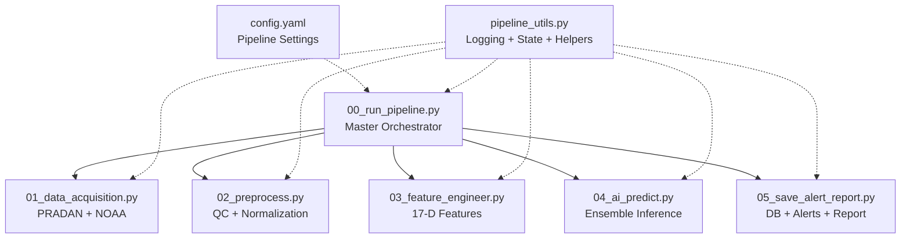
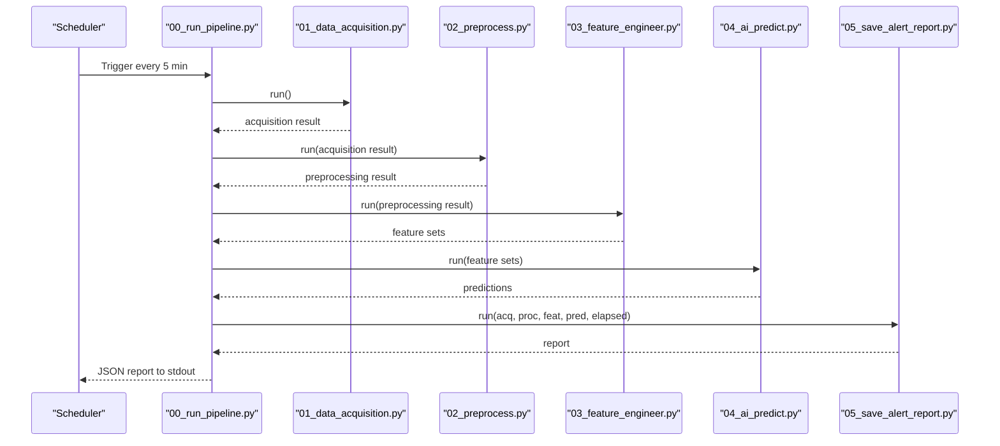
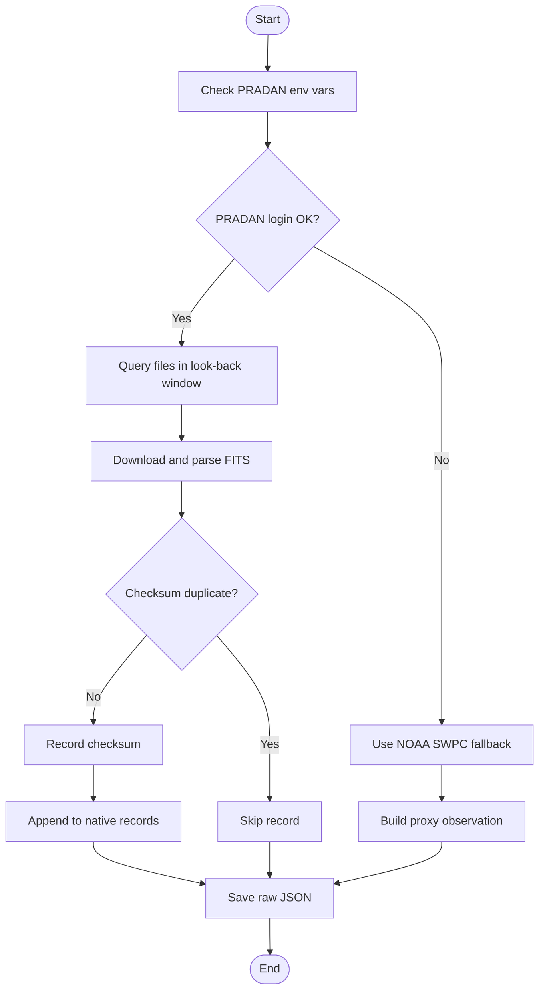
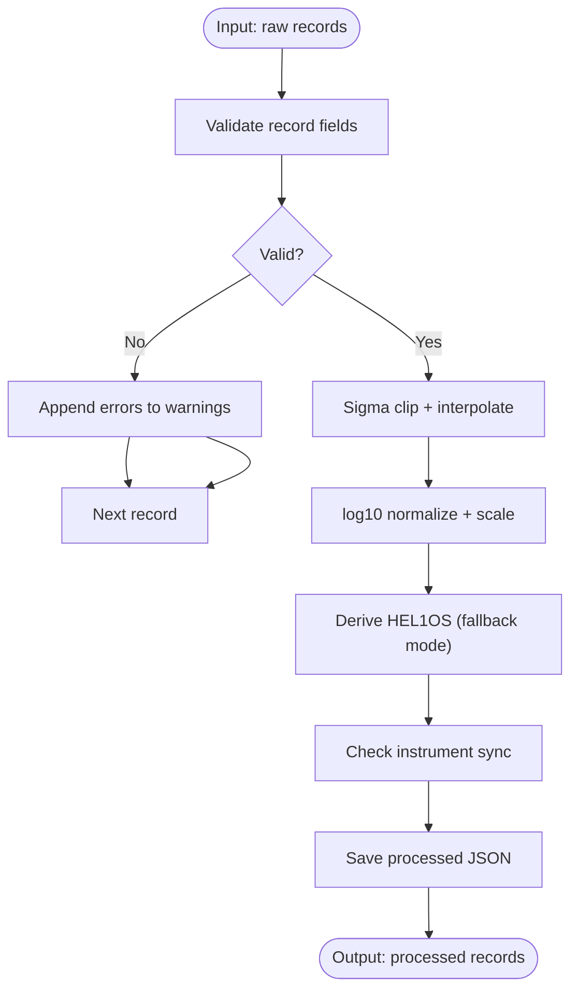
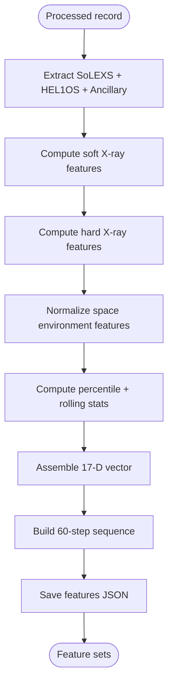
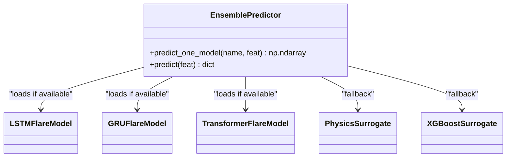
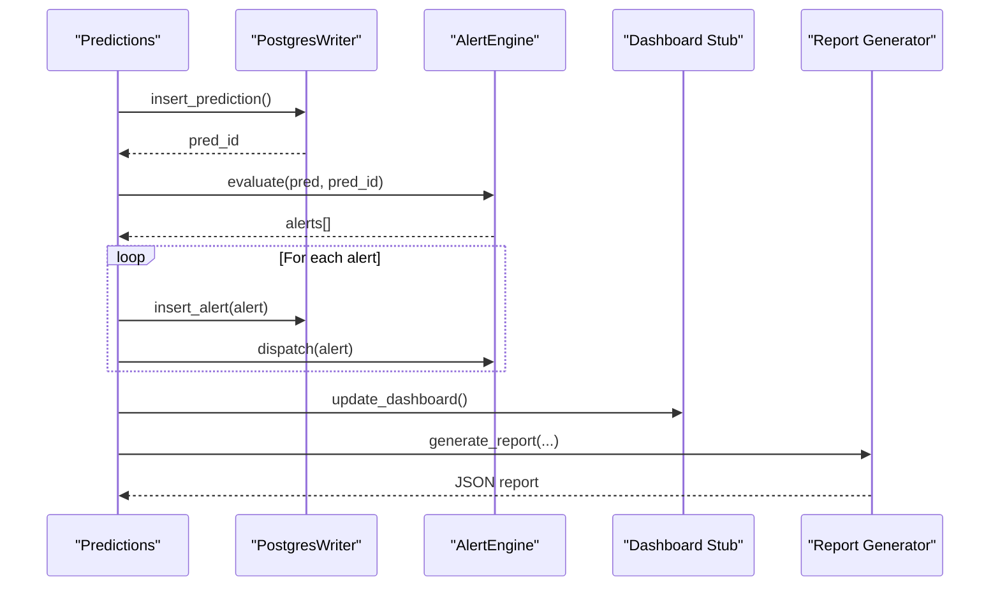
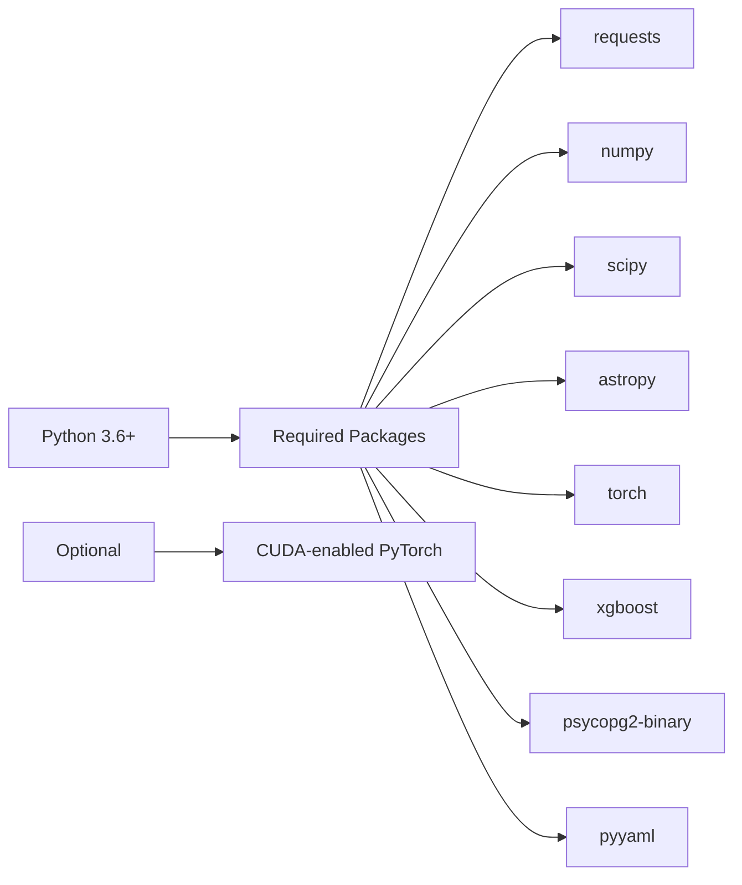

# Getting Started

<cite>
**Referenced Files in This Document**
- [README.md](file://README.md)
- [config.yaml](file://config.yaml)
- [00_run_pipeline.py](file://00_run_pipeline.py)
- [01_data_acquisition.py](file://01_data_acquisition.py)
- [02_preprocess.py](file://02_preprocess.py)
- [03_feature_engineer.py](file://03_feature_engineer.py)
- [04_ai_predict.py](file://04_ai_predict.py)
- [05_save_alert_report.py](file://05_save_alert_report.py)
- [pipeline_utils.py](file://pipeline_utils.py)
</cite>

## Table of Contents
1. [Introduction](#introduction)
2. [Project Structure](#project-structure)
3. [Prerequisites and Environment Setup](#prerequisites-and-environment-setup)
4. [Installation and First-Time Setup](#installation-and-first-time-setup)
5. [Environment Variables and Configuration](#environment-variables-and-configuration)
6. [PostgreSQL Database Setup](#postgresql-database-setup)
7. [Manual Execution Examples](#manual-execution-examples)
8. [CRON Job Automation](#cron-job-automation)
9. [Core Components](#core-components)
10. [Architecture Overview](#architecture-overview)
11. [Detailed Component Analysis](#detailed-component-analysis)
12. [Dependency Analysis](#dependency-analysis)
13. [Performance Considerations](#performance-considerations)
14. [Troubleshooting Guide](#troubleshooting-guide)
15. [First-Run Verification Checklist](#first-run-verification-checklist)
16. [Conclusion](#conclusion)

## Introduction
This guide helps you deploy and operate the Aditya-L1 Solar Flare Forecasting Pipeline. It covers prerequisites, environment setup, database configuration, manual execution, automation via CRON, and first-run verification. The pipeline ingests native Aditya-L1 data (via PRADAN) or NOAA SWPC proxies, validates and normalizes measurements, extracts 17-dimensional features, runs an AI ensemble, evaluates alert thresholds, persists results to PostgreSQL, and emits a structured JSON report.

## Project Structure
The pipeline consists of a master orchestrator and five processing stages, plus shared utilities and configuration.

**Diagram sources**
- [00_run_pipeline.py:1-146](file://00_run_pipeline.py#L1-L146)
- [01_data_acquisition.py:1-458](file://01_data_acquisition.py#L1-L458)
- [02_preprocess.py:1-422](file://02_preprocess.py#L1-L422)
- [03_feature_engineer.py:1-265](file://03_feature_engineer.py#L1-L265)
- [04_ai_predict.py:1-466](file://04_ai_predict.py#L1-L466)
- [05_save_alert_report.py:1-507](file://05_save_alert_report.py#L1-L507)
- [config.yaml:1-104](file://config.yaml#L1-L104)
- [pipeline_utils.py:1-123](file://pipeline_utils.py#L1-L123)

**Section sources**
- [README.md:7-32](file://README.md#L7-L32)
- [00_run_pipeline.py:13-24](file://00_run_pipeline.py#L13-L24)

## Prerequisites and Environment Setup
- Python 3.6 or newer is required.
- Required packages:
  - requests
  - numpy
  - scipy
  - astropy
  - torch
  - xgboost
  - psycopg2-binary
  - pyyaml
- Optional GPU support:
  - Install a CUDA-enabled PyTorch build (see GPU installation note in the quick start).
- Create and activate a virtual environment, then install dependencies as shown in the quick start.

**Section sources**
- [README.md:38-58](file://README.md#L38-L58)

## Installation and First-Time Setup
Follow these steps to prepare your environment:

1. Create a virtual environment and activate it.
2. Install the required Python packages.
3. If using GPU, install the CUDA-enabled PyTorch wheel as indicated.
4. Prepare the configuration file and environment variables (see next sections).
5. Initialize PostgreSQL (see Database Setup).
6. Optionally test manual execution of individual stages.
7. Schedule CRON jobs for automated operation.

**Section sources**
- [README.md:38-58](file://README.md#L38-L58)
- [README.md:87-96](file://README.md#L87-L96)

## Environment Variables and Configuration
Create a .env file with the following variables (do not commit this file):

- PRADAN credentials for native Aditya-L1 data:
  - PRADAN_USERNAME
  - PRADAN_PASSWORD
- PostgreSQL connection:
  - DB_HOST
  - DB_PORT
  - DB_NAME
  - DB_USER
  - DB_PASSWORD
- Optional alert channels:
  - SMTP_HOST
  - ALERT_WEBHOOK_URL

Source the .env before running the pipeline.

Configuration file highlights:
- Pipeline scheduling, logging, retries, and thresholds are defined in config.yaml.
- Data sources, storage directories, normalization, feature windows, and model hyperparameters are configured centrally.
- Alert thresholds and channels are configurable under alerts.

**Section sources**
- [README.md:62-84](file://README.md#L62-L84)
- [config.yaml:6-14](file://config.yaml#L6-L14)
- [config.yaml:15-40](file://config.yaml#L15-L40)
- [config.yaml:62-77](file://config.yaml#L62-L77)
- [config.yaml:79-89](file://config.yaml#L79-L89)
- [config.yaml:91-104](file://config.yaml#L91-L104)

## PostgreSQL Database Setup
Create the database and user, then grant privileges. Tables are created automatically on first run.

SQL commands:
- CREATE DATABASE aditya_l1_sff;
- CREATE USER sff_pipeline WITH PASSWORD 'your_password';
- GRANT ALL PRIVILEGES ON DATABASE aditya_l1_sff TO sff_pipeline;

Schema details:
- Tables are created idempotently on first run, including pipeline_runs, solexs_hel1os_raw, flare_predictions, and flare_alerts.
- Indexes are created for efficient time-range queries.

**Section sources**
- [README.md:87-96](file://README.md#L87-L96)
- [05_save_alert_report.py:49-116](file://05_save_alert_report.py#L49-L116)

## Manual Execution Examples
Run the full pipeline or individual stages:

- Full pipeline (orchestrator):
  - python 00_run_pipeline.py
- Individual stages (for debugging):
  - python 01_data_acquisition.py
  - python 02_preprocess.py
  - python 03_feature_engineer.py
  - python 04_ai_predict.py

Notes:
- Stages write intermediate artifacts to data/raw, data/processed, data/features, and data/reports.
- The orchestrator coordinates retries and error handling.

**Section sources**
- [README.md:99-111](file://README.md#L99-L111)
- [00_run_pipeline.py:41-61](file://00_run_pipeline.py#L41-L61)

## CRON Job Automation
Set up CRON to trigger the pipeline every 5 minutes and nightly retraining:

- Edit crontab:
  - crontab -e
- Add the scheduled entries:
  - Pipeline run: */5 * * * * source /opt/aditya_l1/.env && /opt/aditya_l1/venv/bin/python /opt/aditya_l1/scripts/00_run_pipeline.py >> /opt/aditya_l1/logs/cron.log 2>&1
  - Nightly retrain: 0 2 * * * source /opt/aditya_l1/.env && /opt/aditya_l1/venv/bin/python /opt/aditya_l1/scripts/retrain_models.py >> /opt/aditya_l1/logs/retrain.log 2>&1

Ensure paths match your deployment location.

**Section sources**
- [README.md:114-133](file://README.md#L114-L133)

## Core Components
- Master Orchestrator (00_run_pipeline.py): Coordinates all stages, manages retries, and prints a structured JSON report.
- Data Acquisition (01_data_acquisition.py): Fetches native Aditya-L1 data from PRADAN or falls back to NOAA SWPC JSON feeds.
- Preprocessing (02_preprocess.py): Validates, cleans, normalizes, aligns instruments, and derives HEL1OS features when needed.
- Feature Engineering (03_feature_engineer.py): Builds 17-dimensional feature vectors and temporal sequences.
- AI Inference (04_ai_predict.py): Runs an ensemble of LSTM, GRU, Transformer, and XGBoost; uses surrogates if models are not present.
- Persistence and Alerts (05_save_alert_report.py): Writes to PostgreSQL, evaluates thresholds, dispatches alerts, updates dashboard stub, and generates JSON reports.

**Section sources**
- [00_run_pipeline.py:13-24](file://00_run_pipeline.py#L13-L24)
- [01_data_acquisition.py:8-14](file://01_data_acquisition.py#L8-L14)
- [02_preprocess.py:8-17](file://02_preprocess.py#L8-L17)
- [03_feature_engineer.py:7-27](file://03_feature_engineer.py#L7-L27)
- [04_ai_predict.py:7-24](file://04_ai_predict.py#L7-L24)
- [05_save_alert_report.py:7-13](file://05_save_alert_report.py#L7-L13)

## Architecture Overview
High-level flow from ingestion to reporting:

**Diagram sources**
- [00_run_pipeline.py:63-121](file://00_run_pipeline.py#L63-L121)
- [01_data_acquisition.py:350-452](file://01_data_acquisition.py#L350-L452)
- [02_preprocess.py:230-409](file://02_preprocess.py#L230-L409)
- [03_feature_engineer.py:199-249](file://03_feature_engineer.py#L199-L249)
- [04_ai_predict.py:402-448](file://04_ai_predict.py#L402-L448)
- [05_save_alert_report.py:452-502](file://05_save_alert_report.py#L452-L502)

## Detailed Component Analysis

### Data Acquisition (01_data_acquisition.py)
- PRADAN client authenticates and downloads Level-1 FITS files for SoLEXS and HEL1OS.
- Deduplicates by computing checksums and tracking seen hashes.
- NOAA fallback fetches GOES XRS, Kp index, solar wind, and recent flares.
- Saves raw JSON outputs and updates pipeline state.

**Diagram sources**
- [01_data_acquisition.py:50-193](file://01_data_acquisition.py#L50-L193)
- [01_data_acquisition.py:331-344](file://01_data_acquisition.py#L331-L344)
- [01_data_acquisition.py:350-452](file://01_data_acquisition.py#L350-L452)

**Section sources**
- [01_data_acquisition.py:47-193](file://01_data_acquisition.py#L47-L193)
- [01_data_acquisition.py:327-452](file://01_data_acquisition.py#L327-L452)

### Preprocessing (02_preprocess.py)
- Validates records and detects gaps.
- Applies sigma clipping, linear interpolation, log10 normalization, and min-max scaling.
- Derives HEL1OS rates from SoLEXS and spectral diagnostics when using NOAA fallback.
- Aligns instruments and computes quality metrics.

**Diagram sources**
- [02_preprocess.py:45-120](file://02_preprocess.py#L45-L120)
- [02_preprocess.py:126-224](file://02_preprocess.py#L126-L224)
- [02_preprocess.py:230-409](file://02_preprocess.py#L230-L409)

**Section sources**
- [02_preprocess.py:8-17](file://02_preprocess.py#L8-L17)
- [02_preprocess.py:126-224](file://02_preprocess.py#L126-L224)
- [02_preprocess.py:230-409](file://02_preprocess.py#L230-L409)

### Feature Engineering (03_feature_engineer.py)
- Constructs 17-dimensional feature vector and a (60, 17) sequence tensor.
- Computes percentile rank, rolling statistics, ratios, and normalized indices.
- Provides feature names and raw scalar values for interpretability.

**Diagram sources**
- [03_feature_engineer.py:52-193](file://03_feature_engineer.py#L52-L193)
- [03_feature_engineer.py:199-249](file://03_feature_engineer.py#L199-L249)

**Section sources**
- [03_feature_engineer.py:9-27](file://03_feature_engineer.py#L9-L27)
- [03_feature_engineer.py:52-193](file://03_feature_engineer.py#L52-L193)
- [03_feature_engineer.py:199-249](file://03_feature_engineer.py#L199-L249)

### AI Ensemble Inference (04_ai_predict.py)
- Attempts to load trained models (LSTM, GRU, Transformer, XGBoost).
- Uses physics-informed surrogates if weights are absent.
- Produces class probabilities, CME risk, geomagnetic storm label, onset estimates, and confidence scores.

**Diagram sources**
- [04_ai_predict.py:64-111](file://04_ai_predict.py#L64-L111)
- [04_ai_predict.py:246-395](file://04_ai_predict.py#L246-L395)

**Section sources**
- [04_ai_predict.py:15-24](file://04_ai_predict.py#L15-L24)
- [04_ai_predict.py:246-395](file://04_ai_predict.py#L246-L395)

### Persistence and Alerts (05_save_alert_report.py)
- Creates tables and indexes on first run.
- Inserts predictions and alerts into PostgreSQL (or simulation mode).
- Evaluates thresholds and dispatches alerts via log/email/webhook.
- Generates a structured JSON report and updates dashboard payload stub.

**Diagram sources**
- [05_save_alert_report.py:47-216](file://05_save_alert_report.py#L47-L216)
- [05_save_alert_report.py:222-298](file://05_save_alert_report.py#L222-L298)
- [05_save_alert_report.py:340-425](file://05_save_alert_report.py#L340-L425)

**Section sources**
- [05_save_alert_report.py:7-13](file://05_save_alert_report.py#L7-L13)
- [05_save_alert_report.py:47-216](file://05_save_alert_report.py#L47-L216)
- [05_save_alert_report.py:222-298](file://05_save_alert_report.py#L222-L298)
- [05_save_alert_report.py:340-425](file://05_save_alert_report.py#L340-L425)

## Dependency Analysis
Key runtime dependencies and optional extras:

**Diagram sources**
- [README.md:38-58](file://README.md#L38-L58)

**Section sources**
- [README.md:38-58](file://README.md#L38-L58)

## Performance Considerations
- Use GPU-enabled PyTorch if available to accelerate LSTM/GRU/Transformer inference.
- Ensure sufficient disk space for raw, processed, and feature artifacts.
- Monitor PostgreSQL connection timeouts and indexing for query performance.
- Tune preprocessing parameters (e.g., gap tolerance, outlier thresholds) via config.yaml.

[No sources needed since this section provides general guidance]

## Troubleshooting Guide
Common issues and remedies:

- Missing astropy:
  - Symptom: Cannot parse FITS; warnings logged.
  - Action: pip install astropy.
- Missing psycopg2-binary:
  - Symptom: PostgreSQL writes are simulated; schema not created.
  - Action: pip install psycopg2-binary.
- PRADAN login failures:
  - Symptom: Warnings about login; fallback to NOAA.
  - Action: Verify PRADAN_USERNAME/PASSWORD; check network access to pradan.issdc.gov.in.
- No new data:
  - Symptom: Acquisition reports "NO_NEW_DATA".
  - Action: Wait for next cron cycle; verify deduplication and time windows.
- PostgreSQL connection errors:
  - Symptom: Errors connecting to DB.
  - Action: Confirm DB_HOST, DB_PORT, DB_NAME, DB_USER, DB_PASSWORD; ensure database exists and user has privileges.
- Pipeline failures:
  - Symptom: Failure reported with stack traces.
  - Action: Check logs for the failing stage; inspect environment variables and network connectivity.

**Section sources**
- [01_data_acquisition.py:69-87](file://01_data_acquisition.py#L69-L87)
- [05_save_alert_report.py:121-141](file://05_save_alert_report.py#L121-L141)
- [00_run_pipeline.py:122-141](file://00_run_pipeline.py#L122-L141)

## First-Run Verification Checklist
- Environment:
  - Virtual environment activated.
  - All required packages installed; optional GPU package installed if desired.
  - .env sourced with PRADAN credentials and DB settings.
- Database:
  - PostgreSQL database and user created; privileges granted.
  - First run creates tables and indexes.
- Execution:
  - Run 01_data_acquisition.py; confirm raw JSON saved.
  - Run 02_preprocess.py; confirm processed JSON saved.
  - Run 03_feature_engineer.py; confirm features JSON saved.
  - Run 04_ai_predict.py; confirm predictions generated.
  - Run 00_run_pipeline.py; confirm report printed and saved.
- Alerts:
  - Review alert thresholds and enable channels as needed.
- CRON:
  - Verify crontab entries; check cron.log for output.

**Section sources**
- [README.md:99-133](file://README.md#L99-L133)
- [05_save_alert_report.py:49-116](file://05_save_alert_report.py#L49-L116)

## Conclusion
You now have the essentials to deploy, configure, and operate the Aditya-L1 Solar Flare Forecasting Pipeline. Start with environment setup, database initialization, and manual runs of individual stages. Once verified, automate with CRON and monitor logs and alerts. Adjust thresholds and channels in config.yaml to fit your operational needs.