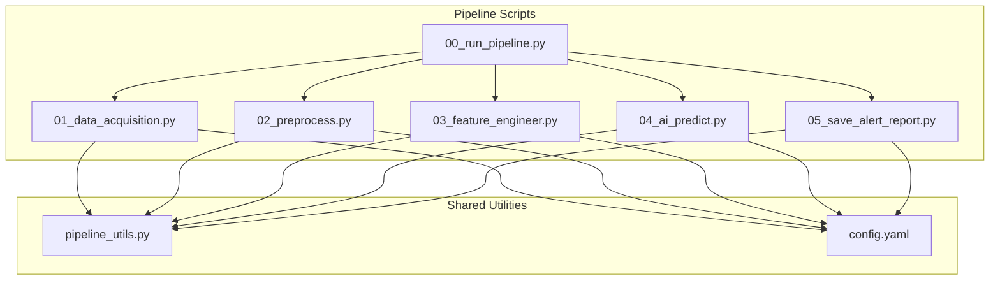
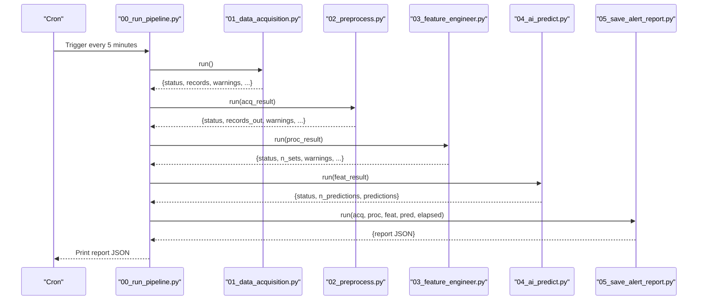
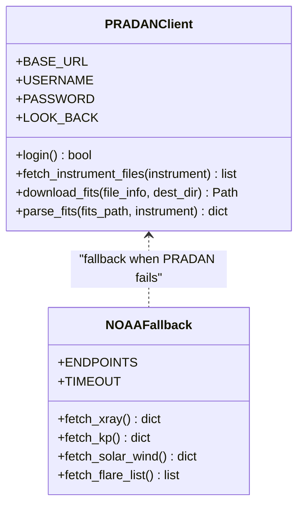
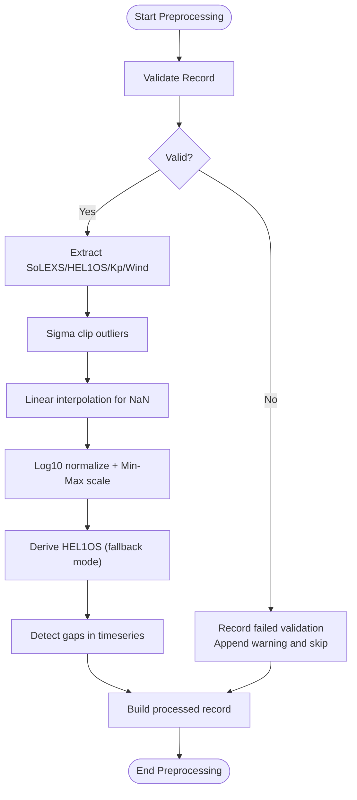
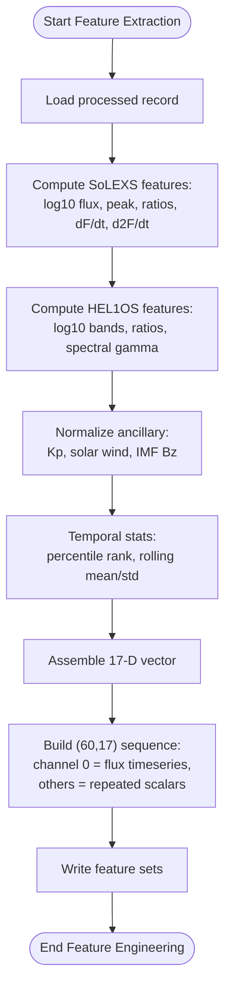
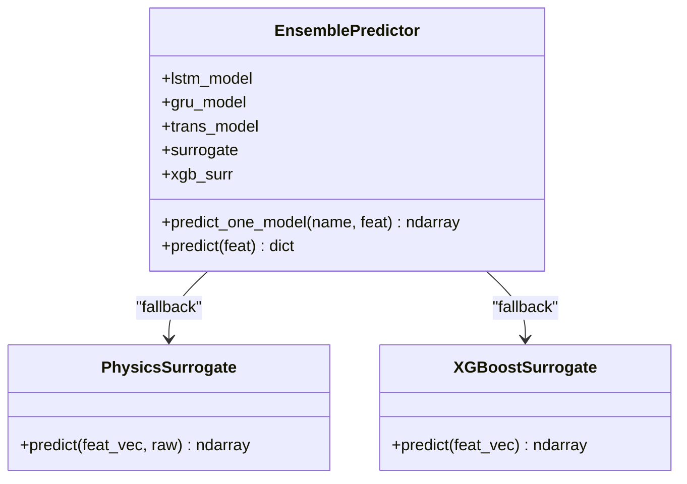
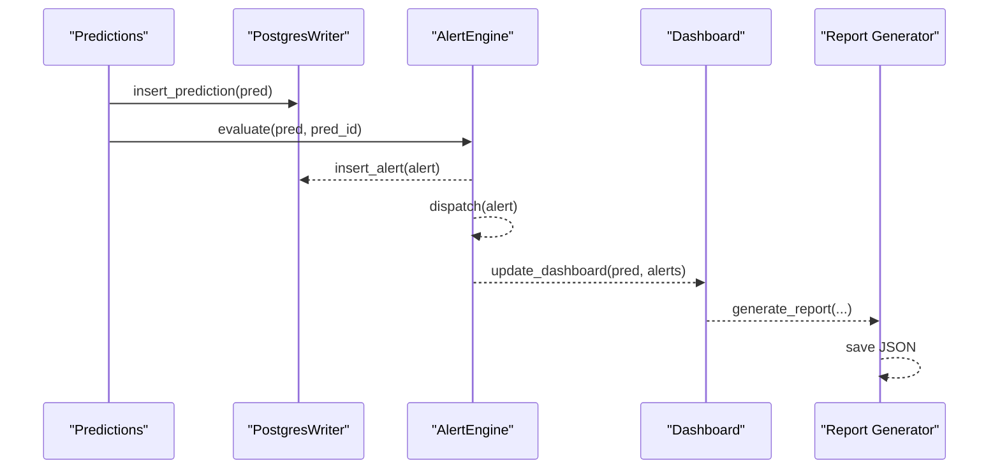
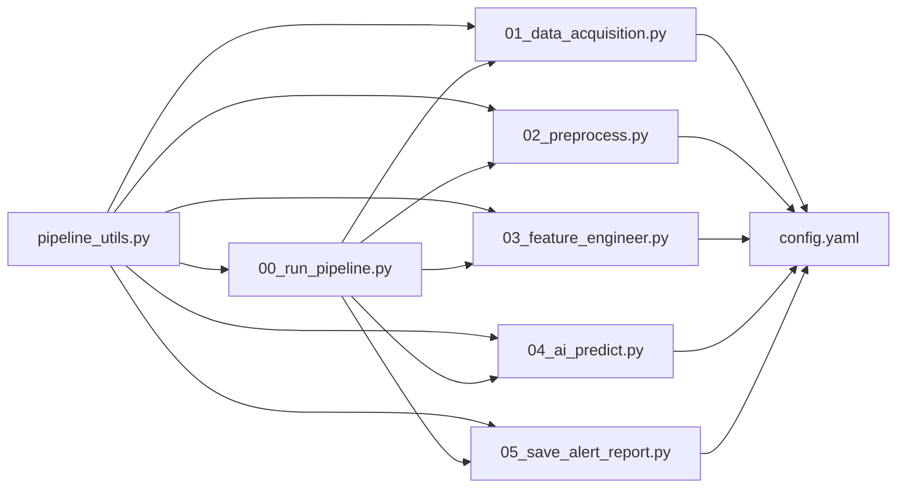

# Pipeline Components

<cite>
**Referenced Files in This Document**
- [README.md](file://README.md)
- [config.yaml](file://config.yaml)
- [00_run_pipeline.py](file://00_run_pipeline.py)
- [01_data_acquisition.py](file://01_data_acquisition.py)
- [02_preprocess.py](file://02_preprocess.py)
- [03_feature_engineer.py](file://03_feature_engineer.py)
- [04_ai_predict.py](file://04_ai_predict.py)
- [05_save_alert_report.py](file://05_save_alert_report.py)
- [pipeline_utils.py](file://pipeline_utils.py)
</cite>

## Table of Contents
1. [Introduction](#introduction)
2. [Project Structure](#project-structure)
3. [Core Components](#core-components)
4. [Architecture Overview](#architecture-overview)
5. [Detailed Component Analysis](#detailed-component-analysis)
6. [Dependency Analysis](#dependency-analysis)
7. [Performance Considerations](#performance-considerations)
8. [Troubleshooting Guide](#troubleshooting-guide)
9. [Conclusion](#conclusion)

## Introduction
This document describes the complete data processing pipeline for the Aditya-L1 Solar Flare Forecasting (SFF) system. It covers the end-to-end workflow from data acquisition (PRADAN native FITS and NOAA SWPC fallback), preprocessing and validation, feature engineering, machine learning ensemble inference, and output generation (PostgreSQL persistence, alert evaluation, dashboard updates, and JSON reporting). It also documents component interfaces, data transformations, error handling, inter-component communication, and performance considerations.

## Project Structure
The pipeline is organized as a sequence of modular Python scripts orchestrated by a master runner. Each step is designed to be independently runnable for development and debugging, while the master orchestrator coordinates retries, timing, and state management.

**Diagram sources**
- [00_run_pipeline.py:1-146](file://00_run_pipeline.py#L1-L146)
- [01_data_acquisition.py:1-458](file://01_data_acquisition.py#L1-L458)
- [02_preprocess.py:1-422](file://02_preprocess.py#L1-L422)
- [03_feature_engineer.py:1-265](file://03_feature_engineer.py#L1-L265)
- [04_ai_predict.py:1-466](file://04_ai_predict.py#L1-L466)
- [05_save_alert_report.py:1-507](file://05_save_alert_report.py#L1-L507)
- [pipeline_utils.py:1-123](file://pipeline_utils.py#L1-L123)
- [config.yaml:1-104](file://config.yaml#L1-L104)

**Section sources**
- [README.md:1-228](file://README.md#L1-L228)
- [00_run_pipeline.py:1-146](file://00_run_pipeline.py#L1-L146)
- [config.yaml:1-104](file://config.yaml#L1-L104)

## Core Components
- Data Acquisition (PRADAN native FITS + NOAA SWPC fallback)
- Preprocessing (validation, QC, normalization, HEL1OS derivation)
- Feature Engineering (17-D feature vectors and sequences)
- AI Ensemble (LSTM, GRU, Transformer, XGBoost with confidence scoring)
- Output Generation (PostgreSQL, alerts, dashboard, JSON report)

Each component exposes a run function that accepts the previous stage’s output and returns a structured result payload suitable for the next stage.

**Section sources**
- [01_data_acquisition.py:350-452](file://01_data_acquisition.py#L350-L452)
- [02_preprocess.py:230-409](file://02_preprocess.py#L230-L409)
- [03_feature_engineer.py:199-249](file://03_feature_engineer.py#L199-L249)
- [04_ai_predict.py:402-448](file://04_ai_predict.py#L402-L448)
- [05_save_alert_report.py:452-502](file://05_save_alert_report.py#L452-L502)

## Architecture Overview
The pipeline follows a strict sequential orchestration with robust error handling and state persistence. The master runner coordinates retries, timing, and state transitions. Inter-stage communication is achieved via JSON artifacts stored under data/ and a lightweight state file.

**Diagram sources**
- [00_run_pipeline.py:63-141](file://00_run_pipeline.py#L63-L141)
- [01_data_acquisition.py:350-452](file://01_data_acquisition.py#L350-L452)
- [02_preprocess.py:230-409](file://02_preprocess.py#L230-L409)
- [03_feature_engineer.py:199-249](file://03_feature_engineer.py#L199-L249)
- [04_ai_predict.py:402-448](file://04_ai_predict.py#L402-L448)
- [05_save_alert_report.py:452-502](file://05_save_alert_report.py#L452-L502)

## Detailed Component Analysis

### Data Acquisition Module
Responsibilities:
- Login to PRADAN and fetch Level-1 SoLEXS/HEL1OS FITS files within a look-back window.
- Parse FITS into structured records (when astropy is available).
- Deduplicate records using checksums persisted in pipeline state.
- Fallback to NOAA SWPC real-time feeds (GOES XRS, Kp, solar wind) when PRADAN credentials are missing.
- Emit warnings for missing proxies and save raw JSON artifacts.

Key interfaces:
- PRADANClient: login, query files, download, parse FITS.
- NOAAFallback: fetch X-ray, Kp, solar wind, recent flares.
- Deduplication: compute checksum, check and record seen checksums.
- Output: structured result with status, source_used, records, warnings.

**Diagram sources**
- [01_data_acquisition.py:50-193](file://01_data_acquisition.py#L50-L193)
- [01_data_acquisition.py:199-325](file://01_data_acquisition.py#L199-L325)

**Section sources**
- [01_data_acquisition.py:350-452](file://01_data_acquisition.py#L350-L452)
- [01_data_acquisition.py:331-344](file://01_data_acquisition.py#L331-L344)
- [config.yaml:15-40](file://config.yaml#L15-L40)

### Preprocessing Stage
Responsibilities:
- Validate records (presence of timestamps, physical ranges).
- Detect gaps in 1-minute timeseries and warn.
- Sigma clipping and linear interpolation for missing values.
- Log10 normalization and min-max scaling for flux.
- Derive HEL1OS hard X-ray bands from SoLEXS soft flux and flux ratio using a spectral model (NOAA fallback mode).
- Align instruments by timestamp within tolerance.
- Produce clean, normalized arrays and metadata.

**Diagram sources**
- [02_preprocess.py:45-224](file://02_preprocess.py#L45-L224)
- [02_preprocess.py:230-409](file://02_preprocess.py#L230-L409)

**Section sources**
- [02_preprocess.py:230-409](file://02_preprocess.py#L230-L409)
- [config.yaml:54-61](file://config.yaml#L54-L61)

### Feature Engineering
Responsibilities:
- Extract 17-dimensional feature vector from processed records.
- Compute rolling statistics (15-min mean/std) and percentile rank against 24h distribution.
- Normalize features to [0,1] using physics-based ranges.
- Construct a 60×17 sequence tensor for temporal models, replicating scalar features along the time axis and varying the first channel with actual flux.

**Diagram sources**
- [03_feature_engineer.py:52-193](file://03_feature_engineer.py#L52-L193)
- [03_feature_engineer.py:199-249](file://03_feature_engineer.py#L199-L249)

**Section sources**
- [03_feature_engineer.py:199-249](file://03_feature_engineer.py#L199-L249)
- [config.yaml:62-77](file://config.yaml#L62-L77)

### Machine Learning Ensemble
Responsibilities:
- Load trained models (LSTM, GRU, Transformer, XGBoost) if available; otherwise use physics-informed surrogates.
- Perform inference on each feature set and aggregate outputs using weighted ensemble.
- Compute derived metrics: CME probability, estimated onset time, geomagnetic storm risk, and confidence score.
- Return structured prediction results for downstream stages.

**Diagram sources**
- [04_ai_predict.py:246-395](file://04_ai_predict.py#L246-L395)
- [04_ai_predict.py:134-190](file://04_ai_predict.py#L134-L190)
- [04_ai_predict.py:192-238](file://04_ai_predict.py#L192-L238)

**Section sources**
- [04_ai_predict.py:402-448](file://04_ai_predict.py#L402-L448)
- [config.yaml:66-77](file://config.yaml#L66-L77)

### Output Generation Stage
Responsibilities:
- Persist pipeline run metadata and predictions to PostgreSQL (schema created on first run).
- Evaluate alert thresholds and dispatch alerts via configured channels (log/email/webhook).
- Update dashboard with prediction payload (placeholder for WebSocket/Redis).
- Generate a canonical JSON report containing run metadata, predictions, thresholds, and recommendations.

**Diagram sources**
- [05_save_alert_report.py:47-216](file://05_save_alert_report.py#L47-L216)
- [05_save_alert_report.py:222-298](file://05_save_alert_report.py#L222-L298)
- [05_save_alert_report.py:304-333](file://05_save_alert_report.py#L304-L333)
- [05_save_alert_report.py:340-425](file://05_save_alert_report.py#L340-L425)

**Section sources**
- [05_save_alert_report.py:452-502](file://05_save_alert_report.py#L452-L502)
- [config.yaml:79-104](file://config.yaml#L79-L104)

## Dependency Analysis
- Inter-component dependencies:
  - 00_run_pipeline.py depends on 01–05 modules’ run functions and orchestrates retries and timing.
  - 01_data_acquisition.py depends on PRADAN credentials and NOAA endpoints; uses astropy for FITS parsing.
  - 02_preprocess.py depends on preprocessing configuration and uses numpy/scipy for statistics.
  - 03_feature_engineer.py depends on models configuration and constructs sequences for temporal models.
  - 04_ai_predict.py conditionally loads torch and xgboost; otherwise uses surrogates.
  - 05_save_alert_report.py conditionally uses psycopg2; otherwise operates in simulation mode.
- Shared utilities:
  - pipeline_utils.py centralizes configuration loading, logging, JSON I/O, and state management.
  - config.yaml defines runtime behavior, thresholds, and database/table names.

**Diagram sources**
- [00_run_pipeline.py:35-38](file://00_run_pipeline.py#L35-L38)
- [01_data_acquisition.py:34-37](file://01_data_acquisition.py#L34-L37)
- [02_preprocess.py:26-29](file://02_preprocess.py#L26-L29)
- [03_feature_engineer.py:35-38](file://03_feature_engineer.py#L35-L38)
- [04_ai_predict.py:32-35](file://04_ai_predict.py#L32-L35)
- [05_save_alert_report.py:32-35](file://05_save_alert_report.py#L32-L35)
- [config.yaml:1-104](file://config.yaml#L1-L104)

**Section sources**
- [00_run_pipeline.py:35-38](file://00_run_pipeline.py#L35-L38)
- [pipeline_utils.py:25-97](file://pipeline_utils.py#L25-L97)
- [config.yaml:1-104](file://config.yaml#L1-L104)

## Performance Considerations
- Data Acquisition
  - Use streaming downloads and chunked reads to reduce memory overhead for large FITS files.
  - Limit look-back window to balance latency and throughput.
  - Skip duplicates early to avoid redundant processing.
- Preprocessing
  - Vectorize operations with numpy to minimize Python loops.
  - Use linear interpolation only where gaps are small; warn for excessive gaps.
  - Normalize in-place when possible to reduce memory churn.
- Feature Engineering
  - Pad sequences efficiently; avoid repeated copies by building arrays incrementally.
  - Normalize features once per batch to reduce recomputation.
- AI Inference
  - Prefer CPU inference when GPU libraries are unavailable; surrogates provide fast fallback.
  - Batch predictions when multiple feature sets are available (not currently implemented).
  - Use half-precision if supported by hardware and models.
- Output Generation
  - Use connection pooling for PostgreSQL (currently simulated; schema creation is idempotent).
  - Asynchronous alert dispatch to avoid blocking the main thread.
  - Write JSON reports atomically to prevent partial writes.

[No sources needed since this section provides general guidance]

## Troubleshooting Guide
Common issues and resolutions:
- PRADAN login failures or missing credentials
  - Symptom: Acquisition skips native data and falls back to NOAA.
  - Action: Verify environment variables and network connectivity.
- No new data since last run
  - Symptom: Acquisition returns “NO_NEW_DATA”.
  - Action: Confirm cron schedule and NOAA feed availability.
- Preprocessing validation errors
  - Symptom: Records fail QC (missing timestamps, out-of-range values).
  - Action: Inspect raw JSON artifacts and adjust preprocessing thresholds.
- Feature extraction failures
  - Symptom: No feature sets generated.
  - Action: Check preprocessing output and ensure valid timeseries.
- Model loading failures
  - Symptom: Surrogate models used instead of trained weights.
  - Action: Install torch/xgboost and place model files in models/.
- PostgreSQL write failures
  - Symptom: Simulation mode logs; schema not created.
  - Action: Install psycopg2 and verify DB credentials and permissions.
- Alert dispatch failures
  - Symptom: Email/webhook errors logged.
  - Action: Validate SMTP host and webhook URL; check network/firewall.

**Section sources**
- [00_run_pipeline.py:41-61](file://00_run_pipeline.py#L41-L61)
- [01_data_acquisition.py:69-87](file://01_data_acquisition.py#L69-L87)
- [02_preprocess.py:51-98](file://02_preprocess.py#L51-L98)
- [04_ai_predict.py:113-127](file://04_ai_predict.py#L113-L127)
- [05_save_alert_report.py:121-141](file://05_save_alert_report.py#L121-L141)
- [05_save_alert_report.py:267-298](file://05_save_alert_report.py#L267-L298)

## Conclusion
The pipeline provides a robust, modular framework for near-real-time solar flare forecasting. It gracefully handles missing data via NOAA fallbacks, rigorously validates and normalizes inputs, extracts rich 17-dimensional features, and delivers calibrated predictions with confidence scores. Outputs are persisted and alerted, enabling operational decision-making. Extending the system involves adding trained models, tuning thresholds, and integrating advanced alert channels and dashboards.