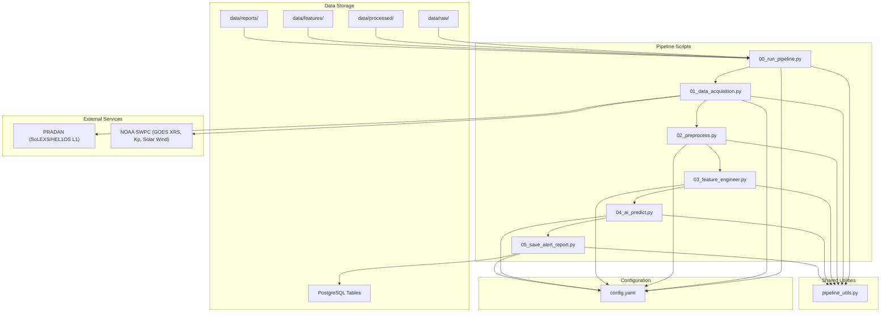
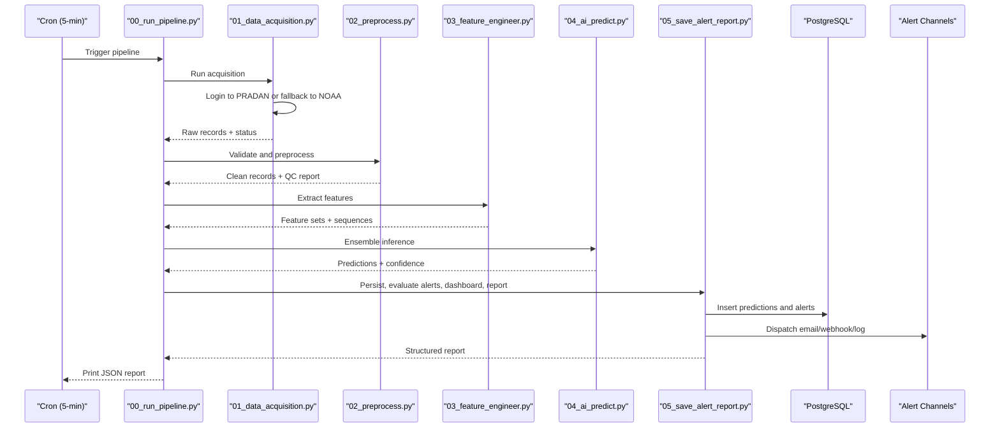
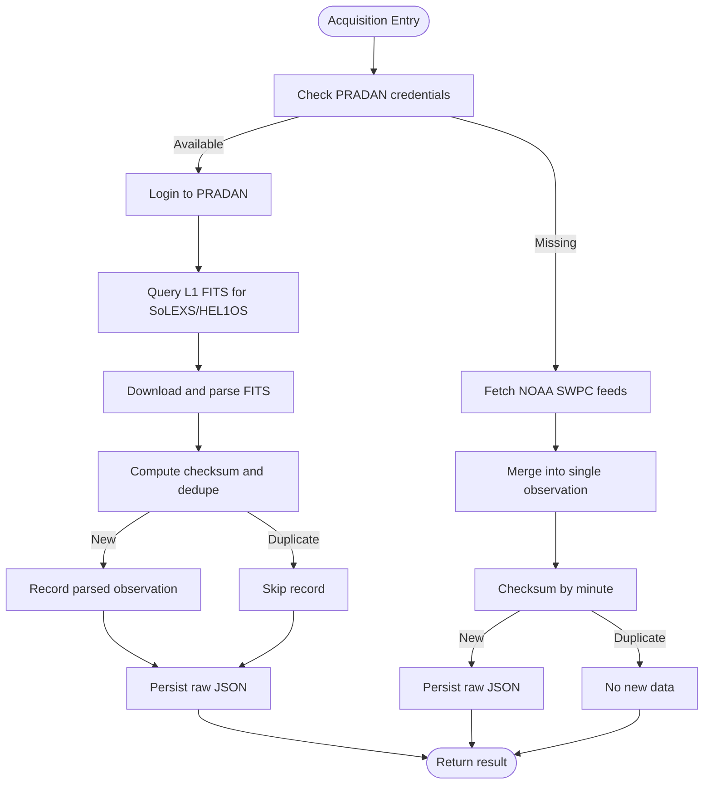
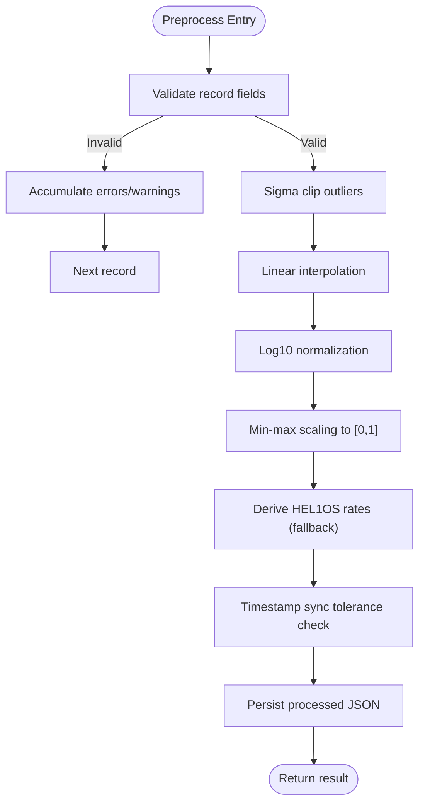
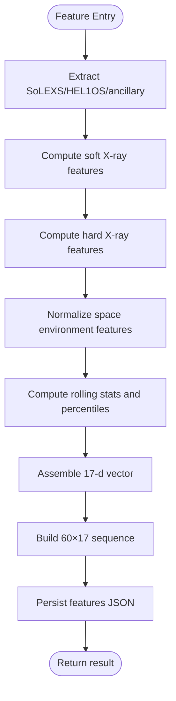
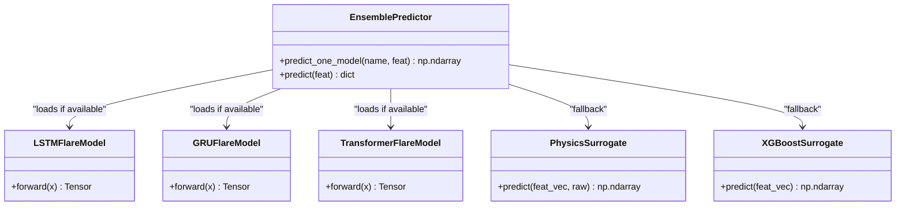
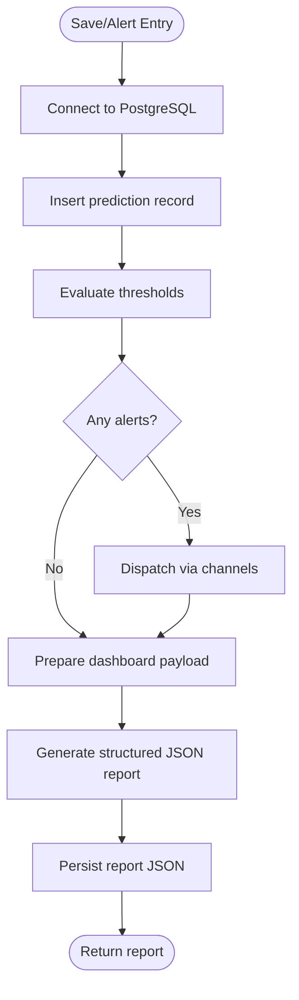
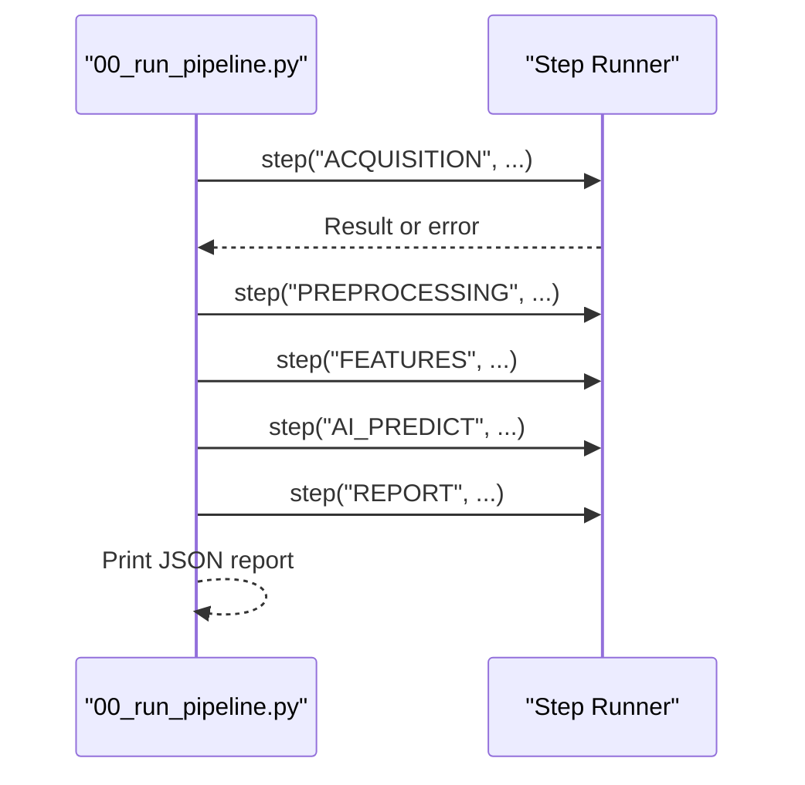
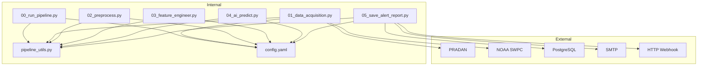

# Project Overview

<cite>
**Referenced Files in This Document**
- [README.md](file://README.md)
- [config.yaml](file://config.yaml)
- [00_run_pipeline.py](file://00_run_pipeline.py)
- [01_data_acquisition.py](file://01_data_acquisition.py)
- [02_preprocess.py](file://02_preprocess.py)
- [03_feature_engineer.py](file://03_feature_engineer.py)
- [04_ai_predict.py](file://04_ai_predict.py)
- [05_save_alert_report.py](file://05_save_alert_report.py)
- [pipeline_utils.py](file://pipeline_utils.py)
</cite>

## Table of Contents
1. [Introduction](#introduction)
2. [Project Structure](#project-structure)
3. [Core Components](#core-components)
4. [Architecture Overview](#architecture-overview)
5. [Detailed Component Analysis](#detailed-component-analysis)
6. [Dependency Analysis](#dependency-analysis)
7. [Performance Considerations](#performance-considerations)
8. [Troubleshooting Guide](#troubleshooting-guide)
9. [Conclusion](#conclusion)
10. [Appendices](#appendices)

## Introduction
This document presents a comprehensive overview of the Aditya-L1 Solar Flare Forecasting Pipeline, ISRO’s space weather monitoring platform designed to process real-time solar flare data from the Aditya-L1 satellite and NOAA instruments. The system ingests native SoLEXS and HEL1OS Level-1 data from the PRADAN portal, with automatic fallback to NOAA SWPC public feeds when credentials are unavailable. It performs validation, quality control, normalization, and feature engineering, then applies an ensemble of machine learning models to forecast flare probability, class, CME likelihood, and geoeffective risks. Predictions are persisted to PostgreSQL, evaluated against configurable alert thresholds, and emitted to logs, email, and/or webhooks. The pipeline runs on a 5-minute cron schedule and produces a structured JSON report consumable by downstream systems.

Target audience:
- Space weather scientists and analysts who interpret forecasts and validate model outputs
- Satellite operators who rely on timely alerts and onset estimates to protect assets
- System administrators responsible for pipeline maintenance, monitoring, and alert delivery

Key use cases:
- Real-time monitoring of solar activity and immediate alerting for X-class flares
- Operational support for satellite-safe-mode decisions and safe-mode activation
- Geomagnetic storm risk communication to power grid operators and GNSS providers
- Historical trend analysis and model retraining coordination

Integration scenarios:
- PRADAN portal for native Aditya-L1 SoLEXS/HEL1OS data
- NOAA SWPC feeds for GOES X-ray proxies, Kp index, and solar wind parameters
- PostgreSQL for persistence and downstream analytics dashboards
- Email and webhook channels for alert distribution

## Project Structure
The pipeline is organized as a modular, cron-driven workflow with explicit step boundaries and shared utilities.

**Diagram sources**
- [00_run_pipeline.py:1-146](file://00_run_pipeline.py#L1-L146)
- [01_data_acquisition.py:1-458](file://01_data_acquisition.py#L1-L458)
- [02_preprocess.py:1-422](file://02_preprocess.py#L1-L422)
- [03_feature_engineer.py:1-265](file://03_feature_engineer.py#L1-L265)
- [04_ai_predict.py:1-466](file://04_ai_predict.py#L1-L466)
- [05_save_alert_report.py:1-507](file://05_save_alert_report.py#L1-L507)
- [config.yaml:1-104](file://config.yaml#L1-L104)
- [pipeline_utils.py:1-123](file://pipeline_utils.py#L1-L123)

**Section sources**
- [README.md:7-32](file://README.md#L7-L32)
- [config.yaml:6-104](file://config.yaml#L6-L104)
- [00_run_pipeline.py:13-24](file://00_run_pipeline.py#L13-L24)

## Core Components
- Data Acquisition (01_data_acquisition.py): Fetches native SoLEXS/HEL1OS Level-1 FITS from PRADAN when credentials are available; otherwise falls back to NOAA SWPC GOES XRS, Kp index, and solar wind proxies. Deduplicates records and persists raw JSON.
- Validation & Preprocessing (02_preprocess.py): Validates timestamps and physical ranges, detects gaps, flags outliers, interpolates missing values, normalizes fluxes, derives HEL1OS hard X-ray rates from SoLEXS proxies when needed, and synchronizes instruments.
- Feature Engineering (03_feature_engineer.py): Builds a 17-dimensional feature vector and a 60×17 sequence tensor for temporal models, including rolling statistics and percentile ranks.
- AI Ensemble Inference (04_ai_predict.py): Runs an ensemble of LSTM, GRU, Transformer, and XGBoost models (or physics-informed surrogates) to produce flare class probabilities, CME likelihood, geoeffective risk, and onset estimates.
- Persistence, Alerts, Dashboard, Report (05_save_alert_report.py): Writes predictions to PostgreSQL, evaluates configurable thresholds, dispatches alerts via log/email/webhook, updates a dashboard payload, and generates a structured JSON report.
- Orchestrator (00_run_pipeline.py): Coordinates all steps with retries, timing, and failure reporting; prints a canonical JSON report to stdout for cron capture.
- Shared Utilities (pipeline_utils.py): Loads configuration with environment expansion, sets up rotating logs, manages pipeline state, and provides classification and labeling helpers.

**Section sources**
- [01_data_acquisition.py:46-458](file://01_data_acquisition.py#L46-L458)
- [02_preprocess.py:45-422](file://02_preprocess.py#L45-L422)
- [03_feature_engineer.py:52-265](file://03_feature_engineer.py#L52-L265)
- [04_ai_predict.py:63-466](file://04_ai_predict.py#L63-L466)
- [05_save_alert_report.py:47-507](file://05_save_alert_report.py#L47-L507)
- [00_run_pipeline.py:41-146](file://00_run_pipeline.py#L41-L146)
- [pipeline_utils.py:25-123](file://pipeline_utils.py#L25-L123)

## Architecture Overview
The pipeline follows a strict chronological flow with robust error handling and idempotent persistence. It integrates external data sources, validates and normalizes inputs, extracts AI-ready features, runs inference, and emits actionable outputs.

**Diagram sources**
- [00_run_pipeline.py:63-146](file://00_run_pipeline.py#L63-L146)
- [01_data_acquisition.py:350-458](file://01_data_acquisition.py#L350-L458)
- [02_preprocess.py:230-422](file://02_preprocess.py#L230-L422)
- [03_feature_engineer.py:199-265](file://03_feature_engineer.py#L199-L265)
- [04_ai_predict.py:402-466](file://04_ai_predict.py#L402-L466)
- [05_save_alert_report.py:452-507](file://05_save_alert_report.py#L452-L507)

## Detailed Component Analysis

### Data Acquisition (01_data_acquisition.py)
Responsibilities:
- Authenticate to PRADAN and fetch Level-1 SoLEXS/HEL1OS FITS files within a look-back window
- Parse FITS into structured records with lightcurves and rates
- Deduplicate records using checksums stored in pipeline state
- Fallback to NOAA SWPC feeds for GOES XRS, Kp index, and solar wind when PRADAN credentials are missing
- Merge fallback data into a single observation record and persist raw JSON

Key design patterns:
- Client classes encapsulate provider-specific logic (PRADANClient, NOAAFallback)
- Checksum-based deduplication prevents redundant processing
- Graceful degradation to fallback mode with warnings

**Diagram sources**
- [01_data_acquisition.py:350-458](file://01_data_acquisition.py#L350-L458)

**Section sources**
- [01_data_acquisition.py:46-458](file://01_data_acquisition.py#L46-L458)
- [config.yaml:15-40](file://config.yaml#L15-L40)

### Validation & Preprocessing (02_preprocess.py)
Responsibilities:
- Validate presence and reasonableness of timestamps and flux values
- Detect and quantify gaps in 1-minute timeseries
- Remove outliers via sigma clipping and interpolate missing values
- Normalize fluxes using log10 and min-max scaling
- Derive HEL1OS hard X-ray rates from SoLEXS soft X-ray ratios when native data is unavailable
- Align timestamps between SoLEXS and HEL1OS within tolerance

**Diagram sources**
- [02_preprocess.py:230-422](file://02_preprocess.py#L230-L422)

**Section sources**
- [02_preprocess.py:45-422](file://02_preprocess.py#L45-L422)
- [config.yaml:54-61](file://config.yaml#L54-L61)

### Feature Engineering (03_feature_engineer.py)
Responsibilities:
- Construct a 17-dimensional feature vector combining SoLEXS soft X-ray, HEL1OS hard X-ray, and space environment metrics
- Compute rolling statistics and percentile ranks for temporal context
- Build a 60×17 sequence tensor for recurrent and attention models, replicating scalar features along the time axis
- Preserve raw scalar values for downstream interpretation

**Diagram sources**
- [03_feature_engineer.py:92-265](file://03_feature_engineer.py#L92-L265)

**Section sources**
- [03_feature_engineer.py:52-265](file://03_feature_engineer.py#L52-L265)
- [README.md:151-172](file://README.md#L151-L172)

### AI Ensemble Inference (04_ai_predict.py)
Responsibilities:
- Load trained PyTorch models (LSTM, GRU, Transformer) and XGBoost if available; otherwise use physics-informed surrogates
- Aggregate predictions via weighted ensemble and compute class probabilities
- Estimate CME probability, geoeffective storm risk, and onset time with uncertainty bounds
- Compute confidence score based on ensemble agreement

**Diagram sources**
- [04_ai_predict.py:63-466](file://04_ai_predict.py#L63-L466)

**Section sources**
- [04_ai_predict.py:63-466](file://04_ai_predict.py#L63-L466)
- [config.yaml:66-77](file://config.yaml#L66-L77)

### Persistence, Alerts, Dashboard, Report (05_save_alert_report.py)
Responsibilities:
- Create PostgreSQL tables on first run and insert predictions with JSONB fields for diagnostics
- Evaluate configurable thresholds and emit alerts to log, email, and/or webhook
- Prepare a dashboard payload for real-time monitoring
- Generate a structured JSON report suitable for automation and downstream systems

**Diagram sources**
- [05_save_alert_report.py:47-507](file://05_save_alert_report.py#L47-L507)
- [config.yaml:79-104](file://config.yaml#L79-L104)

**Section sources**
- [05_save_alert_report.py:47-507](file://05_save_alert_report.py#L47-L507)
- [README.md:175-227](file://README.md#L175-L227)

### Orchestrator (00_run_pipeline.py)
Responsibilities:
- Orchestrate all pipeline steps in order with timing and retry logic
- Propagate results between steps and handle failures gracefully
- Produce a canonical JSON report printed to stdout for cron capture

**Diagram sources**
- [00_run_pipeline.py:41-146](file://00_run_pipeline.py#L41-L146)

**Section sources**
- [00_run_pipeline.py:41-146](file://00_run_pipeline.py#L41-L146)

### Shared Utilities (pipeline_utils.py)
Responsibilities:
- Load configuration with environment variable expansion
- Set up rotating loggers per module
- Manage lightweight pipeline state across cron runs
- Provide classification and geostorm labeling helpers

**Section sources**
- [pipeline_utils.py:25-123](file://pipeline_utils.py#L25-L123)

## Dependency Analysis
The pipeline exhibits strong cohesion within each step and minimal cross-step coupling, relying on shared configuration and state files. External dependencies include PRADAN and NOAA SWPC for data, PostgreSQL for persistence, and optional alert channels.

**Diagram sources**
- [00_run_pipeline.py:35-38](file://00_run_pipeline.py#L35-L38)
- [01_data_acquisition.py:40-43](file://01_data_acquisition.py#L40-L43)
- [05_save_alert_report.py:24-31](file://05_save_alert_report.py#L24-L31)
- [config.yaml:15-104](file://config.yaml#L15-L104)

**Section sources**
- [00_run_pipeline.py:35-38](file://00_run_pipeline.py#L35-L38)
- [01_data_acquisition.py:40-43](file://01_data_acquisition.py#L40-L43)
- [05_save_alert_report.py:24-31](file://05_save_alert_report.py#L24-L31)
- [config.yaml:15-104](file://config.yaml#L15-L104)

## Performance Considerations
- Data ingestion cadence: 5-minute cron ensures near-real-time responsiveness for space weather monitoring.
- Deduplication: Checksum-based skipping avoids redundant processing and reduces I/O.
- Normalization: Log10 and min-max scaling improve numerical stability for ML models.
- Ensemble inference: Weighted combination balances model diversity and latency.
- Database writes: Idempotent inserts and indexing optimize downstream analytics queries.
- Optional GPU acceleration: PyTorch models can leverage GPU when available; fallback surrogates enable CPU-only operation.

[No sources needed since this section provides general guidance]

## Troubleshooting Guide
Common issues and remedies:
- PRADAN login failures: Verify credentials and network connectivity; the pipeline will fall back to NOAA.
- Missing or invalid data: Review QC warnings and gaps; ensure sufficient cadence for interpolation.
- PostgreSQL connection errors: Confirm credentials and service availability; the pipeline continues in simulation mode if psycopg2 is not installed.
- Alert delivery failures: Check SMTP host and webhook URL; verify environment variables are loaded.
- Pipeline failures: Inspect the printed JSON report with pipeline_status FAILED and recommended_action; check logs for stack traces.

**Section sources**
- [01_data_acquisition.py:69-87](file://01_data_acquisition.py#L69-L87)
- [05_save_alert_report.py:121-141](file://05_save_alert_report.py#L121-L141)
- [00_run_pipeline.py:122-141](file://00_run_pipeline.py#L122-L141)

## Conclusion
The Aditya-L1 Solar Flare Forecasting Pipeline provides a robust, configurable, and extensible framework for real-time space weather monitoring. By combining native Aditya-L1 data with NOAA proxies, rigorous preprocessing, and a calibrated AI ensemble, it delivers actionable insights to space weather scientists and satellite operators. Its modular design, idempotent persistence, and structured reporting facilitate seamless integration into broader operational workflows.

[No sources needed since this section summarizes without analyzing specific files]

## Appendices

### Practical Impact Scenarios
- Satellite operations: An X-class probability exceeding the critical threshold triggers immediate safe-mode actions and operator briefings, minimizing radiation exposure and commanding anomalies.
- Space weather forecasting: High M-class probability combined with elevated CME risk prompts enhanced monitoring and public advisories for aviation and power grid operators.
- System administration: Automated alerts and JSON reports streamline incident response and reduce manual intervention overhead.

[No sources needed since this section provides general guidance]