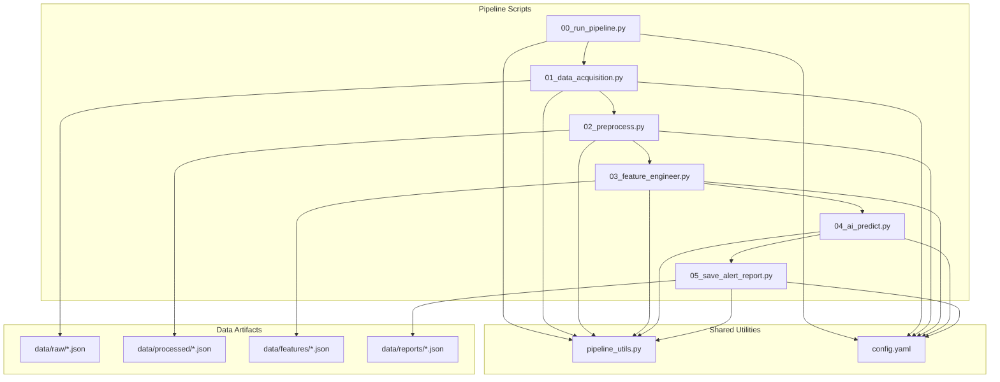
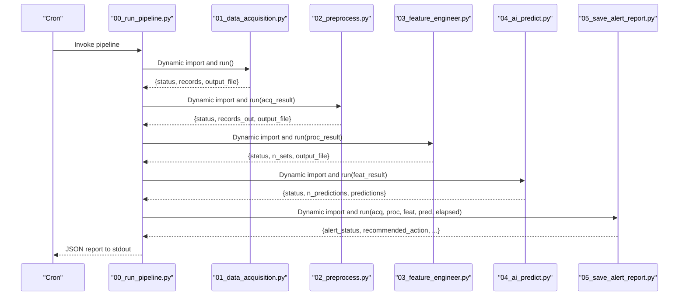
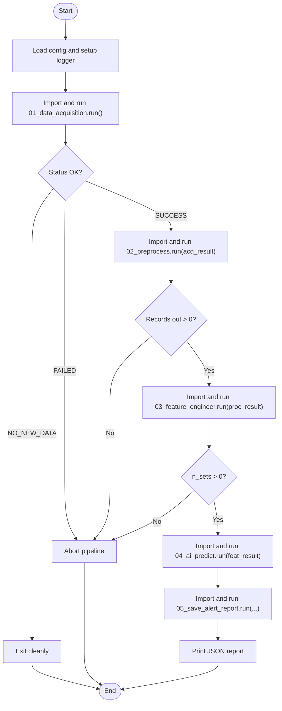
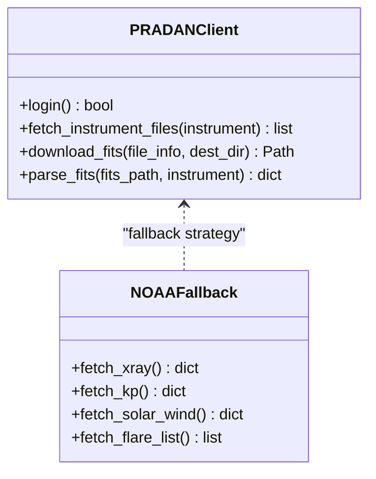
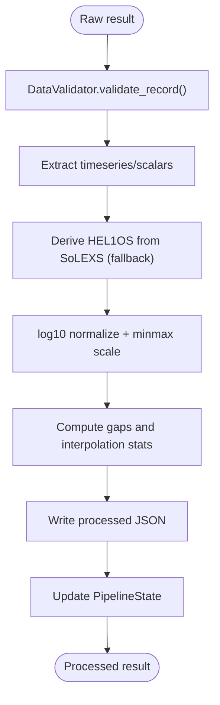
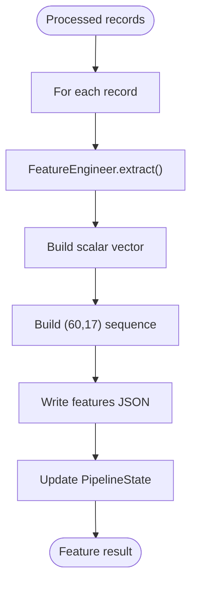
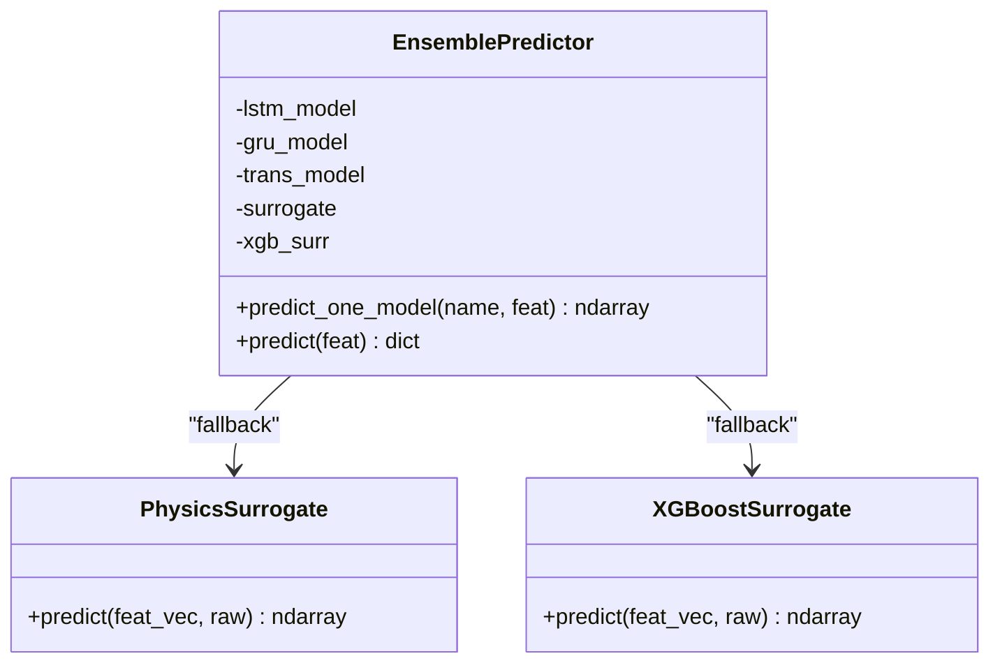
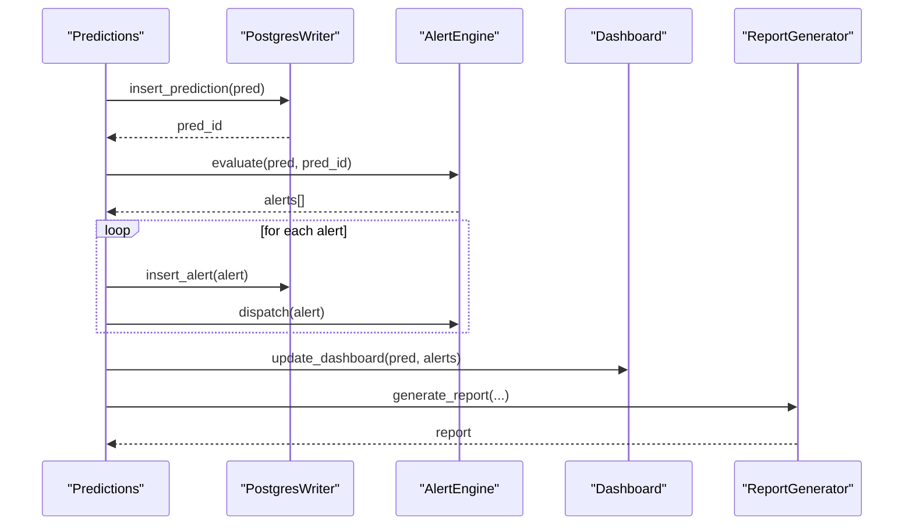
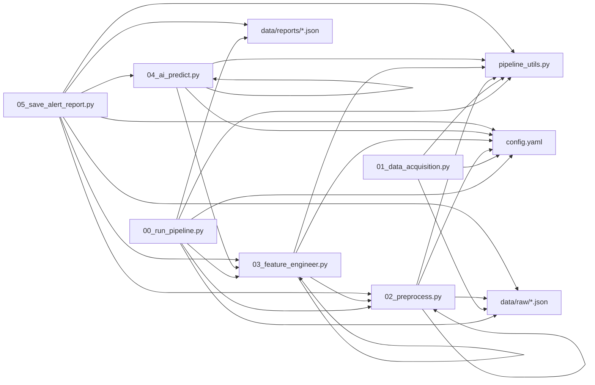

# Component Interactions and Communication

<cite>
**Referenced Files in This Document**
- [00_run_pipeline.py](file://00_run_pipeline.py)
- [01_data_acquisition.py](file://01_data_acquisition.py)
- [02_preprocess.py](file://02_preprocess.py)
- [03_feature_engineer.py](file://03_feature_engineer.py)
- [04_ai_predict.py](file://04_ai_predict.py)
- [05_save_alert_report.py](file://05_save_alert_report.py)
- [pipeline_utils.py](file://pipeline_utils.py)
- [config.yaml](file://config.yaml)
- [README.md](file://README.md)
</cite>

## Table of Contents
1. [Introduction](#introduction)
2. [Project Structure](#project-structure)
3. [Core Components](#core-components)
4. [Architecture Overview](#architecture-overview)
5. [Detailed Component Analysis](#detailed-component-analysis)
6. [Dependency Analysis](#dependency-analysis)
7. [Performance Considerations](#performance-considerations)
8. [Troubleshooting Guide](#troubleshooting-guide)
9. [Conclusion](#conclusion)

## Introduction
This document explains how the Aditya-L1 Solar Flare Forecasting Pipeline coordinates multiple components through a well-defined sequence of operations. Each stage transforms data through intermediate JSON artifacts and shares state via a centralized configuration system and a lightweight persistent state manager. The pipeline employs dependency injection through dynamic imports, a factory pattern for model loading, and a strategy pattern for dual data acquisition approaches.

## Project Structure
The pipeline follows a modular, stepwise architecture where each stage is implemented as a separate Python script that communicates with others through:
- Intermediate JSON files stored under data/ directories
- Centralized configuration loaded from config.yaml
- Persistent state managed by PipelineState

**Diagram sources**
- [00_run_pipeline.py:1-146](file://00_run_pipeline.py#L1-L146)
- [01_data_acquisition.py:1-458](file://01_data_acquisition.py#L1-L458)
- [02_preprocess.py:1-422](file://02_preprocess.py#L1-L422)
- [03_feature_engineer.py:1-265](file://03_feature_engineer.py#L1-L265)
- [04_ai_predict.py:1-466](file://04_ai_predict.py#L1-L466)
- [05_save_alert_report.py:1-507](file://05_save_alert_report.py#L1-L507)
- [pipeline_utils.py:1-123](file://pipeline_utils.py#L1-L123)
- [config.yaml:1-104](file://config.yaml#L1-L104)

**Section sources**
- [README.md:1-228](file://README.md#L1-L228)
- [00_run_pipeline.py:1-146](file://00_run_pipeline.py#L1-L146)
- [pipeline_utils.py:1-123](file://pipeline_utils.py#L1-L123)
- [config.yaml:1-104](file://config.yaml#L1-L104)

## Core Components
- Central orchestrator: 00_run_pipeline.py coordinates all steps, manages retries, and aggregates timing.
- Data acquisition: 01_data_acquisition.py implements a dual-strategy approach (PRADAN native + NOAA fallback) and deduplicates records.
- Preprocessing: 02_preprocess.py validates, normalizes, derives HEL1OS features, and aligns instruments.
- Feature engineering: 03_feature_engineer.py extracts 17-dimensional vectors and builds sequences for deep learning models.
- AI inference: 04_ai_predict.py implements an ensemble of models with a factory-style loader and surrogate fallbacks.
- Persistence and alerts: 05_save_alert_report.py writes to PostgreSQL, evaluates alerts, updates dashboards, and generates JSON reports.
- Shared utilities: pipeline_utils.py provides configuration loading, logging, JSON I/O, and PipelineState persistence.
- Configuration: config.yaml centralizes all runtime settings, including model paths, thresholds, and storage locations.

**Section sources**
- [00_run_pipeline.py:41-146](file://00_run_pipeline.py#L41-L146)
- [01_data_acquisition.py:50-458](file://01_data_acquisition.py#L50-L458)
- [02_preprocess.py:45-422](file://02_preprocess.py#L45-L422)
- [03_feature_engineer.py:52-265](file://03_feature_engineer.py#L52-L265)
- [04_ai_predict.py:63-466](file://04_ai_predict.py#L63-L466)
- [05_save_alert_report.py:47-507](file://05_save_alert_report.py#L47-L507)
- [pipeline_utils.py:25-123](file://pipeline_utils.py#L25-L123)
- [config.yaml:6-104](file://config.yaml#L6-L104)

## Architecture Overview
The pipeline enforces a strict data flow:
- Each step reads its predecessor’s JSON artifact from disk.
- Each step writes its own JSON artifact to disk for the next step.
- All steps share a common configuration and state.

**Diagram sources**
- [00_run_pipeline.py:73-116](file://00_run_pipeline.py#L73-L116)
- [01_data_acquisition.py:350-452](file://01_data_acquisition.py#L350-L452)
- [02_preprocess.py:230-409](file://02_preprocess.py#L230-L409)
- [03_feature_engineer.py:199-249](file://03_feature_engineer.py#L199-L249)
- [04_ai_predict.py:402-448](file://04_ai_predict.py#L402-L448)
- [05_save_alert_report.py:452-502](file://05_save_alert_report.py#L452-L502)

## Detailed Component Analysis

### Central Orchestrator (00_run_pipeline.py)
- Implements a robust step runner with retry/backoff and timing.
- Uses dynamic imports to invoke each step’s run function.
- Coordinates inter-step data passing and handles early exits for no-new-data or failures.
- Persists failure state via PipelineState when exceptions occur.

**Diagram sources**
- [00_run_pipeline.py:41-146](file://00_run_pipeline.py#L41-L146)

**Section sources**
- [00_run_pipeline.py:41-146](file://00_run_pipeline.py#L41-L146)

### Data Acquisition (01_data_acquisition.py)
- Dual acquisition strategy:
  - PRADANClient: downloads Level-1 FITS files and parses them when credentials are available.
  - NOAAFallback: fetches public NOAA SWPC feeds as a proxy when PRADAN is unavailable.
- Deduplication: computes checksums and tracks recent checksums in PipelineState to avoid reprocessing.
- Writes raw JSON artifacts to data/raw/ and updates PipelineState with last acquisition metadata.

**Diagram sources**
- [01_data_acquisition.py:50-325](file://01_data_acquisition.py#L50-L325)

**Section sources**
- [01_data_acquisition.py:50-458](file://01_data_acquisition.py#L50-L458)

### Preprocessing (02_preprocess.py)
- Validates records, detects gaps, flags outliers, interpolates missing values, and normalizes data.
- Derives HEL1OS features from SoLEXS when using NOAA fallback mode.
- Aligns instruments by timestamp and applies log10 + min-max scaling.
- Writes processed JSON artifacts to data/processed/ and updates PipelineState.

**Diagram sources**
- [02_preprocess.py:230-409](file://02_preprocess.py#L230-L409)

**Section sources**
- [02_preprocess.py:45-422](file://02_preprocess.py#L45-L422)

### Feature Engineering (03_feature_engineer.py)
- Extracts 17-dimensional feature vectors and constructs sequences for deep learning models.
- Applies domain-aware normalization and computes rolling statistics.
- Writes feature sets to data/features/ and updates PipelineState.

**Diagram sources**
- [03_feature_engineer.py:199-249](file://03_feature_engineer.py#L199-L249)

**Section sources**
- [03_feature_engineer.py:52-265](file://03_feature_engineer.py#L52-L265)

### AI Inference (04_ai_predict.py)
- Implements an ensemble of four models: LSTM, GRU, Transformer, and XGBoost.
- Factory-style model loader: dynamically imports and loads saved weights when available; otherwise uses physics-informed surrogates.
- Produces probabilistic forecasts, CME risk, geomagnetic storm risk, and onset estimates.

**Diagram sources**
- [04_ai_predict.py:246-396](file://04_ai_predict.py#L246-L396)

**Section sources**
- [04_ai_predict.py:63-466](file://04_ai_predict.py#L63-L466)

### Persistence and Alerts (05_save_alert_report.py)
- PostgreSQL writer: creates tables on first run, inserts predictions and alerts, and maintains indexes.
- Alert engine: evaluates thresholds and dispatches alerts via configured channels (email/webhook/log).
- Dashboard updater: prepares payload for real-time monitoring.
- Report generator: produces a canonical JSON report consumed by downstream systems.

**Diagram sources**
- [05_save_alert_report.py:47-502](file://05_save_alert_report.py#L47-L502)

**Section sources**
- [05_save_alert_report.py:47-507](file://05_save_alert_report.py#L47-L507)

## Dependency Analysis
- Dynamic imports: Each step is invoked via importlib-style imports inside the orchestrator, enabling loose coupling and optional model availability.
- Centralized configuration: All modules depend on load_config() to read config.yaml and expand environment variables.
- Shared state: PipelineState persists across runs and is used by all modules to coordinate file paths and detect duplicates.
- Inter-module data exchange: JSON artifacts act as the contract between modules; each step expects a specific schema and writes a standardized output.

**Diagram sources**
- [00_run_pipeline.py:73-116](file://00_run_pipeline.py#L73-L116)
- [01_data_acquisition.py:34-445](file://01_data_acquisition.py#L34-L445)
- [02_preprocess.py:26-393](file://02_preprocess.py#L26-L393)
- [03_feature_engineer.py:35-239](file://03_feature_engineer.py#L35-L239)
- [04_ai_predict.py:32-440](file://04_ai_predict.py#L32-L440)
- [05_save_alert_report.py:32-499](file://05_save_alert_report.py#L32-L499)
- [pipeline_utils.py:25-123](file://pipeline_utils.py#L25-L123)
- [config.yaml:6-104](file://config.yaml#L6-L104)

**Section sources**
- [00_run_pipeline.py:73-116](file://00_run_pipeline.py#L73-L116)
- [pipeline_utils.py:82-123](file://pipeline_utils.py#L82-L123)
- [config.yaml:6-104](file://config.yaml#L6-L104)

## Performance Considerations
- I/O batching: Each step writes a single JSON artifact per run, minimizing filesystem overhead.
- Lazy model loading: Models are loaded only when weights exist; otherwise, fast surrogate models are used.
- Robust retries: The orchestrator retries failed steps with exponential backoff to handle transient network issues.
- Memory efficiency: Feature engineering constructs sequences on-demand and avoids unnecessary copies.

## Troubleshooting Guide
- No new data: The acquisition step may return a no-new-data status; the orchestrator exits cleanly without failing.
- Missing credentials: PRADAN login failures cause fallback to NOAA; verify environment variables and network connectivity.
- PostgreSQL errors: If psycopg2 is unavailable, writes are simulated; enable the driver and configure credentials.
- Model loading failures: If model weights are missing, the pipeline falls back to surrogate models; ensure models directory contains valid files.
- State corruption: PipelineState is a simple JSON file; if corrupted, delete it to reset state.

**Section sources**
- [00_run_pipeline.py:77-83](file://00_run_pipeline.py#L77-L83)
- [01_data_acquisition.py:69-87](file://01_data_acquisition.py#L69-L87)
- [05_save_alert_report.py:121-141](file://05_save_alert_report.py#L121-L141)
- [04_ai_predict.py:113-127](file://04_ai_predict.py#L113-L127)
- [pipeline_utils.py:82-97](file://pipeline_utils.py#L82-L97)

## Conclusion
The pipeline achieves reliable, modular forecasting through explicit data contracts (JSON artifacts), centralized configuration, and a resilient orchestration layer. Dynamic imports decouple steps, while PipelineState and configuration provide shared context. The factory pattern for model loading and the strategy pattern for data acquisition ensure graceful degradation and extensibility. This design enables smooth operation in production environments with minimal coupling between components.