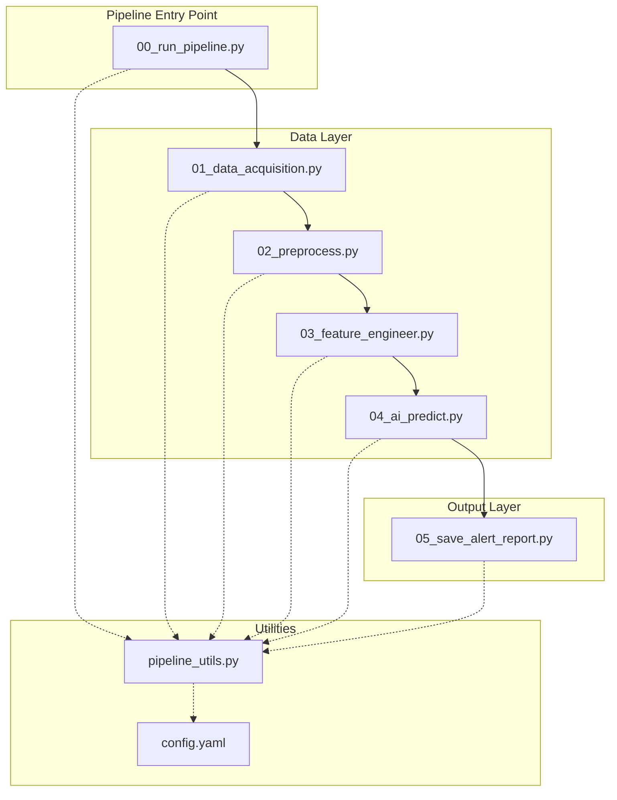
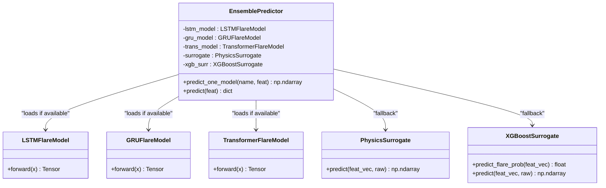
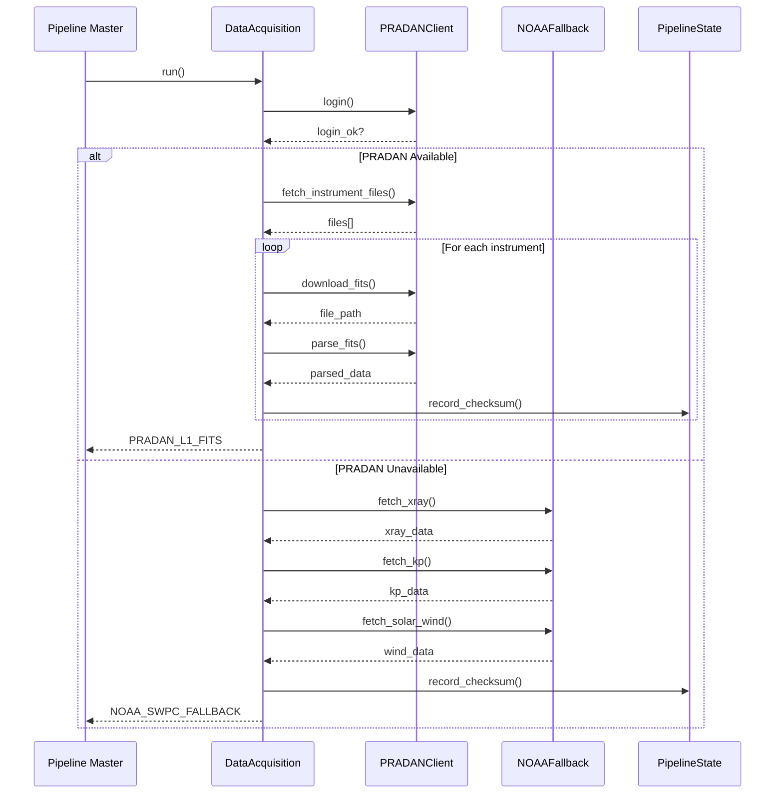
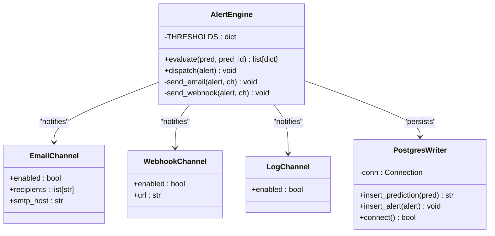
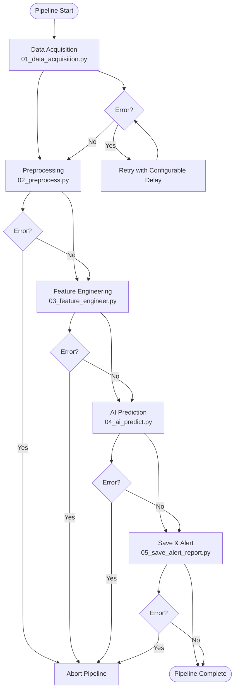
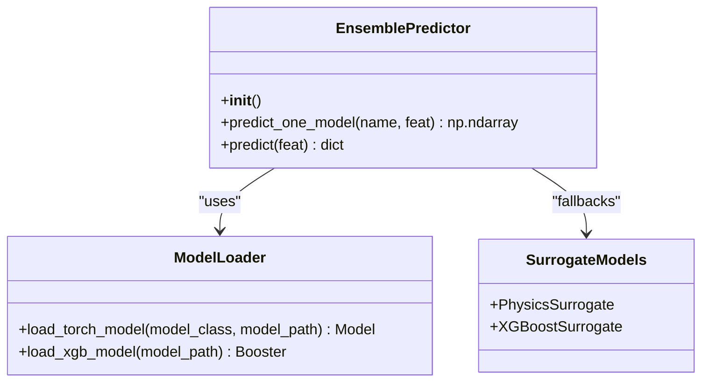
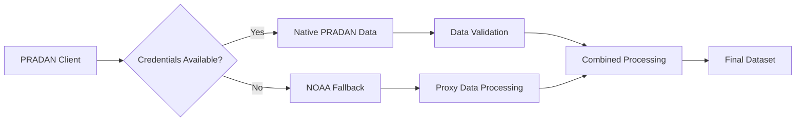
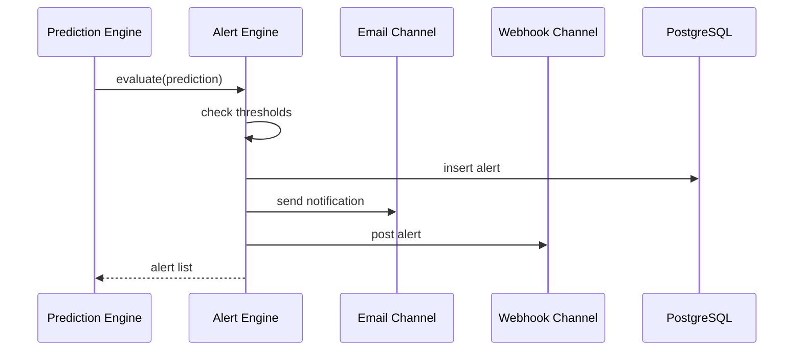

# Design Patterns and Architectural Decisions

<cite>
**Referenced Files in This Document**
- [00_run_pipeline.py](file://00_run_pipeline.py)
- [01_data_acquisition.py](file://01_data_acquisition.py)
- [02_preprocess.py](file://02_preprocess.py)
- [03_feature_engineer.py](file://03_feature_engineer.py)
- [04_ai_predict.py](file://04_ai_predict.py)
- [05_save_alert_report.py](file://05_save_alert_report.py)
- [pipeline_utils.py](file://pipeline_utils.py)
- [config.yaml](file://config.yaml)
- [README.md](file://README.md)
</cite>

## Table of Contents
1. [Introduction](#introduction)
2. [Project Structure](#project-structure)
3. [Core Architectural Patterns](#core-architectural-patterns)
4. [Factory Pattern Implementation](#factory-pattern-implementation)
5. [Strategy Pattern Implementation](#strategy-pattern-implementation)
6. [Observer Pattern Implementation](#observer-pattern-implementation)
7. [Pipeline Pattern Implementation](#pipeline-pattern-implementation)
8. [Pattern Benefits and System Design](#pattern-benefits-and-system-design)
9. [Code-Level Pattern Analysis](#code-level-pattern-analysis)
10. [Conclusion](#conclusion)

## Introduction

The Aditya-L1 Solar Flare Forecasting Pipeline demonstrates sophisticated software architecture through the strategic implementation of multiple design patterns. This system processes real-time solar data from multiple sources, performs complex machine learning inference, and generates actionable alerts for space weather monitoring. The architecture emphasizes modularity, testability, and maintainability through well-defined patterns that enable easy model replacement, intelligent fallback mechanisms, and robust notification systems.

The pipeline operates as a continuous 5-minute cron job, processing data through eight sequential stages while maintaining resilience through configurable retry mechanisms and comprehensive error handling.

## Project Structure

The pipeline follows a modular, stage-based architecture with clear separation of concerns:

**Diagram sources**
- [00_run_pipeline.py:63-146](file://00_run_pipeline.py#L63-L146)
- [01_data_acquisition.py:350-458](file://01_data_acquisition.py#L350-L458)
- [02_preprocess.py:230-422](file://02_preprocess.py#L230-L422)
- [03_feature_engineer.py:199-265](file://03_feature_engineer.py#L199-L265)
- [04_ai_predict.py:402-466](file://04_ai_predict.py#L402-L466)
- [05_save_alert_report.py:452-507](file://05_save_alert_report.py#L452-L507)

**Section sources**
- [README.md:7-32](file://README.md#L7-L32)
- [00_run_pipeline.py:13-24](file://00_run_pipeline.py#L13-L24)

## Core Architectural Patterns

The system implements four primary design patterns that work together to create a robust, maintainable forecasting pipeline:

### 1. Factory Pattern for Model Loading Abstraction
The system uses a factory-like approach to dynamically load and configure machine learning models based on configuration and availability.

### 2. Strategy Pattern for Dual Data Acquisition
Intelligent fallback mechanism between PRADAN (native ISRO data) and NOAA SWPC (public fallback) data sources.

### 3. Observer Pattern for Multi-Channel Alert Notifications
Decoupled alert system that notifies multiple channels (email, webhooks, logs) without tightly coupling the alert logic to the main processing flow.

### 4. Pipeline Pattern for Sequential Processing
Structured processing stages with clear data flow and error handling between each stage.

## Factory Pattern Implementation

The Factory pattern is implemented through the `EnsemblePredictor` class in the AI prediction stage, which dynamically loads and configures different model types based on configuration and availability.

**Diagram sources**
- [04_ai_predict.py:246-396](file://04_ai_predict.py#L246-L396)
- [04_ai_predict.py:64-127](file://04_ai_predict.py#L64-L127)
- [04_ai_predict.py:134-238](file://04_ai_predict.py#L134-L238)

The factory implementation provides:

- **Configuration-driven model selection**: Models are loaded based on configuration file settings
- **Graceful degradation**: When trained weights are unavailable, surrogate models are used
- **Easy model replacement**: New models can be added by extending the factory interface
- **Resource-aware loading**: Models are only loaded when dependencies are available

**Section sources**
- [04_ai_predict.py:246-309](file://04_ai_predict.py#L246-L309)
- [04_ai_predict.py:113-127](file://04_ai_predict.py#L113-L127)
- [config.yaml:66-77](file://config.yaml#L66-L77)

## Strategy Pattern Implementation

The Strategy pattern is implemented in the data acquisition stage, providing intelligent fallback mechanisms between PRADAN (native ISRO data) and NOAA SWPC (public fallback) data sources.

**Diagram sources**
- [01_data_acquisition.py:350-458](file://01_data_acquisition.py#L350-L458)
- [01_data_acquisition.py:366-434](file://01_data_acquisition.py#L366-L434)

Key strategy implementations:

- **Dual acquisition strategies**: Native PRADAN data vs. NOAA fallback
- **Intelligent fallback logic**: Automatic switching based on availability
- **Configurable timeouts and retries**: Robust network handling
- **Checksum-based deduplication**: Prevents processing duplicate data

**Section sources**
- [01_data_acquisition.py:45-193](file://01_data_acquisition.py#L45-L193)
- [01_data_acquisition.py:199-325](file://01_data_acquisition.py#L199-L325)
- [01_data_acquisition.py:350-458](file://01_data_acquisition.py#L350-L458)

## Observer Pattern Implementation

The Observer pattern is implemented through the alert system, which notifies multiple channels (email, webhooks, logs) without tightly coupling the alert logic to the main processing flow.

**Diagram sources**
- [05_save_alert_report.py:222-298](file://05_save_alert_report.py#L222-L298)
- [05_save_alert_report.py:47-216](file://05_save_alert_report.py#L47-L216)

The observer implementation provides:

- **Multi-channel notification**: Email, webhooks, and console logging
- **Configurable alert thresholds**: Easy adjustment of sensitivity levels
- **Decoupled alert evaluation**: Separate from prediction logic
- **Persistent alert storage**: PostgreSQL backend for alert history

**Section sources**
- [05_save_alert_report.py:222-298](file://05_save_alert_report.py#L222-L298)
- [05_save_alert_report.py:47-216](file://05_save_alert_report.py#L47-L216)
- [config.yaml:79-89](file://config.yaml#L79-L89)

## Pipeline Pattern Implementation

The Pipeline pattern organizes the entire forecasting process into sequential stages with clear data flow and error handling between each stage.

**Diagram sources**
- [00_run_pipeline.py:41-146](file://00_run_pipeline.py#L41-L146)

The pipeline implementation ensures:

- **Sequential processing**: Each stage depends on the previous stage's output
- **Configurable retries**: Built-in retry mechanism with exponential backoff
- **Comprehensive error handling**: Graceful degradation and failure reporting
- **State persistence**: Pipeline state maintained between runs

**Section sources**
- [00_run_pipeline.py:41-146](file://00_run_pipeline.py#L41-L146)
- [00_run_pipeline.py:63-121](file://00_run_pipeline.py#L63-L121)

## Pattern Benefits and System Design

The combination of these design patterns provides several key benefits:

### Modularity
- Each stage operates independently with well-defined interfaces
- Components can be tested and debugged in isolation
- Easy addition of new processing stages

### Testability
- Factory pattern enables mocking of model loading
- Strategy pattern allows testing of different data sources
- Observer pattern facilitates unit testing of alert systems

### Maintainability
- Configuration-driven model selection reduces code changes
- Clear separation of concerns simplifies updates
- Centralized error handling and logging

### Scalability
- Factory pattern supports multiple model types
- Strategy pattern accommodates new data sources
- Pipeline pattern enables parallel processing where appropriate

## Code-Level Pattern Analysis

### Factory Pattern Details

The factory implementation in the AI prediction stage demonstrates sophisticated dependency injection and resource management:

**Diagram sources**
- [04_ai_predict.py:246-396](file://04_ai_predict.py#L246-L396)
- [04_ai_predict.py:113-127](file://04_ai_predict.py#L113-L127)

### Strategy Pattern Details

The dual acquisition strategy provides intelligent fallback mechanisms:

**Diagram sources**
- [01_data_acquisition.py:366-434](file://01_data_acquisition.py#L366-L434)

### Observer Pattern Details

The alert system demonstrates event-driven architecture:

**Diagram sources**
- [05_save_alert_report.py:222-298](file://05_save_alert_report.py#L222-L298)

## Conclusion

The Aditya-L1 Solar Flare Forecasting Pipeline exemplifies modern software architecture through the strategic implementation of four key design patterns. The Factory pattern enables flexible model loading and configuration-driven selection, while the Strategy pattern provides intelligent fallback mechanisms for data acquisition. The Observer pattern creates a decoupled alert notification system, and the Pipeline pattern organizes the entire processing workflow into maintainable stages.

These patterns work together to create a system that is highly modular, testable, maintainable, and scalable. The architecture supports easy model replacement, robust error handling, and extensible notification capabilities, making it suitable for production space weather monitoring operations.

The implementation demonstrates how design patterns can be adapted to real-world scenarios, providing both theoretical benefits and practical advantages in a mission-critical system. The codebase serves as an excellent example of how thoughtful architectural decisions can create systems that are both powerful and maintainable.