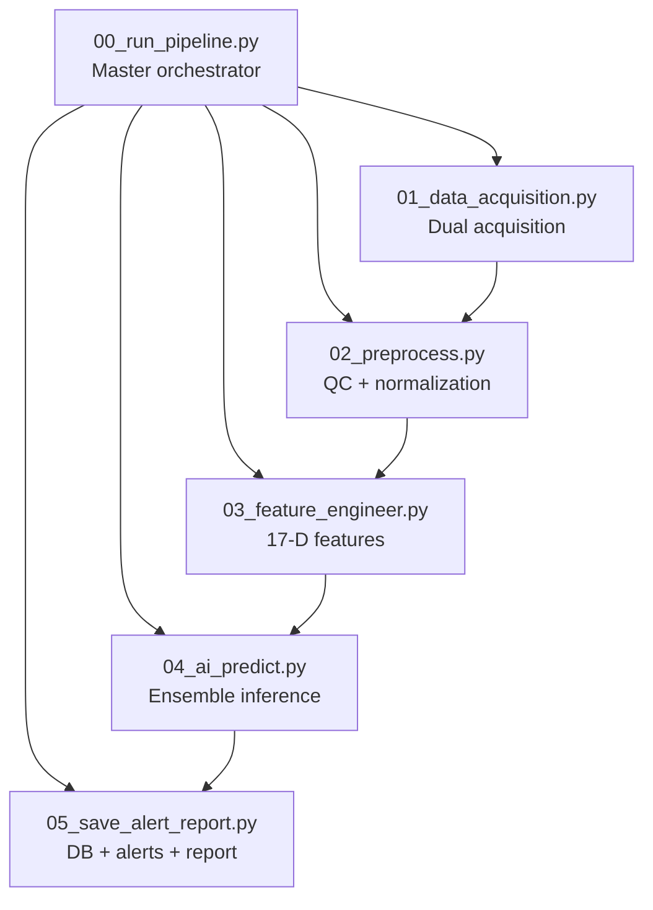
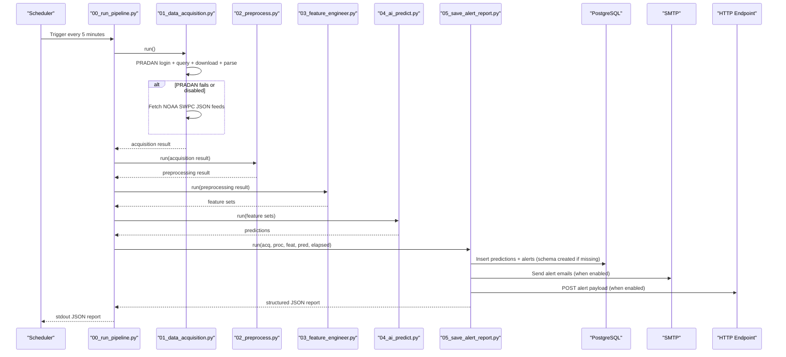
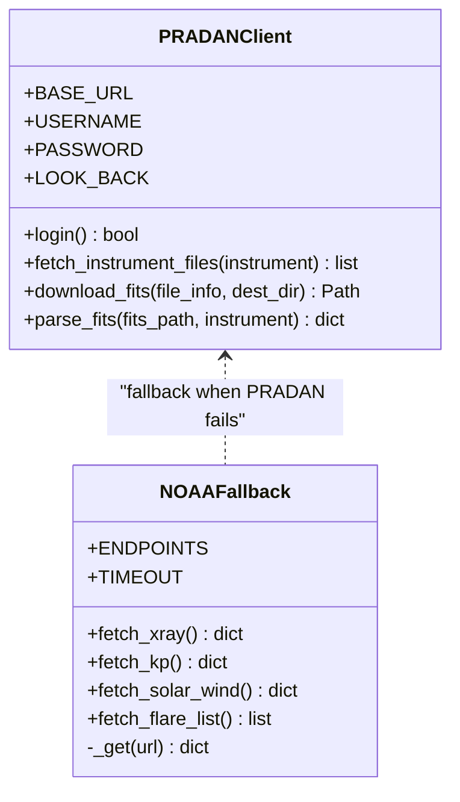
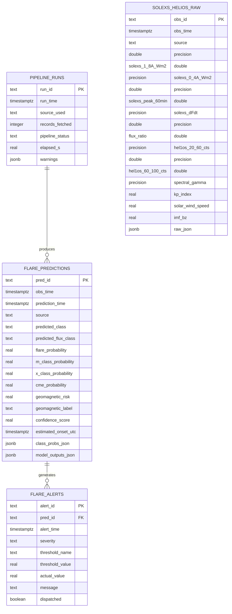
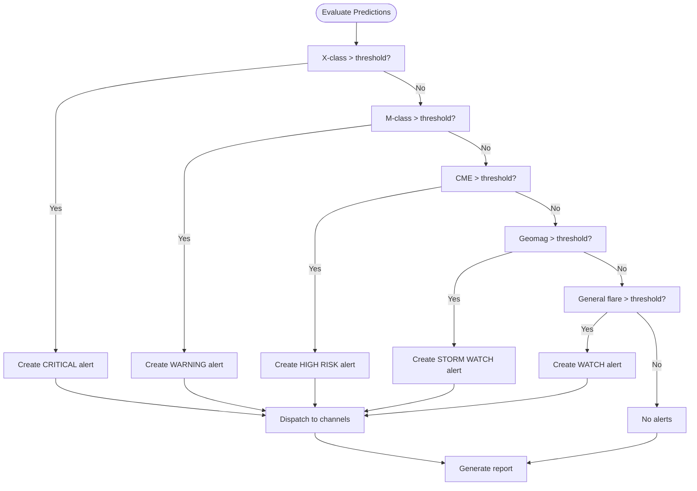
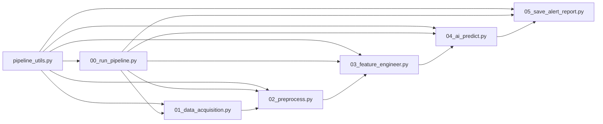

# External Integrations and Interfaces

<cite>
**Referenced Files in This Document**
- [README.md](file://README.md)
- [config.yaml](file://config.yaml)
- [00_run_pipeline.py](file://00_run_pipeline.py)
- [01_data_acquisition.py](file://01_data_acquisition.py)
- [02_preprocess.py](file://02_preprocess.py)
- [03_feature_engineer.py](file://03_feature_engineer.py)
- [04_ai_predict.py](file://04_ai_predict.py)
- [05_save_alert_report.py](file://05_save_alert_report.py)
- [pipeline_utils.py](file://pipeline_utils.py)
</cite>

## Table of Contents
1. [Introduction](#introduction)
2. [Project Structure](#project-structure)
3. [Core Components](#core-components)
4. [Architecture Overview](#architecture-overview)
5. [Detailed Component Analysis](#detailed-component-analysis)
6. [Dependency Analysis](#dependency-analysis)
7. [Performance Considerations](#performance-considerations)
8. [Troubleshooting Guide](#troubleshooting-guide)
9. [Conclusion](#conclusion)
10. [Appendices](#appendices)

## Introduction
This document explains the external system integrations and interface patterns implemented in the Aditya-L1 Solar Flare Forecasting Pipeline. It focuses on:
- Dual data acquisition strategy with the ISRO PRADAN portal and NOAA SWPC fallback
- PostgreSQL database integration with automatic schema creation and data persistence
- Alert system integrations including email notifications, webhooks, and dashboard updates
- Configuration-driven integration patterns, error handling for external service failures, and fallback strategies
- Security considerations, authentication mechanisms, and rate limiting for external API calls

## Project Structure
The pipeline is organized as a sequence of modular scripts orchestrated by a master entry point. Each step encapsulates a distinct integration or processing stage:
- Data acquisition (PRADAN + NOAA SWPC)
- Validation and preprocessing
- Feature engineering
- AI ensemble inference
- Persistence, alert evaluation, dashboard update, and JSON reporting

**Diagram sources**
- [00_run_pipeline.py:63-146](file://00_run_pipeline.py#L63-L146)
- [01_data_acquisition.py:350-458](file://01_data_acquisition.py#L350-L458)
- [02_preprocess.py:230-422](file://02_preprocess.py#L230-L422)
- [03_feature_engineer.py:199-265](file://03_feature_engineer.py#L199-L265)
- [04_ai_predict.py:402-466](file://04_ai_predict.py#L402-L466)
- [05_save_alert_report.py:452-507](file://05_save_alert_report.py#L452-L507)

**Section sources**
- [README.md:7-32](file://README.md#L7-L32)
- [00_run_pipeline.py:13-24](file://00_run_pipeline.py#L13-L24)

## Core Components
- Configuration-driven integration patterns:
  - Centralized configuration via YAML with environment variable expansion
  - Extensive external service endpoints and credentials managed in config
- Dual data acquisition:
  - PRADAN client for native Aditya-L1 L1 FITS data with login and file retrieval
  - NOAA SWPC fallback for real-time proxies (GOES XRS, Kp, solar wind)
- PostgreSQL persistence:
  - Automatic schema creation on first run with idempotent DDL
  - Structured inserts for raw observations, processed features, predictions, and alerts
- Alert system:
  - Threshold-based evaluation and dispatch to email and webhook channels
  - Dashboard payload generation (placeholder for WebSocket/Redis integration)
- Robust orchestration:
  - Retry and error handling per step with pipeline state persistence

**Section sources**
- [config.yaml:6-104](file://config.yaml#L6-L104)
- [01_data_acquisition.py:50-458](file://01_data_acquisition.py#L50-L458)
- [05_save_alert_report.py:47-334](file://05_save_alert_report.py#L47-L334)
- [00_run_pipeline.py:41-61](file://00_run_pipeline.py#L41-L61)

## Architecture Overview
The pipeline integrates with external systems through well-defined interfaces and fallbacks. The master orchestrator coordinates retries and error propagation, while each step encapsulates its own integration logic.

**Diagram sources**
- [00_run_pipeline.py:63-146](file://00_run_pipeline.py#L63-L146)
- [01_data_acquisition.py:350-458](file://01_data_acquisition.py#L350-L458)
- [02_preprocess.py:230-422](file://02_preprocess.py#L230-L422)
- [03_feature_engineer.py:199-265](file://03_feature_engineer.py#L199-L265)
- [04_ai_predict.py:402-466](file://04_ai_predict.py#L402-L466)
- [05_save_alert_report.py:452-507](file://05_save_alert_report.py#L452-L507)

## Detailed Component Analysis

### Data Acquisition: PRADAN + NOAA SWPC Fallback
- PRADAN client:
  - Authenticates via username/password environment variables
  - Queries for L1 FITS files within a look-back window
  - Downloads and parses FITS using astropy when available
  - Deduplicates records using checksums stored in pipeline state
- NOAA SWPC fallback:
  - Real-time feeds for GOES XRS, Kp index, solar wind, and recent flares
  - Uses a custom User-Agent header for identification
  - Aggregates into a unified observation record when native data is unavailable
  - Applies duplicate suppression based on minute-granularity checksum

**Diagram sources**
- [01_data_acquisition.py:50-193](file://01_data_acquisition.py#L50-L193)
- [01_data_acquisition.py:199-325](file://01_data_acquisition.py#L199-L325)

**Section sources**
- [01_data_acquisition.py:69-144](file://01_data_acquisition.py#L69-L144)
- [01_data_acquisition.py:145-193](file://01_data_acquisition.py#L145-L193)
- [01_data_acquisition.py:212-307](file://01_data_acquisition.py#L212-L307)
- [01_data_acquisition.py:331-452](file://01_data_acquisition.py#L331-L452)

### PostgreSQL Integration: Automatic Schema Creation and Persistence
- Schema creation:
  - Idempotent DDL creates tables for raw observations, processed features, predictions, and alerts
  - Indexes optimized for time-series queries
- Persistence:
  - Inserts predictions and alerts with conflict handling
  - JSON fields for structured outputs and model outputs
  - Connection timeout and graceful degradation when psycopg2 is unavailable

**Diagram sources**
- [05_save_alert_report.py:49-116](file://05_save_alert_report.py#L49-L116)
- [05_save_alert_report.py:143-216](file://05_save_alert_report.py#L143-L216)

**Section sources**
- [05_save_alert_report.py:118-142](file://05_save_alert_report.py#L118-L142)
- [05_save_alert_report.py:143-216](file://05_save_alert_report.py#L143-L216)

### Alert System Integrations: Email, Webhooks, and Dashboard Updates
- Threshold evaluation:
  - Configurable percentages for X-class, M-class, CME, geomagnetic storm, and general flare watch
- Dispatch channels:
  - Email: SMTP transport with subject and body composition
  - Webhook: HTTP POST with alert payload
- Dashboard:
  - Generates a structured payload suitable for WebSocket or Redis pub/sub integration
  - Logs payload for verification

**Diagram sources**
- [05_save_alert_report.py:226-266](file://05_save_alert_report.py#L226-L266)
- [05_save_alert_report.py:267-298](file://05_save_alert_report.py#L267-L298)
- [05_save_alert_report.py:304-333](file://05_save_alert_report.py#L304-L333)

**Section sources**
- [05_save_alert_report.py:222-266](file://05_save_alert_report.py#L222-L266)
- [05_save_alert_report.py:267-298](file://05_save_alert_report.py#L267-L298)
- [05_save_alert_report.py:304-333](file://05_save_alert_report.py#L304-L333)

### Configuration-Driven Integration Patterns
- Centralized configuration:
  - Pipeline scheduling, logging, and retry policies
  - Data acquisition endpoints and fallback URLs
  - Instrument definitions and preprocessing parameters
  - Model configurations and ensemble weights
  - Alert thresholds and channels
  - Database connection and table names
- Environment variable expansion:
  - ${ENV_VAR} placeholders expanded at runtime
- Idempotent schema creation:
  - Ensures database readiness without manual intervention

**Section sources**
- [config.yaml:6-104](file://config.yaml#L6-L104)
- [pipeline_utils.py:25-41](file://pipeline_utils.py#L25-L41)

### Error Handling and Fallback Strategies
- Per-step retries with exponential-like delays
- Graceful degradation when external libraries are missing (e.g., astropy, psycopg2)
- Fallback from PRADAN to NOAA SWPC when credentials are missing or API calls fail
- Deduplication prevents repeated processing of identical records
- Failure state persisted to pipeline state for diagnostics

**Section sources**
- [00_run_pipeline.py:41-61](file://00_run_pipeline.py#L41-L61)
- [01_data_acquisition.py:365-407](file://01_data_acquisition.py#L365-L407)
- [05_save_alert_report.py:121-141](file://05_save_alert_report.py#L121-L141)

### Security Considerations, Authentication, and Rate Limiting
- Authentication:
  - PRADAN requires username/password via environment variables
  - Email SMTP host configured via environment variable
- Rate limiting and timeouts:
  - HTTP timeouts configured per endpoint (e.g., 15s login, 20s fetch)
  - Custom User-Agent header included for NOAA SWPC
- Data protection:
  - Sensitive environment variables are not committed to source control
  - Email recipients and webhook URL are configurable

**Section sources**
- [README.md:64-83](file://README.md#L64-L83)
- [01_data_acquisition.py:74-87](file://01_data_acquisition.py#L74-L87)
- [01_data_acquisition.py:214-220](file://01_data_acquisition.py#L214-L220)
- [05_save_alert_report.py:280-297](file://05_save_alert_report.py#L280-L297)

## Dependency Analysis
The pipeline exhibits clear separation of concerns across modules, with explicit dependencies between steps and shared utilities.

**Diagram sources**
- [00_run_pipeline.py:35-38](file://00_run_pipeline.py#L35-L38)
- [01_data_acquisition.py:34-37](file://01_data_acquisition.py#L34-L37)
- [02_preprocess.py:26-29](file://02_preprocess.py#L26-L29)
- [03_feature_engineer.py:35-38](file://03_feature_engineer.py#L35-L38)
- [04_ai_predict.py:32-35](file://04_ai_predict.py#L32-L35)
- [05_save_alert_report.py:32-35](file://05_save_alert_report.py#L32-L35)

**Section sources**
- [00_run_pipeline.py:35-38](file://00_run_pipeline.py#L35-L38)
- [01_data_acquisition.py:34-37](file://01_data_acquisition.py#L34-L37)
- [02_preprocess.py:26-29](file://02_preprocess.py#L26-L29)
- [03_feature_engineer.py:35-38](file://03_feature_engineer.py#L35-L38)
- [04_ai_predict.py:32-35](file://04_ai_predict.py#L32-L35)
- [05_save_alert_report.py:32-35](file://05_save_alert_report.py#L32-L35)

## Performance Considerations
- Timeouts and retries:
  - Configurable max retries and delay reduce transient failure impact
- Data deduplication:
  - Minimizes redundant processing and storage overhead
- Normalization and rolling windows:
  - Efficient feature computation reduces model inference cost
- Asynchronous alert dispatch:
  - Non-blocking email/webhook calls improve throughput

[No sources needed since this section provides general guidance]

## Troubleshooting Guide
- PRADAN connectivity issues:
  - Verify environment variables and network access
  - Check login response and HTTP status codes
- NOAA SWPC unavailability:
  - Confirm JSON endpoints are reachable and returning data
  - Review fallback logic and duplicate suppression
- Database write failures:
  - Ensure PostgreSQL is reachable and schema is created
  - Check connection parameters and permissions
- Alert delivery problems:
  - Validate SMTP host and recipient lists
  - Inspect webhook URL and payload format
- Pipeline state corruption:
  - Review pipeline state file and logs
  - Re-run with fresh state if necessary

**Section sources**
- [01_data_acquisition.py:74-87](file://01_data_acquisition.py#L74-L87)
- [01_data_acquisition.py:214-220](file://01_data_acquisition.py#L214-L220)
- [05_save_alert_report.py:121-141](file://05_save_alert_report.py#L121-L141)
- [05_save_alert_report.py:280-297](file://05_save_alert_report.py#L280-L297)

## Conclusion
The pipeline implements robust external integrations with clear fallbacks, configuration-driven behavior, and resilient persistence and alerting. The dual acquisition strategy ensures continuous operation under varying external conditions, while PostgreSQL schema creation and alert dispatch provide reliable downstream integration points.

[No sources needed since this section summarizes without analyzing specific files]

## Appendices
- Environment variables and secrets:
  - PRADAN credentials, database connection, SMTP host, and webhook URL
- Cron scheduling:
  - 5-minute cadence for acquisition and nightly retraining
- Data retention:
  - Raw data archived for 90 days

**Section sources**
- [README.md:64-133](file://README.md#L64-L133)
- [config.yaml:35-39](file://config.yaml#L35-L39)