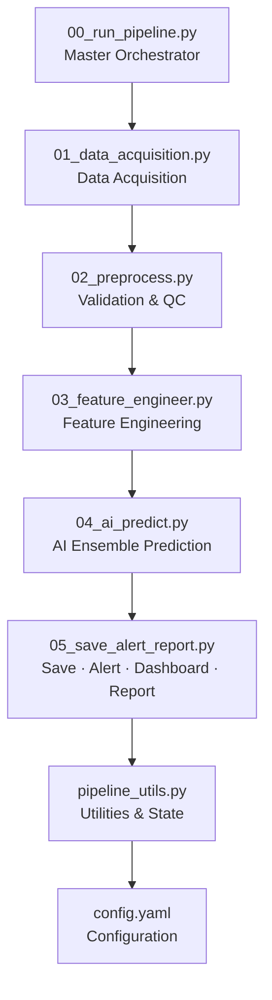
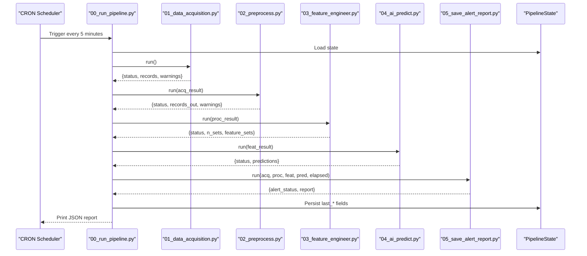
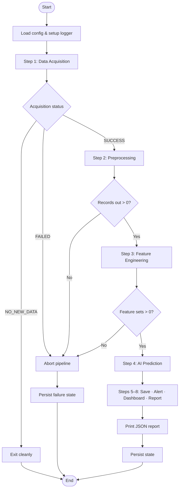
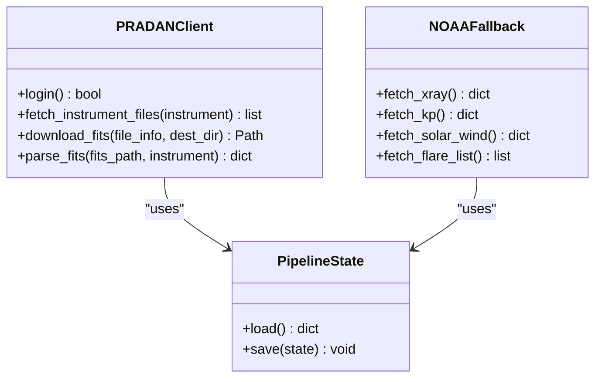
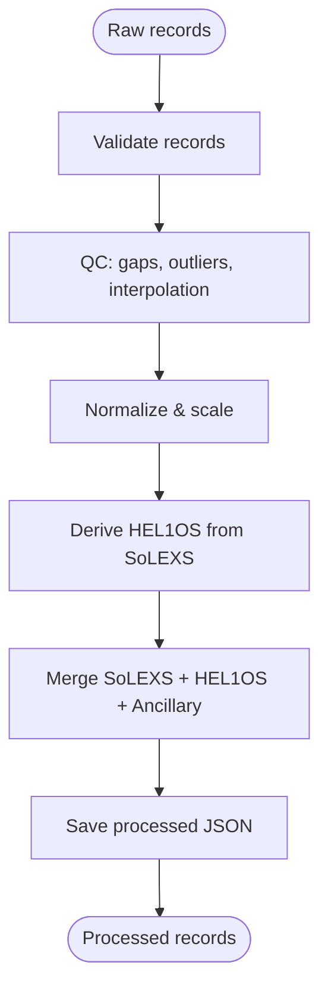
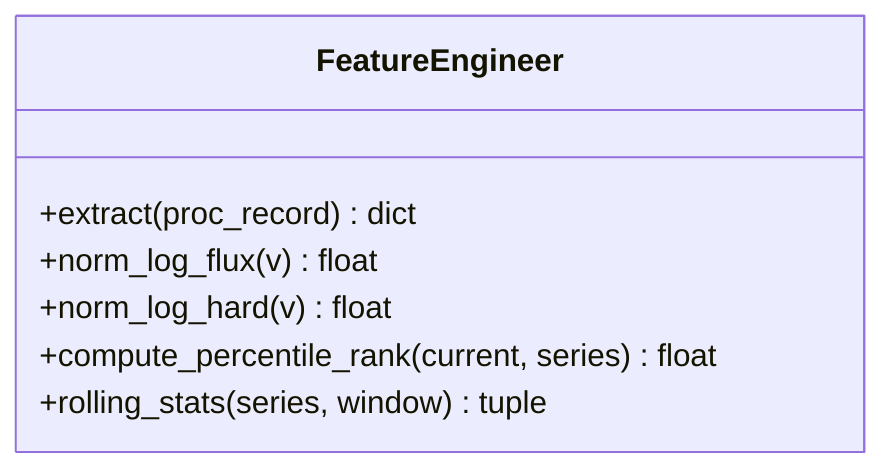
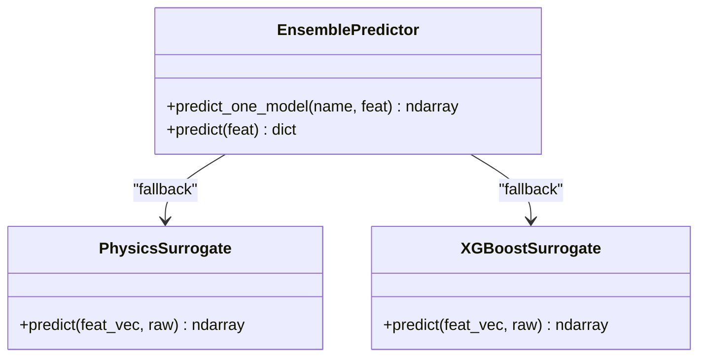
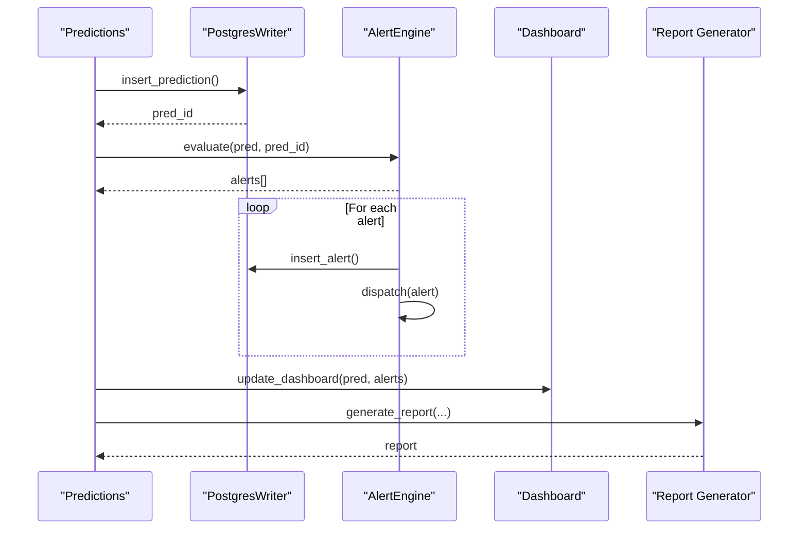
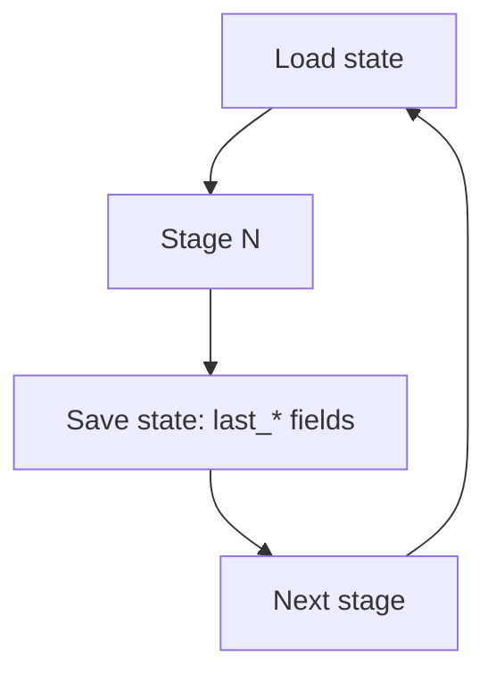
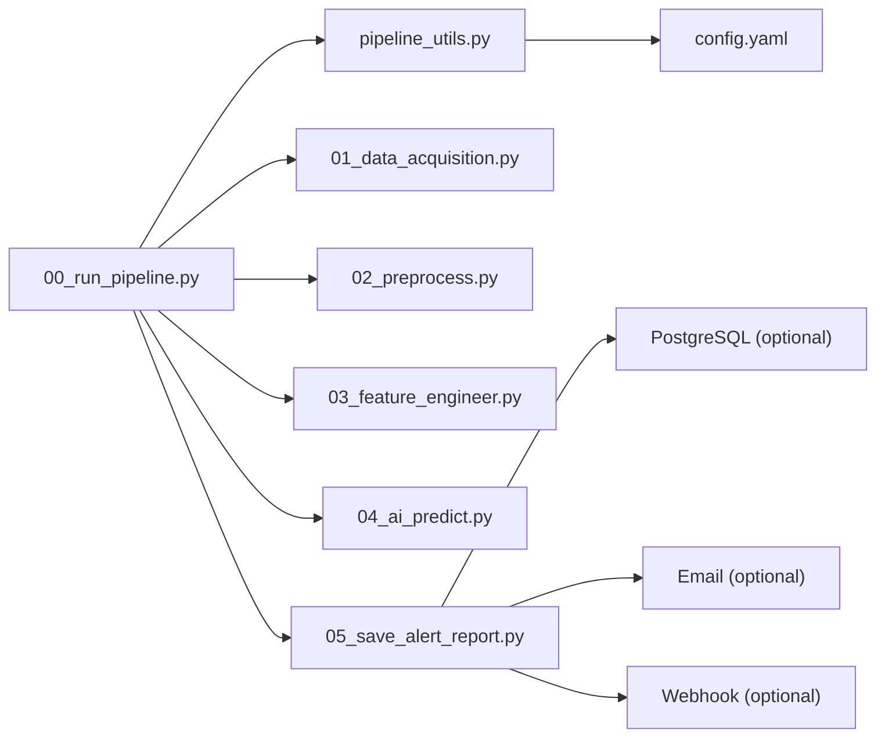

# Pipeline Pattern Implementation

<cite>
**Referenced Files in This Document**
- [00_run_pipeline.py](file://00_run_pipeline.py)
- [01_data_acquisition.py](file://01_data_acquisition.py)
- [02_preprocess.py](file://02_preprocess.py)
- [03_feature_engineer.py](file://03_feature_engineer.py)
- [04_ai_predict.py](file://04_ai_predict.py)
- [05_save_alert_report.py](file://05_save_alert_report.py)
- [pipeline_utils.py](file://pipeline_utils.py)
- [config.yaml](file://config.yaml)
- [README.md](file://README.md)
</cite>

## Table of Contents
1. [Introduction](#introduction)
2. [Project Structure](#project-structure)
3. [Core Components](#core-components)
4. [Architecture Overview](#architecture-overview)
5. [Detailed Component Analysis](#detailed-component-analysis)
6. [Dependency Analysis](#dependency-analysis)
7. [Performance Considerations](#performance-considerations)
8. [Troubleshooting Guide](#troubleshooting-guide)
9. [Conclusion](#conclusion)

## Introduction
This document explains the pipeline pattern implementation for the Aditya-L1 Solar Flare Forecasting (SFF) system. The pipeline is a sequential processing architecture orchestrated by a CRON entry point that executes eight distinct stages: data acquisition, validation and preprocessing, feature engineering, AI ensemble inference, database saving, alert evaluation, dashboard update, and JSON reporting. The master orchestrator provides robust retry logic, error handling, and state persistence to ensure reliable operation across heterogeneous data sources and model backends.

## Project Structure
The pipeline is organized as a set of modular Python scripts, each responsible for a specific stage. A shared utilities module centralizes configuration loading, logging, and state management. Configuration is externalized via YAML for environment-specific customization.

**Diagram sources**
- [00_run_pipeline.py:1-146](file://00_run_pipeline.py#L1-L146)
- [01_data_acquisition.py:1-458](file://01_data_acquisition.py#L1-L458)
- [02_preprocess.py:1-422](file://02_preprocess.py#L1-L422)
- [03_feature_engineer.py:1-265](file://03_feature_engineer.py#L1-L265)
- [04_ai_predict.py:1-466](file://04_ai_predict.py#L1-L466)
- [05_save_alert_report.py:1-507](file://05_save_alert_report.py#L1-L507)
- [pipeline_utils.py:1-123](file://pipeline_utils.py#L1-L123)
- [config.yaml:1-104](file://config.yaml#L1-L104)

**Section sources**
- [README.md:1-32](file://README.md#L1-L32)
- [config.yaml:6-13](file://config.yaml#L6-L13)

## Core Components
- Master Orchestrator (00_run_pipeline.py): Executes the eight-stage pipeline sequentially, wraps each stage in a robust step function with retry/backoff, and aggregates timing and error handling. It also persists failure state for next run recovery.
- Data Acquisition (01_data_acquisition.py): Fetches native PRADAN L1 FITS data and parses it, with automatic fallback to NOAA SWPC public feeds when credentials are unavailable.
- Validation & Preprocessing (02_preprocess.py): Validates records, detects duplicates, performs sigma clipping and linear interpolation, derives HEL1OS features from SoLEXS ratios, and normalizes data.
- Feature Engineering (03_feature_engineer.py): Extracts a 17-dimensional feature vector and constructs a 60×17 sequence tensor for temporal modeling.
- AI Ensemble Prediction (04_ai_predict.py): Runs an ensemble of LSTM, GRU, Transformer, and XGBoost models (with physics-informed surrogates as fallback), computes class probabilities, CME risk, and onset estimates.
- Save, Alert, Dashboard, Report (05_save_alert_report.py): Writes predictions to PostgreSQL (or simulation), evaluates alert thresholds, dispatches alerts via email/webhook, updates a dashboard stub, and generates a structured JSON report.
- Utilities & State (pipeline_utils.py): Loads configuration, sets up logging, manages persistent pipeline state, and provides classification helpers.
- Configuration (config.yaml): Centralizes pipeline, data, preprocessing, model, alert, and database settings.

**Section sources**
- [00_run_pipeline.py:13-24](file://00_run_pipeline.py#L13-L24)
- [01_data_acquisition.py:1-14](file://01_data_acquisition.py#L1-L14)
- [02_preprocess.py:8-17](file://02_preprocess.py#L8-L17)
- [03_feature_engineer.py:9-27](file://03_feature_engineer.py#L9-L27)
- [04_ai_predict.py:7-24](file://04_ai_predict.py#L7-L24)
- [05_save_alert_report.py:7-13](file://05_save_alert_report.py#L7-L13)
- [pipeline_utils.py:82-96](file://pipeline_utils.py#L82-L96)
- [config.yaml:66-77](file://config.yaml#L66-L77)

## Architecture Overview
The pipeline follows a strict sequential flow controlled by the master orchestrator. Each stage validates inputs from the previous stage and passes a structured result to the next. Persistent state ensures resilience against transient failures and enables recovery on subsequent runs.

**Diagram sources**
- [00_run_pipeline.py:63-146](file://00_run_pipeline.py#L63-L146)
- [01_data_acquisition.py:350-452](file://01_data_acquisition.py#L350-L452)
- [02_preprocess.py:230-409](file://02_preprocess.py#L230-L409)
- [03_feature_engineer.py:199-249](file://03_feature_engineer.py#L199-L249)
- [04_ai_predict.py:402-448](file://04_ai_predict.py#L402-L448)
- [05_save_alert_report.py:452-502](file://05_save_alert_report.py#L452-L502)

## Detailed Component Analysis

### Master Orchestrator (00_run_pipeline.py)
- Role: Sequential pipeline executor, timing, retries, error handling, and state persistence.
- Retry mechanism: Wraps each stage in a step function with configurable max retries and delay.
- Flow control: Checks status codes from acquisition/preprocessing to decide whether to continue or exit early.
- State persistence: On failure, stores last failure timestamp and message for next run awareness.

**Diagram sources**
- [00_run_pipeline.py:41-61](file://00_run_pipeline.py#L41-L61)
- [00_run_pipeline.py:63-146](file://00_run_pipeline.py#L63-L146)

**Section sources**
- [00_run_pipeline.py:41-61](file://00_run_pipeline.py#L41-L61)
- [00_run_pipeline.py:63-146](file://00_run_pipeline.py#L63-L146)
- [config.yaml:12-13](file://config.yaml#L12-L13)

### Data Acquisition (01_data_acquisition.py)
- Dual-source strategy: Native PRADAN L1 FITS with login and deduplication; fallback to NOAA SWPC public feeds.
- Deduplication: Computes checksums and maintains a rolling window in pipeline state to skip already-processed records.
- Output: Structured acquisition result with status, source used, and records.

**Diagram sources**
- [01_data_acquisition.py:50-193](file://01_data_acquisition.py#L50-L193)
- [01_data_acquisition.py:199-307](file://01_data_acquisition.py#L199-L307)
- [pipeline_utils.py:82-96](file://pipeline_utils.py#L82-L96)

**Section sources**
- [01_data_acquisition.py:350-452](file://01_data_acquisition.py#L350-L452)
- [01_data_acquisition.py:331-344](file://01_data_acquisition.py#L331-L344)

### Validation & Preprocessing (02_preprocess.py)
- Validation: Ensures presence of required fields and applies source-specific checks.
- Quality control: Detects gaps, flags outliers, interpolates missing values, and normalizes data.
- HEL1OS derivation: Uses a spectral model to estimate hard X-ray rates from SoLEXS proxies when native data is unavailable.
- Output: Clean records with normalized time series and ancillary parameters.

**Diagram sources**
- [02_preprocess.py:230-409](file://02_preprocess.py#L230-L409)

**Section sources**
- [02_preprocess.py:230-409](file://02_preprocess.py#L230-L409)

### Feature Engineering (03_feature_engineer.py)
- Feature extraction: Builds a 17-dimensional vector and a 60×17 sequence tensor for temporal modeling.
- Normalization: Applies log10 and min-max scaling to flux features; normalizes ancillary variables.
- Rolling statistics: Computes percentile rank and rolling mean/std dev for temporal context.

**Diagram sources**
- [03_feature_engineer.py:52-193](file://03_feature_engineer.py#L52-L193)

**Section sources**
- [03_feature_engineer.py:199-249](file://03_feature_engineer.py#L199-L249)

### AI Ensemble Prediction (04_ai_predict.py)
- Model backends: LSTM, GRU, Transformer, XGBoost; auto-detects and loads saved weights; otherwise uses physics-informed surrogates.
- Ensemble: Weighted combination of model outputs; computes class probabilities, CME risk, and onset windows.
- Outputs: Predictions enriched with confidence scores and model outputs.

**Diagram sources**
- [04_ai_predict.py:246-395](file://04_ai_predict.py#L246-L395)
- [04_ai_predict.py:134-190](file://04_ai_predict.py#L134-L190)
- [04_ai_predict.py:192-238](file://04_ai_predict.py#L192-L238)

**Section sources**
- [04_ai_predict.py:402-448](file://04_ai_predict.py#L402-L448)
- [config.yaml:69-77](file://config.yaml#L69-L77)

### Save, Alert, Dashboard, Report (05_save_alert_report.py)
- PostgreSQL writer: Creates tables on first run, inserts predictions and alerts, and handles simulated mode when psycopg2 is unavailable.
- Alert engine: Evaluates thresholds and dispatches alerts via log/email/webhook.
- Dashboard update: Prepares a payload for real-time updates (stubbed for WebSocket/Redis).
- JSON report: Generates a canonical structured output for downstream systems.

**Diagram sources**
- [05_save_alert_report.py:47-216](file://05_save_alert_report.py#L47-L216)
- [05_save_alert_report.py:222-298](file://05_save_alert_report.py#L222-L298)
- [05_save_alert_report.py:304-333](file://05_save_alert_report.py#L304-L333)
- [05_save_alert_report.py:340-425](file://05_save_alert_report.py#L340-L425)

**Section sources**
- [05_save_alert_report.py:452-502](file://05_save_alert_report.py#L452-L502)
- [config.yaml:79-89](file://config.yaml#L79-L89)

### Pipeline State Management, Checkpointing, and Recovery
- State file: A lightweight JSON file tracks last acquisition, processed, features, predictions, report, and last failure metadata.
- Checkpointing: Each stage persists its output path and relevant metadata to enable restart-from-failure and manual debugging.
- Recovery: On failure, the orchestrator persists last failure timestamp and message; subsequent runs can inspect state to resume or escalate.

**Diagram sources**
- [pipeline_utils.py:82-96](file://pipeline_utils.py#L82-L96)
- [01_data_acquisition.py:441-445](file://01_data_acquisition.py#L441-L445)
- [02_preprocess.py:389-393](file://02_preprocess.py#L389-L393)
- [03_feature_engineer.py:233-239](file://03_feature_engineer.py#L233-L239)
- [04_ai_predict.py:438-440](file://04_ai_predict.py#L438-L440)
- [05_save_alert_report.py:492-499](file://05_save_alert_report.py#L492-L499)
- [00_run_pipeline.py:126-130](file://00_run_pipeline.py#L126-L130)

**Section sources**
- [pipeline_utils.py:82-96](file://pipeline_utils.py#L82-L96)
- [00_run_pipeline.py:126-130](file://00_run_pipeline.py#L126-L130)

## Dependency Analysis
The pipeline exhibits strong cohesion within each stage and minimal coupling via explicit result dictionaries. The orchestrator coordinates imports and passes structured payloads between stages. Utilities centralize cross-cutting concerns like logging and state.

**Diagram sources**
- [00_run_pipeline.py:35](file://00_run_pipeline.py#L35)
- [01_data_acquisition.py:34](file://01_data_acquisition.py#L34)
- [02_preprocess.py:26](file://02_preprocess.py#L26)
- [03_feature_engineer.py:35](file://03_feature_engineer.py#L35)
- [04_ai_predict.py:32](file://04_ai_predict.py#L32)
- [05_save_alert_report.py:24](file://05_save_alert_report.py#L24)
- [pipeline_utils.py:25-40](file://pipeline_utils.py#L25-L40)

**Section sources**
- [00_run_pipeline.py:35](file://00_run_pipeline.py#L35)
- [05_save_alert_report.py:24-35](file://05_save_alert_report.py#L24-L35)

## Performance Considerations
- Sequential stages: Each stage completes before the next begins; latency is dominated by the slowest stage (typically AI inference).
- Retry/backoff: Reduces transient failure impact; tune max_retries and retry_delay_seconds in configuration.
- Deduplication: Prevents redundant processing and reduces downstream I/O.
- Normalization and interpolation: Keep preprocessing efficient; consider caching heavy computations if extending the pipeline.
- Database writes: Use simulated mode during development; enable PostgreSQL in production for durable persistence.

[No sources needed since this section provides general guidance]

## Troubleshooting Guide
- CRON failures: Inspect orchestrator’s persisted failure state and logs for the last failure timestamp and message.
- Data acquisition issues: Verify PRADAN credentials and network connectivity; fallback to NOAA SWPC if credentials are missing.
- Missing models: Ensure model weights are placed under models/; otherwise, physics-informed surrogates are used.
- Alert delivery: Confirm alert channels are enabled and configured (email/webhook); check logs for dispatch errors.
- Database connectivity: psycopg2 must be installed for PostgreSQL writes; otherwise, operations are simulated.

**Section sources**
- [00_run_pipeline.py:126-141](file://00_run_pipeline.py#L126-L141)
- [01_data_acquisition.py:69-87](file://01_data_acquisition.py#L69-L87)
- [05_save_alert_report.py:25-31](file://05_save_alert_report.py#L25-L31)
- [05_save_alert_report.py:267-278](file://05_save_alert_report.py#L267-L278)

## Conclusion
The Aditya-L1 SFF pipeline implements a robust, sequential processing architecture with clear separation of concerns, comprehensive retry and error handling, and persistent state management. The master orchestrator coordinates eight stages—from raw data ingestion to actionable alerts—ensuring reliability and traceability across heterogeneous data sources and model backends. The modular design facilitates maintenance, testing, and extension, while the structured JSON report provides a standardized interface for downstream systems.