# System Architecture

<cite>
**Referenced Files in This Document**
- [00_run_pipeline.py](file://00_run_pipeline.py)
- [01_data_acquisition.py](file://01_data_acquisition.py)
- [02_preprocess.py](file://02_preprocess.py)
- [03_feature_engineer.py](file://03_feature_engineer.py)
- [04_ai_predict.py](file://04_ai_predict.py)
- [05_save_alert_report.py](file://05_save_alert_report.py)
- [README.md](file://README.md)
- [config.yaml](file://config.yaml)
- [pipeline_utils.py](file://pipeline_utils.py)
</cite>

## Table of Contents
1. [Introduction](#introduction)
2. [Project Structure](#project-structure)
3. [Core Components](#core-components)
4. [Architecture Overview](#architecture-overview)
5. [Detailed Component Analysis](#detailed-component-analysis)
6. [Dependency Analysis](#dependency-analysis)
7. [Performance Considerations](#performance-considerations)
8. [Fault Tolerance and Recovery](#fault-tolerance-and-recovery)
9. [Scalability Patterns](#scalability-patterns)
10. [External Integrations](#external-integrations)
11. [Conclusion](#conclusion)

## Introduction

The Aditya-L1 Solar Flare Forecasting Pipeline is a sophisticated data processing system designed to monitor and predict solar flare activity using ISRO's Aditya-L1 satellite data. The system operates as a CRON-driven pipeline that processes real-time solar observations through multiple sequential stages, transforming raw astronomical data into actionable space weather forecasts.

This pipeline serves as ISRO's operational space weather monitoring platform, providing critical information for satellite operations, power grid management, and astronaut safety. The system integrates multiple data sources, employs advanced machine learning models, and maintains robust error handling and recovery mechanisms.

## Project Structure

The pipeline follows a modular, stage-based architecture with clear separation of concerns across eight distinct processing stages:

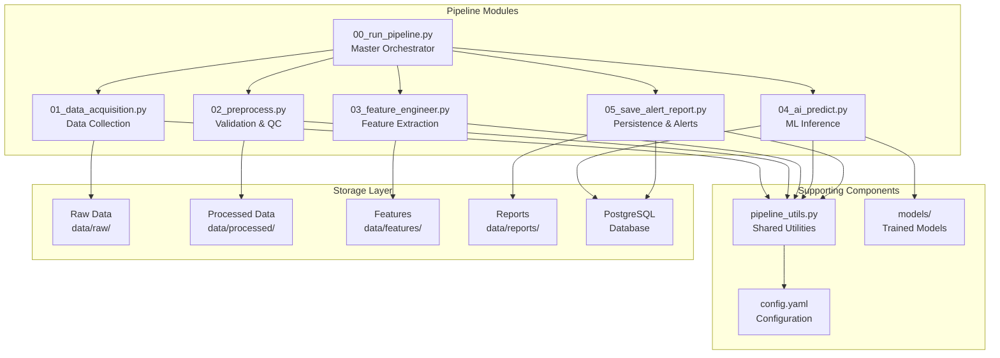

**Diagram sources**
- [00_run_pipeline.py:1-146](file://00_run_pipeline.py#L1-L146)
- [01_data_acquisition.py:1-458](file://01_data_acquisition.py#L1-L458)
- [02_preprocess.py:1-422](file://02_preprocess.py#L1-L422)
- [03_feature_engineer.py:1-265](file://03_feature_engineer.py#L1-L265)
- [04_ai_predict.py:1-466](file://04_ai_predict.py#L1-L466)
- [05_save_alert_report.py:1-507](file://05_save_alert_report.py#L1-L507)

**Section sources**
- [README.md:7-32](file://README.md#L7-L32)
- [config.yaml:1-104](file://config.yaml#L1-L104)

## Core Components

The pipeline consists of six primary processing stages, each with specialized responsibilities:

### Stage 1: Data Acquisition (01_data_acquisition.py)
- **Primary Source**: ISRO PRADAN portal for native Aditya-L1 Level-1 FITS data
- **Fallback Source**: NOAA SWPC public JSON feeds for real-time proxy data
- **Capabilities**: File deduplication, checksum validation, native FITS parsing
- **Output**: Structured observation records with quality indicators

### Stage 2: Data Validation & Preprocessing (02_preprocess.py)
- **Quality Control**: Timestamp validation, duplicate detection, outlier flagging
- **Data Transformation**: Sigma clipping, linear interpolation, normalization
- **Feature Synthesis**: HEL1OS hard X-ray derivation from spectral model
- **Output**: Clean, normalized feature-ready datasets

### Stage 3: Feature Engineering (03_feature_engineer.py)
- **Feature Vector Creation**: 17-dimensional AI-ready feature extraction
- **Temporal Features**: Rolling statistics, percentile calculations
- **Sequence Generation**: LSTM/GRU compatible time-series tensors
- **Output**: Standardized feature matrices for ML models

### Stage 4: Machine Learning Inference (04_ai_predict.py)
- **Ensemble Models**: LSTM, GRU, Transformer, and XGBoost integration
- **Physics Surrogate Models**: Statistical models for first-run scenarios
- **Risk Assessment**: Flare probability, CME probability, geomagnetic risk
- **Output**: Comprehensive forecasting with confidence scores

### Stage 5: Persistence & Alert Management (05_save_alert_report.py)
- **Database Operations**: PostgreSQL schema creation and data insertion
- **Alert Evaluation**: Threshold-based alert generation and dispatch
- **Dashboard Integration**: Real-time monitoring payload generation
- **Report Generation**: Structured JSON output for downstream systems

**Section sources**
- [01_data_acquisition.py:1-458](file://01_data_acquisition.py#L1-L458)
- [02_preprocess.py:1-422](file://02_preprocess.py#L1-L422)
- [03_feature_engineer.py:1-265](file://03_feature_engineer.py#L1-L265)
- [04_ai_predict.py:1-466](file://04_ai_predict.py#L1-L466)
- [05_save_alert_report.py:1-507](file://05_save_alert_report.py#L1-L507)

## Architecture Overview

The pipeline implements a sequential processing pattern with robust error handling and state management:

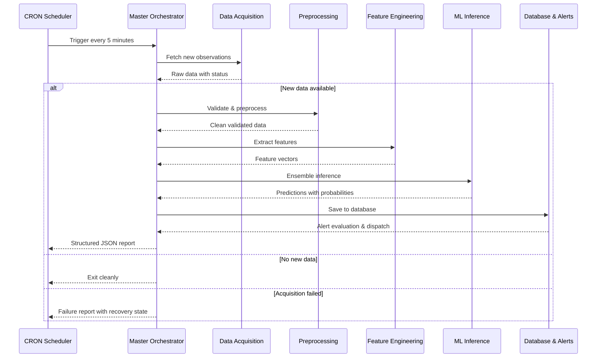

**Diagram sources**
- [00_run_pipeline.py:63-142](file://00_run_pipeline.py#L63-L142)
- [01_data_acquisition.py:350-452](file://01_data_acquisition.py#L350-L452)
- [02_preprocess.py:230-409](file://02_preprocess.py#L230-L409)
- [03_feature_engineer.py:199-249](file://03_feature_engineer.py#L199-L249)
- [04_ai_predict.py:402-448](file://04_ai_predict.py#L402-L448)
- [05_save_alert_report.py:452-502](file://05_save_alert_report.py#L452-L502)

The architecture demonstrates several key design patterns:

### Factory Pattern for Model Loading
The ML inference stage implements a factory pattern for dynamic model instantiation and loading:

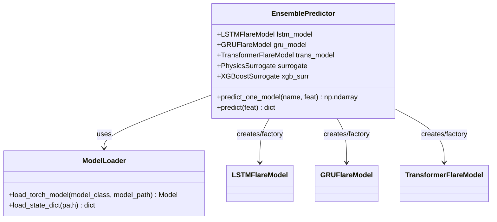

**Diagram sources**
- [04_ai_predict.py:246-395](file://04_ai_predict.py#L246-L395)
- [04_ai_predict.py:113-127](file://04_ai_predict.py#L113-L127)

### Strategy Pattern for Dual Data Acquisition
The data acquisition module implements a strategy pattern for flexible data sourcing:

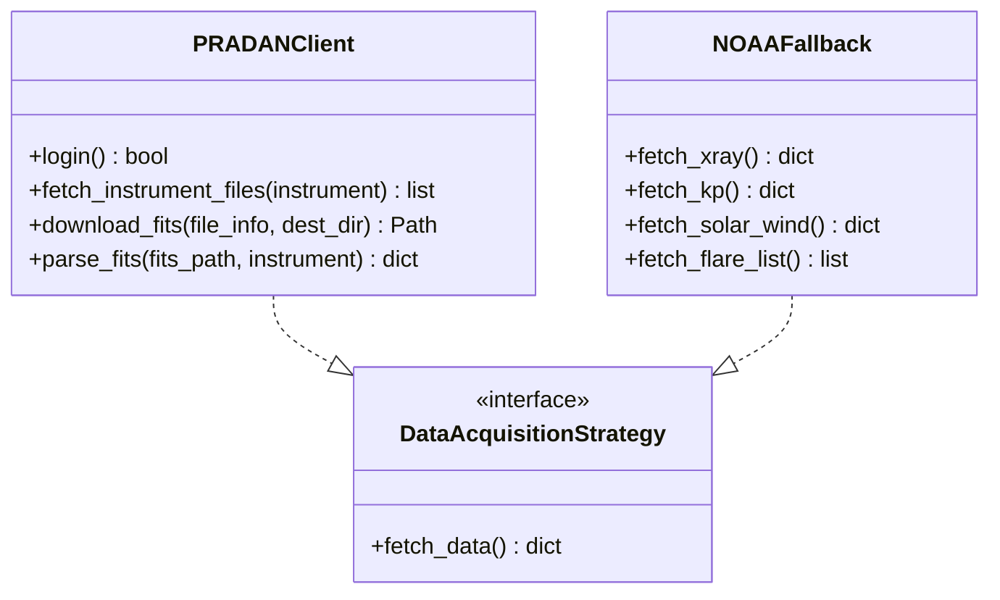

**Diagram sources**
- [01_data_acquisition.py:50-193](file://01_data_acquisition.py#L50-L193)
- [01_data_acquisition.py:199-324](file://01_data_acquisition.py#L199-L324)

### Observer Pattern for Alert Notifications
The alert system implements an observer pattern for notification dispatch:

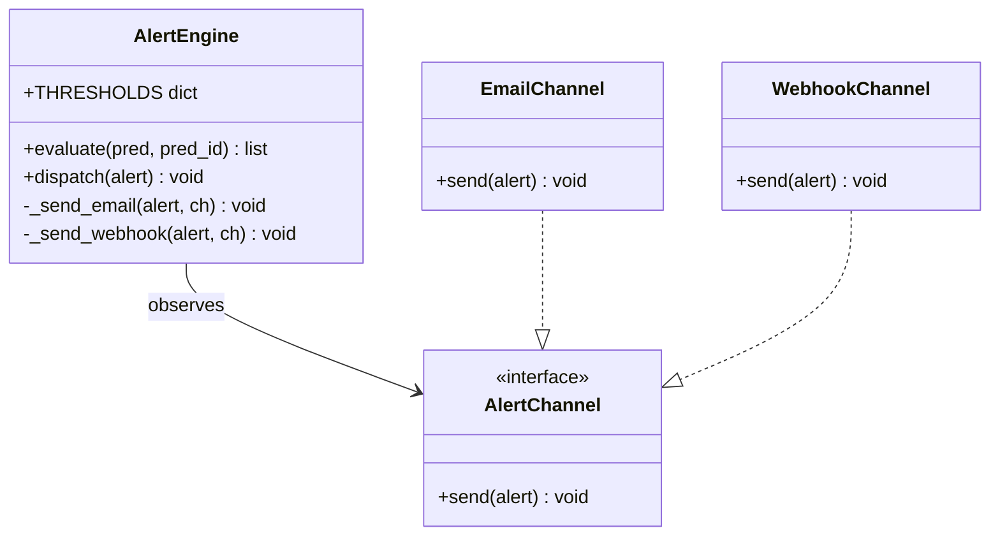

**Diagram sources**
- [05_save_alert_report.py:222-298](file://05_save_alert_report.py#L222-L298)

## Detailed Component Analysis

### Master Orchestrator (00_run_pipeline.py)

The master orchestrator serves as the CRON entry point and central coordinator for the entire pipeline:

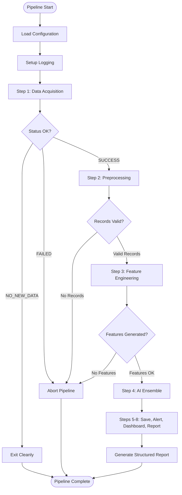

**Diagram sources**
- [00_run_pipeline.py:41-142](file://00_run_pipeline.py#L41-L142)

Key orchestration features include:
- **Retry Logic**: Configurable retry attempts with exponential backoff
- **Error Propagation**: Graceful degradation through pipeline stages
- **State Management**: Persistent state tracking across CRON runs
- **Timing Metrics**: Performance monitoring at each stage

**Section sources**
- [00_run_pipeline.py:41-61](file://00_run_pipeline.py#L41-L61)
- [00_run_pipeline.py:63-142](file://00_run_pipeline.py#L63-L142)

### Data Acquisition Module

The data acquisition module implements a sophisticated dual-source strategy:

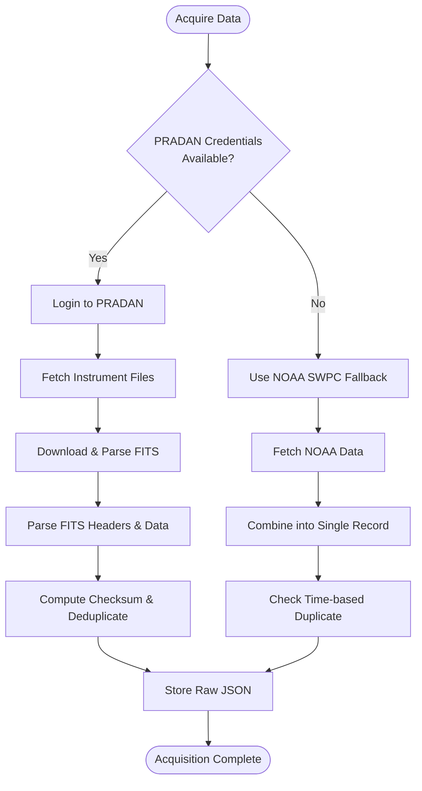

**Diagram sources**
- [01_data_acquisition.py:350-452](file://01_data_acquisition.py#L350-L452)

Advanced features include:
- **Checksum-based Deduplication**: SHA-256 hash validation across 500 recent records
- **Native FITS Parsing**: Using astropy for scientific data interpretation
- **Automatic Fallback**: Seamless transition between data sources
- **Warning Generation**: Contextual alerts for data quality issues

**Section sources**
- [01_data_acquisition.py:50-193](file://01_data_acquisition.py#L50-L193)
- [01_data_acquisition.py:199-324](file://01_data_acquisition.py#L199-L324)
- [01_data_acquisition.py:331-452](file://01_data_acquisition.py#L331-L452)

### Machine Learning Inference Engine

The ML inference engine implements a sophisticated ensemble approach:

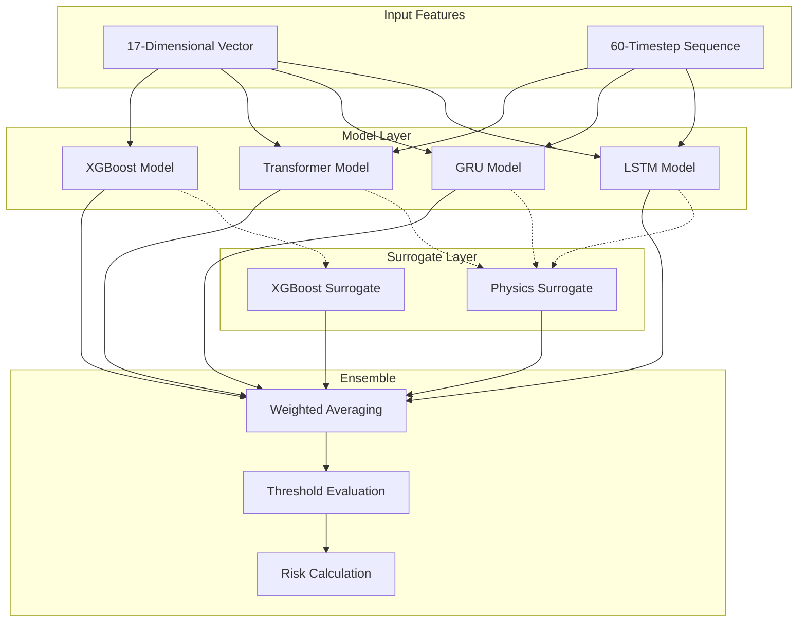

**Diagram sources**
- [04_ai_predict.py:246-395](file://04_ai_predict.py#L246-L395)

The ensemble architecture provides:
- **Model Flexibility**: Automatic fallback to surrogate models when trained weights are unavailable
- **Uncertainty Quantification**: Confidence scores based on model agreement
- **Physical Consistency**: Surrogate models calibrated to known solar flare statistics
- **Real-time Performance**: Optimized inference for operational space weather monitoring

**Section sources**
- [04_ai_predict.py:113-127](file://04_ai_predict.py#L113-L127)
- [04_ai_predict.py:134-238](file://04_ai_predict.py#L134-L238)
- [04_ai_predict.py:246-395](file://04_ai_predict.py#L246-L395)

## Dependency Analysis

The pipeline exhibits clear dependency relationships with well-defined interfaces:

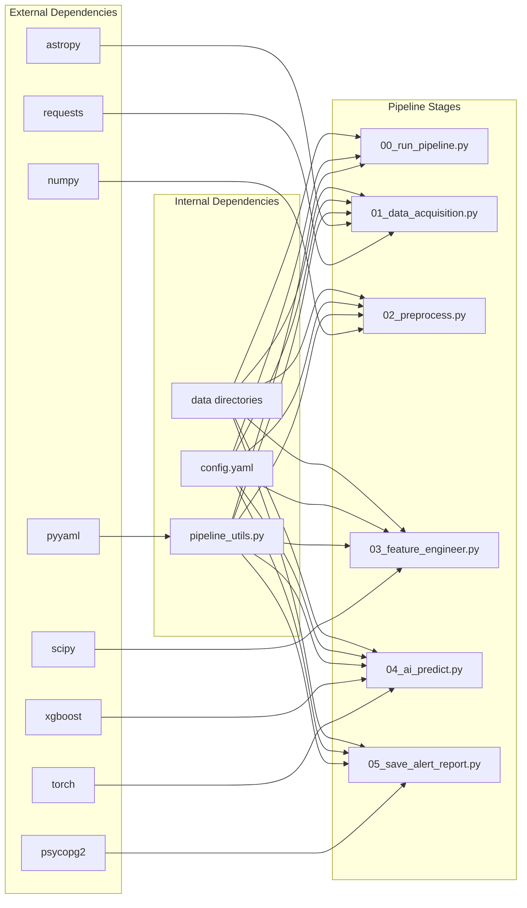

**Diagram sources**
- [README.md:44-58](file://README.md#L44-L58)
- [00_run_pipeline.py:35](file://00_run_pipeline.py#L35)
- [01_data_acquisition.py:34-37](file://01_data_acquisition.py#L34-L37)
- [02_preprocess.py:26-29](file://02_preprocess.py#L26-L29)
- [03_feature_engineer.py:35-38](file://03_feature_engineer.py#L35-L38)
- [04_ai_predict.py:26-35](file://04_ai_predict.py#L26-L35)
- [05_save_alert_report.py:24-35](file://05_save_alert_report.py#L24-L35)

**Section sources**
- [README.md:44-58](file://README.md#L44-L58)
- [config.yaml:1-104](file://config.yaml#L1-L104)

## Performance Considerations

The pipeline is designed for operational efficiency with several performance optimizations:

### Memory Management
- **Streaming Downloads**: Large FITS files are downloaded in chunks to minimize memory usage
- **Window-based Processing**: Rolling windows limit memory footprint for time-series analysis
- **Lazy Loading**: Models are loaded only when available, falling back to CPU-based computations

### Computational Efficiency
- **Vectorized Operations**: NumPy operations replace Python loops for numerical computations
- **Early Termination**: Pipeline stages exit early when no new data is available
- **Batch Processing**: Multiple predictions are handled efficiently in single inference calls

### Network Optimization
- **Connection Pooling**: Reused connections reduce network overhead
- **Timeout Management**: Configurable timeouts prevent hanging operations
- **Fallback Mechanisms**: Automatic switching between data sources prevents single points of failure

## Fault Tolerance and Recovery

The pipeline implements comprehensive fault tolerance mechanisms:

### State Management
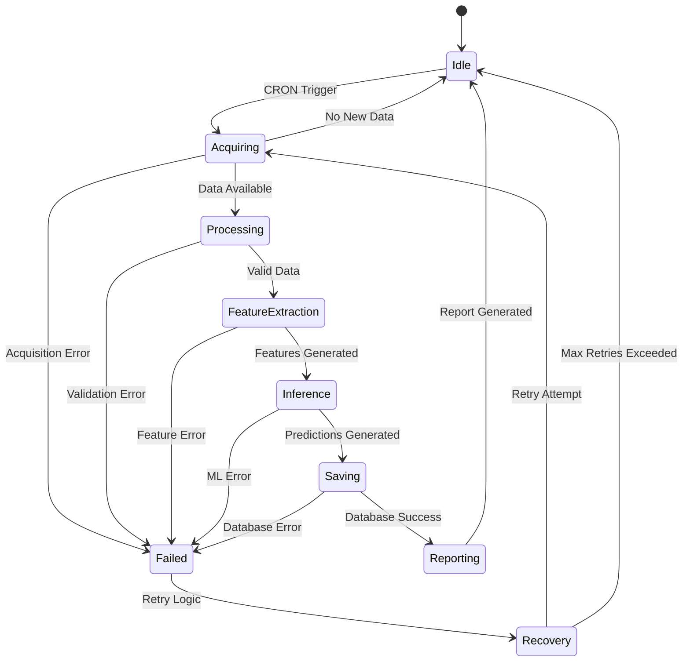

**Diagram sources**
- [00_run_pipeline.py:41-61](file://00_run_pipeline.py#L41-L61)
- [00_run_pipeline.py:122-141](file://00_run_pipeline.py#L122-L141)

### Error Handling Patterns
- **Retry Logic**: Configurable retry attempts with exponential backoff
- **Graceful Degradation**: Lower-priority models when higher-priority models fail
- **Partial State Preservation**: Pipeline state maintained even during failures
- **Structured Error Reporting**: Consistent error messages with recovery recommendations

**Section sources**
- [00_run_pipeline.py:41-61](file://00_run_pipeline.py#L41-L61)
- [00_run_pipeline.py:122-141](file://00_run_pipeline.py#L122-L141)

## Scalability Patterns

The pipeline architecture supports horizontal and vertical scaling:

### Horizontal Scaling
- **Modular Design**: Independent pipeline stages enable parallel processing
- **Queue-based Processing**: Future enhancements could support message queue integration
- **Microservice Migration**: Each stage could be deployed as separate microservices

### Vertical Scaling
- **Model Optimization**: Efficient model architectures support GPU acceleration
- **Memory Optimization**: Streaming and window-based processing reduce memory requirements
- **Database Scaling**: PostgreSQL clustering for high-throughput operations

### Operational Scaling
- **Cron-based Scheduling**: Flexible scheduling allows for increased frequency
- **Resource Pooling**: Shared model weights and configuration files
- **Monitoring Integration**: Extensible alerting system for operational oversight

## External Integrations

The pipeline integrates with multiple external systems:

### Data Sources
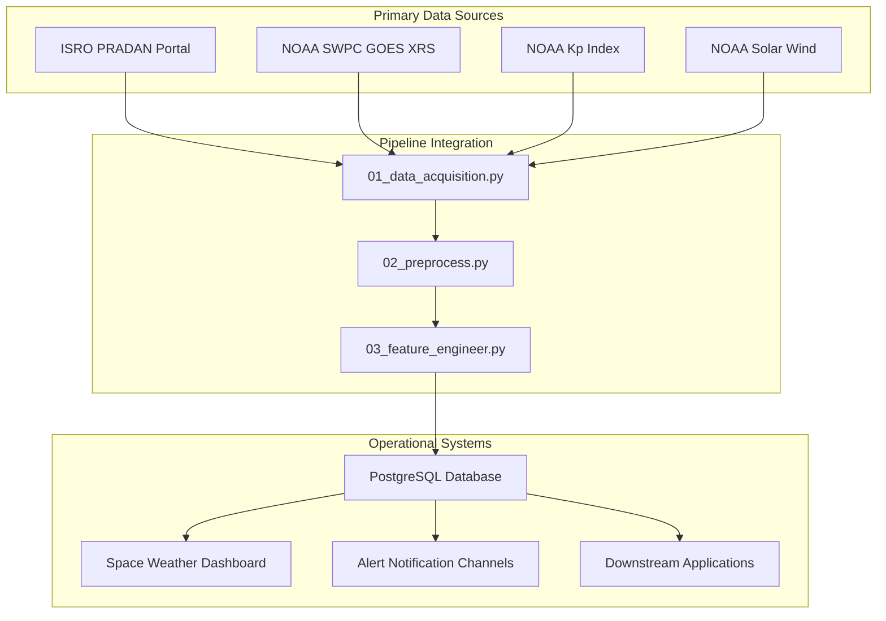

**Diagram sources**
- [01_data_acquisition.py:16-34](file://01_data_acquisition.py#L16-L34)
- [05_save_alert_report.py:47-216](file://05_save_alert_report.py#L47-L216)

### Integration Details

**PRADAN Portal Integration**:
- Secure authentication with credential management
- FITS file downloading and parsing
- Quality assurance through checksum validation

**NOAA SWPC Integration**:
- Public JSON feed consumption
- Real-time data synchronization
- Fallback mechanism for primary source failure

**PostgreSQL Integration**:
- Automated schema creation and migration
- High-performance indexing for time-series queries
- Transactional integrity for prediction records

**Alert System Integration**:
- Multi-channel notification dispatch
- Configurable threshold-based triggering
- Extensible channel architecture

**Section sources**
- [01_data_acquisition.py:16-34](file://01_data_acquisition.py#L16-L34)
- [05_save_alert_report.py:47-216](file://05_save_alert_report.py#L47-L216)
- [config.yaml:15-104](file://config.yaml#L15-L104)

## Conclusion

The Aditya-L1 Solar Flare Forecasting Pipeline represents a mature, production-ready system that successfully balances operational requirements with scientific rigor. The pipeline's architecture demonstrates several key strengths:

**Architectural Excellence**:
- Clear separation of concerns across six distinct processing stages
- Robust error handling with comprehensive retry mechanisms
- Modular design enabling easy maintenance and extension
- Factory and Strategy patterns for flexible model and data source management

**Operational Reliability**:
- CRON-driven automation with graceful degradation
- Comprehensive state management for recovery
- Multi-source data acquisition with automatic fallback
- Real-time alerting and reporting capabilities

**Technical Sophistication**:
- Ensemble machine learning with uncertainty quantification
- Physics-informed surrogate models for first-run scenarios
- Advanced feature engineering for space weather prediction
- Scalable database design for operational monitoring

The system successfully transforms raw astronomical data into actionable space weather forecasts, supporting critical operations for satellite operators, power grid managers, and space weather monitoring agencies. Its modular architecture and comprehensive error handling make it well-suited for continued evolution and expansion as space weather monitoring requirements grow.