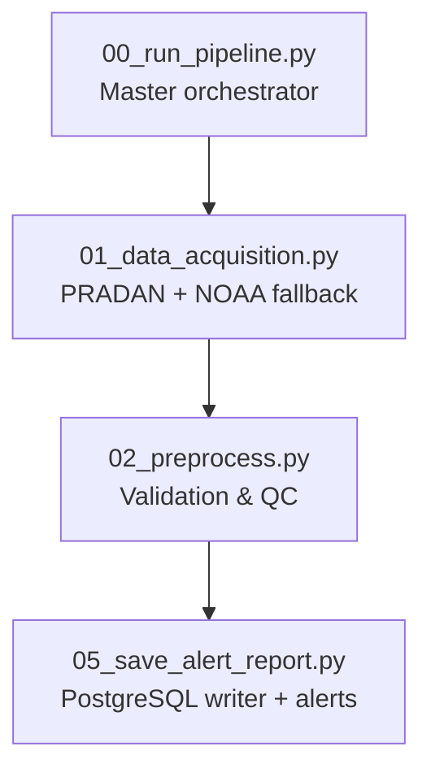
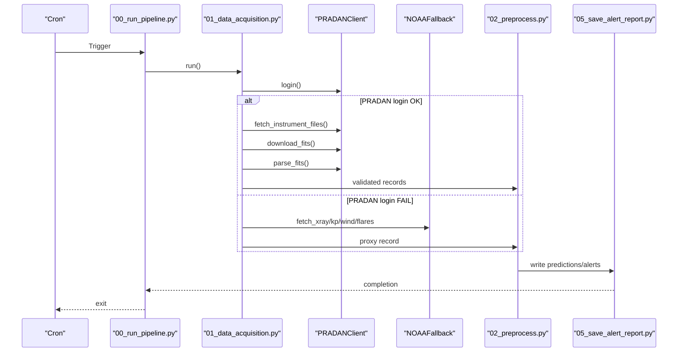
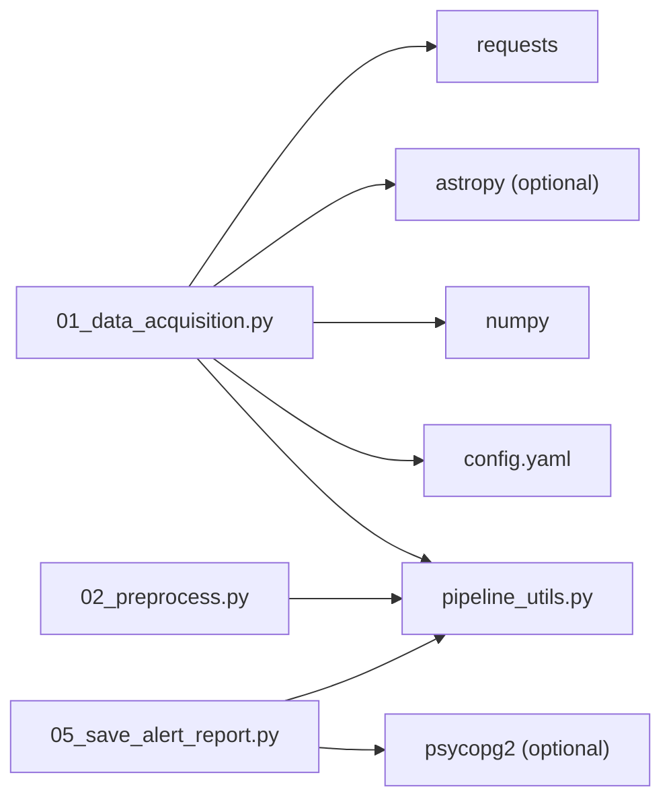

# Data Acquisition Issues

<cite>
**Referenced Files in This Document**
- [01_data_acquisition.py](file://01_data_acquisition.py)
- [02_preprocess.py](file://02_preprocess.py)
- [05_save_alert_report.py](file://05_save_alert_report.py)
- [config.yaml](file://config.yaml)
- [pipeline_utils.py](file://pipeline_utils.py)
- [README.md](file://README.md)
</cite>

## Table of Contents
1. [Introduction](#introduction)
2. [Project Structure](#project-structure)
3. [Core Components](#core-components)
4. [Architecture Overview](#architecture-overview)
5. [Detailed Component Analysis](#detailed-component-analysis)
6. [Dependency Analysis](#dependency-analysis)
7. [Performance Considerations](#performance-considerations)
8. [Troubleshooting Guide](#troubleshooting-guide)
9. [Conclusion](#conclusion)

## Introduction
This document provides a comprehensive troubleshooting guide for data acquisition issues in the Aditya-L1 Solar Flare Forecasting Pipeline. It focuses on PRADAN authentication failures, network connectivity problems, NOAA data unavailability, and FITS file integrity concerns. It also includes diagnostic commands, step-by-step resolution procedures, and preventive measures to keep the pipeline resilient.

## Project Structure
The data acquisition pipeline is composed of:
- A master orchestrator that coordinates pipeline steps and retries on failure
- A dedicated acquisition module that fetches native PRADAN data and falls back to NOAA public feeds
- A preprocessing module that validates and normalizes data
- A persistence/reporting module that writes to PostgreSQL and emits alerts

**Diagram sources**
- [00_run_pipeline.py:63-146](file://00_run_pipeline.py#L63-L146)
- [01_data_acquisition.py:350-458](file://01_data_acquisition.py#L350-L458)
- [02_preprocess.py:1-200](file://02_preprocess.py#L1-L200)
- [05_save_alert_report.py:1-200](file://05_save_alert_report.py#L1-L200)

**Section sources**
- [README.md:137-148](file://README.md#L137-L148)
- [00_run_pipeline.py:63-146](file://00_run_pipeline.py#L63-L146)
- [01_data_acquisition.py:350-458](file://01_data_acquisition.py#L350-L458)

## Core Components
- PRADANClient: Authenticates against PRADAN and downloads Level-1 FITS files, parses them into structured records, and deduplicates outputs.
- NOAAFallback: Fetches public NOAA SWPC JSON feeds (GOES XRS, Kp, solar wind) as a proxy when PRADAN is unavailable.
- PipelineState: Lightweight persistent state to prevent duplicate processing and track last acquisition.
- Logging and timeouts: Centralized logging and explicit timeouts for network operations.

Key configuration locations:
- PRADAN base URL, credentials, and look-back window
- NOAA endpoints and timeouts
- Storage directories and deduplication window

**Section sources**
- [01_data_acquisition.py:50-193](file://01_data_acquisition.py#L50-L193)
- [01_data_acquisition.py:199-325](file://01_data_acquisition.py#L199-L325)
- [pipeline_utils.py:82-97](file://pipeline_utils.py#L82-L97)
- [config.yaml:15-40](file://config.yaml#L15-L40)

## Architecture Overview
The acquisition flow prioritizes native PRADAN data and gracefully falls back to NOAA when PRADAN is unreachable or credentials are missing. The pipeline also deduplicates records across runs.

**Diagram sources**
- [00_run_pipeline.py:72-116](file://00_run_pipeline.py#L72-L116)
- [01_data_acquisition.py:365-452](file://01_data_acquisition.py#L365-L452)
- [02_preprocess.py:126-200](file://02_preprocess.py#L126-L200)
- [05_save_alert_report.py:118-142](file://05_save_alert_report.py#L118-L142)

## Detailed Component Analysis

### PRADAN Authentication and Connectivity
- Authentication: Login endpoint is called with configured credentials. If either credential is missing, the client skips PRADAN and proceeds to fallback.
- Session reuse: A requests.Session is used to persist cookies across requests.
- Timeouts: Login uses a short timeout; file queries and downloads use longer timeouts.
- Error handling: Exceptions are caught and logged; login failure sets a flag to avoid subsequent operations.

Common failure modes:
- Missing credentials
- Invalid credentials
- Network timeouts
- SSL/TLS errors
- Rate limiting or server-side throttling

**Section sources**
- [01_data_acquisition.py:69-87](file://01_data_acquisition.py#L69-L87)
- [01_data_acquisition.py:73-84](file://01_data_acquisition.py#L73-L84)
- [01_data_acquisition.py:77](file://01_data_acquisition.py#L77)
- [01_data_acquisition.py:108-119](file://01_data_acquisition.py#L108-L119)
- [01_data_acquisition.py:133-143](file://01_data_acquisition.py#L133-L143)

### NOAA Fallback Data Availability
- Endpoints: Multiple public JSON feeds are consumed for X-ray, Kp, solar wind, and recent flares.
- Timeouts: A fixed timeout is applied to each request.
- Graceful degradation: If X-ray data is unavailable, the pipeline marks acquisition as failed; otherwise, it constructs a proxy record and continues.

Scenarios:
- Endpoint down or slow response
- JSON parsing errors
- Missing or malformed fields
- Geographic restrictions (unlikely for public endpoints)

**Section sources**
- [01_data_acquisition.py:212-220](file://01_data_acquisition.py#L212-L220)
- [01_data_acquisition.py:222-268](file://01_data_acquisition.py#L222-L268)
- [01_data_acquisition.py:270-283](file://01_data_acquisition.py#L270-L283)
- [01_data_acquisition.py:285-307](file://01_data_acquisition.py#L285-L307)
- [01_data_acquisition.py:402-407](file://01_data_acquisition.py#L402-L407)

### Data Integrity and Deduplication
- Deduplication: A checksum of the normalized record is computed and stored in pipeline state to avoid reprocessing identical data.
- FITS parsing: Requires astropy; absence of astropy prevents parsing but does not block acquisition.
- Validation: Preprocessing validates presence and physical plausibility of flux values and detects gaps.

Potential issues:
- Missing astropy causing parsing failures
- Duplicate records due to state loss or checksum collisions
- Gaps in timeseries requiring interpolation

**Section sources**
- [01_data_acquisition.py:331-344](file://01_data_acquisition.py#L331-L344)
- [01_data_acquisition.py:151-153](file://01_data_acquisition.py#L151-L153)
- [02_preprocess.py:45-97](file://02_preprocess.py#L45-L97)
- [02_preprocess.py:99-119](file://02_preprocess.py#L99-L119)

## Dependency Analysis
- External dependencies: requests, astropy (optional), numpy, YAML, PostgreSQL driver (optional).
- Configuration-driven endpoints and timeouts.
- Persistent state file for deduplication and failure tracking.

**Diagram sources**
- [01_data_acquisition.py:21-32](file://01_data_acquisition.py#L21-L32)
- [02_preprocess.py:19-29](file://02_preprocess.py#L19-L29)
- [05_save_alert_report.py:24-31](file://05_save_alert_report.py#L24-L31)
- [config.yaml:15-40](file://config.yaml#L15-L40)
- [pipeline_utils.py:25-40](file://pipeline_utils.py#L25-L40)

**Section sources**
- [01_data_acquisition.py:21-32](file://01_data_acquisition.py#L21-L32)
- [02_preprocess.py:19-29](file://02_preprocess.py#L19-L29)
- [05_save_alert_report.py:24-31](file://05_save_alert_report.py#L24-L31)
- [config.yaml:15-40](file://config.yaml#L15-L40)
- [pipeline_utils.py:25-40](file://pipeline_utils.py#L25-L40)

## Performance Considerations
- Timeouts: Login uses a short timeout; queries and downloads use longer timeouts to accommodate network variability.
- Streaming downloads: Large FITS files are streamed to disk to reduce memory pressure.
- Deduplication window: Keeps a bounded history of seen checksums to balance memory and duplication prevention.
- Retry policy: The orchestrator retries failed steps up to a configured number of times with a fixed delay.

[No sources needed since this section provides general guidance]

## Troubleshooting Guide

### PRADAN Authentication Failures
Symptoms:
- PRADAN login fails or returns non-200 status
- Missing credentials warning and immediate fallback to NOAA
- Download attempts fail with network errors

Diagnostic steps:
- Verify environment variables are exported and sourced before running:
  - PRADAN_USERNAME
  - PRADAN_PASSWORD
- Confirm PRADAN base URL and credentials in configuration
- Test login endpoint reachability and TLS handshake
- Inspect logs for HTTP status codes and exception messages

Resolution procedures:
- Ensure credentials are correct and registered on the PRADAN portal
- Increase login timeout if the portal is slow to respond
- If rate-limited, wait until the rate limit resets or contact PRADAN support
- If SSL errors occur, update CA certificates or configure a compliant Python environment

Preventive measures:
- Store secrets in a secure environment file and source it before cron runs
- Monitor authentication logs and alert on repeated failures
- Back up configuration and credentials regularly

Backup strategy:
- Continue using NOAA fallback when PRADAN is unavailable
- Maintain a secondary environment with cached raw data for offline diagnostics

**Section sources**
- [01_data_acquisition.py:69-87](file://01_data_acquisition.py#L69-L87)
- [01_data_acquisition.py:70-72](file://01_data_acquisition.py#L70-L72)
- [01_data_acquisition.py:77](file://01_data_acquisition.py#L77)
- [config.yaml:15-24](file://config.yaml#L15-L24)
- [README.md:62-84](file://README.md#L62-L84)

### Network Connectivity Problems
Symptoms:
- Timeouts during login, query, or download
- Proxy configuration issues causing blocked requests
- Firewall restrictions preventing access to PRADAN or NOAA endpoints

Diagnostic steps:
- Test connectivity to PRADAN base URL and NOAA endpoints
- Verify outbound ports and proxy settings
- Check firewall rules and DNS resolution
- Measure latency and packet loss

Resolution procedures:
- Configure system-wide proxy if required by your network
- Adjust timeouts in configuration to match network conditions
- Whitelist PRADAN and NOAA domains in firewall rules
- Use a network traceroute to identify bottlenecks

Preventive measures:
- Add retry logic around network calls
- Monitor network health and availability
- Maintain a secondary route or mirror if available

Backup strategy:
- Rely on NOAA fallback when PRADAN is unreachable
- Cache recent raw data locally for short-term resilience

**Section sources**
- [01_data_acquisition.py:77](file://01_data_acquisition.py#L77)
- [01_data_acquisition.py:110](file://01_data_acquisition.py#L110)
- [01_data_acquisition.py:133](file://01_data_acquisition.py#L133)
- [01_data_acquisition.py:214](file://01_data_acquisition.py#L214)
- [config.yaml:15-34](file://config.yaml#L15-L34)

### NOAA Data Unavailability
Symptoms:
- X-ray data missing or empty
- Kp or solar wind data unavailable
- Flare list returns no events

Diagnostic steps:
- Check NOAA endpoints for service status
- Validate JSON response structure and required fields
- Confirm network access to public endpoints

Resolution procedures:
- Wait for NOAA service restoration if down
- Switch to alternate endpoints if available
- Use proxy or mirror if your network blocks direct access
- Fall back to PRADAN if credentials become available

Preventive measures:
- Monitor NOAA service health externally
- Cache recent data to mitigate transient outages
- Implement circuit breaker logic to avoid repeated failures

Backup strategy:
- Continue with PRADAN when available
- Use proxy-derived features in preprocessing

**Section sources**
- [01_data_acquisition.py:222-268](file://01_data_acquisition.py#L222-L268)
- [01_data_acquisition.py:270-283](file://01_data_acquisition.py#L270-L283)
- [01_data_acquisition.py:285-307](file://01_data_acquisition.py#L285-L307)
- [01_data_acquisition.py:402-407](file://01_data_acquisition.py#L402-L407)

### FITS File Corruption and Integrity
Symptoms:
- FITS parse errors
- Missing astropy installation
- Incomplete downloads leading to corrupted files

Diagnostic steps:
- Verify file sizes and existence
- Check for parse exceptions and stack traces
- Confirm astropy availability

Resolution procedures:
- Re-download the file and verify its integrity
- Install astropy to enable parsing
- Ensure sufficient disk space and stable network for large downloads

Preventive measures:
- Validate file integrity post-download
- Monitor disk usage and cleanup old files
- Use checksums if available from upstream

Backup strategy:
- Continue with NOAA fallback when PRADAN parsing fails
- Maintain a cache of previously parsed records

**Section sources**
- [01_data_acquisition.py:151-153](file://01_data_acquisition.py#L151-L153)
- [01_data_acquisition.py:190-192](file://01_data_acquisition.py#L190-L192)
- [01_data_acquisition.py:133-143](file://01_data_acquisition.py#L133-L143)

### Duplicate Records and State Management
Symptoms:
- No new data detected across runs
- Duplicate processing warnings

Diagnostic steps:
- Inspect pipeline state file for seen checksums
- Review deduplication logic and window size

Resolution procedures:
- Clear or adjust state if corrupted
- Ensure consistent timestamps and normalization
- Verify deduplication window is appropriate for your cadence

Preventive measures:
- Monitor deduplication effectiveness
- Back up state file regularly

**Section sources**
- [01_data_acquisition.py:331-344](file://01_data_acquisition.py#L331-L344)
- [pipeline_utils.py:82-97](file://pipeline_utils.py#L82-L97)

### Diagnostic Commands
- Test PRADAN login:
  - curl with configured credentials and base URL
  - Verify response status and session cookie propagation
- Test NOAA endpoints:
  - curl to each endpoint and validate JSON structure
  - Measure response times and error codes
- Verify environment variables:
  - echo $PRADAN_USERNAME $PRADAN_PASSWORD
- Check configuration:
  - Validate YAML syntax and ${VAR} expansion
- Inspect logs:
  - Review acquisition and preprocessing logs for errors and warnings

[No sources needed since this section provides general guidance]

### Step-by-Step Resolution Procedures
- PRADAN authentication:
  1. Confirm credentials and portal registration
  2. Test login endpoint connectivity
  3. Adjust timeouts and retry policies
  4. If rate-limited, wait and retry
- Network connectivity:
  1. Verify proxy and firewall settings
  2. Test DNS and routing to PRADAN and NOAA
  3. Increase timeouts if needed
  4. Use mirrors or alternate routes
- NOAA unavailability:
  1. Check service status pages
  2. Validate JSON responses
  3. Switch endpoints or use fallbacks
- FITS integrity:
  1. Re-download and verify file sizes
  2. Install astropy and rerun parsing
  3. Ensure adequate disk space and bandwidth
- Deduplication:
  1. Inspect state file and seen checksums
  2. Adjust deduplication window
  3. Clear state if corrupted

[No sources needed since this section provides general guidance]

## Conclusion
This guide consolidates actionable troubleshooting steps for PRADAN authentication, network connectivity, NOAA data availability, and FITS integrity within the Aditya-L1 pipeline. By following the diagnostic commands, resolution procedures, and preventive measures outlined here, operators can minimize downtime and maintain reliable data acquisition across both native and fallback sources.