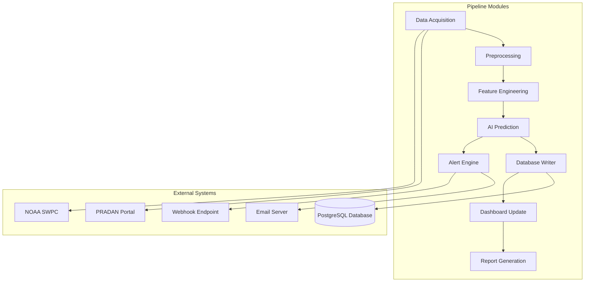
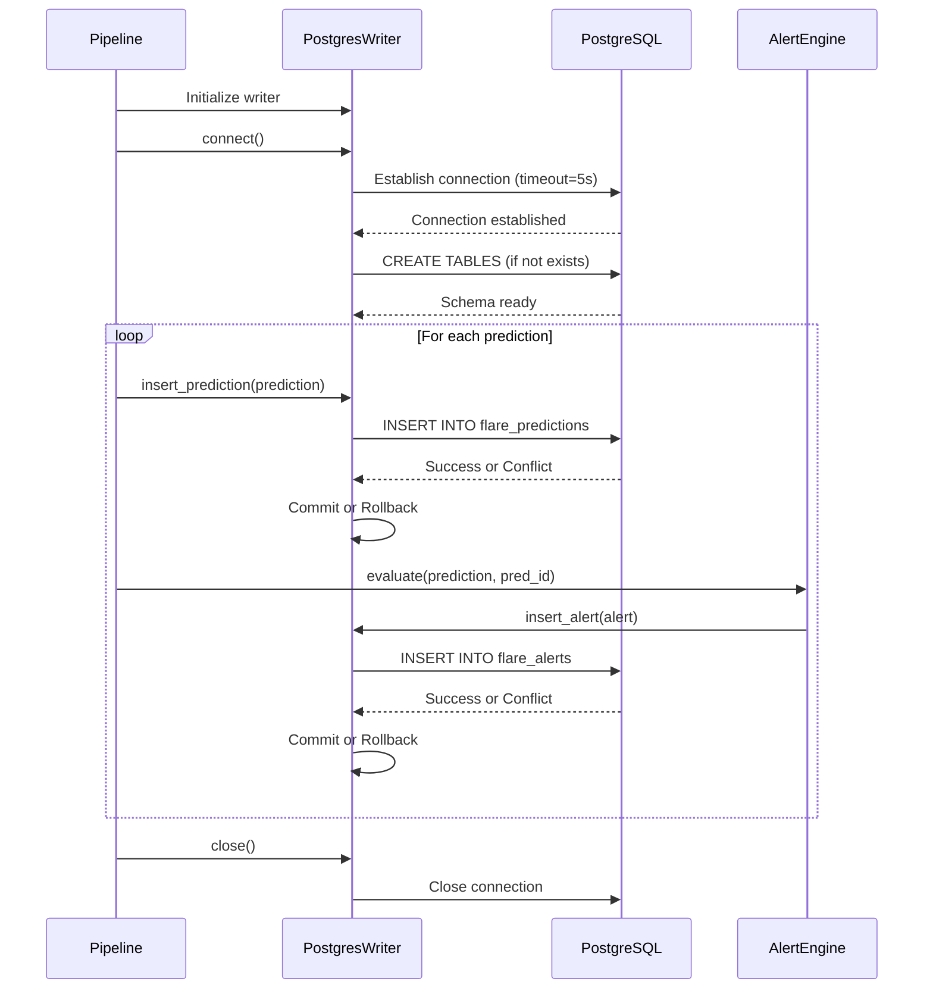
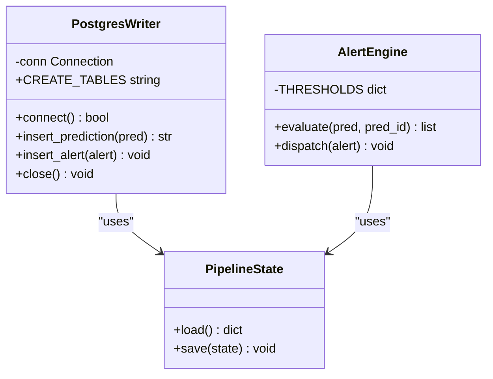
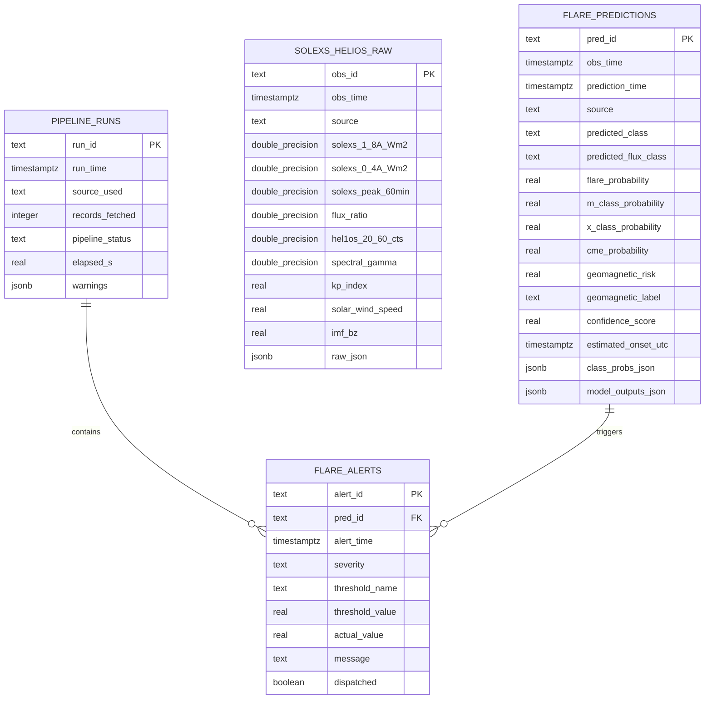
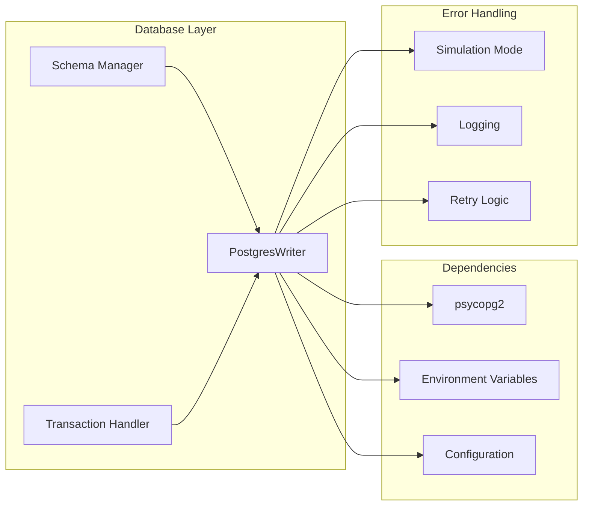

# Database Connectivity Problems

<cite>
**Referenced Files in This Document**
- [config.yaml](file://config.yaml)
- [05_save_alert_report.py](file://05_save_alert_report.py)
- [00_run_pipeline.py](file://00_run_pipeline.py)
- [pipeline_utils.py](file://pipeline_utils.py)
- [README.md](file://README.md)
</cite>

## Table of Contents
1. [Introduction](#introduction)
2. [Project Structure](#project-structure)
3. [Core Components](#core-components)
4. [Architecture Overview](#architecture-overview)
5. [Detailed Component Analysis](#detailed-component-analysis)
6. [Dependency Analysis](#dependency-analysis)
7. [Performance Considerations](#performance-considerations)
8. [Troubleshooting Guide](#troubleshooting-guide)
9. [Conclusion](#conclusion)

## Introduction
This document provides comprehensive troubleshooting guidance for database connectivity and persistence issues in the Aditya-L1 Solar Flare Forecasting Pipeline. The pipeline uses PostgreSQL for storing solar flare predictions, alerts, and pipeline run metadata. This guide covers connection failures, authentication errors, network timeouts, service unavailability, schema creation problems, data insertion failures, and performance issues.

## Project Structure
The pipeline follows a modular architecture with clear separation of concerns:
- Configuration management through YAML with environment variable substitution
- Data acquisition from multiple sources (PRADAN and NOAA)
- Data preprocessing and feature engineering
- AI ensemble prediction
- Database persistence and alert management
- Logging and state management



**Diagram sources**
- [00_run_pipeline.py:63-148](file://00_run_pipeline.py#L63-L148)
- [05_save_alert_report.py:452-502](file://05_save_alert_report.py#L452-L502)

**Section sources**
- [00_run_pipeline.py:13-24](file://00_run_pipeline.py#L13-L24)
- [README.md:7-32](file://README.md#L7-L32)

## Core Components
The database functionality is primarily handled by the `PostgresWriter` class in the save/alert/report module. This component manages:
- Database connection establishment with timeout configuration
- Automatic schema creation on first run
- Data insertion with conflict handling
- Transaction management and rollback on errors
- Connection lifecycle management

Key configuration elements include:
- Host, port, database name, username, and password
- Connection pool size (default 5)
- Table names for raw observations, processed features, predictions, alerts, and pipeline runs

**Section sources**
- [config.yaml:91-104](file://config.yaml#L91-L104)
- [05_save_alert_report.py:47-216](file://05_save_alert_report.py#L47-L216)

## Architecture Overview
The database architecture follows a write-through pattern where predictions are persisted immediately after AI inference. The system handles both direct PostgreSQL connections and simulation mode when the driver is unavailable.



**Diagram sources**
- [05_save_alert_report.py:118-216](file://05_save_alert_report.py#L118-L216)
- [05_save_alert_report.py:452-502](file://05_save_alert_report.py#L452-L502)

## Detailed Component Analysis

### Database Connection Management
The `PostgresWriter` class implements robust connection handling with timeout configuration and automatic schema initialization.



**Diagram sources**
- [05_save_alert_report.py:47-216](file://05_save_alert_report.py#L47-L216)
- [pipeline_utils.py:82-96](file://pipeline_utils.py#L82-L96)

**Section sources**
- [05_save_alert_report.py:118-142](file://05_save_alert_report.py#L118-L142)
- [05_save_alert_report.py:143-188](file://05_save_alert_report.py#L143-L188)
- [05_save_alert_report.py:190-212](file://05_save_alert_report.py#L190-L212)

### Schema Creation and Management
The system automatically creates required tables on first run with idempotent operations. The schema includes:

- `pipeline_runs`: Track pipeline execution metadata
- `solexs_hel1os_raw`: Store raw observation data
- `flare_predictions`: Persist AI model predictions
- `flare_alerts`: Record triggered alerts with foreign key relationships



**Diagram sources**
- [05_save_alert_report.py:49-116](file://05_save_alert_report.py#L49-L116)

**Section sources**
- [05_save_alert_report.py:49-116](file://05_save_alert_report.py#L49-L116)

## Dependency Analysis
The database layer has minimal external dependencies, relying primarily on the `psycopg2` library for PostgreSQL connectivity. The system gracefully handles missing dependencies by operating in simulation mode.



**Diagram sources**
- [05_save_alert_report.py:24-31](file://05_save_alert_report.py#L24-L31)
- [05_save_alert_report.py:118-142](file://05_save_alert_report.py#L118-L142)

**Section sources**
- [05_save_alert_report.py:24-31](file://05_save_alert_report.py#L24-L31)
- [05_save_alert_report.py:118-142](file://05_save_alert_report.py#L118-L142)

## Performance Considerations
The pipeline implements several performance optimizations:
- Connection timeout of 5 seconds to prevent hanging
- Automatic schema creation only on first run
- Idempotent inserts with conflict handling
- Connection pooling with configurable size (default 5)
- Efficient indexing on frequently queried columns

Potential performance bottlenecks and solutions:
- Connection pool exhaustion: Reduce pool size or increase timeout
- Large transaction sizes: Batch inserts or reduce data volume
- Slow query execution: Add appropriate indexes and optimize queries
- Memory pressure: Monitor connection usage and adjust pool settings

**Section sources**
- [05_save_alert_report.py:121-142](file://05_save_alert_report.py#L121-L142)
- [config.yaml:97](file://config.yaml#L97)

## Troubleshooting Guide

### Database Connection Failures

#### Authentication Errors
**Symptoms:**
- Connection refused with authentication failure messages
- Error logs indicating invalid credentials
- Pipeline fails during initialization phase

**Common Causes:**
- Incorrect username/password combination
- User account locked or disabled
- Database server rejecting connections from specific IP
- SSL/TLS configuration mismatch

**Diagnostic Steps:**
1. Verify environment variables are properly exported:
   ```bash
   echo $DB_HOST $DB_PORT $DB_NAME $DB_USER
   ```

2. Test basic connection using psql:
   ```bash
   psql "host=$DB_HOST port=$DB_PORT dbname=$DB_NAME user=$DB_USER password=$DB_PASSWORD"
   ```

3. Check PostgreSQL logs for authentication errors

4. Verify user permissions:
   ```sql
   \du $DB_USER
   ```

**Resolution Procedures:**
1. Update credentials in environment variables
2. Reset user password if compromised
3. Configure firewall to allow database connections
4. Verify SSL configuration matches client requirements

#### Network Timeouts
**Symptoms:**
- Connection timeout errors during pipeline startup
- Logs showing "connect timeout exceeded"
- Pipeline retries fail consistently

**Common Causes:**
- Network connectivity issues between hosts
- Database server overloaded or unresponsive
- DNS resolution problems
- Firewall blocking database ports

**Diagnostic Steps:**
1. Test network connectivity:
   ```bash
   telnet $DB_HOST $DB_PORT
   ```

2. Check database server status:
   ```bash
   systemctl status postgresql
   ```

3. Verify firewall rules allow connections

4. Test with increased timeout:
   ```python
   # Modify connect_timeout parameter temporarily
   ```

**Resolution Procedures:**
1. Fix network infrastructure issues
2. Scale database server resources
3. Configure DNS properly
4. Adjust firewall rules
5. Implement connection retry logic

#### Service Unavailability
**Symptoms:**
- Connection refused errors
- Database not accepting connections
- Complete pipeline failure

**Common Causes:**
- PostgreSQL service stopped
- Database crashed or corrupted
- Resource exhaustion (memory, disk)
- Maintenance mode enabled

**Diagnostic Steps:**
1. Check PostgreSQL service status:
   ```bash
   systemctl status postgresql
   ```

2. Review system logs for resource issues:
   ```bash
   dmesg | grep -i memory
   df -h
   ```

3. Test database accessibility:
   ```bash
   pg_isready -h $DB_HOST -p $DB_PORT -d $DB_NAME
   ```

**Resolution Procedures:**
1. Restart PostgreSQL service
2. Free up system resources
3. Restore from backups if corrupted
4. Scale infrastructure resources

### Schema Creation Problems

#### Permission Denied Errors
**Symptoms:**
- Schema creation fails with permission errors
- Table creation blocked by insufficient privileges
- Migration operations fail

**Common Causes:**
- User lacks CREATE privileges
- Database ownership restrictions
- Role membership issues

**Diagnostic Steps:**
1. Verify user privileges:
   ```sql
   SHOW grants for $DB_USER;
   ```

2. Check database ownership:
   ```sql
   SELECT pg_get_userbyid(datdba) FROM pg_database WHERE datname = '$DB_NAME';
   ```

3. Test schema creation manually:
   ```sql
   CREATE TABLE test_table (id text);
   DROP TABLE test_table;
   ```

**Resolution Procedures:**
1. Grant necessary privileges to user:
   ```sql
   GRANT ALL PRIVILEGES ON DATABASE $DB_NAME TO $DB_USER;
   ```

2. Ensure user has CREATE privileges on target database
3. Verify role membership includes required permissions

#### Constraint Violations
**Symptoms:**
- Insert operations fail with constraint errors
- Primary key conflicts reported
- Foreign key constraint violations

**Common Causes:**
- Duplicate primary keys
- Referential integrity violations
- Data type mismatches
- Check constraint violations

**Diagnostic Steps:**
1. Check existing records:
   ```sql
   SELECT COUNT(*) FROM flare_predictions WHERE pred_id = 'SPECIFIC_ID';
   ```

2. Verify referential integrity:
   ```sql
   SELECT * FROM flare_alerts WHERE pred_id NOT IN (SELECT pred_id FROM flare_predictions);
   ```

3. Examine constraint definitions:
   ```sql
   \d flare_predictions
   ```

**Resolution Procedures:**
1. Remove conflicting records
2. Correct data types and formats
3. Update foreign key references
4. Modify constraint definitions if necessary

#### Table Conflicts
**Symptoms:**
- Schema creation conflicts with existing tables
- Migration errors during updates
- Version mismatch issues

**Common Causes:**
- Existing table structures incompatible
- Partial migrations left incomplete
- Manual schema modifications

**Diagnostic Steps:**
1. Compare current schema with expected:
   ```sql
   \d flare_predictions
   ```

2. Check for existing table structures:
   ```sql
   SELECT * FROM information_schema.tables WHERE table_name LIKE '%flare%';
   ```

3. Review migration history:
   ```sql
   SELECT * FROM migration_log ORDER BY timestamp DESC LIMIT 10;
   ```

**Resolution Procedures:**
1. Backup existing data and drop conflicting tables
2. Recreate tables with correct schema
3. Restore data with proper transformations
4. Implement proper migration management

### Data Insertion Failures

#### Duplicate Key Errors
**Symptoms:**
- INSERT statements fail with unique constraint violations
- ON CONFLICT handling triggered frequently
- Data duplication attempts detected

**Current Implementation:**
The system uses `ON CONFLICT (pred_id) DO NOTHING` to handle duplicates gracefully.

**Diagnostic Steps:**
1. Check for existing records:
   ```sql
   SELECT * FROM flare_predictions WHERE pred_id = 'SPECIFIC_ID';
   ```

2. Analyze UUID generation patterns:
   ```python
   # Verify unique identifier generation
   ```

**Resolution Procedures:**
1. Ensure unique identifier generation is working correctly
2. Implement proper deduplication logic
3. Review data processing pipeline for duplicate detection

#### Foreign Key Constraints
**Symptoms:**
- Alert insertion fails due to missing prediction reference
- Referential integrity violations
- Cascade operation failures

**Current Implementation:**
Alerts reference predictions through foreign key relationships with proper constraint enforcement.

**Diagnostic Steps:**
1. Verify prediction existence before alert insertion:
   ```sql
   SELECT COUNT(*) FROM flare_predictions WHERE pred_id = 'SPECIFIC_ID';
   ```

2. Check foreign key constraint status:
   ```sql
   \d flare_alerts
   ```

**Resolution Procedures:**
1. Insert predictions before alerts
2. Implement proper transaction ordering
3. Add validation checks for referential integrity

#### Transaction Rollbacks
**Symptoms:**
- Database operations failing with rollback notifications
- Inconsistent data states
- Partial transaction completion

**Current Implementation:**
The system implements explicit rollback on exceptions with proper transaction management.

**Diagnostic Steps:**
1. Enable detailed logging for transaction operations
2. Check PostgreSQL logs for rollback reasons
3. Monitor connection pool usage

**Resolution Procedures:**
1. Implement proper error handling around transactions
2. Add retry logic for transient failures
3. Optimize transaction size and duration

### Database Performance Issues

#### Slow Query Execution
**Symptoms:**
- Queries taking excessive time to complete
- Database response timeouts
- Increased pipeline execution time

**Current Implementation:**
Index creation on frequently queried columns (`obs_time`, `severity`).

**Diagnostic Steps:**
1. Analyze query execution plans:
   ```sql
   EXPLAIN ANALYZE SELECT * FROM flare_predictions WHERE obs_time > NOW() - INTERVAL '1 hour';
   ```

2. Monitor query performance metrics:
   ```sql
   SELECT * FROM pg_stat_statements ORDER BY mean_time DESC LIMIT 10;
   ```

3. Check index usage:
   ```sql
   SELECT * FROM pg_indexes WHERE tablename IN ('flare_predictions', 'flare_alerts');
   ```

**Resolution Procedures:**
1. Add appropriate indexes for common query patterns
2. Optimize query execution plans
3. Implement query caching strategies
4. Consider database partitioning for large datasets

#### Connection Pool Exhaustion
**Symptoms:**
- Connection timeout errors during peak loads
- Queueing of database operations
- Application performance degradation

**Current Implementation:**
Default connection pool size of 5 with timeout configuration.

**Diagnostic Steps:**
1. Monitor connection pool usage:
   ```sql
   SELECT count(*) FROM pg_stat_activity WHERE datname = '$DB_NAME';
   ```

2. Check pool statistics:
   ```sql
   SELECT * FROM pg_pool_stats;
   ```

3. Analyze connection patterns:
   ```sql
   SELECT state, count(*) FROM pg_stat_activity GROUP BY state;
   ```

**Resolution Procedures:**
1. Increase connection pool size appropriately
2. Implement connection reuse strategies
3. Optimize transaction duration
4. Add connection pooling middleware

#### Memory Pressure
**Symptoms:**
- Database server memory exhaustion
- Performance degradation under load
- System stability issues

**Diagnostic Steps:**
1. Monitor system memory usage:
   ```bash
   free -h
   ```

2. Check PostgreSQL memory settings:
   ```sql
   SHOW shared_buffers;
   SHOW work_mem;
   ```

3. Analyze query memory usage:
   ```sql
   SELECT * FROM pg_stat_statements ORDER BY temp_bytes DESC LIMIT 10;
   ```

**Resolution Procedures:**
1. Adjust PostgreSQL memory parameters
2. Optimize query efficiency
3. Implement proper resource limits
4. Scale database server resources

### Diagnostic Tools and Testing

#### Connection Health Testing
**Manual Testing:**
1. Basic connectivity test:
   ```bash
   psql "host=$DB_HOST port=$DB_PORT dbname=$DB_NAME user=$DB_USER password=$DB_PASSWORD" -c "SELECT 1;"
   ```

2. Schema verification:
   ```bash
   psql "$DB_CONN" -c "\dt"
   ```

3. Performance benchmark:
   ```sql
   psql "$DB_CONN" -c "EXPLAIN ANALYZE SELECT COUNT(*) FROM flare_predictions;"
   ```

**Automated Testing:**
The pipeline includes built-in connection testing through the `PostgresWriter.connect()` method which returns boolean status indicating connection success.

#### Schema Integrity Validation
**SQL Validation Queries:**
1. Table existence verification:
   ```sql
   SELECT EXISTS (SELECT FROM information_schema.tables WHERE table_name IN ('flare_predictions', 'flare_alerts', 'pipeline_runs'));
   ```

2. Column structure validation:
   ```sql
   SELECT column_name, data_type, is_nullable 
   FROM information_schema.columns 
   WHERE table_name = 'flare_predictions' 
   ORDER BY ordinal_position;
   ```

3. Constraint validation:
   ```sql
   SELECT conname, conrelid::regclass, confrelid::regclass, conkey, confkey
   FROM pg_constraint WHERE conrelid IN ('flare_predictions'::regclass, 'flare_alerts'::regclass);
   ```

#### Performance Monitoring
**System-Level Monitoring:**
1. Database connection monitoring:
   ```bash
   psql "$DB_CONN" -c "SELECT count(*) FROM pg_stat_activity WHERE state = 'active';"
   ```

2. Query performance analysis:
   ```sql
   psql "$DB_CONN" -c "SELECT query, calls, mean_time FROM pg_stat_statements ORDER BY mean_time DESC LIMIT 5;"
   ```

3. Resource utilization:
   ```bash
   psql "$DB_CONN" -c "SELECT datname, pg_size_pretty(pg_database_size(datname)) FROM pg_database ORDER BY pg_database_size(datname) DESC;"
   ```

### Resolution Procedures

#### Database Reconfiguration
**Steps:**
1. Update configuration in `config.yaml`:
   ```yaml
   database:
     host: "${DB_HOST}"
     port: 5432
     name: "${DB_NAME}"
     user: "${DB_USER}"
     password: "${DB_PASSWORD}"
     pool_size: 10
   ```

2. Export new environment variables:
   ```bash
   export DB_HOST=new-host
   export DB_PORT=new-port
   export DB_NAME=new-db
   ```

3. Test new configuration:
   ```bash
   python -c "from pipeline_utils import load_config; cfg = load_config(); print(cfg['database'])"
   ```

4. Restart pipeline services

#### Schema Migration
**Safe Migration Process:**
1. Backup existing data:
   ```bash
   pg_dump -h $DB_HOST -p $DB_PORT -U $DB_USER $DB_NAME > backup.sql
   ```

2. Create migration script:
   ```sql
   -- Add new columns
   ALTER TABLE flare_predictions ADD COLUMN IF NOT EXISTS new_column text;
   
   -- Update indexes
   CREATE INDEX IF NOT EXISTS idx_new_column ON flare_predictions(new_column);
   ```

3. Test migration on staging environment
4. Apply migration to production
5. Validate data integrity

#### Data Recovery Operations
**Recovery Procedures:**
1. **Partial Recovery:**
   ```bash
   # Restore specific table
   pg_restore -h $DB_HOST -p $DB_PORT -U $DB_USER -d $DB_NAME -t table_name backup.dump
   ```

2. **Point-in-Time Recovery:**
   ```bash
   # Configure WAL archiving and recovery settings
   ```

3. **Data Validation:**
   ```sql
   # Verify restored data integrity
   SELECT COUNT(*) FROM table_name;
   ```

**Section sources**
- [05_save_alert_report.py:118-142](file://05_save_alert_report.py#L118-L142)
- [05_save_alert_report.py:143-188](file://05_save_alert_report.py#L143-L188)
- [05_save_alert_report.py:190-212](file://05_save_alert_report.py#L190-L212)
- [config.yaml:91-104](file://config.yaml#L91-L104)

## Conclusion
The Aditya-L1 Solar Flare Forecasting Pipeline provides robust database connectivity with comprehensive error handling and graceful degradation capabilities. The troubleshooting guide addresses the most common database issues while maintaining system reliability through simulation mode and proper error handling. Regular monitoring, proper configuration management, and systematic troubleshooting procedures ensure optimal database performance and data integrity.