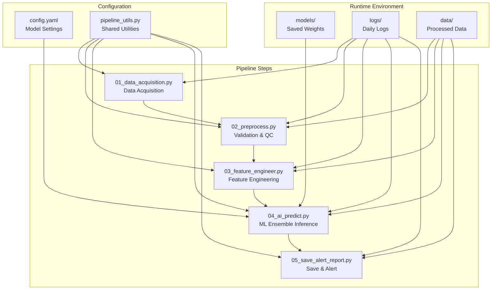
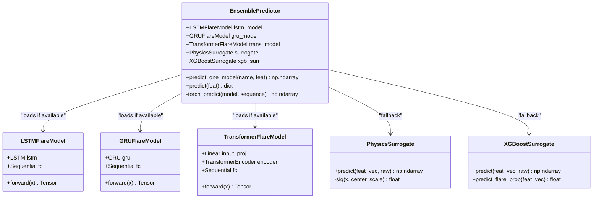
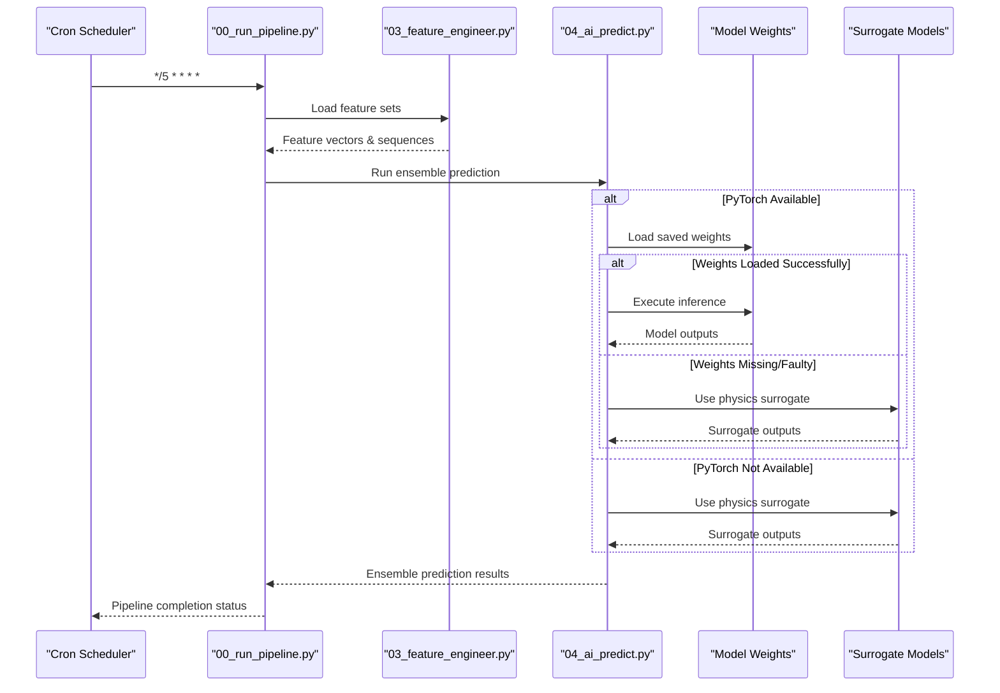
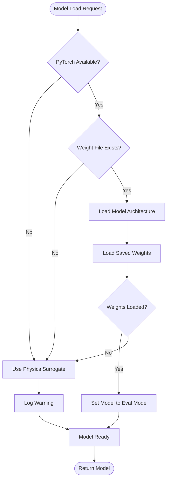
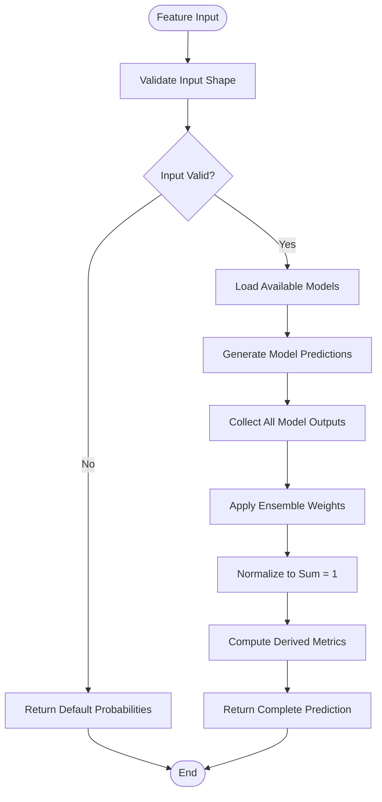
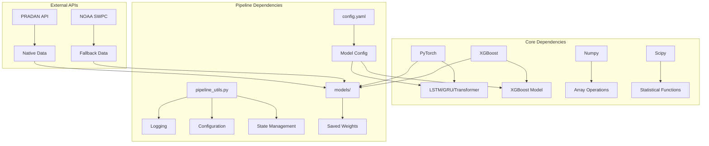

# Machine Learning Model Issues

<cite>
**Referenced Files in This Document**
- [00_run_pipeline.py](file://00_run_pipeline.py)
- [04_ai_predict.py](file://04_ai_predict.py)
- [config.yaml](file://config.yaml)
- [pipeline_utils.py](file://pipeline_utils.py)
- [01_data_acquisition.py](file://01_data_acquisition.py)
- [02_preprocess.py](file://02_preprocess.py)
- [03_feature_engineer.py](file://03_feature_engineer.py)
- [05_save_alert_report.py](file://05_save_alert_report.py)
</cite>

## Table of Contents
1. [Introduction](#introduction)
2. [Project Structure](#project-structure)
3. [Core Components](#core-components)
4. [Architecture Overview](#architecture-overview)
5. [Detailed Component Analysis](#detailed-component-analysis)
6. [Dependency Analysis](#dependency-analysis)
7. [Performance Considerations](#performance-considerations)
8. [Troubleshooting Guide](#troubleshooting-guide)
9. [Conclusion](#conclusion)

## Introduction
This document provides comprehensive troubleshooting guidance for machine learning model issues in the Aditya-L1 Solar Flare Forecasting Pipeline. The system implements a four-model ensemble (LSTM, GRU, Transformer, XGBoost) that predicts solar flare probabilities and associated space weather risks. The pipeline follows a strict five-minute cron schedule and includes robust error handling, model fallback mechanisms, and diagnostic capabilities.

## Project Structure
The pipeline consists of eight coordinated steps that process real-time solar observation data through a machine learning forecasting system:



**Diagram sources**
- [00_run_pipeline.py:13-23](file://00_run_pipeline.py#L13-L23)
- [config.yaml:66-77](file://config.yaml#L66-L77)

**Section sources**
- [00_run_pipeline.py:13-23](file://00_run_pipeline.py#L13-L23)
- [config.yaml:66-77](file://config.yaml#L66-L77)

## Core Components
The machine learning system centers around a sophisticated ensemble architecture with multiple model types and comprehensive fallback mechanisms:

### Ensemble Architecture
The system implements a weighted ensemble combining four distinct model types:



**Diagram sources**
- [04_ai_predict.py:246-395](file://04_ai_predict.py#L246-L395)
- [04_ai_predict.py:64-111](file://04_ai_predict.py#L64-L111)
- [04_ai_predict.py:134-190](file://04_ai_predict.py#L134-L190)
- [04_ai_predict.py:192-238](file://04_ai_predict.py#L192-L238)

### Model Configuration and Weights
Each model type has specific configuration parameters and weight locations:

| Model Type | Configuration Key | Expected Weight File | Hidden Layers | Sequence Length |
|------------|-------------------|---------------------|---------------|-----------------|
| LSTM | LSTM | models/lstm_v1.pt | 3 layers | 60 |
| GRU | GRU | models/gru_v1.pt | 2 layers | 60 |
| Transformer | Transformer | models/transformer_v1.pt | 4 layers | 60 |
| XGBoost | XGBoost | models/xgboost_v1.json | N/A | N/A |

**Section sources**
- [04_ai_predict.py:246-395](file://04_ai_predict.py#L246-L395)
- [config.yaml:66-77](file://config.yaml#L66-L77)

## Architecture Overview
The ML inference pipeline follows a structured workflow with comprehensive error handling and fallback mechanisms:



**Diagram sources**
- [00_run_pipeline.py:103-106](file://00_run_pipeline.py#L103-L106)
- [04_ai_predict.py:246-395](file://04_ai_predict.py#L246-L395)

## Detailed Component Analysis

### Model Loading and Validation
The system implements robust model loading with comprehensive error handling and validation:



**Diagram sources**
- [04_ai_predict.py:113-127](file://04_ai_predict.py#L113-L127)
- [04_ai_predict.py:249-267](file://04_ai_predict.py#L249-L267)

### Ensemble Prediction Workflow
The ensemble combines multiple model outputs with weighted averaging:



**Diagram sources**
- [04_ai_predict.py:310-395](file://04_ai_predict.py#L310-L395)

**Section sources**
- [04_ai_predict.py:113-127](file://04_ai_predict.py#L113-L127)
- [04_ai_predict.py:246-395](file://04_ai_predict.py#L246-L395)

## Dependency Analysis
The ML system has several critical dependencies that impact model functionality:



**Diagram sources**
- [04_ai_predict.py:43-56](file://04_ai_predict.py#L43-L56)
- [config.yaml:66-77](file://config.yaml#L66-L77)

**Section sources**
- [04_ai_predict.py:43-56](file://04_ai_predict.py#L43-L56)
- [config.yaml:66-77](file://config.yaml#L66-L77)

## Performance Considerations
The ML system implements several performance optimization strategies:

### Memory Management
- **Batch Processing**: Models process single predictions in batches of one
- **Tensor Operations**: Efficient NumPy array operations minimize memory overhead
- **Model States**: Automatic switching between training and evaluation modes

### Computational Efficiency
- **Fallback Mechanisms**: Physics-based surrogates provide fast approximations
- **Early Termination**: Failed model loads gracefully fall back to surrogates
- **Weighted Ensembles**: Balanced weighting reduces computational load

### Scalability Factors
- **Model Size**: LSTM/GRU use 128 hidden units; Transformer uses 64-dimensional embeddings
- **Sequence Length**: Fixed 60-step temporal windows for consistency
- **Feature Dimensionality**: 17-dimensional feature vectors optimize computation

## Troubleshooting Guide

### Model Loading Failures

#### Missing Weight Files
**Symptoms:**
- Models show as "SURROGATE" in model status
- Predictions fall back to physics-based estimates
- Warning messages in logs about failed model loads

**Diagnostic Steps:**
1. Verify weight file existence:
   ```bash
   ls -la models/
   ```
2. Check file permissions:
   ```bash
   ls -la models/lstm_v1.pt
   ls -la models/gru_v1.pt
   ls -la models/transformer_v1.pt
   ls -la models/xgboost_v1.json
   ```

**Resolution Steps:**
1. Place trained model weights in the `models/` directory
2. Ensure correct filenames match configuration
3. Verify file integrity and completeness
4. Test model loading independently

#### Incompatible PyTorch Versions
**Symptoms:**
- Import errors for PyTorch modules
- State dictionary loading failures
- CUDA-related compatibility issues

**Diagnostic Steps:**
1. Check PyTorch version:
   ```python
   import torch
   print(torch.__version__)
   ```

2. Verify CUDA availability:
   ```python
   import torch
   print(torch.cuda.is_available())
   ```

**Resolution Steps:**
1. Match PyTorch version with training environment
2. Use compatible CUDA versions if GPU support needed
3. Reinstall PyTorch with appropriate wheel:
   ```bash
   pip uninstall torch
   pip install torch --index-url https://download.pytorch.org/whl/cpu
   ```

#### CUDA Availability Issues
**Symptoms:**
- GPU memory allocation failures
- Slow inference performance
- CUDA out-of-memory errors

**Diagnostic Steps:**
1. Check GPU availability:
   ```python
   import torch
   print(torch.cuda.device_count())
   ```

2. Monitor GPU memory:
   ```python
   import torch
   if torch.cuda.is_available():
       print(torch.cuda.get_device_properties(0))
   ```

**Resolution Steps:**
1. Disable CUDA by setting CPU-only installation
2. Reduce batch sizes or model complexity
3. Clear GPU memory cache
4. Use mixed precision training

### Inference Errors

#### Tensor Shape Mismatches
**Symptoms:**
- Shape mismatch errors during model inference
- Assertion failures in tensor operations
- Runtime errors in PyTorch forward passes

**Common Shape Issues:**
- Input tensor shape: `(batch_size, sequence_length, features)`
- Expected: `(1, 60, 17)` for LSTM/GRU/Transformer
- Output tensor shape: `(batch_size, 5)` for 5-class probabilities

**Diagnostic Steps:**
1. Verify feature vector dimensions:
   ```python
   print(f"Vector length: {len(feature_vector)}")
   print(f"Sequence length: {len(sequence)}")
   print(f"Sequence shape: {len(sequence[0])}")
   ```

2. Check tensor shapes before inference:
   ```python
   import torch
   x = torch.tensor([sequence], dtype=torch.float32)
   print(f"Tensor shape: {x.shape}")
   ```

**Resolution Steps:**
1. Ensure feature engineering produces correct dimensions
2. Validate input data preprocessing
3. Check sequence padding and truncation logic
4. Verify model architecture matches expected input

#### Device Allocation Failures
**Symptoms:**
- CUDA out-of-memory errors
- Device mismatch errors
- Memory allocation failures

**Diagnostic Steps:**
1. Check available memory:
   ```python
   import torch
   if torch.cuda.is_available():
       print(f"Allocated: {torch.cuda.memory_allocated()}")
       print(f"Reserved: {torch.cuda.memory_reserved()}")
   ```

2. Monitor memory usage during inference

**Resolution Steps:**
1. Move tensors to CPU when GPU memory is insufficient
2. Clear CUDA cache between predictions
3. Reduce model complexity or batch size
4. Implement memory-efficient inference patterns

#### Memory Overflow Problems
**Symptoms:**
- Out of memory errors during inference
- System slowdown or crashes
- Memory leak detection

**Diagnostic Steps:**
1. Monitor memory usage:
   ```python
   import psutil
   print(f"Memory usage: {psutil.virtual_memory().percent}%")
   ```

2. Check for memory leaks in model instances

**Resolution Steps:**
1. Implement proper model cleanup
2. Use context managers for model operations
3. Clear unused variables and tensors
4. Optimize batch processing

### Model Performance Degradation

#### Accuracy Drops
**Symptoms:**
- Decreased prediction accuracy over time
- Unstable confidence scores
- Model drift detection

**Diagnostic Steps:**
1. Compare current predictions with historical baselines
2. Monitor confidence score distributions
3. Track model performance metrics

**Resolution Steps:**
1. Retrain models with recent data
2. Update model weights regularly
3. Implement model validation procedures
4. Consider ensemble recalibration

#### Prediction Timeouts
**Symptoms:**
- Excessive inference latency
- Timeout errors in production
- Slow response times

**Diagnostic Steps:**
1. Measure inference timing:
   ```python
   import time
   start = time.time()
   # Model inference
   end = time.time()
   print(f"Inference time: {end - start} seconds")
   ```

2. Profile slow operations

**Resolution Steps:**
1. Optimize model architectures
2. Implement caching mechanisms
3. Use model quantization
4. Scale up computational resources

#### Confidence Score Anomalies
**Symptoms:**
- Extremely high or low confidence scores
- Inconsistent confidence behavior
- Unstable prediction reliability

**Diagnostic Steps:**
1. Analyze entropy calculations:
   ```python
   import math
   entropy = -sum(p * math.log(p + 1e-9) for p in probabilities)
   max_entropy = math.log(5)
   confidence = 1.0 - entropy / max_entropy
   ```

2. Check probability distributions for validity

**Resolution Steps:**
1. Calibrate model outputs
2. Adjust ensemble weights
3. Implement confidence thresholding
4. Validate probability normalization

### Ensemble Model Coordination Issues

#### Model Synchronization Failures
**Symptoms:**
- Inconsistent model outputs
- Timing mismatches in predictions
- Synchronization errors

**Diagnostic Steps:**
1. Verify model loading order
2. Check timestamp consistency
3. Monitor model initialization

**Resolution Steps:**
1. Ensure sequential model loading
2. Implement proper initialization order
3. Add synchronization barriers
4. Validate model states

#### Voting Scheme Failures
**Symptoms:**
- Incorrect ensemble weighting
- Aggregation errors
- Weight application failures

**Diagnostic Steps:**
1. Verify ensemble weights configuration:
   ```yaml
   ensemble_weights:
     LSTM: 0.30
     GRU: 0.25
     Transformer: 0.30
     XGBoost: 0.15
   ```

2. Check weight normalization

**Resolution Steps:**
1. Recalculate normalized weights
2. Validate weight sums equal 1.0
3. Implement weight validation
4. Add weight consistency checks

#### Prediction Aggregation Errors
**Symptoms:**
- Incorrect ensemble predictions
- Probability summation errors
- Metric calculation failures

**Diagnostic Steps:**
1. Verify probability normalization:
   ```python
   ensemble_sum = sum(ensemble)
   if abs(ensemble_sum - 1.0) > 1e-6:
       # Handle normalization error
   ```

2. Check individual model contributions

**Resolution Steps:**
1. Implement robust normalization
2. Add validation for probability sums
3. Handle edge cases in aggregation
4. Validate ensemble convergence

### Diagnostic Procedures

#### Model Validation
**Procedure:**
1. Load models individually
2. Test with synthetic data
3. Validate output shapes and ranges
4. Check gradient computations

**Implementation:**
```python
# Test model loading
try:
    model = load_torch_model(LSTMFlareModel, "models/lstm_v1.pt")
    if model:
        # Test inference
        test_input = [[1.0] * 17] * 60  # 60x17 tensor
        result = model(torch.tensor([test_input], dtype=torch.float32))
        print(f"Test result shape: {result.shape}")
    else:
        print("Model failed to load")
except Exception as e:
    print(f"Model validation error: {e}")
```

#### Performance Benchmarking
**Procedure:**
1. Measure inference latency
2. Monitor memory usage
3. Track throughput rates
4. Compare against baseline performance

**Implementation:**
```python
import time
import psutil

def benchmark_model(model, test_data, iterations=100):
    # Warm up
    for _ in range(10):
        model(test_data)
    
    # Benchmark
    start_time = time.time()
    start_memory = psutil.virtual_memory().percent
    
    for _ in range(iterations):
        model(test_data)
    
    end_time = time.time()
    end_memory = psutil.virtual_memory().percent
    
    return {
        'avg_latency': (end_time - start_time) / iterations,
        'memory_delta': end_memory - start_memory
    }
```

#### Alternative Model Fallback Strategies
**Procedure:**
1. Implement graceful degradation
2. Monitor fallback usage
3. Track performance impact
4. Optimize fallback parameters

**Implementation:**
```python
def safe_predict(predictor, feature_set):
    try:
        return predictor.predict(feature_set)
    except Exception as e:
        logger.warning(f"Primary prediction failed: {e}")
        # Fallback to surrogate models
        return predictor.surrogate.predict(
            feature_set["vector"], 
            feature_set["raw_scalars"]
        )
```

### Resolution Steps

#### Model Retraining
**Procedure:**
1. Collect recent training data
2. Train models with updated parameters
3. Validate model performance
4. Deploy new weights

**Implementation:**
```python
# Example retraining workflow
def retrain_models():
    # Load recent data
    recent_data = load_recent_training_data()
    
    # Retrain models
    lstm_model = train_lstm(recent_data)
    gru_model = train_gru(recent_data)
    transformer_model = train_transformer(recent_data)
    xgb_model = train_xgboost(recent_data)
    
    # Save new weights
    torch.save(lstm_model.state_dict(), "models/lstm_v1.pt")
    torch.save(gru_model.state_dict(), "models/gru_v1.pt")
    torch.save(transformer_model.state_dict(), "models/transformer_v1.pt")
    xgb_model.save_model("models/xgboost_v1.json")
```

#### Format Conversion
**Procedure:**
1. Convert model formats as needed
2. Validate converted models
3. Test compatibility
4. Update configuration

**Implementation:**
```python
def convert_model_format(old_path, new_path, target_format):
    if target_format == "torch":
        # Convert to PyTorch format
        model = load_old_format(old_path)
        torch.save(model.state_dict(), new_path)
    elif target_format == "onnx":
        # Convert to ONNX format
        import torch.onnx
        model = load_torch_model(model_class, old_path)
        torch.onnx.export(model, dummy_input, new_path)
```

#### Environment Configuration Fixes
**Procedure:**
1. Verify Python environment
2. Check dependency versions
3. Validate configuration files
4. Test system readiness

**Implementation:**
```python
def validate_environment():
    # Check Python version
    import sys
    print(f"Python: {sys.version}")
    
    # Check dependencies
    try:
        import torch
        print(f"PyTorch: {torch.__version__}")
    except ImportError:
        print("PyTorch not available")
    
    try:
        import xgboost
        print(f"XGBoost: {xgboost.__version__}")
    except ImportError:
        print("XGBoost not available")
    
    # Check configuration
    with open("config.yaml", "r") as f:
        config = yaml.safe_load(f)
        print(f"Config loaded: {config['pipeline']['name']}")
```

**Section sources**
- [04_ai_predict.py:113-127](file://04_ai_predict.py#L113-L127)
- [04_ai_predict.py:246-395](file://04_ai_predict.py#L246-L395)
- [config.yaml:66-77](file://config.yaml#L66-L77)

## Conclusion
The Aditya-L1 Solar Flare Forecasting Pipeline implements a robust machine learning system with comprehensive error handling, fallback mechanisms, and diagnostic capabilities. The ensemble architecture provides reliable predictions through multiple model types while maintaining flexibility for various operational scenarios. The troubleshooting guide provides systematic approaches to address common model issues, from basic configuration problems to complex performance optimization challenges. Regular monitoring, proper maintenance, and adherence to the diagnostic procedures outlined in this document will ensure optimal system performance and reliability.