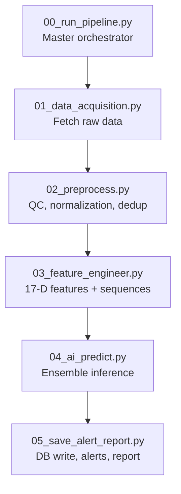
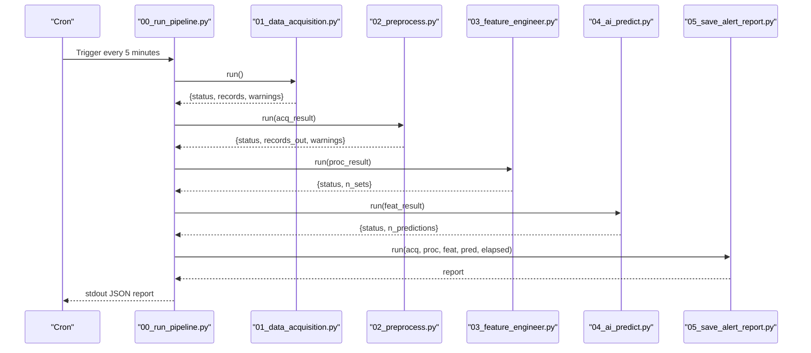

# Performance Optimization

<cite>
**Referenced Files in This Document**
- [README.md](file://README.md)
- [config.yaml](file://config.yaml)
- [00_run_pipeline.py](file://00_run_pipeline.py)
- [01_data_acquisition.py](file://01_data_acquisition.py)
- [02_preprocess.py](file://02_preprocess.py)
- [03_feature_engineer.py](file://03_feature_engineer.py)
- [04_ai_predict.py](file://04_ai_predict.py)
- [05_save_alert_report.py](file://05_save_alert_report.py)
- [pipeline_utils.py](file://pipeline_utils.py)
</cite>

## Table of Contents
1. [Introduction](#introduction)
2. [Project Structure](#project-structure)
3. [Core Components](#core-components)
4. [Architecture Overview](#architecture-overview)
5. [Detailed Component Analysis](#detailed-component-analysis)
6. [Dependency Analysis](#dependency-analysis)
7. [Performance Considerations](#performance-considerations)
8. [Troubleshooting Guide](#troubleshooting-guide)
9. [Conclusion](#conclusion)
10. [Appendices](#appendices)

## Introduction
This document focuses on performance optimization for the Aditya-L1 Solar Flare Forecasting Pipeline. It covers memory usage optimization, processing speed improvements, resource utilization monitoring, pipeline throughput, profiling and metrics, and capacity planning. The goal is to provide practical, actionable guidance grounded in the repository’s implementation to identify bottlenecks, apply targeted optimizations, and establish reliable performance baselines.

## Project Structure
The pipeline is organized as a sequence of discrete steps orchestrated by a master runner. Each stage encapsulates a specific responsibility and writes intermediate artifacts to disk for persistence and diagnostics.

**Diagram sources**
- [00_run_pipeline.py:63-123](file://00_run_pipeline.py#L63-L123)
- [01_data_acquisition.py:350-452](file://01_data_acquisition.py#L350-L452)
- [02_preprocess.py:230-409](file://02_preprocess.py#L230-L409)
- [03_feature_engineer.py:199-249](file://03_feature_engineer.py#L199-L249)
- [04_ai_predict.py:402-448](file://04_ai_predict.py#L402-L448)
- [05_save_alert_report.py:452-502](file://05_save_alert_report.py#L452-L502)

**Section sources**
- [README.md:7-32](file://README.md#L7-L32)
- [00_run_pipeline.py:13-24](file://00_run_pipeline.py#L13-L24)

## Core Components
- Master orchestrator: measures per-stage durations, retries, and aggregates totals.
- Data acquisition: HTTP fetching, streaming downloads, checksum-based deduplication, fallback logic.
- Preprocessing: validation, gap detection, sigma clipping, linear interpolation, normalization, and merging heterogeneous sources.
- Feature engineering: computes 17-dimensional features and builds sequences for deep learning models.
- AI inference: ensemble of LSTM, GRU, Transformer, and XGBoost with surrogate fallbacks.
- Persistence and alerts: PostgreSQL schema creation, inserts, alert evaluation, and report generation.

Key performance-relevant aspects:
- Per-stage timing and retries reduce transient failures and enable accurate latency tracking.
- Deduplication prevents redundant processing and I/O.
- Normalization and interpolation reduce model instability and improve throughput.
- Ensemble inference balances accuracy and speed with surrogate fallbacks.
- Centralized logging and state management support observability and recovery.

**Section sources**
- [00_run_pipeline.py:41-61](file://00_run_pipeline.py#L41-L61)
- [01_data_acquisition.py:331-343](file://01_data_acquisition.py#L331-L343)
- [02_preprocess.py:45-98](file://02_preprocess.py#L45-L98)
- [03_feature_engineer.py:52-193](file://03_feature_engineer.py#L52-L193)
- [04_ai_predict.py:246-395](file://04_ai_predict.py#L246-L395)
- [05_save_alert_report.py:47-116](file://05_save_alert_report.py#L47-L116)

## Architecture Overview
The pipeline is designed for periodic execution under a cron schedule. It emphasizes reliability and observability through explicit retries, per-stage timing, and structured logging. The AI stage supports both GPU-accelerated models and CPU-based surrogates, enabling flexible deployment scenarios.

**Diagram sources**
- [README.md:114-133](file://README.md#L114-L133)
- [00_run_pipeline.py:71-118](file://00_run_pipeline.py#L71-L118)
- [01_data_acquisition.py:350-452](file://01_data_acquisition.py#L350-L452)
- [02_preprocess.py:230-409](file://02_preprocess.py#L230-L409)
- [03_feature_engineer.py:199-249](file://03_feature_engineer.py#L199-L249)
- [04_ai_predict.py:402-448](file://04_ai_predict.py#L402-L448)
- [05_save_alert_report.py:452-502](file://05_save_alert_report.py#L452-L502)

## Detailed Component Analysis

### Data Acquisition (01_data_acquisition.py)
- HTTP fetching with timeouts and streaming downloads reduces memory spikes during large file transfers.
- Checksum-based deduplication avoids reprocessing identical records.
- Fallback to NOAA SWPC ensures continuity when native data is unavailable.
- Logging captures errors and warnings for quick triage.

Optimization levers:
- Tune timeouts and chunk sizes for network stability.
- Adjust deduplication window to balance freshness vs. overhead.
- Monitor network latency and availability to anticipate fallback triggers.

**Section sources**
- [01_data_acquisition.py:69-87](file://01_data_acquisition.py#L69-L87)
- [01_data_acquisition.py:133-143](file://01_data_acquisition.py#L133-L143)
- [01_data_acquisition.py:331-343](file://01_data_acquisition.py#L331-L343)
- [01_data_acquisition.py:392-439](file://01_data_acquisition.py#L392-L439)

### Preprocessing (02_preprocess.py)
- Validates records, detects gaps, and applies sigma clipping and linear interpolation to stabilize time series.
- Applies log10 normalization and min-max scaling to improve numerical stability for ML models.
- Provides a synchronization check between instruments.

Optimization levers:
- Tune outlier threshold and interpolation strategy to minimize data loss while preserving signal.
- Consider vectorized operations for large arrays to reduce Python loop overhead.
- Cache computed statistics for repeated windows to avoid recomputation.

**Section sources**
- [02_preprocess.py:45-98](file://02_preprocess.py#L45-L98)
- [02_preprocess.py:126-168](file://02_preprocess.py#L126-L168)
- [02_preprocess.py:207-223](file://02_preprocess.py#L207-L223)

### Feature Engineering (03_feature_engineer.py)
- Computes 17-dimensional features and constructs sequences for temporal models.
- Implements percentile ranking and rolling statistics with bounded normalization.

Optimization levers:
- Use NumPy arrays and vectorized operations for rolling computations.
- Pad sequences efficiently to avoid unnecessary copies.
- Consider precomputing feature ranges and caches for normalization constants.

**Section sources**
- [03_feature_engineer.py:52-193](file://03_feature_engineer.py#L52-L193)
- [03_feature_engineer.py:199-249](file://03_feature_engineer.py#L199-L249)

### AI Ensemble Inference (04_ai_predict.py)
- Supports LSTM, GRU, Transformer, and XGBoost with optional surrogate fallbacks.
- Uses weighted ensemble averaging and computes derived metrics (CME, onset, geomagnetic risk).
- Handles missing model weights gracefully.

Optimization levers:
- Enable GPU acceleration when available; otherwise rely on surrogate models.
- Batch inference for multiple feature sets if extending the pipeline.
- Calibrate ensemble weights based on observed performance.

**Section sources**
- [04_ai_predict.py:246-395](file://04_ai_predict.py#L246-L395)
- [04_ai_predict.py:402-448](file://04_ai_predict.py#L402-L448)

### Persistence and Alerts (05_save_alert_report.py)
- Creates PostgreSQL tables on first run and inserts predictions and alerts.
- Evaluates thresholds and dispatches alerts via email/webhook.
- Generates a structured JSON report for downstream systems.

Optimization levers:
- Use connection pooling and batch inserts to reduce DB overhead.
- Asynchronously dispatch alerts to avoid blocking the main pipeline.
- Indexes are already created; ensure maintenance tasks keep them healthy.

**Section sources**
- [05_save_alert_report.py:47-116](file://05_save_alert_report.py#L47-L116)
- [05_save_alert_report.py:222-265](file://05_save_alert_report.py#L222-L265)
- [05_save_alert_report.py:452-502](file://05_save_alert_report.py#L452-L502)

## Dependency Analysis
The pipeline exhibits a strict sequential dependency chain with minimal cross-stage coupling. Inter-stage data is persisted to disk, which simplifies fault isolation but introduces I/O overhead.

**Diagram sources**
- [00_run_pipeline.py:71-118](file://00_run_pipeline.py#L71-L118)
- [01_data_acquisition.py:350-452](file://01_data_acquisition.py#L350-L452)
- [02_preprocess.py:230-409](file://02_preprocess.py#L230-L409)
- [03_feature_engineer.py:199-249](file://03_feature_engineer.py#L199-L249)
- [04_ai_predict.py:402-448](file://04_ai_predict.py#L402-L448)
- [05_save_alert_report.py:452-502](file://05_save_alert_report.py#L452-L502)

**Section sources**
- [00_run_pipeline.py:71-118](file://00_run_pipeline.py#L71-L118)

## Performance Considerations

### Memory Usage Optimization
- Streaming downloads: Use chunked reads to avoid loading entire files into memory at once.
- Deduplication cache: Limit stored checksums to a fixed-size sliding window to cap memory growth.
- Normalization and interpolation: Prefer in-place operations and avoid creating redundant copies.
- Surrogate models: Reduce memory footprint when GPU models are unavailable.

Practical tips:
- Monitor memory usage during acquisition and preprocessing to detect leaks.
- Use smaller batch sizes for inference when memory is constrained.
- Periodically clear old raw/processed/features artifacts according to retention policy.

**Section sources**
- [01_data_acquisition.py:133-143](file://01_data_acquisition.py#L133-L143)
- [01_data_acquisition.py:339-343](file://01_data_acquisition.py#L339-L343)
- [02_preprocess.py:128-151](file://02_preprocess.py#L128-L151)
- [04_ai_predict.py:246-308](file://04_ai_predict.py#L246-L308)

### Processing Speed Improvements
- Parallelization strategies:
  - Multi-threaded downloads: Use concurrent sessions for multiple files.
  - Batch inference: Extend the pipeline to process multiple feature sets concurrently.
  - Asynchronous alert dispatch: Offload email/webhook posting to background tasks.
- Caching mechanisms:
  - Cache normalized feature windows and rolling statistics.
  - Persist intermediate artifacts to SSD/NVMe for faster access.
- I/O optimization:
  - Use buffered writes and compress JSON outputs where appropriate.
  - Batch PostgreSQL inserts to reduce round-trips.

**Section sources**
- [01_data_acquisition.py:133-143](file://01_data_acquisition.py#L133-L143)
- [04_ai_predict.py:402-448](file://04_ai_predict.py#L402-L448)
- [05_save_alert_report.py:143-188](file://05_save_alert_report.py#L143-L188)

### Resource Utilization Monitoring
- CPU usage patterns:
  - Identify hotspots in preprocessing (gap detection, normalization) and feature engineering (percentiles, rolling stats).
  - Track GPU utilization during inference; monitor fallback to CPU.
- Disk space management:
  - Enforce retention policies for raw/processed/features artifacts.
  - Monitor PostgreSQL storage growth and vacuum/analyze schedules.
- Network bandwidth optimization:
  - Tune timeouts and chunk sizes for data acquisition.
  - Use fallback only when necessary to minimize external traffic.

**Section sources**
- [config.yaml:35-39](file://config.yaml#L35-L39)
- [01_data_acquisition.py:213-220](file://01_data_acquisition.py#L213-L220)
- [05_save_alert_report.py:118-141](file://05_save_alert_report.py#L118-L141)

### Pipeline Throughput Issues
- Bottleneck identification:
  - Use per-stage timing logs to locate slow steps.
  - Monitor DB insertion latency and alert dispatch delays.
- Stage optimization:
  - Optimize preprocessing loops and vectorize operations.
  - Reduce model inference overhead by batching and using surrogate models when needed.
- Load balancing strategies:
  - Distribute ingestion across multiple workers for acquisition.
  - Scale DB connections and consider read replicas for reporting.

**Section sources**
- [00_run_pipeline.py:41-61](file://00_run_pipeline.py#L41-L61)
- [05_save_alert_report.py:143-188](file://05_save_alert_report.py#L143-L188)

### Profiling Tools and Metrics Collection
- Built-in timing and retries:
  - Per-stage duration tracking enables baseline establishment.
  - Retry logic with delays improves resilience against transient failures.
- Logging and state:
  - Daily rotating logs per module aid in diagnosing issues.
  - Persistent state helps recover from partial failures.

Recommended additions:
- Add structured metrics (latency histograms, error rates) to logs.
- Instrument DB queries and alert dispatches with timing.
- Use Python’s built-in profiler or third-party tools for hot-spot analysis.

**Section sources**
- [00_run_pipeline.py:41-61](file://00_run_pipeline.py#L41-L61)
- [pipeline_utils.py:43-64](file://pipeline_utils.py#L43-L64)

### Capacity Planning Guidelines
- Throughput targets:
  - Aim to complete each 5-minute cycle within 3–4 minutes for headroom.
  - Account for fallback mode performance degradation.
- Scaling factors:
  - Increase DB pool size and optimize indexes for higher write volumes.
  - Provision CPU/GPU resources proportional to inference workload.

**Section sources**
- [README.md:114-133](file://README.md#L114-L133)
- [config.yaml:97-104](file://config.yaml#L97-L104)

## Troubleshooting Guide
Common issues and remedies:
- No new data detected:
  - Verify deduplication checksum window and acquisition credentials.
- Acquisition failures:
  - Inspect network timeouts and fallback logic.
- Preprocessing failures:
  - Review validation errors and gap detection warnings.
- Feature extraction errors:
  - Check for missing keys and numeric edge cases.
- Inference errors:
  - Confirm model weights presence and environment availability.
- DB write failures:
  - Validate connection parameters and schema readiness.

**Section sources**
- [01_data_acquisition.py:339-343](file://01_data_acquisition.py#L339-L343)
- [02_preprocess.py:258-263](file://02_preprocess.py#L258-L263)
- [03_feature_engineer.py:229-231](file://03_feature_engineer.py#L229-L231)
- [04_ai_predict.py:317-320](file://04_ai_predict.py#L317-L320)
- [05_save_alert_report.py:139-141](file://05_save_alert_report.py#L139-L141)

## Conclusion
The pipeline is structured for reliability and observability, with clear per-stage timing and robust fallbacks. Optimizations should focus on I/O efficiency, numerical stability, and leveraging GPU acceleration where available. Establishing baselines, adding metrics, and applying targeted improvements will enhance throughput and resource utilization while maintaining accuracy and responsiveness.

## Appendices

### Performance Baseline Establishment
- Record per-stage durations over several runs to build a baseline.
- Track error rates and retry counts to assess stability.
- Compare GPU vs. CPU inference performance to guide deployment decisions.

**Section sources**
- [00_run_pipeline.py:41-61](file://00_run_pipeline.py#L41-L61)

### Configuration Reference
- Data retention and storage paths are configurable.
- Model parameters and ensemble weights are centralized.

**Section sources**
- [config.yaml:35-39](file://config.yaml#L35-L39)
- [config.yaml:66-77](file://config.yaml#L66-L77)