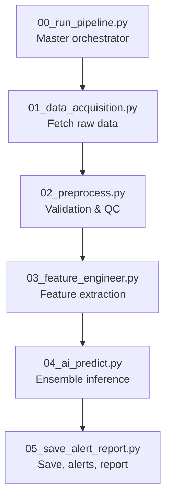
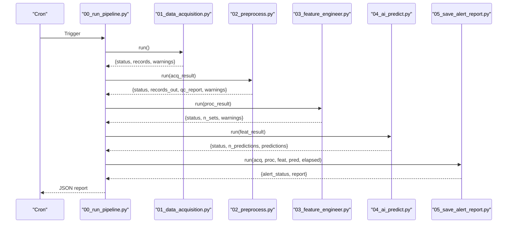
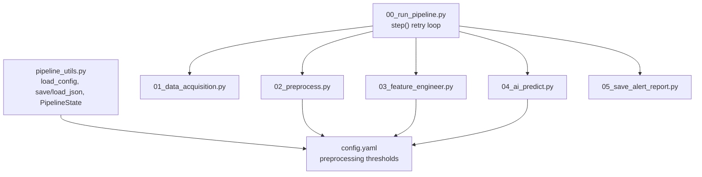

# Preprocessing and Validation Errors

<cite>
**Referenced Files in This Document**
- [00_run_pipeline.py](file://00_run_pipeline.py)
- [01_data_acquisition.py](file://01_data_acquisition.py)
- [02_preprocess.py](file://02_preprocess.py)
- [03_feature_engineer.py](file://03_feature_engineer.py)
- [04_ai_predict.py](file://04_ai_predict.py)
- [05_save_alert_report.py](file://05_save_alert_report.py)
- [README.md](file://README.md)
- [config.yaml](file://config.yaml)
- [pipeline_utils.py](file://pipeline_utils.py)
</cite>

## Table of Contents
1. [Introduction](#introduction)
2. [Project Structure](#project-structure)
3. [Core Components](#core-components)
4. [Architecture Overview](#architecture-overview)
5. [Detailed Component Analysis](#detailed-component-analysis)
6. [Dependency Analysis](#dependency-analysis)
7. [Performance Considerations](#performance-considerations)
8. [Troubleshooting Guide](#troubleshooting-guide)
9. [Conclusion](#conclusion)

## Introduction
This document provides comprehensive troubleshooting guidance for preprocessing and validation failures across the Aditya-L1 Solar Flare Forecasting Pipeline. It focuses on detecting and resolving:
- Corrupted data: malformed JSON, unexpected data types, missing fields
- Quality control issues: outlier detection failures, missing value imputation errors, time synchronization problems
- Validation rule violations: data range checks, consistency validations, business logic errors
- Memory-related issues during data processing, file I/O errors, and temporary file handling problems
- Debugging techniques for identifying problematic data records, batch processing failures, and partial data corruption
- Resolution strategies including data recovery procedures and validation bypass options when appropriate

## Project Structure
The pipeline is composed of eight steps orchestrated by a master entry point. The preprocessing and validation logic resides primarily in the preprocessing step, with supporting utilities and configuration.

**Diagram sources**
- [00_run_pipeline.py:63-121](file://00_run_pipeline.py#L63-L121)
- [01_data_acquisition.py:350-452](file://01_data_acquisition.py#L350-L452)
- [02_preprocess.py:230-409](file://02_preprocess.py#L230-L409)
- [03_feature_engineer.py:199-249](file://03_feature_engineer.py#L199-L249)
- [04_ai_predict.py:402-448](file://04_ai_predict.py#L402-L448)
- [05_save_alert_report.py:452-502](file://05_save_alert_report.py#L452-L502)

**Section sources**
- [README.md:7-32](file://README.md#L7-L32)
- [00_run_pipeline.py:13-23](file://00_run_pipeline.py#L13-L23)

## Core Components
- Data Acquisition: Fetches native PRADAN L1 FITS and/or NOAA SWPC fallback data, deduplicates, and persists raw JSON.
- Preprocessing: Validates records, detects gaps, performs outlier clipping, interpolates missing values, normalizes, derives HEL1OS bands, and aligns instruments.
- Feature Engineering: Builds 17-dimensional feature vectors and sequences for AI models.
- AI Prediction: Runs ensemble models (LSTM, GRU, Transformer, XGBoost) with surrogate fallbacks.
- Persistence and Reporting: Writes predictions to PostgreSQL (when available), evaluates alerts, updates dashboard stub, and generates structured JSON reports.

Key configuration impacting validation and QC is defined in the configuration file, including thresholds for gaps, outliers, and synchronization tolerances.

**Section sources**
- [01_data_acquisition.py:350-452](file://01_data_acquisition.py#L350-L452)
- [02_preprocess.py:45-224](file://02_preprocess.py#L45-L224)
- [03_feature_engineer.py:52-193](file://03_feature_engineer.py#L52-L193)
- [04_ai_predict.py:246-396](file://04_ai_predict.py#L246-L396)
- [05_save_alert_report.py:47-116](file://05_save_alert_report.py#L47-L116)
- [config.yaml:54-60](file://config.yaml#L54-L60)

## Architecture Overview
The pipeline enforces robust error handling and state persistence across steps. Each step runs with retries and logs failures. The preprocessing step aggregates QC metrics and warnings, which are propagated to downstream steps and included in the final report.

**Diagram sources**
- [00_run_pipeline.py:71-116](file://00_run_pipeline.py#L71-L116)
- [01_data_acquisition.py:350-452](file://01_data_acquisition.py#L350-L452)
- [02_preprocess.py:230-409](file://02_preprocess.py#L230-L409)
- [03_feature_engineer.py:199-249](file://03_feature_engineer.py#L199-L249)
- [04_ai_predict.py:402-448](file://04_ai_predict.py#L402-L448)
- [05_save_alert_report.py:452-502](file://05_save_alert_report.py#L452-L502)

## Detailed Component Analysis

### Data Acquisition (01_data_acquisition.py)
- Authentication and connectivity: PRADAN login and file query handle timeouts and HTTP errors gracefully, logging warnings and continuing with fallbacks.
- Deduplication: Uses checksums computed from normalized JSON to skip already-processed records.
- Fallback mode: When PRADAN is unavailable, the system switches to NOAA SWPC feeds and warns about reduced fidelity.

Common failure modes:
- Missing credentials lead to skipped native acquisition.
- Network timeouts or HTTP errors during PRADAN queries cause fallback to NOAA.
- FITS parsing requires astropy; absence triggers a warning and skips parsing.

Resolution strategies:
- Verify environment variables for PRADAN credentials.
- Confirm network access to PRADAN and NOAA endpoints.
- Install astropy for native FITS parsing.

**Section sources**
- [01_data_acquisition.py:69-87](file://01_data_acquisition.py#L69-L87)
- [01_data_acquisition.py:107-119](file://01_data_acquisition.py#L107-L119)
- [01_data_acquisition.py:133-143](file://01_data_acquisition.py#L133-L143)
- [01_data_acquisition.py:151-192](file://01_data_acquisition.py#L151-L192)
- [01_data_acquisition.py:331-343](file://01_data_acquisition.py#L331-L343)
- [01_data_acquisition.py:402-407](file://01_data_acquisition.py#L402-L407)

### Preprocessing and Validation (02_preprocess.py)
- Validation rules:
  - Timestamp presence is mandatory.
  - For NOAA/Proxy records: validates presence of band_1_8A latest flux, applies physical range checks, and flags low cadence.
  - For PRADAN records: ensures SoLEXS bands are present and within expected ranges.
- Quality control:
  - Outlier detection via sigma clipping.
  - Missing value imputation via linear interpolation.
  - Gap detection in 1-minute timeseries.
  - Instrument synchronization tolerance check.
- Normalization and scaling:
  - Log10 transformation and min-max scaling for flux.
  - Derived HEL1OS bands using a spectral model when native data is unavailable.

Failure scenarios:
- Missing fields cause validation errors and record rejection.
- Outliers not clipped or interpolated can propagate to downstream steps.
- Gaps exceeding configured thresholds produce warnings.
- Desynchronized timestamps trigger warnings but do not fail the step.

Resolution strategies:
- Fix upstream data sources to include required fields.
- Adjust preprocessing thresholds in configuration.
- Ensure continuous 1-minute cadence for NOAA-derived records.
- Validate instrument timestamps before merging.

**Section sources**
- [02_preprocess.py:51-97](file://02_preprocess.py#L51-L97)
- [02_preprocess.py:128-151](file://02_preprocess.py#L128-L151)
- [02_preprocess.py:153-167](file://02_preprocess.py#L153-L167)
- [02_preprocess.py:169-205](file://02_preprocess.py#L169-L205)
- [02_preprocess.py:207-224](file://02_preprocess.py#L207-L224)
- [02_preprocess.py:259-263](file://02_preprocess.py#L259-L263)
- [02_preprocess.py:288-294](file://02_preprocess.py#L288-L294)

### Feature Engineering (03_feature_engineer.py)
- Extracts 17-dimensional features from validated records.
- Computes percentile ranks, rolling statistics, and normalizations.
- Builds a 60×17 sequence tensor by replicating scalar features along the time axis.

Failure scenarios:
- Missing or invalid fields in the input record cause extraction errors.
- Insufficient data for rolling windows or percentile computation leads to defaults.

Resolution strategies:
- Ensure preprocessing completes successfully and populates all required fields.
- Validate that timeseries length meets the minimum requirement for rolling windows.

**Section sources**
- [03_feature_engineer.py:92-193](file://03_feature_engineer.py#L92-L193)
- [03_feature_engineer.py:219-232](file://03_feature_engineer.py#L219-L232)

### AI Prediction (04_ai_predict.py)
- Loads trained models when available; otherwise uses physics-informed surrogates.
- Aggregates predictions from multiple models with weighted ensemble.
- Computes derived outputs: CME probability, onset time estimates, and confidence scores.

Failure scenarios:
- Model loading failures fall back to surrogates.
- Prediction exceptions are logged and do not halt the pipeline.

Resolution strategies:
- Place trained model weights in the models directory.
- Monitor model availability and ensure dependencies are installed.

**Section sources**
- [04_ai_predict.py:113-127](file://04_ai_predict.py#L113-L127)
- [04_ai_predict.py:246-396](file://04_ai_predict.py#L246-L396)
- [04_ai_predict.py:422-437](file://04_ai_predict.py#L422-L437)

### Persistence and Reporting (05_save_alert_report.py)
- PostgreSQL writer creates tables on first run and inserts predictions and alerts.
- Alert engine evaluates thresholds and dispatches alerts via configured channels.
- Generates a structured JSON report with pipeline status, alert status, and recommended actions.

Failure scenarios:
- PostgreSQL connection failures are handled gracefully; operations are simulated when psycopg2 is unavailable.
- Alert dispatch failures are logged and do not block reporting.

Resolution strategies:
- Install and configure PostgreSQL with the correct credentials.
- Enable and configure alert channels (email/webhook) as needed.

**Section sources**
- [05_save_alert_report.py:118-141](file://05_save_alert_report.py#L118-L141)
- [05_save_alert_report.py:226-265](file://05_save_alert_report.py#L226-L265)
- [05_save_alert_report.py:267-298](file://05_save_alert_report.py#L267-L298)
- [05_save_alert_report.py:340-425](file://05_save_alert_report.py#L340-L425)

## Dependency Analysis
The pipeline relies on shared utilities for configuration, logging, and state management. The preprocessing step depends on configuration thresholds for QC and normalization.

**Diagram sources**
- [pipeline_utils.py:25-40](file://pipeline_utils.py#L25-L40)
- [config.yaml:54-77](file://config.yaml#L54-L77)
- [00_run_pipeline.py:41-61](file://00_run_pipeline.py#L41-L61)
- [02_preprocess.py:31-38](file://02_preprocess.py#L31-L38)
- [03_feature_engineer.py:40-43](file://03_feature_engineer.py#L40-L43)
- [04_ai_predict.py:37-40](file://04_ai_predict.py#L37-L40)

**Section sources**
- [pipeline_utils.py:25-40](file://pipeline_utils.py#L25-L40)
- [config.yaml:54-77](file://config.yaml#L54-L77)
- [00_run_pipeline.py:41-61](file://00_run_pipeline.py#L41-L61)

## Performance Considerations
- Timeouts and retries: The orchestrator retries failed steps with delays, reducing transient network failures impact.
- Logging overhead: Excessive logging can increase I/O; adjust log levels in configuration for production.
- Memory usage: Large timeseries and feature tensors require sufficient RAM; monitor memory consumption during preprocessing and feature engineering.
- Disk I/O: Frequent JSON writes to disk; ensure adequate disk space and fast storage for raw, processed, and feature directories.

[No sources needed since this section provides general guidance]

## Troubleshooting Guide

### Corrupted Data Detection
Symptoms:
- JSON parsing errors or missing keys in raw or processed files.
- Unexpected data types causing conversion failures.

Detection techniques:
- Inspect raw acquisition output and processed files for missing fields or malformed entries.
- Review preprocessing warnings indicating missing or out-of-range values.

Resolution strategies:
- Validate upstream data sources to ensure required fields are present.
- Adjust validation thresholds in configuration to accommodate legitimate edge cases.
- Re-run acquisition to refresh corrupted files.

**Section sources**
- [01_data_acquisition.py:441-449](file://01_data_acquisition.py#L441-L449)
- [02_preprocess.py:55-97](file://02_preprocess.py#L55-L97)

### Quality Control Issues
Outlier detection failures:
- Symptoms: Abnormally high or low values persisting after preprocessing.
- Cause: Outlier threshold too strict or too lenient.
- Resolution: Tune outlier_sigma_threshold in configuration.

Missing value imputation errors:
- Symptoms: NaN values propagating to features or predictions.
- Cause: Insufficient data for interpolation or extreme gaps.
- Resolution: Increase cadence or use alternate sources; verify interpolation logic.

Time synchronization problems:
- Symptoms: Warnings about instrument desynchronization.
- Cause: Timestamps outside configured tolerance.
- Resolution: Align timestamps or increase tolerance in configuration.

**Section sources**
- [02_preprocess.py:128-151](file://02_preprocess.py#L128-L151)
- [02_preprocess.py:207-224](file://02_preprocess.py#L207-L224)
- [config.yaml:57-59](file://config.yaml#L57-L59)

### Validation Rule Violations
Data range checks:
- Symptoms: Warnings about flux values outside expected ranges.
- Cause: Sensor anomalies or incorrect units.
- Resolution: Cross-check against known ranges; apply manual overrides if justified.

Consistency validations:
- Symptoms: Missing fields for specific sources.
- Cause: Incomplete or inconsistent data payloads.
- Resolution: Enforce schema compliance upstream; reject invalid records.

Business logic errors:
- Symptoms: Derived values outside expected bounds.
- Cause: Incorrect assumptions in spectral model or derived calculations.
- Resolution: Validate derived formulas; use fallbacks when necessary.

**Section sources**
- [02_preprocess.py:79-87](file://02_preprocess.py#L79-L87)
- [02_preprocess.py:89-97](file://02_preprocess.py#L89-L97)
- [02_preprocess.py:169-205](file://02_preprocess.py#L169-L205)

### Memory-Related Issues
Symptoms:
- Out-of-memory errors during preprocessing or feature engineering.
- Slow processing times with large datasets.

Mitigations:
- Reduce sequence length or batch sizes.
- Monitor memory usage and optimize data structures.
- Use streaming or chunked processing for very large files.

**Section sources**
- [03_feature_engineer.py:150-166](file://03_feature_engineer.py#L150-L166)

### File I/O and Temporary File Problems
Symptoms:
- Permission errors writing to data directories.
- Disk space exhaustion.
- JSON serialization failures.

Resolutions:
- Ensure write permissions for raw, processed, features, and reports directories.
- Clean up old files according to retention policies.
- Validate JSON serialization and encoding.

**Section sources**
- [01_data_acquisition.py:441-449](file://01_data_acquisition.py#L441-L449)
- [02_preprocess.py:380-389](file://02_preprocess.py#L380-L389)
- [03_feature_engineer.py:233-235](file://03_feature_engineer.py#L233-L235)
- [05_save_alert_report.py:492-493](file://05_save_alert_report.py#L492-L493)

### Debugging Techniques
- Identify problematic records:
  - Inspect the last raw and processed files recorded in pipeline state.
  - Filter logs by module name to isolate failures.
- Batch processing failures:
  - Run individual steps manually to reproduce issues.
  - Use smaller subsets of data to pinpoint failing records.
- Partial data corruption:
  - Re-run acquisition to refresh corrupted files.
  - Recompute checksums and deduplicate to avoid reprocessing duplicates.

Recovery procedures:
- For preprocessing failures, fix the underlying data issues and rerun the preprocessing step.
- For feature extraction failures, ensure preprocessing succeeded and all required fields are populated.
- For prediction failures, verify model availability or rely on surrogate models.

Validation bypass options:
- Adjust thresholds in configuration to accommodate edge cases temporarily.
- Skip problematic records by filtering in acquisition or preprocessing until upstream issues are resolved.

**Section sources**
- [pipeline_utils.py:82-96](file://pipeline_utils.py#L82-L96)
- [00_run_pipeline.py:41-61](file://00_run_pipeline.py#L41-L61)
- [01_data_acquisition.py:419-424](file://01_data_acquisition.py#L419-L424)
- [02_preprocess.py:391-393](file://02_preprocess.py#L391-L393)
- [03_feature_engineer.py:254-259](file://03_feature_engineer.py#L254-L259)

## Conclusion
This guide consolidates practical strategies for diagnosing and resolving preprocessing and validation failures across the pipeline. By leveraging built-in logging, QC warnings, and state persistence, operators can quickly isolate issues, recover from partial corruption, and maintain reliable forecasts. Adjusting configuration thresholds and ensuring upstream data integrity are key to preventing recurring failures.