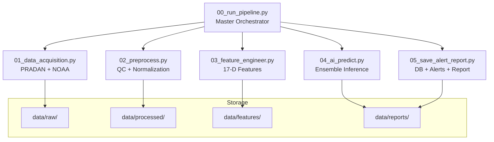
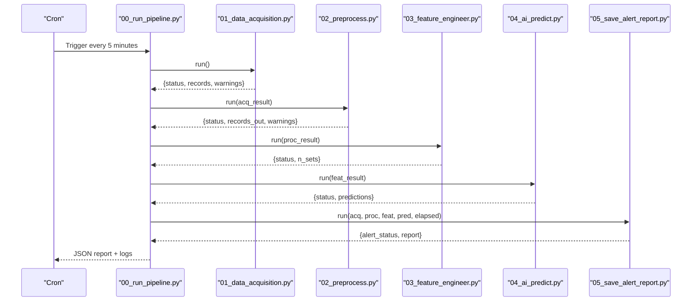
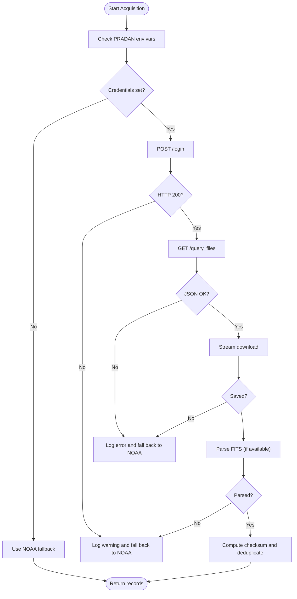
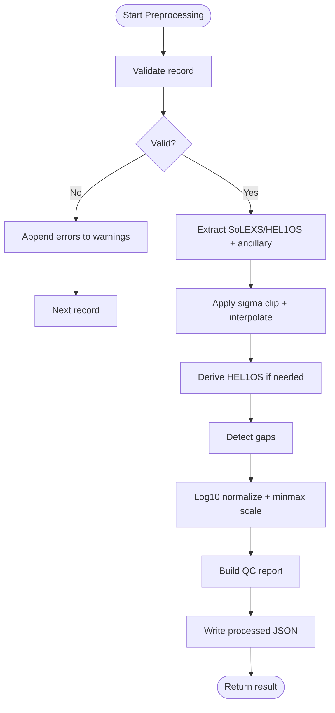
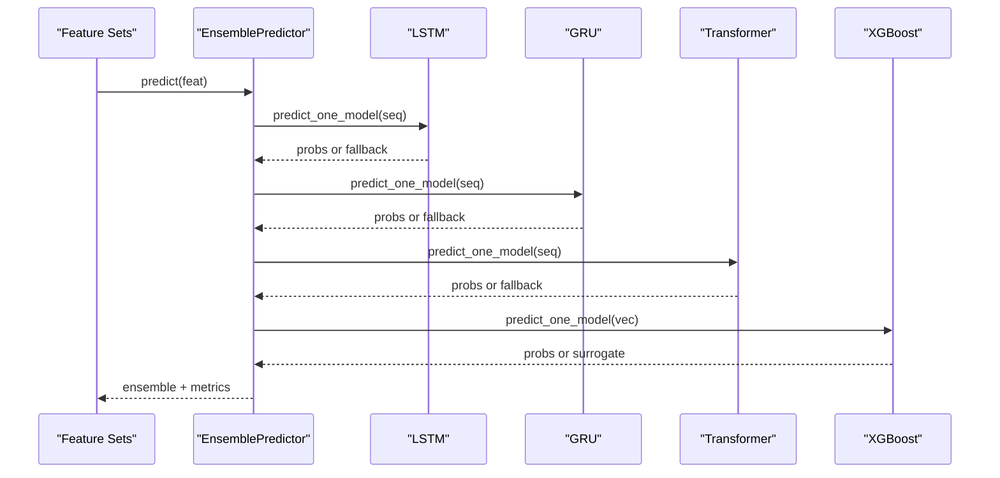
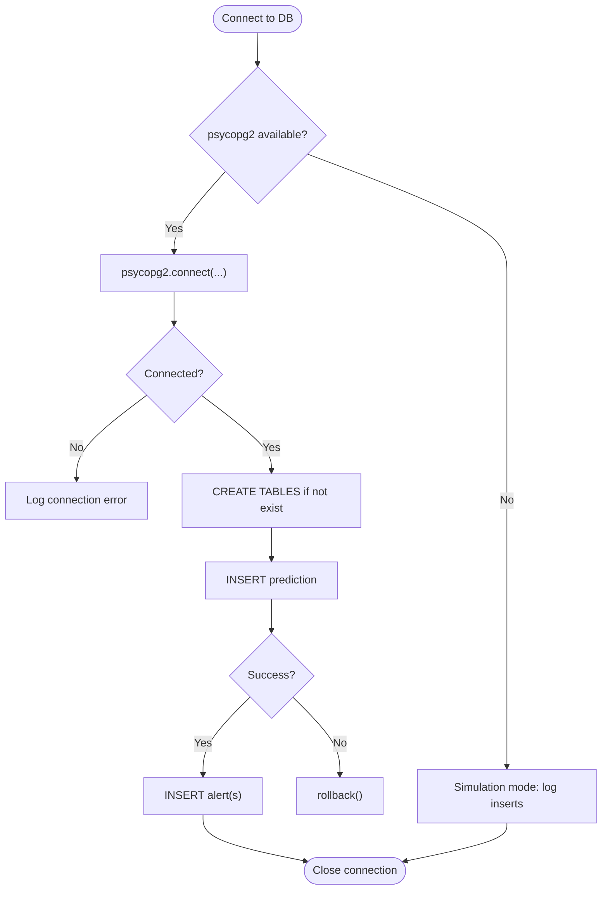
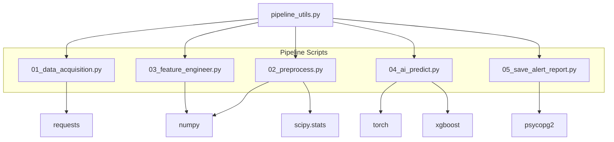

# Troubleshooting

<cite>
**Referenced Files in This Document**
- [00_run_pipeline.py](file://00_run_pipeline.py)
- [01_data_acquisition.py](file://01_data_acquisition.py)
- [02_preprocess.py](file://02_preprocess.py)
- [03_feature_engineer.py](file://03_feature_engineer.py)
- [04_ai_predict.py](file://04_ai_predict.py)
- [05_save_alert_report.py](file://05_save_alert_report.py)
- [pipeline_utils.py](file://pipeline_utils.py)
- [config.yaml](file://config.yaml)
- [README.md](file://README.md)
</cite>

## Table of Contents
1. [Introduction](#introduction)
2. [Project Structure](#project-structure)
3. [Core Components](#core-components)
4. [Architecture Overview](#architecture-overview)
5. [Detailed Component Analysis](#detailed-component-analysis)
6. [Dependency Analysis](#dependency-analysis)
7. [Performance Considerations](#performance-considerations)
8. [Troubleshooting Guide](#troubleshooting-guide)
9. [Conclusion](#conclusion)
10. [Appendices](#appendices)

## Introduction
This document provides comprehensive troubleshooting guidance for the Aditya-L1 Solar Flare Forecasting Pipeline. It covers data acquisition issues (PRADAN authentication failures, network connectivity, NOAA data unavailability), preprocessing errors (corrupted FITS files, missing data gaps, validation failures), machine learning model issues (missing weights, incompatible formats, inference errors), database connectivity and persistence problems, logging and debugging techniques, performance optimization strategies, systematic diagnosis procedures, error code references, escalation guidelines, preventive measures, monitoring recommendations, and maintenance schedules.

## Project Structure
The pipeline is composed of eight orchestrated steps executed by a master orchestrator. Each step is responsible for a specific stage of the forecasting workflow and writes intermediate artifacts to disk for traceability and recovery.

**Diagram sources**
- [00_run_pipeline.py:63-121](file://00_run_pipeline.py#L63-L121)
- [01_data_acquisition.py:350-452](file://01_data_acquisition.py#L350-L452)
- [02_preprocess.py:230-409](file://02_preprocess.py#L230-L409)
- [03_feature_engineer.py:199-248](file://03_feature_engineer.py#L199-L248)
- [04_ai_predict.py:402-447](file://04_ai_predict.py#L402-L447)
- [05_save_alert_report.py:452-502](file://05_save_alert_report.py#L452-L502)

**Section sources**
- [README.md:7-32](file://README.md#L7-L32)
- [00_run_pipeline.py:13-23](file://00_run_pipeline.py#L13-L23)

## Core Components
- Master Orchestrator: Executes steps sequentially, manages retries, logs timing, and persists failure state.
- Data Acquisition: Fetches native PRADAN L1 FITS and falls back to NOAA SWPC JSON feeds.
- Preprocessing: Validates records, detects gaps, removes outliers, interpolates missing values, normalizes, and derives HEL1OS features.
- Feature Engineering: Builds 17-D feature vectors and sequences for ML models.
- AI Ensemble: Runs LSTM, GRU, Transformer, and XGBoost (with surrogate fallback).
- Persistence and Alerts: Writes to PostgreSQL (simulated if unavailable), evaluates thresholds, dispatches alerts, updates dashboard stub, and generates JSON reports.

**Section sources**
- [00_run_pipeline.py:41-61](file://00_run_pipeline.py#L41-L61)
- [01_data_acquisition.py:50-452](file://01_data_acquisition.py#L50-L452)
- [02_preprocess.py:45-409](file://02_preprocess.py#L45-L409)
- [03_feature_engineer.py:52-248](file://03_feature_engineer.py#L52-L248)
- [04_ai_predict.py:63-447](file://04_ai_predict.py#L63-L447)
- [05_save_alert_report.py:47-502](file://05_save_alert_report.py#L47-L502)

## Architecture Overview
End-to-end flow from acquisition to reporting, including error handling and state persistence.

**Diagram sources**
- [00_run_pipeline.py:71-121](file://00_run_pipeline.py#L71-L121)
- [01_data_acquisition.py:350-452](file://01_data_acquisition.py#L350-L452)
- [02_preprocess.py:230-409](file://02_preprocess.py#L230-L409)
- [03_feature_engineer.py:199-248](file://03_feature_engineer.py#L199-L248)
- [04_ai_predict.py:402-447](file://04_ai_predict.py#L402-L447)
- [05_save_alert_report.py:452-502](file://05_save_alert_report.py#L452-L502)

## Detailed Component Analysis

### Data Acquisition Troubleshooting
Common issues:
- PRADAN authentication failures
- Network timeouts and HTTP errors
- Missing or corrupted FITS files
- NOAA feed unavailability

Key diagnostics:
- PRADAN login status and HTTP response codes
- File query and download progress
- FITS parsing availability and errors
- NOAA endpoint reachability and JSON parsing

**Diagram sources**
- [01_data_acquisition.py:69-143](file://01_data_acquisition.py#L69-L143)
- [01_data_acquisition.py:145-192](file://01_data_acquisition.py#L145-L192)
- [01_data_acquisition.py:212-324](file://01_data_acquisition.py#L212-L324)

**Section sources**
- [01_data_acquisition.py:69-87](file://01_data_acquisition.py#L69-L87)
- [01_data_acquisition.py:107-119](file://01_data_acquisition.py#L107-L119)
- [01_data_acquisition.py:133-143](file://01_data_acquisition.py#L133-L143)
- [01_data_acquisition.py:150-192](file://01_data_acquisition.py#L150-L192)
- [01_data_acquisition.py:212-220](file://01_data_acquisition.py#L212-L220)
- [01_data_acquisition.py:378-385](file://01_data_acquisition.py#L378-L385)

### Preprocessing Troubleshooting
Common issues:
- Validation failures (missing fields, out-of-range values)
- Time series gaps exceeding thresholds
- Outlier removal and interpolation anomalies
- Instrument synchronization mismatches

Key diagnostics:
- Validator error/warning lists
- Gap detection metrics
- Interpolation counts
- Desynchronization warnings

**Diagram sources**
- [02_preprocess.py:258-377](file://02_preprocess.py#L258-L377)
- [02_preprocess.py:128-167](file://02_preprocess.py#L128-L167)
- [02_preprocess.py:169-205](file://02_preprocess.py#L169-L205)
- [02_preprocess.py:287-293](file://02_preprocess.py#L287-L293)

**Section sources**
- [02_preprocess.py:45-97](file://02_preprocess.py#L45-L97)
- [02_preprocess.py:99-119](file://02_preprocess.py#L99-L119)
- [02_preprocess.py:128-151](file://02_preprocess.py#L128-L151)
- [02_preprocess.py:142-151](file://02_preprocess.py#L142-L151)
- [02_preprocess.py:207-223](file://02_preprocess.py#L207-L223)

### Machine Learning Model Troubleshooting
Common issues:
- Missing model weights
- Import failures for PyTorch/XGBoost
- Inference exceptions
- Surrogate model fallback behavior

Key diagnostics:
- Torch/XGBoost availability
- Model loading exceptions
- Ensemble prediction failures
- Surrogate vs loaded model indicators

**Diagram sources**
- [04_ai_predict.py:246-395](file://04_ai_predict.py#L246-L395)
- [04_ai_predict.py:272-308](file://04_ai_predict.py#L272-L308)
- [04_ai_predict.py:310-395](file://04_ai_predict.py#L310-L395)

**Section sources**
- [04_ai_predict.py:42-57](file://04_ai_predict.py#L42-L57)
- [04_ai_predict.py:113-126](file://04_ai_predict.py#L113-L126)
- [04_ai_predict.py:299-308](file://04_ai_predict.py#L299-L308)
- [04_ai_predict.py:316-320](file://04_ai_predict.py#L316-L320)

### Database Connectivity and Persistence Troubleshooting
Common issues:
- PostgreSQL driver not installed
- Connection failures
- Insert errors and rollbacks
- Schema creation idempotency

Key diagnostics:
- psycopg2 availability
- Connection parameters and timeouts
- Table creation and indexing
- Insertion and conflict handling

**Diagram sources**
- [05_save_alert_report.py:118-141](file://05_save_alert_report.py#L118-L141)
- [05_save_alert_report.py:143-188](file://05_save_alert_report.py#L143-L188)
- [05_save_alert_report.py:190-211](file://05_save_alert_report.py#L190-L211)

**Section sources**
- [05_save_alert_report.py:24-30](file://05_save_alert_report.py#L24-L30)
- [05_save_alert_report.py:121-141](file://05_save_alert_report.py#L121-L141)
- [05_save_alert_report.py:149-187](file://05_save_alert_report.py#L149-L187)
- [05_save_alert_report.py:194-211](file://05_save_alert_report.py#L194-L211)

## Dependency Analysis
External libraries and optional components:
- Requests: HTTP clients for PRADAN and NOAA
- NumPy/SciPy: Numerical processing and statistics
- PyYAML: Configuration loading
- Astropy: FITS parsing (optional)
- Psycopg2: PostgreSQL persistence (optional)
- PyTorch: Deep learning models (optional)
- XGBoost: Tree-based model (optional)

**Diagram sources**
- [01_data_acquisition.py:20-37](file://01_data_acquisition.py#L20-L37)
- [02_preprocess.py:22-29](file://02_preprocess.py#L22-L29)
- [03_feature_engineer.py:31-38](file://03_feature_engineer.py#L31-L38)
- [04_ai_predict.py:43-56](file://04_ai_predict.py#L43-L56)
- [05_save_alert_report.py:24-30](file://05_save_alert_report.py#L24-L30)
- [pipeline_utils.py:9-15](file://pipeline_utils.py#L9-L15)

**Section sources**
- [README.md:38-58](file://README.md#L38-L58)
- [config.yaml:66-77](file://config.yaml#L66-L77)

## Performance Considerations
- Memory usage
  - Large arrays for time series normalization and interpolation
  - Sequence padding for LSTM/Transformer inputs
  - Minimizing intermediate copies and using in-place operations where possible
- Processing speed
  - Parallelism: PRADAN downloads and NOAA fetches are independent
  - Batch processing: Process multiple records per step
  - Efficient numerical operations with NumPy
- Resource utilization
  - Logging to files to reduce console overhead
  - Optional GPU acceleration for PyTorch models
  - Connection pooling for PostgreSQL (configured in DB settings)

[No sources needed since this section provides general guidance]

## Troubleshooting Guide

### Data Acquisition Problems
Symptoms:
- PRADAN login fails or credentials missing
- HTTP errors querying files or downloading
- FITS parsing disabled or errors
- NOAA feeds unavailable

Actions:
- Verify environment variables for PRADAN credentials and database credentials.
- Check network connectivity to PRADAN base URL and NOAA endpoints.
- Confirm astropy installation for FITS parsing.
- Inspect logs for HTTP status codes and exceptions.

References:
- PRADAN login and query: [01_data_acquisition.py:69-119](file://01_data_acquisition.py#L69-L119)
- Download and parse: [01_data_acquisition.py:121-192](file://01_data_acquisition.py#L121-L192)
- NOAA fetches: [01_data_acquisition.py:212-324](file://01_data_acquisition.py#L212-L324)

Escalation:
- If PRADAN credentials are missing, switch to NOAA fallback mode.
- If NOAA feeds fail, wait for service restoration or increase retry delays.

### Preprocessing Errors
Symptoms:
- Validation failures (missing fields, out-of-range values)
- Excessive gaps in time series
- Interpolation anomalies
- Instrument desync warnings

Actions:
- Review validator warnings and errors.
- Adjust preprocessing thresholds in configuration.
- Inspect deduplicated checksums and duplicate windows.
- Verify normalization ranges and gap thresholds.

References:
- Validation and gap detection: [02_preprocess.py:45-119](file://02_preprocess.py#L45-L119)
- Interpolation and normalization: [02_preprocess.py:128-167](file://02_preprocess.py#L128-L167)
- Desync check: [02_preprocess.py:207-223](file://02_preprocess.py#L207-L223)

Escalation:
- If gaps exceed thresholds, consider increasing cadence or adjusting thresholds.
- If desync persists, investigate clock offsets between instruments.

### Machine Learning Model Issues
Symptoms:
- Missing model weights
- Import failures for PyTorch/XGBoost
- Inference exceptions
- Surrogate model fallback

Actions:
- Place trained weights in models/ directory with correct filenames.
- Install optional dependencies (torch, xgboost).
- Verify model paths and formats match expectations.
- Check ensemble weights configuration.

References:
- Optional imports and fallbacks: [04_ai_predict.py:42-57](file://04_ai_predict.py#L42-L57)
- Model loading: [04_ai_predict.py:113-126](file://04_ai_predict.py#L113-L126)
- Surrogate models: [04_ai_predict.py:134-238](file://04_ai_predict.py#L134-L238)
- Ensemble prediction: [04_ai_predict.py:310-395](file://04_ai_predict.py#L310-L395)

Escalation:
- Use surrogate models for initial deployment until trained weights are available.
- Validate model outputs and adjust ensemble weights.

### Database Connectivity Problems
Symptoms:
- psycopg2 not installed
- Connection failures
- Insert errors and rollbacks
- Schema creation issues

Actions:
- Install psycopg2-binary.
- Verify database host, port, name, user, and password.
- Check firewall and network policies.
- Review connection timeout settings.

References:
- Availability and connection: [05_save_alert_report.py:24-30](file://05_save_alert_report.py#L24-L30), [05_save_alert_report.py:121-141](file://05_save_alert_report.py#L121-L141)
- Schema creation: [05_save_alert_report.py:49-116](file://05_save_alert_report.py#L49-L116)
- Insert and rollback: [05_save_alert_report.py:149-187](file://05_save_alert_report.py#L149-L187), [05_save_alert_report.py:194-211](file://05_save_alert_report.py#L194-L211)

Escalation:
- Use simulation mode logs to confirm expected inserts.
- Investigate network connectivity and database permissions.

### Logging and Debugging Techniques
- Log levels and rotation: INFO/DEBUG/WARNING/ERROR with daily file rotation.
- Centralized logging per module with timestamps.
- Tracebacks captured on failures.
- Pipeline state persisted for recovery.

References:
- Logger setup: [pipeline_utils.py:43-64](file://pipeline_utils.py#L43-L64)
- Tracebacks and failure state: [00_run_pipeline.py:53-60](file://00_run_pipeline.py#L53-L60), [00_run_pipeline.py:122-130](file://00_run_pipeline.py#L122-L130)
- Pipeline state: [pipeline_utils.py:82-96](file://pipeline_utils.py#L82-L96)

Log file locations:
- Logs directory under pipeline root with daily rotated files per module.

Debug modes:
- Increase log level to DEBUG for verbose diagnostics.
- Use standalone step scripts for isolated testing.

### Performance Optimization Strategies
- Reduce memory footprint by processing smaller batches and avoiding unnecessary copies.
- Optimize numerical operations with vectorized NumPy routines.
- Enable GPU acceleration for PyTorch models if available.
- Tune PostgreSQL connection pool size and timeouts.

[No sources needed since this section provides general guidance]

### Systematic Problem Diagnosis Procedures
1. Identify failing step from orchestrator logs and exit status.
2. Inspect step-specific logs for warnings and errors.
3. Validate environment variables and network connectivity.
4. Check intermediate artifacts for corruption or missing data.
5. Verify model weights and library installations.
6. Test database connectivity and schema readiness.
7. Recreate state and rerun from the previous successful step.

References:
- Orchestrator error handling: [00_run_pipeline.py:71-121](file://00_run_pipeline.py#L71-L121)
- Step-level retries and timing: [00_run_pipeline.py:41-61](file://00_run_pipeline.py#L41-L61)

### Error Code References
- PRADAN login failures: HTTP status codes and warnings logged during authentication.
- Data source unavailability: "All data sources failed" and fallback warnings.
- Validation failures: Validator error lists appended to warnings.
- Inference exceptions: Prediction errors caught and logged with fallback probabilities.
- Database errors: Connection and insert exceptions with rollbacks.

References:
- PRADAN login and query: [01_data_acquisition.py:69-119](file://01_data_acquisition.py#L69-L119)
- Validation errors: [02_preprocess.py:258-263](file://02_preprocess.py#L258-L263)
- Inference errors: [04_ai_predict.py:316-320](file://04_ai_predict.py#L316-L320)
- Database errors: [05_save_alert_report.py:138-141](file://05_save_alert_report.py#L138-L141), [05_save_alert_report.py:183-187](file://05_save_alert_report.py#L183-L187), [05_save_alert_report.py:208-212](file://05_save_alert_report.py#L208-L212)

### Escalation Guidelines
- Initial: Check logs and environment variables.
- Intermediate: Validate data sources and preprocessing thresholds.
- Advanced: Verify model weights and library installations.
- Critical: Confirm database connectivity and schema readiness; escalate to platform administrators.

[No sources needed since this section provides general guidance]

### Preventive Measures and Maintenance
- Regularly monitor logs and alert thresholds.
- Maintain up-to-date model weights in models/ directory.
- Schedule periodic database maintenance and backups.
- Rotate logs and archive old artifacts according to retention policy.
- Review and update configuration periodically.

References:
- Retrain schedule: [README.md:128-133](file://README.md#L128-L133)
- Storage and archive days: [config.yaml:35-39](file://config.yaml#L35-L39)

## Conclusion
This troubleshooting guide consolidates actionable steps to diagnose and resolve common issues across the pipeline’s stages. By leveraging structured logging, modular error handling, and clear escalation paths, operators can maintain reliable space weather forecasting operations with minimal downtime.

[No sources needed since this section summarizes without analyzing specific files]

## Appendices

### Configuration Reference
- Pipeline settings: retries, log level, schedules
- Data sources: PRADAN base URL, NOAA endpoints, storage directories
- Preprocessing: thresholds, normalization, gap detection
- Models: ensemble weights, model paths
- Alerts: thresholds and channels
- Database: connection parameters, table names

References:
- [config.yaml:6-13](file://config.yaml#L6-L13)
- [config.yaml:15-40](file://config.yaml#L15-L40)
- [config.yaml:54-60](file://config.yaml#L54-L60)
- [config.yaml:66-77](file://config.yaml#L66-L77)
- [config.yaml:79-89](file://config.yaml#L79-L89)
- [config.yaml:91-104](file://config.yaml#L91-L104)

### Installation and Environment Setup
- Install dependencies and optional GPU support.
- Set environment variables for PRADAN and database credentials.
- Create database and grant privileges.

References:
- [README.md:38-58](file://README.md#L38-L58)
- [README.md:62-83](file://README.md#L62-L83)
- [README.md:87-95](file://README.md#L87-L95)